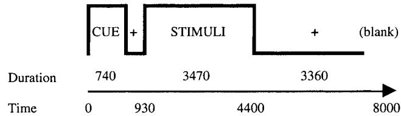
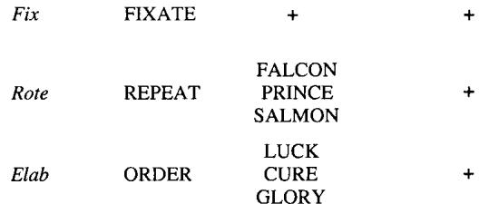
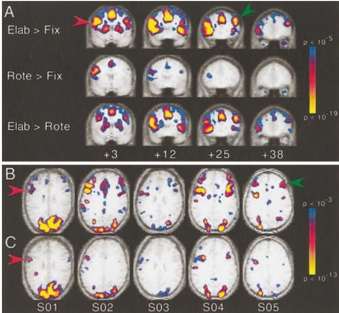
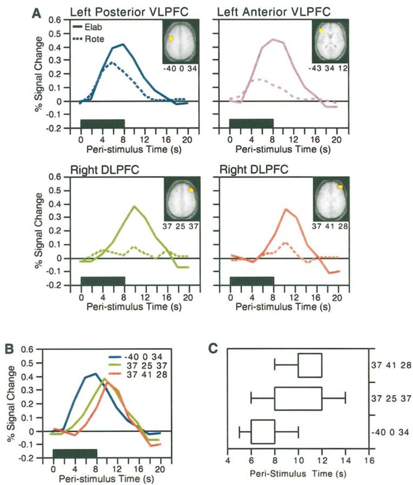

# Prefrontal Contributions to Executive Control: fMRI Evidence for Functional Distinctions within Lateral Prefrontal Cortex

Anthony D. Wagner,\*† Anat Maril,‡ Robert A. Bjork,§ and Daniel L. Schacter†  *Department of Brain and Cognitive Sciences, Massachusetts Institute of Technology, Cambridge, Massachusetts 02139; †MGH- NMR Center, Charlestown, Massachusetts 02129; ‡Department of Psychology, Harvard University, Cambridge, Massachusetts 02138; and §Department of Psychology, University of California at Los Angeles, Los Angeles, California 90095

Received February 11, 2001; published online October 14, 2001

The prefrontal cortex (PFC) plays a fundamental role in internally guided behavior. Although it is generally accepted that PFC subserves working memory and executive control operations, it remains unclear whether the subregions within lateral PFC support distinct executive control processes. An event- related fMRI study was implemented to test the hypothesis that ventrolateral and dorsolateral PFC are functionally distinct, as well as to assess whether functional specialization exists within ventrolateral PFC. Participants performed two executive control tasks that differed in the types of control processes required. During rote rehearsal, participants covertly rehearsed three words in the order presented, thus requiring phonological access and maintenance. During elaborative rehearsal, participants made semantic comparisons between three words held in working memory, reordering them from least to most desirable. Thus, in addition to maintenance, elaborative rehearsal required goal- relevant coding of items in working memory ("monitoring") and selection from among the items to implement their reordering. Results revealed that left posterior ventrolateral PFC was active during performance of both tasks, whereas right dorsolateral PFC was differentially engaged during elaborative rehearsal. The temporal characteristics of the hemodynamic responses further suggested that dorsolateral activation lagged ventrolateral activation. Finally, differential activation patterns were observed within left ventrolateral PFC, distinguishing between posterior and anterior regions. These data suggest that anatomically separable subregions within lateral PFC may be functionally distinct and are consistent with models that posit a hierarchical relationship between dorsolateral and ventrolateral regions such that the former monitors and selects goal- relevant representations being maintained by the latter. © 2001 Academic Press

# INTRODUCTION

Prefrontal cortex (PFC) plays a central role in the control of cognition and behavior (Baddeley, 1998;

Fuster, 1997; Miller and Cohen, 2001; Petrides, 1994b; Roberts et al., 1998). In the human, neuropsychological and neuroimaging data have highlighted the relation between PFC and the controlled retrieval, selection, maintenance, and/or manipulation of goal- relevant representations (Christoff and Gabrieli, 2000; D'Esposito et al., 1998; Smith and Jonides, 1999; Stuss and Benson, 1984; Wagner, 1999). In nonhuman primates, electrophysiological and lesion studies have shown that PFC is necessary for the maintenance of item or goal representations (Fuster and Alexander, 1971; Goldman- Rakic, 1987; Jacobsen, 1936; Miller et al., 1996), as well as for the monitoring, manipulation, or evaluation of such representations (Petrides, 1991, 2000). Such observations indicate that PFC is a fundamental component of the neural architecture supporting executive control (Miyake and Shah, 1999).

Although the past few decades have witnessed marked advances in our understanding of PFC function, fundamental questions remain regarding the functional organization of PFC with respect to executive control. One unresolved issue is whether the subregions within lateral PFC differentially mediate functionally distinct control processes or the same underlying process. Anatomically, lateral PFC consists of multiple subregions that differ in cytoarchitecture and connectivity (Petrides and Pandya, 1994), raising the possibility that these subregions may guide goal- directed behavior through different mechanisms.

Based on lesion studies in nonhuman primates (Potrides, 1991), initial neuroimaging studies in humans (Petrides et al., 1993a,b; see also D'Esposito et al., 1998), and structural/connectivity evidence (Petrides and Pandya, 1994), a two- stage model of PFC contributions to cognitive control has been posited (Owen et al., 1996; Petrides, 1994a,b, 1996). Within this framework, ventrolateral PFC differentially subserves controlled retrieval of representations from posterior cortices, with some theorists also positing that ventrolateral PFC guides active online maintenance of the accessed representations (e.g., Christoff and Gab

# TRIAL STRUCTURE

# TRIAL TYPES

  
FIG. 1. Schematic diagram of the experimental trial structure and conditions. During baseline Fix trials, subjects visually fixated on a  $^{\ast} + ^{\ast}$  sign throughout the duration of the trial. During Rote rehearsal trials, subjects covertly rehearsed the word triplet in the order presented throughout the duration of the trial. During Elab rehearsal trials, subjects covertly reordered the word triplet along the subjective dimension of "desirability," ordering the words from least to most desirable.

rieli, 2000; D'Esposito et al., 1998). By contrast, dorsolateral PFC is hypothesized to differentially mediate the "monitoring" and "manipulation" of representations maintained by ventrolateral PFC. Monitoring operations are thought to subserve online coding and updating of the relative goal- specific status of items in working memory (Petrides, 2000) or to mediate goal- directed selection between maintained representations (Rowe et al., 2000). In this manner, ventrolateral and dorsolateral PFC are hypothesized to be hierarchically related, with dorsolateral regions operating on the products of ventrolateral PFC.

Here, event- related functional magnetic resonance imaging (fMRI) was adopted to assess the functional contributions of ventrolateral and dorsolateral PFC. Building on prior cognitive behavioral studies of rote and elaborative rehearsal (Woodward et al., 1973), two executive control tasks were developed such that the trial structure and the nature of the stimuli were held constant across tasks, with only the required control processes differing. Accordingly, during both tasks, each 8- s trial consisted of visual presentation of a column of three nouns for approximately  $3.5\mathrm{s}$  followed by visual fixation for the remainder of the trial (Fig. 1).

Rote rehearsal required subjects to maintain the three words in the order presented. This condition corresponded to a standard phonological maintenance task, requiring access to and active maintenance of phonological codes throughout the trial, including across the fixation delay period that followed stimulus offset. In contrast to many investigations of working memory, there was no probe or decision phase at the end of the trial; that is, participants were not required to compare a test probe against the contents of working memory. Thus, phonological access and maintenance processes were elicited while placing minimal demands on comparison (i.e., monitoring) or selection within working memory.

Elaborative rehearsal was designed to tax phonological maintenance processes as well as monitoring and/or selection mechanisms. In this condition, subjects mentally reordered the triplet of nouns along the subjective dimension of "desirability," ordering the words from least to most desirable. Thus, in addition to phonological maintenance of the nouns, this task required semantic comparisons between, and goal- directed relative coding of, the items in working memory (monitoring) and selection from among the items so as to mentally implement their reordering. That is, subjects had to monitor the contents of working memory by comparing the retrieved semantic knowledge associated with each item along the prespecified criterion of desirability and then, based on these comparisons, to select the items in accord with their relative rankings.

These conditions were constructed to assess whether ventrolateral and dorsolateral PFC demonstrate differential patterns of functional activation. To the extent that ventrolateral PFC is differentially involved in active maintenance and dorsolateral PFC is differentially involved in monitoring and/or selection of representations within working memory, the task manipulation should yield different patterns of activity across these regions. Evidence for functional distinctions within lateral PFC was expected to be revealed through a region (ventrolateral/dorsolateral)  $\times$  task (rote/elaborative) interaction. That is, the pattern of task- related activity was expected to differ across ventrolateral and dorsolateral PFC, with ventrolateral PFC predicted to be active during both tasks, whereas robust dorsolateral PFC activation was primarily expected during elaborative trials.

# MATERIALS AND METHODS

# Participants

Participants were 12 right- handed, native speakers of English (9 women; ages 18- 27 years), with normal or corrected- to- normal vision. Participants received $50 for participation. Data from one participant were excluded due to excessive motion. Informed consent was obtained in a manner approved by the Human Studies Committee of the Massachusetts General Hospital.

# Stimuli and Behavioral Procedures

Stimuli consisted of visually presented triplets of nouns printed in uppercase letters and in a column.

For counterbalancing purposes, sets of 10 word triplets were formed such that the sets were matched for mean word length, word frequency, and desirability (normative desirability was indexed by collecting ratings from an independent sample of participants). Across subjects, each set of stimuli served equally often in the two experimental conditions.

In each of six event- related fMRI scans, 10 8- s trials from each of three trial types (Fig. 1) were rapidly intermixed with the constraint that all trial types had a similar trial history (Buckner et al., 1998a; Dale and Buckner, 1997). During baseline trials (Fix), the cue "FIXATE" indicated that subjects should fixate on a  $^+$  " sign throughout the duration of the trial. During rote rehearsal trials (Rote), the cue "REPEAT" indicated that subjects should covertly rehearse the word triplet in the order presented throughout the duration of the trial, terminating rehearsal upon onset of the subsequent cue. During elaborative rehearsal trials (Elab), the cue "ORDER" indicated that subjects should covertly reorder the triplet along the subjective dimension of desirability, going from least to most desirable. To ensure careful comparison across items, all members of a triplet had a similar desirability rating, as indexed by normative data. Subjects were instructed to settle on their order only after considering the desirability of each item in relation to the other items in the triplet. Behavioral pilot data, for which subjects responded overtly, indicated that subjects took an average approximately  $4.2~\mathrm{s}$  to perform the Elab task, suggesting that the 7 s provided for performance was sufficient.

Both the Rote and the Elab tasks were designed to depend on phonological access and maintenance mechanisms, with these processing demands perhaps being greater during Elab trials because recovery of semantic features of the to- be- ordered words was also required. Prior evidence suggests that semantic processing modulates phonological processing demands (Poldrack et al., 1999; Price et al., 1997). Critically, the Elab condition was designed to also depend on monitoring and selection operations that mediate the relative comparison and reordering of the items.

Prior to the fMRI scans, participants received extensive practice on the two experimental tasks both out side and inside the magnet so as to ensure that they understood the instructions and could perform the tasks in the allotted time. This practice verified that subjects understood that they were to engage in sustained rote rehearsal throughout the duration of the Rote trials and to reorder the word triplet during the Elab trials.

To assess episodic memory encoding, memory for the words encountered during the Rote and Elab trials was evaluated using an item- based recognition memory test administered approximately  $20\mathrm{min}$  after the last fMRI scan. During this test, all studied words and a set of unstudied foils were individually presented. Subjects indicated whether they remembered having studied the item, designating their confidence ("high" or "low") when responding "studied."

# fMRI Procedures

Echo- planar and conventional imaging was performed on a 3.0- T GF Signa scanner with an ANMR upgrade using procedures identical to those previously reported (Kirchhoff et al., 2000; Koutstaal et al., 2001; Wagner et al., 1998, 2000b). Conventional structural images included a high- resolution rf- spoiled GRASS sequence (SPGR; 60 slice sagittal,  $2.8\mathrm{- mm}$  thickness). Echo- planar imaging consisted of (a) an automated shim procedure to improve  $B_{0}$  magnetic field homogeneity and (b)  $\mathrm{T}_{2}^{*}$  weighted gradient- echo functional images (128 sequential whole- brain acquisitions, 16 slices aligned with the plane intersecting the anterior and posterior commissures,  $3.125\mathrm{- mm}$  in- plane resolution,  $7\mathrm{- mm}$  thickness, skip  $1\mathrm{mm}$ ,  $\mathrm{TR} = 2\mathrm{s}$ ,  $\mathrm{TE} = 30\mathrm{ms}$ , flip angle  $90^{\circ}$ ). A General Electric quadrature head coil was used for signal reception. The subject's head was immobilized with pillows and a restraining strap to reduce motion artifact.

The procedures for selective averaging and statistical map generation for rapidly intermixed event- related trials have been described elsewhere (Buckner et al., 1998a; Dale and Buckner, 1997). Data from individual functional runs were first normalized. Normalization involved (a) scaling of whole- brain signal intensity to a fixed value of 1000, (b) linear slope removal on a voxel- by- voxel basis to counteract effects of drift (Bandettini et al., 1993), (c) spatial filtering with a 1.5- voxel radius Hanning filter, and (d) removal of the mean signal intensity on a voxel- by- voxel basis. Normalized runs were selectively averaged within subject with reference to trial onset, resulting in 11 mean images (22 s at  $\mathrm{TE} = 2\mathrm{s}$ ) for each trial type as well as the variance for each of the 11 images per trial type (Buckner et al., 1998a; Dale and Buckner, 1997). The mean and variance images were subsequently transformed into stereotaxic atlas space (Talairach and Tournoux, 1988). Across- subject averaging consisted of weighting the means and variance by the number of trials contributed by each subject (in the present design, all subjects contributed an equal number of trials per condition). The SPGR anatomical images were averaged across subjects to yield a mean anatomy image onto which the functional data were projected.

Activation maps were constructed using a  $t$  statistic (Buckner et al., 1998a; Dale and Buckner, 1997). Specifically, a set of predicted hemodynamic response functions was generated with the temporal delay of the response varied in 1- s steps with reference to trial onset. Gamma functions were used as the base shape. Varying the onset delay of the predicted hemodynamic

curve can be critical for detection of activation changes throughout cortical and subcortical structures, as regional variability in the timing onset of the hemodynamic response has been observed (Schacter et al., 1997). Indeed, differences in the temporal characteristics of the hemodynamic response across PFC subregions were observed in the present study (see Results).

Statistical maps were generated by calculating the covariance between the observed signal difference between trial types and the predicted hemodynamic response functions. To identify voxels demonstrating a greater response during executive control, the Fix trials were subtracted from the experimental trials (collapsed across Rote and Elab). To identify voxels demonstrating a differential response during the two executive control tasks, Rote and Elab trials were subtracted from each other. Finally, for completeness, the Fix trials were subtracted from each of the experimental trial types. Given a priori expectations that lateral PFC activation would correlate with performance of the two tasks, peak coordinates were considered significant if they fell within clusters of five or more contiguous voxels exceeding an uncorrected statistical threshold of  $P< 0.001$ . For peaks falling closer than 10 mm to one another, the most significant was retained.

To further explore the effects of executive control, region- of- interest (ROI) analyses were performed for lateral prefrontal regions demonstrating a greater response during experimental trials (collapsed across task) relative to Fix. Task- related hemodynamic responses were derived from a three- dimensional region surrounding the peak voxel, included all significant contiguous voxels within  $10\mathrm{mm}$  of the peak, and reflected percentage signal change from Fix. Mixed- effect analyses of variance (ANOVA) were performed with percentage signal change as the dependent variable and task (Rote/Elab) and peristimulus time (0- 20 s from stimulus onset) as repeated factors. Subjects were treated as a random effect, ensuring that the outcomes were reliable across subjects. The effect of task was further explored in ROIs demonstrating a task  $\times$  time interaction: Planned contrasts compared the percentage signal change associated with Rote and Elab trials at the time point corresponding to the peak (highest amplitude) response in the ROI when defined using the mean of the two experimental trial types. A Huynh- Feldt correction for nonsphericity was implemented.

# RESULTS

# Episodic Memory

The subsequent recognition memory test permitted consideration of the relation between rote and elaborative rehearsal and episodic memory. Consistent with earlier behavioral research on types of rehearsal (Woodward et al., 1973), postscan item recognition was superior following Elab relative to Rote rehearsal, suggesting that processes leading to effective episodic encoding were recruited to a greater extent in the Elab condition. The overall probability of recognizing studied words as "old" (i.e., the hit rate) was higher for items from Elab (0.75) than from Rote (0.46) trials  $(F(1,10) = 55.10, P< 0.0001)$ . "High confidence" hits also differed across the conditions (Elab, 0.52; Rote, 0.21;  $F(1,10) = 70.43, P< 0.0001$ ). The overall and high confidence false alarm rates were 0.30 and 0.08, respectively. Thus, recognition was above chance following Elab and Rote rehearsal and the expected task effect was observed, suggesting that subjects performed the tasks as instructed.

A recent study exploring the effect of rote rehearsal on episodic encoding provides further evidence that subjects likely engaged in phonological rehearsal during the rote task even though no overt response was required (Davachi et al., 2001). In that study, activation in neural correlates of phonological working memory during performance of the same covert rote rehearsal paradigm as implemented here was correlated with later recognition success. Due to an insufficient number of trials, a similar subsequent memory analysis could not be conducted with the present data.

# fMRI Indices of Prefrontal Executive Function

Comparing the executive control tasks to Fix revealed activation in numerous cortical and subcortical regions, including regions in occipital, lateral and medial temporal, superior and inferior parietal, and frontal cortices, as well as striatal and cerebellar foci. Here, we report the pattern of activation in inferior and middle PFC; a subsequent report will consider nonfrontal findings.

Voxel- based statistical comparisons revealed activation in ventrolateral PFC (VLPFC) and dorsolateral PFC (DLPFC) comparing executive control trials to Fix (Table 1). Activations included posterior inferior frontal/precentral ( $\sim$ Brodmann's area (BA) 44/6), opercular/inferior frontal ( $\sim$ BA 45/47), and middle frontal ( $\sim$ BA 46/9/10) cortices. Comparison of Elab to Fix revealed activation in left VLPFC and bilateral DLPFC, whereas comparison of Rote to Fix revealed activation primarily in left posterior VLPFC (Fig. 2A). This pattern was consistently observed at the individual subject level (Figs. 2B and 2C). Specifically, almost all subjects revealed significant VLPFC and bilateral DLPFC activation during the Elab condition (Table 2). By contrast, during Rote rehearsal, while almost all subjects demonstrated left posterior VLPFC activation, only half of the subjects demonstrated significant left anterior VLPFC and left DLPFC activation and only one subject demonstrated right DLPFC activation. This pattern suggests that the pattern of task- related activation differed across VLPFC and DLPFC,

TABLE 1 Inferior and Middle Prefrontal Peaks Demonstrating Greater Activation during Executive Control (Collapsed across Rote and Elab) Relative to Fix and the Outcome of ROI Analyses  

<table><tr><td>Region</td><td colspan="3">Talairach coordinates</td><td>~BA</td><td>ROI analyses</td></tr><tr><td>Left hemisphere</td><td></td><td></td><td></td><td></td><td></td></tr><tr><td>Post. inferior frontal/precentral a</td><td>-40</td><td>0</td><td>34</td><td>44,6</td><td>Time × task, E &amp;gt; R</td></tr><tr><td>Post. inferior frontal</td><td>-43</td><td>9</td><td>28</td><td>44</td><td>Time × task, E &amp;gt; R</td></tr><tr><td>Operculum/inferior frontal</td><td>-37</td><td>13</td><td>9</td><td>44,43</td><td>Time × task, E &amp;gt; R</td></tr><tr><td>Operculum/inferior frontal</td><td>-28</td><td>22</td><td>9</td><td>45,47</td><td>Time × task, E &amp;gt; R</td></tr><tr><td>Inferior/middle frontal</td><td>-37</td><td>25</td><td>21</td><td>45,9</td><td>Time × task, E &amp;gt; R</td></tr><tr><td>Middle frontal a</td><td>-40</td><td>47</td><td>15</td><td>46,10</td><td>Time × task, E &amp;gt; R</td></tr><tr><td>Middle frontal a</td><td>-31</td><td>44</td><td>25</td><td>46,9</td><td>Time × task, E &amp;gt; R</td></tr><tr><td>Middle frontal</td><td>-37</td><td>16</td><td>50</td><td>8,6</td><td>ns</td></tr><tr><td>Frontopolar</td><td>-21</td><td>66</td><td>3</td><td>10</td><td>ns</td></tr><tr><td>Right hemisphere</td><td></td><td></td><td></td><td></td><td></td></tr><tr><td>Middle frontal a</td><td>37</td><td>25</td><td>37</td><td>9,46</td><td>Time × task, E &amp;gt; R</td></tr><tr><td>Middle frontal a</td><td>37</td><td>41</td><td>28</td><td>46,9</td><td>Time × task, E &amp;gt; R</td></tr><tr><td>Middle frontal</td><td>28</td><td>44</td><td>21</td><td>46,9</td><td>ns b</td></tr><tr><td>Post. inferior frontal/precentral</td><td>50</td><td>3</td><td>18</td><td>44,6</td><td>ns</td></tr><tr><td>Post. inferior frontal</td><td>40</td><td>9</td><td>28</td><td>44</td><td>Time × task, E &amp;gt; R</td></tr><tr><td>Operculum/inferior frontal</td><td>34</td><td>16</td><td>9</td><td>45,44</td><td>Time × task, E &amp;gt; R</td></tr><tr><td>Ant. inferior frontal</td><td>31</td><td>28</td><td>-3</td><td>47</td><td>ns</td></tr><tr><td>Frontopolar</td><td>40</td><td>59</td><td>3</td><td>10</td><td>ns b</td></tr><tr><td>Frontopolar</td><td>28</td><td>59</td><td>-9</td><td>10,11</td><td>ns</td></tr></table>

Note. Ant., anterior;  $\sim \mathrm{BA}$  approximate Brodmann's area; E, Elab; ns, nonsignificant interaction; R, Rote; Post., posterior. a Left ventrolateral and bilateral dorsolateral prefrontal regions of interest based on prior studies of phonological maintenance and of monitoring" processes. b Time  $\times$  Cond.,  $P< 0.06$  uncorrected;  $\mathrm{E} > \mathrm{R}$ $P< 0.05$

with right DLPFC (in particular) being differentially engaged during the Elab condition. Direct comparison of Elab to Rote revealed greater responses during the Elab condition in both VLPFC and DLPFC (Fig. 2A). By contrast, this comparison did not reveal PFC activations that demonstrated an above- baseline response during Rote trials that was also greater than that during Elab trials.

# Differential Activation Patterns between VLPFC and DLPFC

As indicated in Table 1, ROI analyses demonstrated that many lateral PFC regions demonstrated a differential response during Elab and Rote trials (task  $\times$  peristimulus time interaction, all  $F(1,10) > 4.40$ ,  $P < 0.05$ , corrected for multiple comparisons). Planned contrasts revealed a greater response in all  $F(1,10) > 11.17$ ,  $P < 0.05$ ). These effects do not reflect a global increase in activation during the Elab condition, as activation in a number of frontal regions did not reliably differ between tasks, including frontopolar and right inferior frontal cortices. Moreover, responses in control regions beyond PFC did not differ between tasks (e.g., visual cortex,  $\sim \mathrm{BA}$  18; coordinates of  $- 15, - 83, - 9$ ;  $F < 1.0$ ).

The statistical maps suggest that left posterior VLPFC was recruited during both executive control tasks, whereas DLPFC, especially on the right, was relatively more engaged during the Elab task (Fig. 2). To statistically test whether the patterns of task- related activation differed across these regions, we conducted mixed- effect ANOVAs that treated region (left posterior VLPFC/right DLPFC) and task as repeated measures and the magnitude of the peak hemodynamic response as the dependent measure. As displayed in Table 3 and Fig. 3A, the effect of task differed across region, confirming that left posterior VLPFC was robustly engaged by both tasks, whereas right DLPFC was differentially engaged by the Elab condition. Interestingly, the pattern of task- related activity in the homologous left DLPFC region ( $\sim \mathrm{BA}$  46/9) did not statistically differ from that observed in left posterior VLPFC, although an interaction was observed with a more anterior left DLPFC region ( $\sim \mathrm{BA}$  46/10) (Table 3). The former result raises the possibility that the differential role of DLPFC in monitoring may be greater in the right hemisphere.

The response in left posterior VLPFC and right DLPFC differed along another fundamental characteristic: The time to reach the peak of the hemodynamic response during performance of the Elab task lagged in DLPFC relative to VLPFC (Fig. 3B). This intriguing difference was further explored by deriving each subject's time to peak elicited by the Elab task for these ROIs. Analyses revealed that time to peak was significantly shorter in left posterior VLPFC relative to ei

  
FIG. 2. VLPFC and DLPFC responses during performance of Rote and Elab rehearsal. (A) Group activation maps from coronal PFC sections (distance in mm rostral to the anterior commissure is below each section). Greater activation was observed in posterior VLPFC (red arrow) and in DLPFC (green arrow) during Elab relative to Fix (upper row), but was relatively restricted to posterior VLPFC during Rote relative to Fix (middle row). Direct comparison of the two executive control tasks (lower row) revealed greater activation in multiple PFC regions during the Elab trials, including (but not restricted to) left posterior VLPFC (\~BA 44,6; \~43, 16, 23; \~43, 15, 15; 40, 0, 34), left anterior VLPFC (\~BA 45/47; \~43, 34, 3; \~37, 22, 0), and right DLPFC (\~BA 46/9/10; 40, 35, 37; 43, 34, 28). (B) Activation maps demonstrating greater activation during Elab relative to Fix are presented for five subjects (S01-S05). In each subject, activations were observed in posterior VLPFC and in DLPFC. (C) Activation maps demonstrating greater activation during Rote relative to Fix are presented for the same five participants and reveal primarily left posterior VLPFC activation.

The right DLPFC region (37, 25, 37,  $F(1,10) = 20.20$ ,  $P< 0.001$ ; 37, 41, 28,  $F(1,10) = 28.78$ ,  $P< 0.0001$ ), whereas time to peak did not differ between the DLPFC regions ( $F< 1.0$ ) (Fig. 3C). To the extent that these differences reflect neural, rather than vascular effects, they are generally consistent with the proposed hierarchical relation between VLPFC and DLPFC processes.

The differential patterns of task- related activation in left posterior VLPFC and right DLPFC suggest that these lateral PFC regions may subserve distinct executive control processes. However, it remains possible that these results reflect a differential sensitivity (or differing slopes) in response to task difficulty across PFC subregions. Although the present design does not permit a direct refutation of this possibility, we believe a difficulty account is unlikely for three reasons. First, prior studies that have directly manipulated task difficulty (as indexed by reaction time) have failed to reveal an increase in DLPFC activation with increasing cognitive effort (e.g., Barch et al., 1997; Demb et al., 1995). Second, as discussed above, a lag in the time to peak was observed between VLPFC and DLPFC regions within the Elab condition (by definition this difference could not arise from between- task differences in difficulty). Finally, given that the present findings converge with prior observations of putative process dissociations within lateral PFC (D'Esposito et al., 1998; Owen et al., 1996; Postle et al., 1999), we would suggest that the observed interactions are more likely to derive from process distinctions rather than differential cognitive effort.

# Differential Activation Patterns within VLPFC

Recent data suggest that the posterior and anterior extents of left VLPFC may be functionally distinct (Buckner et al., 1995; Fiez, 1997; Poldrack et al., 1999; Wagner, 1999; Wagner et al., 2000a), with the posterior extent (\~BA 44/6) implicated in phonological processing and maintenance (Awh et al., 1996; Fiez et al., 1996; Paulesu et al., 1993) and the anterior extent (\~BA 45/47) implicated in controlled retrieval or selection of semantic knowledge (Gabrieli et al., 1996; Thompson- Schill et al., 1997; Wagner et al., 1997, 2001). Given the demands of the Elab and Rote tasks, posterior VLPFC activation was expected—and was observed—during both tasks, whereas anterior VLPFC activation was predicted to be particularly robust during the Elab trials.

A distinct peak was not detected in left anterior VLPFC comparing the executive control tasks to Fix (likely due to the presence of neighboring foci in the anterior extent of the frontal operculum, thereby "masking" activation in this nearby lateral anterior region). Thus, to examine whether left VLPFC subregions were differentially influenced by the task manipulation, we extracted data from a left anterior VLPFC region (\~43, 34, 12; lateral and anterior to the frontal operculum; see Fig. 3A) in a manner identical to that

# TABLE 2

Summary of the Number of Participants Who Demonstrated Inferior and Middle Prefrontal Activation during the Elaborative and Rote Rehearsal Conditions  

<table><tr><td>Region</td><td>~BA</td><td>Elab &amp;gt; Fix</td><td>Rote &amp;gt; Fix</td></tr><tr><td>Left hemisphere</td><td></td><td></td><td></td></tr><tr><td>Post. inferior frontal/</td><td></td><td></td><td></td></tr><tr><td>precentral</td><td>44,6</td><td>11/11 subjects</td><td>10/11 subjects</td></tr><tr><td>Ant. inferior frontal</td><td>45,47</td><td>11/11 subjects</td><td>5/11 subjects</td></tr><tr><td>Middle frontal</td><td>46,9</td><td>11/11 subjects</td><td>6/11 subjects</td></tr><tr><td>Right hemisphere</td><td></td><td></td><td></td></tr><tr><td>Middle frontal</td><td>46,9</td><td>10/11 subjects</td><td>1/11 subjects</td></tr></table>

Note. Ant., anterior; \~BA, approximate Brodmann's area; Post., posterior.

  
FIG. 3. Differential patterns of functional activation were observed between left posterior VLPFC, left anterior VLPFC, and right DLPFC regions of interest. (A) Displayed are the selectively averaged task-related hemodynamic responses from VLPFC and DLPFC regions of interest. The examined ROIs are displayed on corresponding axial slices. The hemodynamic responses reveal that the Elab task recruited both VLPFC and DLPFC processes, whereas the Rote task primarily engaged VLPFC processes. Consideration of the DLPFC responses to the Rote trials suggests that these regions were minimally engaged during Rote rehearsal, although a modest response peaked following trial termination. The black bar corresponds to the trial duration. (B) Displayed are the observed hemodynamic responses elicited by the Elab task in VLPFC and DLPFC regions. (C) Across subjects, the time to peak lagged in DLPFC regions (mean median of  $10~\mathrm{s}$  in both DLPFC regions) relative to VLPFC (8 s). Boxes encompass the second and third quartiles of each distribution.

performed for left posterior VLPFC  $(- 40, 0, 34)$ , with one exception. The seed point used for identifying voxels in anterior VLPFC was obtained from an independent data set that identified this peak as associated with semantic processing and semantic repetition priming on the abstract/concrete decision task (Wagner et al., 2000a). Importantly, the present data revealed a significant interaction between VLPFC region (posterior/anterior) and task (Table 3). The magnitude of activation during Elab rehearsal was similar in poste rior (0.39) and anterior (0.44) VLPFC  $(F(1,10) = 1.39, P > 0.25)$ , whereas activation during Rote rehearsal was significantly greater in posterior (0.28) than in anterior (0.15) VLPFC  $(F(1,10) = 9.55, P< 0.025)$ . Moreover, the time to peak of the hemodynamic response in the anterior region was significantly later than that in the posterior region  $(F(1,10) = 6.98, P< 0.05)$ , but earlier than that in DLPFC (37, 25, 37,  $F(1,10) = 4.12, P< 0.07; 37, 41, 28, F(1,10) = 8.41, P< 0.025$ ). With respect to left VLPFC, our data are con

# TABLE 3

The Effects of Rote and Elab Processing Differed between Left Posterior Ventrolateral Prefrontal Cortex  $(\sim \mathrm{BA}4 / 6;$  Coordinates -40, 0, 34) and Dorsolateral and Left Anterior Ventrolateral Prefrontal Cortices (i.e., Task  $\times$  Region Interaction Performed on the Peak of the Hemodynamic Response)  

<table><tr><td>Region contrasted with left posterior VLPFC</td><td colspan="3">Talairach coordinates</td><td>~BA</td><td>Region × Task</td></tr><tr><td>Right hemisphere</td><td></td><td></td><td></td><td></td><td></td></tr><tr><td>Middle frontal</td><td>37</td><td>25</td><td>37</td><td>9,46</td><td>F(1,10) = 9.07, P &amp;lt; 0.025</td></tr><tr><td>Middle frontal</td><td>37</td><td>41</td><td>28</td><td>46,9</td><td>F(1,10) = 5.90, P &amp;lt; 0.05</td></tr><tr><td>Left hemisphere</td><td></td><td></td><td></td><td></td><td></td></tr><tr><td>Middle frontal</td><td>-40</td><td>47</td><td>15</td><td>46,10</td><td>F(1,10) = 5.76, P &amp;lt; 0.05</td></tr><tr><td>Middle frontal</td><td>-31</td><td>44</td><td>25</td><td>46,9</td><td>F(1,10) = 1.76, P &amp;gt; 0.20</td></tr><tr><td>Anterior inferior frontal*</td><td>-43</td><td>34</td><td>12</td><td>45,47</td><td>F(1,10) = 9.12, P &amp;lt; 0.025</td></tr></table>

Note.  $\sim \mathrm{BA}$  approximate Brodmann's area. a The left anterior VLPFC region was defined based on a prior study of semantic processing (see text).

sistent with the hypothesis that distinct subregions within VLPFC play a differential role in access and maintenance operations depending on the content or nature of the representations (e.g., phonological/lexical vs semantic).

# DISCUSSION

The present fMRI study examined whether separable subregions within lateral PFC subserve distinct executive control processes. The results revealed differential patterns of activation between ventrolateral and dorsolateral PFC regions, as well as different patterns within ventrolateral PFC. Performance of a rote rehearsal task that relied primarily upon phonological access and maintenance mechanisms elicited activation in left posterior ventrolateral PFC and, to a lesser extent, in left anterior ventrolateral PFC and left dorsolateral PFC. Rote rehearsal, however, minimally engaged right dorsolateral PFC. By contrast, robust activation was observed in ventrolateral and bilateral dorsolateral PFC during performance of an elaborative rehearsal task that additionally required semantic comparisons across items in working memory (monitoring) and selection from among these items in a goal- directed manner. The effect of task interacted with PFC region, and the hemodynamic response elicited by performance of the elaborative task was lagged in dorsolateral relative to ventrolateral PFC.

# Differential Functional Patterns between VLPFC and DLPFC

The observed PFC activation patterns complement and extend the findings from prior neuroimaging studies of executive control (D'Esposito et al., 1998, 1999; Owen, 1997; Poldrack et al., 1999; Rowe et al., 2000; Smith and Jonides, 1999; Wagner et al., 2000a). Consistent with studies of phonological working memory (Awh et al., 1996; Fiez et al., 1996; Paulesu et al., 1993), PFC activation during rote rehearsal was principally observed in the most posterior extent of the left inferior frontal gyrus, extending back into premotor cortex. Left posterior VLPFC is thought to mediate access to and maintenance of phonological codes and is hypothesized to be a component of the neural circuitry supporting control of phonological representations (Baddeley, 1998; Paulesu et al., 1993). The present data suggest that these processes are engaged during the encoding and rehearsal stages of phonological working memory (Rypma and D'Esposito, 2000).

By contrast, right DLPFC was minimally engaged during rote phonological rehearsal. Consideration of the selectively averaged hemodynamic response in right DLPFC during rote rehearsal (Fig. 3A) indicated that activation did not markedly differ from baseline (although there was a modest response that peaked following trial termination), and only one subject demonstrated significant rote- related activation in this region (Table 2). These data converge with a number of recent functional neuroimaging reports suggesting that the maintenance of item information minimally engages right DLPFC (D'Esposito et al., 1998; Owen, 1997; Smith and Jonides, 1999), as well as with recent lesion data in nonhuman primates (Petrides, 2000). For example, using fMRI, Rowe and colleagues (2000) observed that, whereas selection from among maintained spatial representations elicited dorsolateral activation, maintenance per se did not result in an appreciable dorsolateral response (see also Collette et al., 1999). Rypma and D'Esposito (2000) observed delay period activity in three right DLPFC voxels in one study, but failed to replicate this effect in a second study. Moreover, Petrides (2000) reported that excision of mid- DLPFC did not disrupt visual working memory performance even when a low load had to be maintained for up to 2 min. However, as the maintenance load increased, performance declined following mid- DLPFC lesion even with a short delay of 10 s. The present data build on this literature by providing evidence that right DLPFC and left VLPFC demonstrate

differential responses across executive control tasks as revealed by a task  $\times$  region interaction. Moreover, these data would appear inconsistent with recent reports that strongly conclude that DLPFC and VLPFC are similarly engaged during item maintenance (Postle and D'Esposito, 1999, 2000).

It is important to note, however, that maintenance- related activation has been previously observed in DLPFC both in human (Cohen et al., 1997; D'Esposito et al., 1999; Postle et al., 1999) and in nonhuman primates (reviewed in Goldman- Rakic, 1987; Miller and Cohen, 2001). For example, neuroimaging studies of verbal- working memory have revealed delay- period activity during performance of an  $N$ - back working memory task (Cohen et al., 1997) as well as during performance of a delayed item recognition task (D'Esposito et al., 1999; Postle et al., 1999). As noted elsewhere, rote rehearsal tasks differ from the  $N$ - back task along a number of dimensions (D'Esposito et al., 1998), thus complicating interpretation of the source of the difference between the present findings and this earlier report. Moreover, the present rote rehearsal task required maintenance of three words, whereas the item recognition studies revealing maintenance- related DLPFC activation required rehearsal of five letters (D'Esposito et al., 1999; Postle et al., 1999). This difference in the number of to- be- maintained items may account for the divergence of our results from these earlier findings. However, other fMRI data indicate that direct manipulations of working memory load do not consistently elicit increased DLPFC delay period activity with greater loads. Rather, load appears to affect DLPFC activity during the stimulus encoding period (Postle et al., 1999; Rypma and D'Esposito, 1999). These load effects have been interpreted as deriving from monitoring demands during stimulus encoding (Rypma and D'Esposito, 1999; Rypma et al., 1999). Although further investigation is required to clarify these between- study differences, the present findings, in conjunction with the recent lesion data (Petrides, 2000), suggest that right DLPFC may play only a modest role in item maintenance tasks (at least at lower loads).

In addition to revealing that ventrolateral and dorsolateral PFC demonstrate differential task- related activation, the present study provides further suggestive evidence that these lateral PFC regions may be functionally distinct. Consideration of the hemodynamic responses elicited by the elaborative task revealed that the time to peak was systematically lagged in right DLPFC relative to left posterior VLPFC. fMRI studies of episodic recognition memory have previously revealed differential temporal lags across frontal structures (Buckner et al., 1998b; Schacter et al., 1997), where frontal opercular (early response) and frontopolar (late response) cortices were dissociated. A recent study of the Stroop interference paradigm also re vealed an apparent lag between the DLPFC response and other PFC responses, although a statistical comparison was not conducted to assess the reliability of this difference (Leung et al., 2000).

Cross- regional temporal differences should be interpreted with caution because fMRI data do not distinguish between vascular and neural sources for such effects. Nevertheless, the present temporal difference between VLPFC and DLPFC responses is provocative because the pattern is in accord with the "two- stage" hypothesis of cognitive control, in which DLPFC is thought to operate on the products of VLPFC (Owen et al., 1996; Petrides, 1994b; Petrides, 1996). At the cognitive level, access and maintenance of phonological and semantic codes—posited to be mediated by left posterior and anterior VLPFC, respectively—would appear to be required before participants can reorder the items because the monitoring and/or selection processes engaged during item reordering—posited to be mediated by DLPFC—likely operate or depend on such codes. Additional data from studies that integrate high temporal resolution imaging, such as magnetoencephalography or electroencephalography, with fMRI are required to resolve whether these temporal differences reflect a two- stage engagement of cognitive and neural processes or regional differences in the vascular response.

# Distinct PFC Control Processes: Variable Locus of Bias?

The present findings suggest that ventrolateral and dorsolateral PFC may mediate goal- directed controlled behavior by differentially subserving distinct forms of executive control. Based on the present design and the extant literature, we have interpreted the observed patterns of activation as reflecting a VLPFC/DLPFC distinction between maintenance and monitoring processes. However, because the present experiment manipulated executive control demands with two tasks, it is difficult to further specify the precise cognitive control operations subserved by these PFC subregions. Moreover, given the complexity of the elaborative rehearsal task it remains possible that the observed right DLPFC activation might have arisen from an increased working memory load in this condition (i.e., the increase in load that follows semantic retrieval and that might accompany the reordering of elements in working memory). Although, as discussed above, prior observations of increasing DLPFC activation with working memory load have been interpreted as deriving from increased demands on monitoring operations rather than on maintenance processes (Rypma and D'Esposito, 1999; Rypma et al., 1999), the present design does not permit definitive adjudication between these possibilities.

With these caveats in mind, we tentatively suggest that the differential patterns of activation in VLPFC

and DLPFC reflect the differential role these regions play in distinct executive control operations—"retrieval" of long- term representations and "maintenance" of these representations in working memory versus "monitoring" or "selection" from among representations within working memory. This distinction between ventrolateral and dorsolateral processes may reflect differences in their locus of operation (Petrides, 1996). PFC has been posited to represent goal states and to actively bias the processing of goal- relevant representations (Cohen and Servan- Schreiber, 1992; Desimone and Duncan, 1995; Miller and Cohen, 2001). Models of PFC functional organization raise the possibility that ventrolateral and dorsolateral PFC bias mechanisms operate on different loci or types of representations (Miller and Cohen, 2001). Specifically, VLPFC may play a greater role in modulating processing or representations in posterior cortices, whereas DLPFC may differentially modulate processing or representations in VLPFC (Petrides, 1996). In this manner, ventrolateral bias or selection mechanisms may support access to and maintenance of item representations, whereas dorsolateral bias mechanisms may operate on the representations being maintained within working memory or on the maintenance processes themselves, thus supporting the selection of goal- relevant knowledge (Rowe et al., 2000).

# ACKNOWLEDGMENTS

This work was supported by the National Institutes of Health (MH60941, NS26985, and DC04466), the Ellison Medical Foundation, and P. E. Newton. We thank L. Davachi, W. Koutstaal, and R. Poldrack for insightful comments and discussion.

# REFERENCES

Awh, E., Jonides, J., Smith, E. E., Schumacher, E. H., Koeppe, R. A., and Katz, S. 1996. Dissociation of storage and rehearsal in verbal working memory: Evidence from PET. Psychol. Sci. 7: 25- 31. Baddeley, A. 1998. Recent developments in working memory. Curr. Opin. Neurobiol. 8: 234- 238. Bandettini, P. A., Jesmanowicz, A., Wong, E. C., and Hyde, J. S. 1993. Processing strategies for time- course data sets in functional MRI of the human brain. Magn. Reson. Med. 30: 161- 173. Barch, D. M., Braver, T. S., Nystrom, L. E., Ferman, S. D., Noll, D. C., and Cohen, J. D. 1997. Dissociating working memory from task difficulty in human prefrontal cortex. Neuropsychologia 35: 1373- 1380. Buckner, R. L., Goodman, J., Burock, M., Rotte, M., Koutstaal, W., Schacter, D., Rosen, B., and Dale, A. M. 1998a. Functional- anatomic correlates of object priming in humans revealed by rapid presentation event- related fMRI. Neuron 20: 285- 296. Buckner, R. L., Koutstaal, W., Schacter, D. L., Dale, A. M., Rotte, M., and Rosen, B. R. 1998b. Functional- anatomic study of episodic retrieval. II. Selective averaging of event- related fMRI trials to test the retrieval success hypothesis. NeuroImage 7: 163- 175. Buckner, R. L., Raichle, M. E., and Petersen, S. E. 1995. Dissociation of human prefrontal cortical areas across different speech production tasks and gender groups. J. Neurophysiol. 74: 2163- 2173.

Christoff, K., and Gabrieli, J. D. E. 2000. The frontopolar cortex and human cognition: Evidence for a rostrocaudal hierarchical organization within the human prefrontal cortex. Psychobiology 28: 168- 186. Cohen, J. D., Perlstein, W. M., Braver, T. S., Nystrom, L. E., Noll, D. C., Jonides, J., and Smith, E. E. 1997. Temporal dynamics of brain activation during a working memory task. Nature 386: 604- 608. Cohen, J. D., and Servan- Schreiber, D. 1992. Context, cortex, and dopamine: A connectionist approach to behavior and biology in schizophrenia. Psychol. Rev. 99: 45- 77. Collette, F., Salmon, E., Van der Linden, M., Chicherio, C., Belleville, S., Degueldre, C., Delfiore, G., and Franck, G. 1999. Regional brain activity during tasks devoted to the central executive of working memory. Cognit. Brain Res. 7: 411- 417. Dale, A. M., and Buckner, R. L. 1997. Selective averaging of rapidly presented individual trials using fMRI. Hum. Brain Mapp. 5: 329- 340. Davachi, L., Maril, A., and Wagner, A. D. 2001. When keeping in mind supports later bringing to mind: Neural markers of phonological rehearsal predict subsequent remembering. J. Cognit. Neurosci., in press. Demb, J. B., Desmond, J. E., Wagner, A. D., Vaidya, C. J., Glover, G. H., and Gabrieli, J. D. E. 1995. Semantic encoding and retrieval in the left inferior prefrontal cortex: A functional MRI study of task difficulty and process specificity. J. Neurosci. 15: 5870- 5878. Desimone, R., and Duncan, J. 1995. Neural mechanisms of selective visual attention. Annu. Rev. Neurosci. 18: 193- 222. D'Esposito, M., Aguirre, J. K., Zarahn, E., Ballard, D., Shin, R. K., and Lease, J. 1998. Functional MRI studies of spatial and nonspatial working memory. Cognit. Brain Res. 7: 1- 13. D'Esposito, M., Postle, B. R., Ballard, D., and Lease, J. 1999. Maintenance versus manipulation of information held in working memory: An event- related fMRI study. Brain Cognit. 41: 66- 86. Fiez, J. A. 1997. Phonology, semantics, and the role of the left inferior prefrontal cortex. Hum. Brain Mapp. 5: 79- 83. Fiez, J. A., Raife, E. A., Balota, D. A., Schwarz, J. P., Raichle, M. E., and Petersen, S. E. 1996. A positron emission tomography study of the short- term maintenance of verbal information. J. Neurosci. 16: 808- 822. Fuster, J. M. 1997. The Prefrontal Cortex: Anatomy, Physiology, and Neuropsychology of the Frontal Lobe. Lippincott- Raven, Philadelphia. Fuster, J. M., and Alexander, G. E. 1971. Neuron activity related to short- term memory. Science 173: 652- 654. Gabrieli, J. D. E., Desmond, J. E., Demb, J. B., Wagner, A. D., Stone, M. V., Vaidya, C. J., and Glover, G. H. 1996. Functional magnetic resonance imaging of semantic memory processes in the frontal lobes. Psychol. Sci. 7: 278- 283. Goldman- Rakic, P. S. 1987. Circuitry of primate prefrontal cortex and regulation of behavior by representational memory. In Handbook of Physiology, Section 1, The Nervous System, Vol. V, Higher Functions of the Brain, Part 1 (F. Plum and V. Mountcastle, Eds.), pp. 373- 417. Am. Physiol. Soc., Bethesda, MD. Jacobsen, C. F. 1936. Studies of cerebral function in primates. I. The functions of the frontal association areas in monkeys. Comp. Psychol. Monogr. 13: 1- 60. Kirchhoff, B. A., Wagner, A. D., Maril, A., and Stern, C. E. 2000. Prefrontal- temporal circuitry for novelty encoding and subsequent memory. J. Neurosci. 20: 6173- 6180. Konishi, S., Donaldson, D. I., and Buckner, R. L. 2001. Transient activity during block transition. NeuroImage 13: 364- 374. Koutstaal, W., Wagner, A. D., Rotte, M., Maril, A., Buckner, R. L., and Schacter, D. L. 2001. Perceptual specificity in visual object

priming: Functional magnetic resonance imaging evidence for a laterality difference in fusiform cortex. Neuropsychologia 39: 184- 199.

Leung, H. C., Skudlarski, P., Gatenby, J. C., Peterson, B. S., and Gore, J. C. 2000. An event- related functional MRI study of the Stroop color word interference task. Cereb. Cortex 10: 552- 560.

Miller, E. K., and Cohen, J. D. 2001. An integrative theory of prefrontal cortex function. Annu. Rev. Neurosci. 24: 167- 202.

Miller, E. K., Erickson, C. A., and Desimone, R. 1996. Neural mechanisms of visual working memory in prefrontal cortex of the macaque. J. Neurosci. 16: 5154- 5167.

Miyake, A., and Shah, P., Eds. 1999. Models of Working Memory: Mechanisms of Active Maintenance and Executive Control. Cambridge Univ. Press, Cambridge, MA.

Owen, A. M. 1997. The functional organization of working memory processes within human lateral frontal cortex: The contribution of functional neuroimaging. Eur. J. Neurosci. 9: 1329- 1339.

Owen, A. M., Evans, A. C., and Petrides, M. 1996. Evidence for a two- stage model of spatial working memory processing within the lateral frontal cortex: A positron emission tomography study. Cereb. Cortex 6: 31- 38.

Paulesu, E., Frith, C. D., and Frackowiak, R. S. 1993. The neural correlates of the verbal component of working memory. Nature 362: 342- 345.

Petrides, M. 1991. Monitoring of selections of visual stimuli and the primate frontal cortex. Philos. Trans. R. Soc. London B Biol. Sci. 246: 293- 298.

Petrides, M. 1994a. Frontal lobes and behaviour. Curr. Opin. Neurobiol. 4: 207- 211.

Petrides, M. 1994b. Frontal lobes and working memory: Evidence from investigations of the effects of cortical excisions in nonhuman primates. In Handbook of Neuropsychology (F. Boller and J. Grafman, Eds.), Vol. 9, pp. 59- 82. Elsevier, Amsterdam.

Petrides, M. 1996. Specialized systems for the processing of mnemonic information within the primate frontal cortex. Philos. Trans. R. Soc. London B Biol. Sci. 351: 1455- 1462.

Petrides, M. 2000. Dissociable roles of mid- dorsolateral prefrontal and anterior inferotemporal cortex in visual working memory. J. Neurosci. 20: 7496- 7503.

Petrides, M., Alivisatos, B., Evans, A. C., and Meyer, E. 1993a. Dissociation of human mid- dorsolateral from posterior dorsolateral frontal cortex in memory processing. Proc. Natl. Acad. Sci. USA 90: 873- 877.

Petrides, M., Alivisatos, B., Meyer, E., and Evans, A. C. 1993b. Functional activation of the human frontal cortex during the performance of verbal working memory tasks. Proc. Natl. Acad. Sci. USA 90: 878- 882.

Petrides, M., and Pandya, D. N. 1994. Comparative architectonic analysis of the human and the macaque frontal cortex. In Handbook of Neuropsychology (F. Boller and J. Grafman, Eds.), Vol. 9, pp. 17- 58. Elsevier, Amsterdam.

Poldrack, R. A., Wagner, A. D., Prull, M. W., Desmond, J. E., Glover, G. H., and Gabrieli, J. D. E. 1999. Functional specialization for semantic and phonological processing in the left inferior frontal cortex. NeuroImage 10: 15- 35.

Postle, B. R., Berger, J. S., and D'Esposito, M. 1999. Functional neuroanatomical double dissociation of mnemonic and executive control processes contributing to working memory performance. Proc. Natl. Acad. Sci. USA 96: 12959- 12964.

Postle, B. R., and D'Esposito, M. 1999. "What"—then—"where" in visual working memory: An event- related fMRI study. J. Cognit. Neurosci. 11: 585- 597.

Postle, B. R., and D'Esposito, M. 2000. Evaluating models of the topographical organization of working memory function in frontal cortex with event- related fMRI. Psychobiology 28: 132- 145.

Price, C. J., Moore, C. J., Humphreys, G. W., and Wise, R. S. J. 1997. Segregating semantic from phonological processes during reading. J. Cognit. Neurosci. 9: 727- 733.

Roberts, A. C., Robbins, T. W., and Weiskrantz, L. 1998. The Prefrontal Cortex: Executive and Cognitive Functions. Oxford Univ. Press, Oxford.

Rowe, J. B., Toni, I., Josephs, O., Frackowiak, R. S. J., and Passingham, R. E. 2000. The prefrontal cortex: Response selection or maintenance within working memory? Science 288: 1656- 1660.

Rypma, B., and D'Esposito, M. 1999. The roles of prefrontal brain regions in components of working memory: Effects of memory load and individual differences. Proc. Natl. Acad. Sci. USA 96: 6558- 6563.

Rypma, B., and D'Esposito, M. 2000. Isolating the neural mechanisms of age- related changes in human working memory. Nat. Neurosci. 3: 509- 515.

Rypma, B., Prabhakaran, V., Desmond, J. E., Glover, G. H., and Gabrieli, J. D. 1999. Load- dependent roles of frontal brain regions in the maintenance of working memory. NeuroImage 9: 16- 26.

Schacter, D. L., Buckner, R. L., Koutstaal, W., Dale, A. M., and Rosen, B. R. 1997. Late onset of anterior prefrontal activity during true and false recognition: An event- related fMRI study. NeuroImage 6: 259- 269.

Smith, E. E., and Jonides, J. 1999. Storage and executive processes in the frontal lobes. Science 283: 1657- 1661.

Stuss, D. T., and Benson, D. F. 1984. Neuropsychological studies of the frontal lobes. Psychol. Bull. 96: 3- 28.

Talairach, J., and Tournoux, P. 1988. A Co- planar Stereotactic Atlas of the Human Brain. Thieme, Stuttgart.

Thompson- Schill, S. L., D'Esposito, M., Aguirre, G. K., and Farah, M. J. 1997. Role of left inferior prefrontal cortex in retrieval of semantic knowledge: A reevaluation. Proc. Natl. Acad. Sci. USA 94: 14792- 14797.

Wagner, A. D. 1999. Working memory contributions to human learning and remembering. Neuron 22: 19- 22.

Wagner, A. D., Desmond, J. E., Demb, J. B., Glover, G. H., and Gabrieli, J. D. E. 1997. Semantic repetition priming for verbal and pictorial knowledge: A functional MRI study of left inferior prefrontal cortex. J. Cognit. Neurosci. 9: 714- 726.

Wagner, A. D., Koutstaal, W., Maril, A., Schacter, D. L., and Buckner, R. L. 2000a. Task- specific repetition priming in left inferior prefrontal cortex. Cereb. Cortex 10: 1176- 1184.

Wagner, A. D., Maril, A., and Schacter, D. L. 2000b. Interactions between forms of memory: When priming hinders new learning. J. Cognit. Neurosci. 18: 527- 531- 50.

Wagner, A. D., Paré- Elagoev, E. J., Clark, J., and Poldrack, R. A. 2001. Recovering meaning: Left prefrontal cortex guides controlled semantic retrieval. Neuron 31: 329- 338.

Wagner, A. D., Schacter, D. L., Rotte, M., Koutstaal, W., Maril, A., Dale, A. M., Rosen, B. R., and Buckner, R. L. 1998. Building memories: Remembering and forgetting of verbal experiences as predicted by brain activity. Science 281: 1188- 1191.

Woodward, A. E., Bjork, R. A., and Jongeward, R. 1973. Recall and recognition as a function of primary rehearsal. J. Verbal Learn. Verbal Behav. 12: 608- 617.