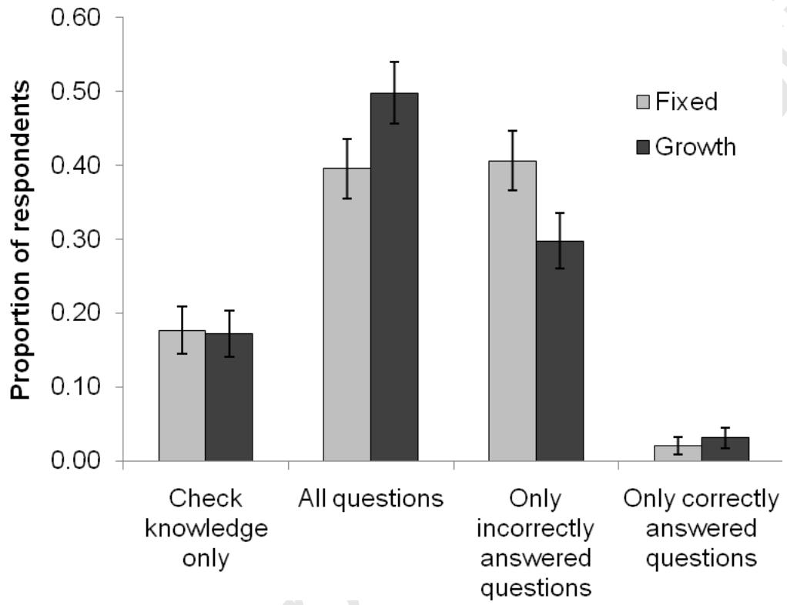
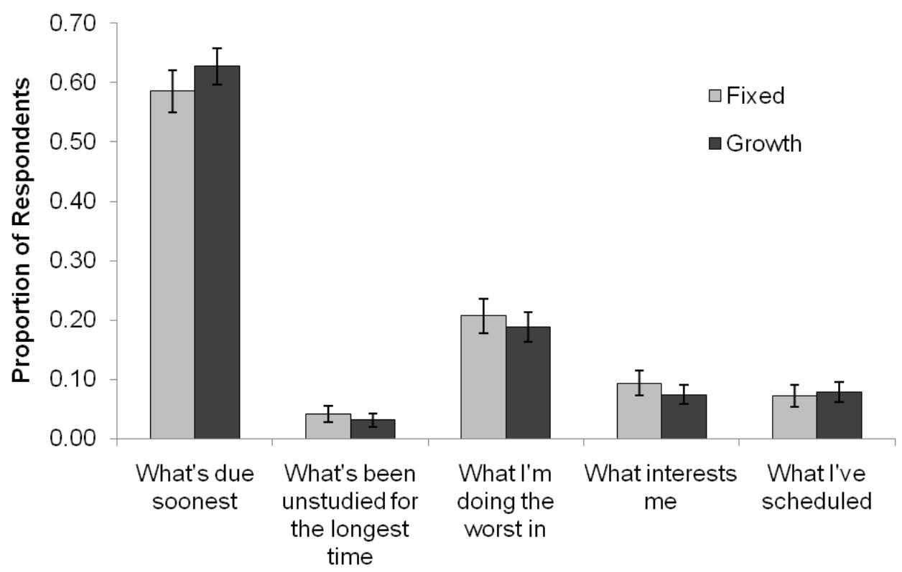
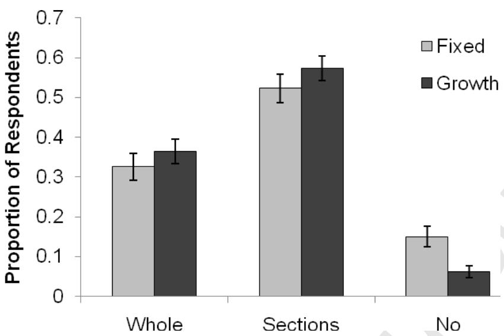
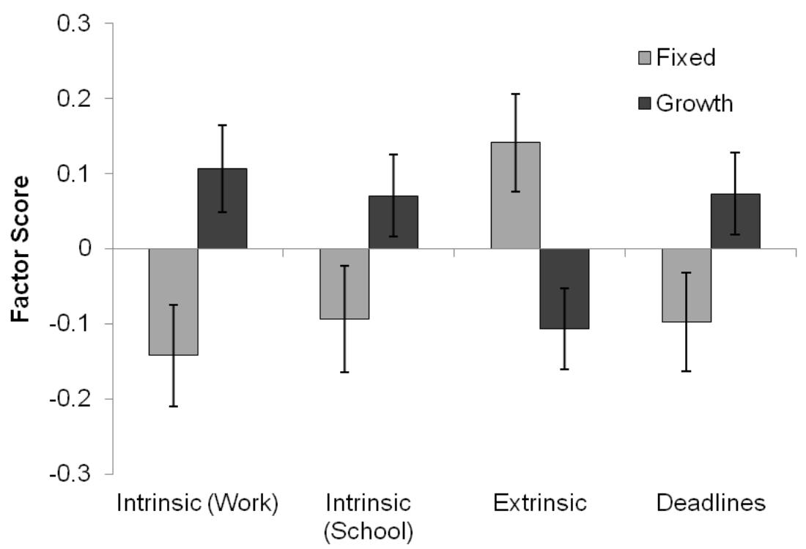

# Accepted Manuscript

Title: Habits and beliefs that guide self- regulated learning: Do they vary with mindset?

Author: Veronica X. Yan Khanh- Phuong Thai Robert A. Bjork

PII: S2211- 3681(14)00026- 6  DOI: http://dx.doi.org/doi:10.1016/j.jarmac.2014.04.003  Reference: JARMAC 123

To appear in:

Received date: 2- 12- 2013  Revised date: 11- 4- 2014  Accepted date: 14- 4- 2014

Please cite this article as: Yan, V. X., Thai, K.- P., & Bjork, R. A., Habits and beliefs that guide self- regulated learning: Do they vary with mindset?, Journal of Applied Research in Memory and Cognition (2014), http://dx.doi.org/10.1016/j.jarmac.2014.04.003

This is a PDF file of an unedited manuscript that has been accepted for publication. As a service to our customers we are providing this early version of the manuscript. The manuscript will undergo copyediting, typesetting, and review of the resulting proof before it is published in its final form. Please note that during the production process errors may be discovered which could affect the content, and all legal disclaimers that apply to the journal pertain.

Running head: MINDSET AND SELF- REGULATED LEARNING

Habits and beliefs that guide self- regulated learning: Do they vary with mindset?

Veronica X. Yan, Khanh- Phuong Thai, and Robert A. Bjork  University of California, Los Angeles

Correspondence regarding this article should be addressed to Veronica X. Yan (veronicayan@ucla.edu), 1285 Franz Hall, Department of Psychology, University of California, Los Angeles, CA 90095, Phone number: (310)- 954- 6650

Running head: MINDSET AND SELF- REGULATED LEARNING

Habits and beliefs that guide self- regulated learning: Do they vary with mindset?

# Highlights

! Our MTurk sample reported habits and metacognitive shortcomings strikingly similar to those reported by college students in prior studies.  !! In particular, our respondents tended not to restudy, failed to appreciate the pedagogical power of testing, and were driven by deadlines.  !! A growth mindset, however, was related to a greater likelihood of restudying information and appreciating the pedagogical benefits of testing.  !! A growth mindset, though, must be combined with knowing how to learn, including knowing that certain difficulties can be desirable.

# Abstract

Prior research by Kornell and Bjork (2007) and Hartwig and Dunlosky (2012) has demonstrated that college students tend to employ study strategies that are far from optimal. We examined whether individuals in the broader—and typically older—population might hold different beliefs about how best to study and learn, given their more extensive experience outside of formal coursework and deadlines. Via a web- based survey, however, we found striking similarities: Learners' study decisions tend to be driven by deadlines, and the benefits of activities such as self- testing and reviewing studied materials are mostly unappreciated. We also found evidence, however, that one's mindset with respect to intelligence is related to one's habits and beliefs: Individuals who believe that intelligence can be increased through effort were more likely to value the pedagogical benefits of self- testing, to restudy, and to be intrinsically motivated to learn, compared to individuals who believe that intelligence is fixed.

Keywords: self- regulated learning, metacognition, mindset, study strategiesWord count: 6,101

Habits and beliefs that guide self- regulated learning: Do they vary with mindset?

With the world's knowledge at our fingertips, there are increasing opportunities to learn on our own, not only during the years of formal education, but also across our lifespan as our careers, hobbies, and interests change. The rapid pace of technological change has also made such self- directed learning necessary: The ability to effectively self- regulate one's learning—monitoring one's own learning and implementing beneficial study strategies—is, arguably, more important than ever before.

Decades of research have revealed the efficacy of various study strategies (see Dunlosky, Rawson, Marsh, Nathan, & Willingham, 2013, for a review of effective—and less effective—study techniques). Bjork (1994) coined the term, “desirable difficulties,” to refer to the set of study conditions or study strategies that appear to slow down the acquisition of to- be- learned materials and make the learning process seem more effortful, but then enhance long- term retention and transfer, presumably because contending with those difficulties engages processes that support learning and retention. Examples of desirable difficulties include generating information or testing oneself (instead of reading or re- reading information—a relatively passive activity), spacing out repeated study opportunities (instead of cramming), and varying conditions of practice (rather than keeping those conditions constant and predictable).

Many recent findings, however—both survey- based and experimental—have revealed that learners continue to study in non- optimal ways. Learners do not appear, for example, to understand two of the most robust effects from the cognitive psychology literature—namely, the testing effect (that practicing retrieval leads to better long- term retention, compared even to rereading; e.g., Roediger & Karpicke, 2006a) and the spacing effect (that spacing repeated study sessions leads to better long- term retention than does massing repetitions; e.g., Cepeda, Pashler,

Vul, Wixted, & Rohrer, 2006; Dempster, 1988). A survey of 472 undergraduate students by Kornell and Bjork (2007)—which was replicated by Hartwig and Dunlosky (2012)—showed that students underappreciate the learning benefits of testing. Similarly, Karpicke, Butler, and Roediger (2009) surveyed students' study strategies and found that re- reading was by far the most popular study strategy and that self- testing tended to be used only to assess whether some level of learning had been achieved, not to enhance subsequent recall.

Even when students have some appreciation of effective strategies they often do not implement those strategies. Susser and McCabe (2013), for example, showed that even though students reported understanding the benefits of spaced learning over massed learning, they often do not space their study sessions on a given topic, particularly if their upcoming test is going to have a multiple- choice format, or if they think the material is relatively easy, or if they are simply too busy. In fact, Kornell and Bjork's (2007) survey showed that students' study decisions tended to be driven by impending deadlines, rather than by learning goals, and that students tended not to return to material they considered (rightly or wrongly) learned, or return to material after a course has ended. Hartwig and Dunlosky (2012) administered this same survey to a second sample of undergraduate students at a different university and found strikingly similar results. Furthermore, they demonstrated that students' learning habits do matter: Students with lower grade- point averages (GPAs) were more driven by deadlines and reported less self- testing than did students with higher GPAs.

Previous studies have focused on college students, but given that self- regulated learning is important across the lifespan, and that the online learning population, versus the college population, is so much more heterogeneous on every dimension, it is important to examine how a more diverse population manages its own learning. With additional life experiences, and without

the worry of maintaining a GPA, are people in the broader population more strategic self- regulators of learning? To explore this issue, we recruited participants via Amazon Mechanical Turk (MTurk)—a web- based platform that has been proven useful for recruiting and paying a diverse population to perform experimental tasks (Berinsky, Huber, & Lenz, 2012). We asked the participants the same questions used by Kornell and Bjork (2007), plus additional questions that examined specific study strategies and motivations for learning.

One specific question motivating the present research is whether there are general beliefs about one's self- related to study decisions. One potential candidate is an individual's theory of intelligence (Dweck, 1999)—that is, whether they are “fixed” (also referred to as “entity”) theorists, who believe that intelligence is innate and cannot be changed, or “growth” (or, “incremental”) theorists who believe that intelligence can be increased through effort. In both correlational and experimental research, one's theory of intelligence has been shown to impact not just academic achievement (e.g., Blackwell, Trzesniewski, & Dweck, 2007; Mangels, Butterfield, Lamb, Good, & Dweck, 2006; Mueller & Dweck, 1998), but also motivation and use of learning strategies. Growth theorists are more likely than fixed theorists to hold mastery, rather than performance, learning goals (Blackwell et al., 2007; Dupeyrat & Mariné, 2005), are more likely to change learning strategies and persist in the face of difficulty, and use deeper processing strategies during learning (Ommundsen, 2003; Grant & Dweck, 2003). Conversely, fixed theorists tend to believe that ability itself is sufficient for learning, and effort merely reflects a lack of ability (Blackwell et al., 2007; Dweck & Master, 2008).

Consistent with the notion that growth theorists are more likely to interpret effort in a productive way, prior research (Miele & Molden, 2010; Miele, Son, & Metcalfe, 2013) found that fixed theorists interpreted effortful encoding as a sign that they had reached their limits of

learning (thus, giving lower judgments of learning or comprehension to items that were dis- fluent), whereas growth theorists were more likely to interpret effort as greater engagement with learning. Most of the research exploring strategy use and preferences by fixed versus growth theorists has not, however, focused on the specific learning techniques that Dunlosky et al. (2013) deemed most effective (e.g., spacing, rather than massing, repeated study sessions, and testing, rather than recopying or restudying, to- be- learned information). Rather, many used survey items where effort could be engaged in both efficient and less efficient ways, such as "when I decide to study, I set aside a specific length of time and stick to it" (from the Learning and Study Strategies Inventory, Weinstein, Schulte, & Palmer, 1987) or "when I study for a test, I practice saying the important facts over and over to myself" (from the Motivated Strategies for Learning Questionnaire, Pintrich & DeGroot, 1990). Understanding how attitudes towards—and adoption of—effective but effortful strategies such as spacing and testing is related to a learner's theory of intelligence was one goal of the present research. To the extent that learners fail to appreciate the benefits of effective study techniques because these techniques make learning feel less fluent and more difficult (e.g., Alter & Oppenheimer, 2009; Benjamin, Bjork, & Schwartz, 1998; Schwarz et al., 1991), are growth theorists less likely to fall prey to metacognitive illusions and possess the insight to appreciate the benefits of desirable difficulties?

# Method

# Participants

Four hundred and fifty participants (197 males, 250 females, 3 undisclosed) from the United States were paid $0.50 for completing the survey. Participants' ages ranged from 18- 74, with a mean age of 34.23, standard deviation of 12.10, and median age of 31.24.44% of the

respondents were between the ages of 18- 24;  $48.43\%$  were aged 25- 40;  $26.01\%$  were aged 41- 65; and only  $1.12\%$  were 65 years or older.

# Materials

Survey on learning and memory. The questionnaire consisted of 13 questions on a single webpage: the seven original questions from Kornell and Bjork's (2007) study, follow- up questions aimed at clarifying the responses to those seven questions, and a few questions probing the respondent's motivations to learn, both for work and for school. The survey also included three questions to assess participants' intrinsic theory of intelligence (from Chiu, Hong, & Dweck, 1997). Appendix A contains the instructions and questions asked. The sequence of questions was the same for all participants.

Demographics questionnaire. Following the survey questions, participants provided their age, gender, highest level of education, profession, level of English fluency, and how often they find themselves in charge of their own learning.

# Procedure

MTurk workers could preview the survey before they decided to participate. They were instructed to read all the responses for a given question carefully before selecting their answer. When questions referred to classroom learning and the participants were not currently in school or college, they were instructed to think back to how they studied (or would study) in school. Participants completed the survey at their own pace (average completion time, 10 minutes).

# Results and Discussion

# Statistical Analysis Strategy

All statistical analyses were conducted using  $\alpha = .05$  . For each question, we first described the pattern of responses by a categorical theory of intelligence variable (fixed vs. growth). Our regression analyses, however, treated theory of intelligence as a continuous variable, using each participant's averaged responses to the three theory- of- intelligence questions.

Each question was analyzed using a stepwise backward binomial or multinomial logistic regression, entering theory of intelligence (continuous between 1- 6), education (no bachelor's degree, bachelor's degree, graduate degree) and student status (student, non- student) as predictor variables, with an entry probability of .05 and elimination probability of .10. For the education variable, "no bachelor's degree" was always designated the reference category, and for the student status variable, "student" was always designated the reference category. The full results of the regression analyses are presented in Appendix B.

# Demographic Data

Demographic DataTheory of intelligence. Participants' six- point Likert scale responses were averaged across the three statements. We report results in two ways. For the purposes of representing the responses in the figure, we categorized participants as either "fixed" or "growth" theorists, as has been the practice in the prior literature (e.g., Blackwell et al., 2007; Miele & Molden, 2010), and refer to this variable as categorical theory of intelligence: Those scoring an average above 3.5 were classified as growth theorists, while those scoring an average below 3.5 were classified as fixed theorists. The Cronbach's alpha coefficient for these three statements was 0.95, indicating

that the scale has excellent internal consistency. Of the participants,  $57.1\%$  were classified as growth theorists and  $42.9\%$  were classified as fixed theorists. This categorical theory of intelligence did not interact with gender,  $\chi^2 (1) = .03$ .

For the purposes of conducting binomial and multinomial regression analyses to examine the responses to our survey questions, the average theory of intelligence responses were treated as a continuous variable ( $M = 3.73$ ,  $SD = 1.43$ ), ranging from 1- 6, where a higher number represents more of a growth mindset and a lower number represents more of a fixed mindset. When treated as a continuous variable, theory of intelligence did not correlate with age,  $r = - .02$ .

Education level. Of the respondents,  $15\%$  held a graduate degree,  $37\%$  held a bachelor's (BA) degree, and  $48\%$  had no tertiary education degree (i.e., they had completed some college, had a high school diploma, or had completed some high school). Education level did not differ by gender,  $\chi^2 (2) = 2.73$ , but interestingly, it did differ by categorical theory of intelligence,  $\chi^2 (2) = 9.52$ . In fact, participants reporting a higher level of education were more likely to be fixed theorists— $36\%$ ,  $46\%$ , and  $57\%$  of those with no bachelor's degree, a bachelor's degree, and a graduate degree, respectively, were categorized as fixed theorists.

Students versus non- students. Sixty participants within our sample self- identified as being students (age range: 18- 51, mean age  $= 22.93$ ,  $SD = 4.91$ ), whereas 390 (age range: 18- 74, mean age  $= 36.11$ ,  $SD = 12.02$ ) participants listed other occupations. Chi- square tests of independence revealed that student status did not differ by categorical theory of intelligence,  $\chi^2 (1) = .00$ , nor by gender,  $\chi^2 (1) = 1.68$ . As expected, student status did differ by education level,  $\chi^2 (2) = 21.03$ : While  $75\%$  of MTurk students did not hold bachelor's degree, only  $44\%$  of the remaining MTurk workers fell into that same category.

# MINDSET AND SELF-REGULATED LEARNING

# [Insert Table 1 about here]

# How Does the MTurk Sample Compare to Previous Student Samples?

Table 1 compares the percentage of each response from student samples examined by Kornell and Bjork (2007) and by Hartwig and Dunlosky (2012), and our MTurk sample, separating the responses of the 60 students from the 360 non- students, and their combined responses. Although there are a few differences (e.g., the MTurk sample are more likely to reread whole chapters when studying than are the students), what is most striking are the similarities in reported study habits. The MTurk participants, like the students, are primarily driven by deadlines (the most popular response—75% of our students and 58% of the non- students—was to study whatever is due soonest or overdue). The non- students within our MTurk sample was, however, somewhat more likely than the students, to choose to study whatever they found interesting (9%, vs. 3% of the MTurk students, and 4% and 5% in Kornell & Bjork, and Hartwig & Dunlosky, respectively), presumably due to the greater flexibility and choice in study material among participants who are not enrolled in classes. Interestingly, however, fewer respondents in the MTurk sample plan their study ahead of time and study what they have scheduled (8% of our non- students and 7% of our students, vs. 11% and 13% in the previous student samples).

The MTurk sample also showed marked similarities to the previous student samples in their use of quizzing: They, like the college students, mostly used quizzes to check their own knowledge rather than as a learning tool (65% of our non- students and 52% of the MTurk students, as compared to 68% and 54% in the previous student samples). In fact, the MTurk non- students were even less likely to appreciate the benefits of quizzing: Only 14% (vs. 22% of the

MTurk students, and  $18\%$  and  $27\%$  in previous student samples) indicated that quizzing is better for learning than is rereading, and  $16\%$  of our non- students and  $15\%$  of our students (vs.  $9\%$  and  $9\%$  ) reported that they usually do not quiz themselves.

The majority of respondents in the MTurk sample (though a smaller percentage compared to the earlier student samples) do not return to course material after it has ended ( $57\%$  of our non- students and  $68\%$  of our students vs.  $86\%$  and  $78\%$ )—although our sample was, on the whole, more likely than the previous student samples to return to old course material. Furthermore, the MTurk respondents also tend not to review material once they consider it learned ( $58\%$  of our non- students and  $68\%$  of our students vs.  $64\%$  and  $54\%$ ) and finally, tend not to study the way they had been taught ( $65\%$  of non- students and  $60\%$  of our students vs.  $80\%$  and  $64\%$ ).

Overall, despite having more life experiences and little or no academic pressure, this more general population appears not to have better study habits than do college students.

# Do People Appreciate the Benefits of Testing?

One question that merits further examination is "If you quiz yourself, why do you do so?" We found, as with the previous student studies, that people appear to use quizzing only to figure out how well they have learned the information they are studying. In contrast, research shows that tests benefit learning, both for correctly answered items and incorrectly answered items, provided the failed testing is followed by feedback (see Roediger & Karpicke, 2006a, for a review of the testing effect). The benefits of testing persist even when testing takes away from study time (e.g., Kornell, Hays, & Bjork, 2009; Roediger & Karpicke, 2006b). Do the responses to Kornell and Bjork's (2007) quiz question (question 8, see Appendix A), however, truly reflect

a failure to appreciate the learning benefits of testing? We included a second question on quiz usefulness to probe what people really believed about quizzing, asking participants which of the following statements they most agreed with:

1. Quizzes are not useful for anything except to tell me what I do and do not know. [Check knowledge only]  
2. Quizzes are useful because I learn more for those questions that I answered incorrectly. [Only incorrectly answered questions]  
3. Quizzes are useful because I learn more for both questions that I answer correctly and incorrectly. [All questions]  
4. Quizzes are good only if I get the answers correct. [Only correctly answered questions]

Here, the metacognitively sophisticated learner should indicate that quizzes are useful for learning more about all questions. The least metacognitively sophisticated learner would believe that tests have no pedagogical value, and are simply a way of assessing one's current state of knowledge (i.e., check knowledge only). Of those that responded to the first quiz question that quizzing was used to figure out how well they had learned the information,  $45\%$  correctly responded that quizzing was useful for learning about all questions while  $40\%$  responded that quizzing was useful only for learning about those answered incorrectly, and a mere  $12\%$  believed that quizzing was useful only to check their state of knowledge. In fact, across the board, regardless of how participants responded to the first quiz question,  $45\%$  correctly believed that quizzing was useful for learning more about all questions. A substantial proportion  $(34\%)$ , however, reported that quizzing was useful for learning more about only those questions that were answered incorrectly. These data then, paint a somewhat more optimistic picture of what

people understand about the benefits of testing. We base further discussion of what people know about testing on the second quiz question.

Quizzing and theory of intelligence. Figure 1 shows the proportion of participants' response by their categorical theory of intelligence (fixed vs. growth). Few participants reported that self- quizzing is useful only when they got the answers correctly and for checking their knowledge, and there was no difference in the proportion of fixed and growth theorists on these responses. The majority of people believe that self- quizzing is helpful for either only incorrectly answered questions or all questions. Interestingly, it appeared that growth theorists were more likely to appreciate the benefit of testing for all tested material. Fixed theorists, on the other hand, most often responded that quizzing was helpful only for those questions that they answered incorrectly, perhaps reflecting a belief that if they had answered correctly, then no extra learning can take place.

A multinomial logistic regression (Appendix B1- a) did not confirm an effect of theory of intelligence,  $\chi^2 (3) = 4.83$ , but there was a marginally significant effect of education level,  $\chi^2 (6) = 10.93$ ,  $p = .08$ , and of student status,  $\chi^2 (3) = 6.74$ ,  $p = .08^1$ : Those with a BA degree were more likely to say that quizzes are useful for all questions than only to check their knowledge and than only on wrongly answered questions. On the other hand, non- students were more likely to say that they learned more from wrong answers than from all questions. When we restrict our analyses to only those who responded that quizzes are useful for either all question or for incorrectly answered question, however, the same multinomial logistic regression (Appendix B1- b) revealed a significant effect of theory of intelligence,  $\chi^2 (1) = 4.05$ , a significant effect of student status,  $\chi^2 (1) = 4.45$ , but no significant effect of education level,  $\chi^2 (2) = 3.80$ : Growth

theorists and BA degree holders were more likely to respond that quizzing was useful for all questions than for only wrongly answered questions. On the other hand, non- students were more likely to say that quizzing was useful for wrongly answered questions than for all questions.

Figure 1. Responses to the quiz usefulness question, "If you quiz yourself, why do you do so?", by categorical theory of intelligence. Error bars represent  $\pm 1$  standard error.

# How Do People Make Study Decisions?

Figure 2 shows the responses to "How do you decide what to study next?", broken down by theory of intelligence. Kornell and Bjork (2007) and Hartwig and Dunlosky (2012) found that college students' choices of what to study next tend to be driven by deadlines, rather than by strategies designed to maximize learning (e.g., by planning study schedule in advance, studying what they are doing the worst in, or studying what has been unstudied for the longest time), or by

some intrinsic factor (e.g., interest). Our MTurk sample showed a very similar pattern of results. There was very little difference between the fixed and growth theorists. Multinomial logistic regression confirmed that there was no effect of theory of intelligence,  $\chi^2 (4) = 4.09$  (Appendix B2).

Education level,  $\chi^2 (8) = 30.29$  and student status,  $\chi^2 (4) = 13.13$ , however, were both significant predictors. Specifically, those participants with a bachelor's degree were significantly less likely to study what they found most interesting, what hadn't been studied in the longest time, and what they were doing the worst in, as compared to studying whatever was due the soonest (or overdue) $^2$ . Those with a graduate degree were significantly less likely to study what they were doing the worst in, as compared to studying whatever was due soonest, and non- students were significantly more likely to study what they were doing the worst in and what they found interesting, compared to studying whatever was due soonest. In other words, while participants of all education levels were most likely to choose to next study whatever is due soonest, this effect was particularly pronounced for those with bachelor's degrees and for current students.

  
Figure 2. Responses to "How to do you decide what to study next?" by categorical theory of intelligence. Error bars represent  $\pm 1$  standard error.

# Do Restudying Habits Vary by Mindset?

Three questions in our survey examined restudying habits (response options are presented in the brackets):

1) When you study, do you typically reread the textbook/article/other source material more than once? [Yes, I reread whole chapters; Yes, I reread sections that I underlined/highlighted/marked; Not usually]  
2) Imagine that in the course of studying, you become convinced that you know the answer to a certain question. What do you do? [Put it aside and focus on other material; Make sure to study it again later]

3) Do you usually return to course material to review it after a course has ended?

[Yes; No]

Students' judgments of learning made during learning are often inaccurate. Kornell and Bjork (2008) for instance showed that participants tended to drop flashcards while studying GRE words (i.e., judged that they had maximally learned those words), even if they could not remember the definition of dropped words in a later recall test. Indeed, high accessibility (i.e., feeling that information is easy to retrieve) during study does not necessarily reflect strong long- term learning (Bjork & Bjork, 1992). Information can be easy to retrieve for a number of reasons. Consecutive, repeat studying (massing) of to- be- learned information, for example, might make learning on those repetition trials feel easy only because that information had very recently been studied, without allowing time to forget it; conversely, spaced repetitions can make learning feel more effortful and less effective (Zechmeister & Shaughnessy, 1980). These subjective experiences, however, stand in direct contrast to a massive body of literature that demonstrates that spaced practice is more effective for long- term learning than is massed practice (see Cepeda et al., 2006, for a review of the spacing literature). A metacognitively sophisticated learner, therefore, should return to studied material after a break to restudy or test themselves on that material. Consistent with prior research, however, our sample did not tend to restudy information considered learned over the course of studying, nor did they tend to return to old course material.

  
Figure 3. Responses to "When you study, do you typically reread the textbook/article/other source material more than once?" by categorical theory of intelligence. Error bars represent  $\pm 1$  standard error.

Rereading texts. Our first restudy question examined how people restudied information (if they even did so). The majority  $55\%$  of participants reported that they would reread only sections that they had marked,  $35\%$  indicated that they reread whole passages and  $10\%$  reported that they did not typically reread information.

Figure 3 shows the responses to this question by categorical theory of intelligence, and shows that fixed theorists were overall more likely to simply not reread information. Multinomial logistic regression (Appendix B3) confirmed that theory of intelligence was a significant predictor of responses,  $\chi^2 (2) = 10.72$ : A higher theory of intelligence score (i.e., more likely to be growth theorists) was associated with higher likelihood of rereading (both sections or the whole text) $^3$ . The log odds ratio revealed that a one unit increase in average theory of intelligence rating was associated with a 1.37 times greater likelihood of rereading sections and a 1.48 times greater

likelihood of rereading whole texts, as compared to not rereading at all. Neither education level,  $\chi^2 (4) = 3.25$ , nor student status,  $\chi^2 (2) = 2.23$ , were significant predictors.

  
Figure 4. Proportion of participants who do and do not re-study information they consider

"learned" during the course of studying (left), and who do and do not return to old course materials (right), by categorical theory of intelligence. Error bars represent  $\pm 1$  standard error.

Revisiting information during study. The second restudy question examined people's behaviors during the course of studying, and revealed that a majority  $63\%$  of participants reported that they would not return to material they considered "learned". The responses, by categorical theory of intelligence are presented in the left side of Figure 3. A binomial logistic regression (Appendix B4) revealed that theory of intelligence and student status were both significant predictors, but that educational level was not. Specifically, the log odds ratio showed that a one unit increase in theory of intelligence score (i.e., more growth theory) predicted a 1.20 times greater likelihood of studying information again later, and participants who are not currently students were only .48 times as likely as those who are students to restudy information.

Returning to old course materials. The responses to the third restudy question—whether learners review course material after a course has ended—revealed that similar to the responses about whether people revisit studied information, a majority  $59\%$  of participants said that they did not return to old course materials. These responses, by categorical theory of intelligence, are depicted on the right side of Figure 3, and reveal a strikingly similar pattern to the responses to the second restudy question. Examining responses by categorical theory of intelligence, we see that fixed theorists were unlikely to review old course material ( $36\%$ ) while the growth theorists were more evenly split ( $45\%$  indicated that they would review old course material).

Binomial logistic regression analysis (Appendix B5) revealed that while education level and student status were not significant predictors, theory of intelligence was a significant predictor. Consistent with the other two restudy questions, higher theory of intelligence scores were related to greater likelihood of returning to old course materials: A one unit increase in theory of intelligence score corresponded to a 1.18 times greater likelihood of returning to old course materials.

# What are People Being Taught, and What Study Strategies Do They Use?

The majority ( $64\%$ ) of participants do not study the way a teacher taught (consistent with response rates among student samples), and binomial logistic regression analyses revealed that this tendency was not predicted by theory of intelligence, education level, or student status. These results are difficult to interpret, however, without understanding what it is that our respondents are being taught, and we therefore asked respondents to indicate from a checklist the strategies they had been taught, and the strategies they actually used.

Appendix C1 reports—for each strategy from our checklist—the proportion of participants that reported that the strategy had been taught to them by a teacher, and the proportion that use each strategy regularly, as well as showing how these are broken down by categorical theory of intelligence. Theory of intelligence did not interact with either report of teaching or usage, for any strategy.

Engaging with to- be- learned material. Seven of the listed strategies represent different methods of engaging with to- be- learned material. Listing them roughly in order (from least to most) on how much each strategy engages the learning and leads to effective long- term learning, they are: Rereading, underlining, recopying notes, creating outlines, creating diagrams, testing with flashcards, and self- testing. Consistent with the findings of Karpicke et al. (2009), the most popular strategy was to reread information (75% of participants reported regularly rereading information), despite the fact that rereading is a relatively passive strategy—and arguably, the least effective strategy of the seven. Another popular strategy was underlining (59%), which again, has failed to demonstrate real learning benefits (rated as having “low utility” in the Dunlosky et al., 2013 review).

Interestingly, some form of testing—which a robust body of literature has demonstrated is effective—was fairly popular too. 66% of participants indicated that they used at least one of the two testing options: testing oneself with flashcards (40%) and self- testing (46%). Flashcards may be relatively popular because they often contain smaller pieces of information and can be quicker and more convenient to use. Whether the 40% of respondents who reported using flashcards actually use them in a true testing fashion (rather than simply using them as to- be- read summaries or highlights) is not clear.

Study conditions. The remaining strategies represent different types of study conditions and study schedules, and below, we discuss the responses to five of these study conditions.

Studying in the same place vs. different places. Contextual variation has been shown to improve long- term learning as well as transfer (e.g., Smith, Glenberg, & Bjork, 1978). One corollary of this finding is that instead of always studying in the same place, one should study in different places. In contrast to research findings, people were over three times more likely to be taught (22% vs. 7%)—and were actually more likely (20% vs. 14%)—to study in the same place than in different places. Though more people study in different places than had been taught to do so, this pattern is more likely reflective of practical constraints than a metacognitive awareness of the benefit of contextual variation.

Spacing vs. cramming. Spacing—the act of distributing practice, rather than cramming—has been repeatedly found to lead to better long- term learning, and is one of the most robust findings in cognitive psychology. While spacing was taught more often than cramming (44% vs. 7%), people still spaced and crammed their study at relatively equal rates (39% and 36%, respectively).

Scheduling study in advance. Although many people (54%) reported being taught to schedule their study activities (and, presumably, understand that this is a sensible technique), only 23% reported that they actually did schedule their studying—a finding that emphasizes that people are driven more by deadlines than by any self- generated scheduling.

# What Motivates Learning?

Our survey included several statements regarding people's motivations to learn, both for work and for school (see Appendix A, question 4). We asked respondents to consider their

responses for work and school motivations separately, to encourage people to think of specific learning situations, and understanding that the motivations for work and school could be very different. We conducted an exploratory factor analyses on these 12 items using maximum likelihood extraction employing direct oblimin (oblique) rotations to allow for correlated factors. We extracted four factors, corresponding to intrinsic motivation for work, intrinsic motivation for school, extrinsic motivation and deadline priority (see Appendix D1 for factor loadings, and D2 for the factor correlation matrix). The two intrinsic motivation factors (work and school) were significantly positively correlated with each other,  $r(447) = .35$ . Extrinsic motivation was significantly negatively correlated with intrinsic motivation for work,  $r(447) = - .18$ , and with intrinsic motivation in school,  $r(447) = - .27$ . Prioritizing deadlines was significantly positively correlated with intrinsic motivation for work,  $r(447) = .18$ , and with intrinsic motivation for school,  $r(447) = .13$ . This four- factor model was judged to be an good fit, based upon a root mean square error of approximation (RMSEA) of 0.057, 90%  $CI = 0.047 - 0.065$ .

  
Figure 5. Average factor scores for each motivational factor, by categorical theory of intelligence. Error bars represent  $\pm 1$  standard error.

The average factor scores, on each motivation factor of each categorical theory of intelligence group are shown in Figure 5. Although the statements were rated such that a lower rating indicated greater agreement, we have reversed the direction of the factor scores for interpretive ease. For example, in Figure 5, and in the scores reported below, a higher 'extrinsic' motivation score indicates higher extrinsic motivation.

Correlational analyses between theory of intelligence and motivation factor scores largely confirmed the patterns that can be seen in Figure 5—that growth theorists have higher intrinsic motivation and that fixed theorists have higher extrinsic motivation. Those with a higher theory of intelligence score (i.e., more growth theory) had significantly higher intrinsic motivation for work,  $r(448) = .10$ , and marginally higher intrinsic motivation for school,  $r(448) = .08$ ,  $p = .10$ .

They were also marginally more likely to report the importance of meeting deadlines,  $r(448) = .09, p = .05$ , On the other hand, those with a lower theory of intelligence score (i.e., more fixed theory) had significantly greater extrinsic motivation scores,  $r(448) = - .17$ .

# General Discussion

Research on metacognition and self- regulated learning has provided insights into the activities and processes that support learning and academic achievement. Much of this research, however, has relied on studies of, and responses from, college students. Our study examined the learning habits and activities of a much broader population and how those habits and activities vary by learners' beliefs about intelligence.

We found that the broader population carries much the same beliefs about learning, and engages in very similar study habits, as do the previously surveyed college students. In one sense, this similarity is good news for researchers: Much of the research on the necessity of enhancing self- regulated learning is generalizable to the broader population. This similarity, however, means that even in the real world, away from the time- pressures and exam- based assessments of college, people engage in far- from- optimal learning behaviors. More specifically, people are still largely driven by deadlines, underappreciate the pedagogical power of testing, tend not to restudy information that they consider "learned" or to return to old course materials, and rely heavily on passive and less effective study strategies, such as rereading and underlining.

Our data suggest, however, that growth theorists manage their own learning in somewhat more productive ways than do fixed theorists. Growth theorists, for example, were more likely than fixed theorists to understand the pedagogical importance of self- testing, and less likely to believe that quizzes were useful only to check knowledge. Growth theorists were also more

likely to restudy information, across all three variants of our restudying questions—restudying passages, restudying information considered “learned,” and restudying old course material. Fixed theorists are also less intrinsic (especially in their attitudes towards work) and more extrinsic in their motivations to learn. Our findings are consistent with previous literature, underscoring fixed theorists’ belief that ability is stable, that what had been learned in the past may still be retained now, and that effortful study reflects a lack of ability rather than learning progress (e.g., Dweck, 1999; Hong, Chiu, Dweck, Lin & Wan, 1999; Rhodewalt, 1994; Blackwell et al., 2007; Dweck & Master, 2008)

# Practical Applications

The research we report is correlational, but shows interesting relationships between mindset and self- regulated learning: Those who hold growth mindsets are somewhat more likely to engage in more metacognitively sophisticated learning habits. It is likely that effective self- regulated learning requires both understanding of what learning strategies are effective (and which are not), and an appreciation that effort and difficulty is central to the process of learning, rather than a sign of failure to learn (i.e., a growth mindset).

If research continues to show that mindset matters—either in pre- existing learning habits, or in the willingness to change one’s habits—then one question is what can be done to alter a learner’s mindset (e.g., Blackwell et al., 2007, report a successful classroom intervention). Simply shifting from a fixed to a growth mindset would clearly not, though, given our findings, lead to effective self- regulated learning: Both fixed and growth theorists reported non- optimal beliefs and habits. A growth mindset, however, might make people more amenable to learning

about and incorporating "desirable difficulties" and other effective methods into their learning repertoire.

Interestingly, if one approaches the relationship between mindset and self- regulated learning from the opposite direction, so to speak, it may also be the case that teaching evidence- based study strategies might shift learners toward a growth theory of intelligence. This type of instruction is, we think, largely lacking in current classrooms. That is, we think it is rare for students and instructors to recognize the difference between long- term learning and current performance and to understand that some difficulties may be desirable. As learners appreciate that long- term learning typically calls for greater effort, and that effective learning should not necessarily feel easy, they may gradually come to understanding intelligence as something that can be increased.

The next challenge in creating effective and independent learners involves finding a mixture of instruction and experiences that has the power not only to modify learners' mental models of their own learning, but also provide them with a toolkit of processes and activities that actually enhance learning and comprehension.

Conflict of Interest Statement: The authors declare that they have no conflict of interest.

# Acknowledgments

This research was supported by Grant No. 29192G from the McDonnell Foundation. We thank Kat Devera for her help in coding data, and members of CogFog for their contributions to this article. Portions of this research were presented at the  $92^{\text{nd}}$  annual convention of the Western Psychological Association, San Francisco, CA.

# MINDSET AND SELF-REGULATED LEARNING

# References

Alter, A. L. & Oppenheimer, D. M. (2009). Uniting the tribes of fluency to form a metacognition nation. Personality and Social Psychology Review, 13, 219- 235.

Benjamin, A. S., Bjork, R. A., & Schwartz, B. L. (1998). The mismeasure of memory: When retrieval fluency is misleading as a metamnemonic index. Journal of Experimental Psychology: General, 127, 55- 68.

Berinsky, A. J., Huber, G. A., Lenz, G. S. (2012). Evaluating Online Labor Markets for Experimental Research: Amazon.com's Mechanical Turk. Political Analysis. doi: 10.1093/pan/mpr057.

Blackwell, L., Trzesniewski, K., & Dweck, C. S. (2007). Implicit Theories of Intelligence Predict Achievement Across an Adolescent Transition: A Longitudinal Study and an Intervention. Child Development, 78, 246- 263.

Bjork, R. A. (1994). Memory and metamemory considerations in the training of human beings. In J. Metcalfe and A. Shimamura (Eds.), Metacognition: Knowing about knowing (pp.185- 205). Cambridge, MA: MIT Press.

Bjork, R. A., & Bjork, E. L. (1992). A new theory of disuse and an old theory of stimulus fluctuation. In A. Healy, S. Kosslyn & R. Shiffrin (Eds.), From Learning Processes to Cognitive Processes: Essays in Honor of William E. Estes (Vol. 2, pp. 35- 67). Hillsdale, NJ: Erlbaum.

Cepeda, N. J., Pasher, H., Vul, E., Wixted, J. T., & Rohrer, D. (2006). Distributed practice in verbal recall tasks: A review and quantitative synthesis. Psychology Bulletin, 132, 354- 380.

Chiu, C., Hong, Y., & Dweck, C.S. (1997). Lay dispositionism and implicit theories of personality. Journal of Personality and Social Psychology, 73, 19- 30.

Dempster, F. N. (1988). The spacing effect: A case study in the failure to apply the results of psychological research. *American Psychologist*, 43, 627- 634.

Dunlosky, J., Rawson, K., Marsh, E. J., Nathan, M. J., & Willingham, D. T. (2013). Improving students' learning with effective learning techniques: Promising directions from cognitive and educational psychology. *Psychological Science in the Public Interest*, 14, 4- 58.

Dupeyrat, C., & Marine, C. (2005). Implicit theories of intelligence, goal orientation, cognitive engagement, and achievement: A test of Dweck's model with returning to school adults. *Contemporary Educational Psychology*, 30, 43- 59.

Dweck, C. S. (1999). *Self- theories: Their role in motivation, personality and development*. Philadelphia: Taylor and Francis/Psychology Press.

Dweck, C.S., & Master, A. (2008). Self- theories motivate self- regulated learning. In D. Schunk & B. Zimmerman (Eds). Motivation and self- regulated learning: Theory, Research, and Applications. Mahwah, NJ: Erlbaum.

Grant, H., & Dweck, C. S. (2003). Clarifying achievement goals and their impact. *Journal of Personality and Social Psychology*, 85, 541- 553.

Hartwig, M. K. & Dunlosky, J. (2012). Study strategies of college students: Are self- testing and scheduling related to achievement? *Psychonomic Bulletin & Review*, 19, 126- 134.

Hong, Y- Y., Chiu, C.- Y., Dweck, C. S., Lin, D. M.- S., Wan, W. (1999). Implicit theories, attributions, and coping: A meaningful system approach. *Journal of Personality and Social Psychology*, 77, 588- 599.

Karpicke, J. D., Butler, A. C., & Roediger, H. L., 3rd. (2009). Metacognitive strategies in student learning: do students practise retrieval when they study on their own? *Memory*, 17, 471- 479.

Kornell, N., & Bjork, R. A. (2007). The promise and perils of self- regulated study. Psychonomic Bulletin & Review, 14, 219- 224.

Kornell, N., & Bjork, R. A. (2008). Optimizing self- regulated study: The benefits and costs of dropping flashcards. Memory, 16, 125- 136.

Kornell, N., Hays, M. J., & Bjork, R. A. (2009). Unsuccessful Retrieval Attempts Enhance Subsequent Learning. Journal of Experimental Psychology: Learning, Memory and Cognition, 35, 989- 998.

Mangels, J. A., Butterfield, B., Lamb, J., Good, C., & Dweck, C. S. (2006). Why do beliefs about intelligence influence learning success? A social cognitive neuroscience model. Social Cognitive and Affective Neuroscience, 1, 75- 86.

Miele, D. B., Son, L. K., & Metcalfe, J. (2013). Children's naïve theories of intelligence influence their metacognitive judgments. Child Development, 84, 1879- 86.

Miele, D. B. & Molden, D. (2010). Naive theories of intelligence and the role of processing fluency in perceived comprehension. Journal of Experimental Psychology: General, 139, 535- 557.

Mueller, C. M., & Dweck, C. S. (1998). Praise for Intelligence Can Undermine Children's Motivation and Performance. Journal of Personality and Social Psychology, 75, 33- 52.

Ommundsen, Y. (2003). Implicit theories of ability and self- regulation strategies in physical education classes. Educational Psychology, 23, 141- 157.

Pintrich, R. R., & DeGroot, E. V. (1990). Motivational and self- regulated learning components of classroom academic performance. Journal of Educational Psychology, 82, 33- 40.

Rhodewalt, F. (1994). Conceptions of ability, achievement goals, and individual differences in self- handicapping behavior: On the application of implicit theories. *Journal of Personality*, 62, 67- 85.

Roediger, H. L., & Karpicke, J.D. (2006a). The power of testing memory: Basic research and implications for educational practice. *Perspectives on Psychological Science*, 1, 181- 210.

Roediger, H. L., & Karpicke, J. D. (2006b). Test- enhanced learning: taking memory tests improves long- term retention. *Psychological Science*, 17, 249- 255.

Schwarz, N., Bless, H., Strack, F., Klumpp, G., Rittenauer- Schatka, H., & Simons, A. (1991). Ease of retrieval as information: Another look at the availability heuristic. *Journal of Personality and Social Psychology*, 61, 195- 202.

Smith, S.M., & Glenberg, A., & Bjork, R.A. (1978). Environmental context and human memory. *Memory & Cognition*, 6, 342- 353.

Susser, J. A., & McCabe, J. (2013). From the lab to the dorm room: metacognitive awareness and use of spaced study. *Instructional Science*, 41, 345- 363.

Weinstein, C. E., Schulte, A. C., & Palmer, D. P. (1987). Learning and Study Strategies Inventory. Clearwater, FL: H & H Publishing.

Zechmeister, E. B., & Shaughnessy, J. J. (1980). When you know that you know and when you think that you know but you don't. *Bulletin of the Psychonomic Society*, 15, 41- 44.

# MINDSET AND SELF-REGULATED LEARNING

Table 1

Summary of responses to the seven original questions from Kornell & Bjork (2007), compared across three studies  

<table><tr><td rowspan="2">Questions</td><td rowspan="2">Choices</td><td rowspan="2">Kornell &amp;amp; Bjork (2007) (N=472)</td><td rowspan="2">Hartwig &amp;amp; Dunlosky (2012) (N=324)</td><td colspan="3">Current study (N=450)</td></tr><tr><td>Students (N=60)</td><td>Non-students (N=390)</td><td>Combined (N=450)</td></tr><tr><td rowspan="2">1 Would you say that you study the way you do because a teacher (or teachers) taught you to study that way?</td><td>Yes</td><td>20%</td><td>36%</td><td>40%</td><td>35%</td><td>36%</td></tr><tr><td>No</td><td>80%</td><td>64%</td><td>60%</td><td>65%</td><td>64%</td></tr><tr><td rowspan="5">2 How do you decide what to study next?</td><td>Whatever&#x27;s due soonest/overdue</td><td>59%</td><td>56%</td><td>75%</td><td>58%</td><td>61%</td></tr><tr><td>Whatever I haven&#x27;t studied for the longest time</td><td>4%</td><td>2%</td><td>3%</td><td>4%</td><td>4%</td></tr><tr><td>Whatever I find interesting</td><td>4%</td><td>5%</td><td>3%</td><td>9%</td><td>8%</td></tr><tr><td>Whatever I feel I&#x27;m doing the worst in</td><td>22%</td><td>24%</td><td>12%</td><td>21%</td><td>20%</td></tr><tr><td>I plan my study schedule ahead of time, and I study whatever I&#x27;ve scheduled</td><td>11%</td><td>13%</td><td>7%</td><td>8%</td><td>8%</td></tr><tr><td rowspan="2">3 Do you usually return to course material to review it after a course has ended?</td><td>Yes</td><td>14%</td><td>23%</td><td>32%</td><td>42%</td><td>41%</td></tr><tr><td>No</td><td>86%</td><td>78%</td><td>68%</td><td>57%</td><td>59%</td></tr><tr><td rowspan="3">4 All other things being equal, what do you study more for?</td><td>Essay/short answer exams</td><td>29%</td><td>20%</td><td>35%</td><td>39%</td><td>38%</td></tr><tr><td>Multiple-choice exams</td><td>22%</td><td>22%</td><td>18%</td><td>17%</td><td>17%</td></tr><tr><td>About the same</td><td>49%</td><td>58%</td><td>47%</td><td>44%</td><td>45%</td></tr></table>

# MINDSET AND SELF-REGULATED LEARNING

<table><tr><td rowspan="3">5 When you study, do you typically read a textbook/article/other source material more than once?</td><td>Yes, I reread whole chapters/articles</td><td>16%</td><td>19%</td><td>40%</td><td>34%</td><td>35%</td></tr><tr><td>Yes, I reread sections that I underlined/highlighted/marked</td><td>60%</td><td>64%</td><td>47%</td><td>56%</td><td>55%</td></tr><tr><td>Not usually</td><td>23%</td><td>17%</td><td>13%</td><td>9%</td><td>10%</td></tr><tr><td rowspan="4">6 If you quiz yourself while you study (either using a quiz at the end of a chapter, or a practice quiz, or flashcards, or something else), why do you do so?</td><td>I learn more that way than I would through rereading</td><td>18%</td><td>27%</td><td>22%</td><td>14%</td><td>15%</td></tr><tr><td>To figure out how well I have learned the information I&#x27;m studying</td><td>68%</td><td>54%</td><td>52%</td><td>64%</td><td>62%</td></tr><tr><td>I find quizzing more enjoyable than reading</td><td>4%</td><td>10%</td><td>12%</td><td>5%</td><td>6%</td></tr><tr><td>I usually do not quiz myself</td><td>9%</td><td>9%</td><td>15%</td><td>16%</td><td>16%</td></tr><tr><td rowspan="2">7 Imagine that in the course of studying, you become convinced that you know the answer to a certain question (e.g., the definition of a term in psychology). What would you do?</td><td>Make sure to study (or test yourself on) it again later</td><td>36%</td><td>46%</td><td>52%</td><td>34%</td><td>36%</td></tr><tr><td>Put it aside and focus on other material</td><td>64%</td><td>54%</td><td>48%</td><td>66%</td><td>63%</td></tr></table>

# Appendix A

Note: Asterisks (*) indicate survey questions from Kornell & Bjork (2007)

SURVEY ON LEARNING AND MEMORY

Please read each question carefully and read each answer before selecting your most honest response.

If a questions asks about classroom learning and you are not currently in school or college, please think back to how you studied (or would study) in school.

Q1. This question aims to understand what study methods teachers have encouraged, and what study methods you actually employ. We want to see how these match or differ.

*1a) Would you say that you study the way you do because a teacher (or teachers) taught you to study that way?

Yes No

1b) Which of the following study methods are methods that a teacher (or teachers) has encouraged you to use in the past, regardless of whether you actually use them? Check all that apply.

Re- copy your notes Re- read notes, textbooks, chapters, etc. Underline or highlight while reading Test yourself with questions or practice problems Using flashcards to test yourself Make outlines Make diagrams, charts or pictures Study in the same place Study in different places Spread out study across multiple days/weeks Focus on one thing at a time, learning that well before moving onto something different "Cram" lots of information the night before the test Schedule study ahead of time and stick to it Study with friends Other

If you selected other, please describe: [free response]

1c) The list of strategies from Q1b) is copied below. Which of the above strategies do you actually use regularly, regardless of whether anyone encouraged you to use it or you developed it yourself? Check all that apply.

Re- copy your notes Re- read notes, textbooks, chapters, etc. Underline or highlight while reading Test yourself with questions or practice problems Using flashcards to test yourself Make outlines Make diagrams, charts or pictures Study in the same place Study in different places Spread out study across multiple days/weeks Focus on one thing at a time, learning that well before moving onto something different "Cram' lots of information the night before the test Schedule study ahead of time and stick to it Study with friends Other

If you selected other, please describe: [free response]

*Q2. How do you decide what to study next? Whatever's due soonest/overdue Whatever I haven't studied for the longest time Whatever I find interesting Whatever I feel I'm doing the worst in I plan my study schedule ahead of time, and I study whatever I've scheduled

Q3. Does the way you learn/study change between learning for school/university and learning for work? If so, please describe how your study habits differ for school and for work. [free response]

Q4. Indicate how much you agree with the following statements [1 = strongly disagree; 5 = strongly agree]

# When learning for school:

... I find courses interesting. ... I feel excited to learn new course material. ... I mainly study in order to pass exams. ... It is imperative that I meet deadlines.

... Course material is important beyond the course itself. ... If information is available online or in a book/manual, I place less priority in learning it.

# When learning for jobs:

... I find learning for my job interesting. ... I get excited about mastering new skills for my job. ... Work is just about earning money. ... It is imperative that I meet deadlines. ... If I did not have my job, I would still be interested in learning the skills/knowledge that I need for the job. ... If information is available online or in a book/manual, I place less priority in learning it.

*Q5. Do you usually return to course material to review it after a course has ended?

Yes No

*Q6a) All other things being equal, what do you study for more?

a) Essay/short answer exams  
b) Multiple-choice exams  
c) About the same

Q6b) Please explain your answer choice to Q6a). [free response]

Q6c) Which type of exam...(essay/short answer, MCQ or about the same)

... Is more important to perform well in? ... Tests a greater amount of information? ... Tests a greater understanding of information? ... Is more difficult? ... Is more commonly used?

*Q7. When you study, do you typically read a textbook/article/other source material more than once?

Yes, I reread whole chapters/articles  Yes, I reread sections that I underlined/highlighted/marked  Not usually

$\ast \mathrm{Q8}$  . If you quiz yourself while you study (either using a quiz at the end of a chapter, or a practice quiz, or flashcards, or something else), why do you do so?

I learn more that way than I would through rereading To find out how well I have learned the information I'm studying I find quizzing more enjoyable than rereading I do not quiz myself

Q9. Which of the following statements do you agree with the most?

Quizzes are not useful for anything except to tell me what I do and do not know. Quizzes are useful because I learn more for those questions that I answered incorrectly. Quizzes are useful because I learn more for both questions that I answer correctly and incorrectly. Quizzes are good only if I get all the answers correct.

$\ast \mathrm{Q10}$  Imagine that in the course of studying, you become convinced that you know the answer to a certain question (e.g. the definition of a term in psychology). What would you do?

Make sure to study (or test yourself on) it again later Put it aside and focus on other material

Q11. Please indicate how much you agree with the following statements on a scale of 1- 6, with 1 being strongly agree and 6 being strongly disagree.

You have a certain amount of intelligence and you really cannot do much to change it. Your intelligence is something about you that you cannot change very much. You can learn new things, but you cannot really change your basic intelligence.

# DEMOGRAPHICS

1. What country are you from? 
2. What is your age? 
3. What is your gender? 
4. What is your highest level of education? Some high school High school Some college Bachelor's degree Graduate degree I prefer not to say

5. How often do you find yourself in charge of your own learning (in terms of learning some information, a skill or procedure, etc.)? Never

# MINDSET AND SELF-REGULATED LEARNING

RarelySometimesOften

6. What is your profession?

7. Please indicate your level of English fluency.Not at all fluentSomewhat fluent/ConversationalFluentNative speaker

8. Please describe a circumstance where you have had to regulate/be in charge of your own learning.

# Appendix B

Table B1- a Multinomial logistic regression parameter estimates (of the final model, using backward stepwise method) for investigating the effects of theory of intelligence, education, and student status on responses to the question regarding the usefulness of quizzing (Question 9)

<table><tr><td>Response (compared to “Quizzes are useful because I learn more for both questions I answer correctly and incorrectly”)</td><td>B (SE)</td><td>Wald</td><td>df</td><td>Sig.</td><td>Exp (B)</td></tr><tr><td>Useful only to check what I do and do not know</td><td></td><td></td><td></td><td></td><td></td></tr><tr><td>Education</td><td></td><td></td><td></td><td></td><td></td></tr><tr><td>(No BA = 0, BA = 1)</td><td>-.75 (.31)</td><td>5.87</td><td>1</td><td>.02*</td><td>.48</td></tr><tr><td>(No BA = 0, Graduate = 1)</td><td>-.26 (.40)</td><td>.41</td><td>1</td><td>.52</td><td>.77</td></tr><tr><td>Student</td><td></td><td></td><td></td><td></td><td></td></tr><tr><td>(Non-student = 0, Student = 1)</td><td>.61 (.41)</td><td>2.16</td><td>1</td><td>.14</td><td>1.83</td></tr><tr><td>Useful only if I get the answers correct</td><td></td><td></td><td></td><td></td><td></td></tr><tr><td>Education</td><td></td><td></td><td></td><td></td><td></td></tr><tr><td>(No BA = 0, BA = 1)</td><td>-.25 (.62)</td><td>.16</td><td>1</td><td>.69</td><td>.78</td></tr><tr><td>(No BA = 0, Graduate = 1)</td><td>-19.14 (.00)**</td><td>--</td><td>1</td><td>--</td><td>--</td></tr><tr><td>Student</td><td></td><td></td><td></td><td></td><td></td></tr><tr><td>(Non-student = 0, Student = 1)</td><td>-.30 (.71)</td><td>.18</td><td>1</td><td>.68</td><td>.74</td></tr><tr><td>Useful only if I get the answers incorrect</td><td></td><td></td><td></td><td></td><td></td></tr><tr><td>Education</td><td></td><td></td><td></td><td></td><td></td></tr><tr><td>(No BA = 0, BA = 1)</td><td>-.40 (.24)</td><td>2.81</td><td>1</td><td>.09</td><td>.67</td></tr><tr><td>(No BA = 0, Graduate = 1)</td><td>.01 (.32)</td><td>.00</td><td>1</td><td>.97</td><td>1.01</td></tr><tr><td>Student</td><td></td><td></td><td></td><td></td><td></td></tr><tr><td>(Non-student = 0, Student = 1)</td><td>.78 (.35)</td><td>5.00</td><td>1</td><td>.03*</td><td>2.17</td></tr></table>

Note: \*\* This estimate is large, as no respondent with a Graduate degree chose that quizzes are useful only if the answers are correct. Asterisks  $(^{*})$  indicate statistical significance at  $p<$  .05.

Table B1- b Multinomial logistic regression parameter estimates (of the final model, using backward stepwise method) for investigating the effects of theory of intelligence, education, and student status on responses to the question regarding the usefulness of quizzing (Question 9; including only answer choices with the most responses: quizzes are useful for all questions and for only incorrectly answered questions)

<table><tr><td>Response (compared to “Quizzes are useful because I learn more for both questions I answer correctly and incorrectly”)</td><td>B (SE)</td><td>Wald</td><td>df</td><td>Sig.</td><td>Exp (B)</td></tr><tr><td>Useful only if I get the answers incorrect</td><td></td><td></td><td></td><td></td><td></td></tr><tr><td>Theory of Intelligence</td><td>-.15 (.08)</td><td>4.00</td><td>1</td><td>.05*</td><td>.86</td></tr><tr><td>Student 
(Non-student = 0, Student = 1)</td><td>.69(.34)</td><td>4.18</td><td>1</td><td>.04*</td><td>2.00</td></tr></table>

Note: Asterisks  $(^{*})$  indicate statistical significance at  $p < .05$

Table B2 Multinomial logistic regression parameter estimates (of the final model, using backward stepwise method) for investigating the effects of theory of intelligence, education, and student status on responses to Question 2 "How do you decide what to study next?"  

<table><tr><td>Response (compared to “Whatever is due soonest or overdue”)
Study what is most interesting</td><td></td><td>B (SE)</td><td>Wald</td><td>df</td><td>Sig.</td><td>Exp (B)</td></tr><tr><td>Education</td><td></td><td></td><td></td><td></td><td></td><td></td></tr><tr><td>(No BA = 0, BA = 1)</td><td>-1.32 (.44)</td><td>9.21</td><td>1</td><td>.00*</td><td>.27</td><td></td></tr><tr><td>(No BA = 0, Graduate = 1)</td><td>-.89 (.53)</td><td>2.84</td><td>1</td><td>.09</td><td>.41</td><td></td></tr><tr><td>Student</td><td></td><td></td><td></td><td></td><td></td><td></td></tr><tr><td>(Non-student = 0, Student = 1)</td><td>1.61(.76)</td><td>4.56</td><td>1</td><td>.03*</td><td>5.02</td><td></td></tr><tr><td>Study what hasn’t been studied in the longest time</td><td></td><td></td><td></td><td></td><td></td><td></td></tr><tr><td>Education</td><td></td><td></td><td></td><td></td><td></td><td></td></tr><tr><td>(No BA = 0, BA = 1)</td><td>-1.54 (.66)</td><td>5.36</td><td>1</td><td>.02*</td><td>.21</td><td></td></tr><tr><td>(No BA = 0, Graduate = 1)</td><td>-1.73</td><td>2.64</td><td>1</td><td>.10</td><td>.18</td><td></td></tr><tr><td></td><td>(1.06)</td><td></td><td></td><td></td><td></td><td></td></tr><tr><td>Student</td><td></td><td></td><td></td><td></td><td></td><td></td></tr><tr><td>(Non-student = 0, Student = 1)</td><td>.80(.79)</td><td>1.04</td><td>1</td><td>.31</td><td>2.23</td><td></td></tr><tr><td>Study what has been scheduled</td><td></td><td></td><td></td><td></td><td></td><td></td></tr><tr><td>Education</td><td></td><td></td><td></td><td></td><td></td><td></td></tr><tr><td>(No BA = 0, BA = 1)</td><td>.17 (.40)</td><td>.17</td><td>1</td><td>.68</td><td>1.18</td><td></td></tr><tr><td>(No BA = 0, Graduate = 1)</td><td>-.35 (.61)</td><td>.34</td><td>1</td><td>.56</td><td>.70</td><td></td></tr><tr><td>Student</td><td></td><td></td><td></td><td></td><td></td><td></td></tr><tr><td>(Non-student = 0, Student = 1)</td><td>.40(.57)</td><td>.48</td><td>1</td><td>.49</td><td>1.49</td><td></td></tr><tr><td>Study what I feel I am doing the worst in</td><td></td><td></td><td></td><td></td><td></td><td></td></tr><tr><td>Education</td><td></td><td></td><td></td><td></td><td></td><td></td></tr><tr><td>(No BA = 0, BA = 1)</td><td>-1.09 (.29)</td><td>13.87</td><td>1</td><td>.00*</td><td>.34</td><td></td></tr><tr><td>(No BA = 0, Graduate = 1)</td><td>-.79 (.37)</td><td>4.49</td><td>1</td><td>.03*</td><td>.46</td><td></td></tr><tr><td>Student</td><td></td><td></td><td></td><td></td><td></td><td></td></tr><tr><td>(Non-student = 0, Student = 1)</td><td>1.15 (.44)</td><td>6.89</td><td>1</td><td>.01*</td><td>3.17</td><td></td></tr></table>

Note: Asterisks  $(^{*})$  indicate statistical significance at  $p < .05$

Table B3 Multinomial logistic regression parameter estimates (of the final model, using backward stepwise method) for investigating the effects of theory of intelligence, education, and student status on responses to Question 7 "When you study, do you typically reread the textbook/article/other source material more than once?"  

<table><tr><td>Response (compared to “Not usually”)</td><td>B (SE)</td><td>Wald</td><td>df</td><td>Sig.</td><td>Exp (B)</td></tr><tr><td>Yes, I reread sections that I underlined/highlighted/marked</td><td></td><td></td><td></td><td></td><td></td></tr><tr><td>Theory of Intelligence</td><td>.31 (.12)</td><td>7.18</td><td>1</td><td>.01*</td><td>1.37</td></tr><tr><td>Yes, I reread whole chapters/articles</td><td></td><td></td><td></td><td></td><td></td></tr><tr><td>Theory of Intelligence</td><td>.39 (.12)</td><td>10.27</td><td>1</td><td>.00*</td><td>1.48</td></tr></table>

Note: Asterisks  $(^{*})$  indicate statistical significance at  $p < .05$

Table B4 Binomial logistic regression parameter estimates (of the final model, using backward stepwise method) for investigating the effects of theory of intelligence, education, and student status on responses to Question 10 "Imagine that in the course of studying, you become convinced that you know the answer to a certain question (e.g. the definition of a term in psychology). What would you do?"  

<table><tr><td>Response (compared to “Put it aside and focus on other material”) 
Make sure to study (or test yourself on) it again later</td><td>B (SE)</td><td>Wald</td><td>df</td><td>Sig.</td><td>Exp (B)</td></tr><tr><td>Theory of Intelligence</td><td>.18 (.07)</td><td>6.48</td><td>1</td><td>.01*</td><td>1.20</td></tr><tr><td>Student 
(Non-student = 0, Student = 1)</td><td>-.74 (.28)</td><td>6.88</td><td>1</td><td>.01*</td><td>.48</td></tr></table>

Note: Asterisks  $(^{*})$  indicate statistical significance at  $p < .05$

Table B5 Binomial logistic regression parameter estimates (of the final model, using backward stepwise method) for investigating the effects of theory of intelligence, education, and student status on responses to Question 5 "Do you usually return to course material to review it after a course has ended?"  

<table><tr><td>Response (compared to “No”)</td><td>B (SE)</td><td>Wald</td><td>df</td><td>Sig.</td><td>Exp (B)</td></tr><tr><td>Yes</td><td></td><td></td><td></td><td></td><td></td></tr><tr><td></td><td>.17 (.07)</td><td>5.97</td><td>1</td><td>.02*</td><td>.18</td></tr><tr><td>Theory of Intelligence</td><td></td><td></td><td></td><td></td><td></td></tr></table>

Note: Asterisks  $(\ast)$  indicate statistical significance at  $p < .05$

  
Figure B1. Responses to Question 6a "All other things being equal, what do you study for more?" by categorical theory of intelligence. Error bars represent  $\pm 1$  standard error.

# Table B6

Table B6Multinomial logistic regression parameter estimates (of the final model, using backward stepwise method) for investigating the effects of theory of intelligence, education, and student status on responses to Question 6a "All other things being equal, what do you study for more?"

<table><tr><td>Response (compared to “About the same”)</td><td>B (SE)</td><td>Wald</td><td>df</td><td>Sig.</td><td>Exp (B)</td></tr><tr><td>Essay/short answer exams</td><td></td><td></td><td></td><td></td><td></td></tr><tr><td>Theory of Intelligence</td><td>-.08 (.08)</td><td>1.04</td><td>1</td><td>.31</td><td>.93</td></tr><tr><td>Education</td><td></td><td></td><td></td><td></td><td></td></tr><tr><td>(No BA = 0, BA = 1)</td><td>-.28 (.23)</td><td>1.46</td><td>1</td><td>.23</td><td>.76</td></tr><tr><td>(No BA = 0, Graduate = 1)</td><td>.16 (.31)</td><td>.27</td><td>1</td><td>.60</td><td>1.18</td></tr><tr><td>Multiple-choice exams</td><td></td><td></td><td></td><td></td><td></td></tr><tr><td>Theory of Intelligence</td><td>-.35 (.10)</td><td>12.55</td><td>1</td><td>.00*</td><td>.71</td></tr><tr><td>Education</td><td></td><td></td><td></td><td></td><td></td></tr><tr><td>(No BA = 0, BA = 1)</td><td>.34 (.30)</td><td>1.26</td><td>1</td><td>.26</td><td>1.40</td></tr><tr><td>(No BA = 0, Graduate = 1)</td><td>.26 (.42)</td><td>.38</td><td>1</td><td>.54</td><td>1.29</td></tr></table>

Note: Asterisks  $(^{*})$  indicate statistical significance at  $p < .05$  . There was a significant effect of Theory of Intelligence,  $\chi^2 (2) = 13.09$ $\mathsf{p} < .05$  , fixed theorists were more likely to respond that they study for both essays and multiple-choice exams about equally than studying more for multiple choice exams.

# Appendix C

Table C1 Proportion of participants who reported, for each selected study strategy in Q1, that the strategy had been taught to them by a teacher (taught) and that they use the strategy regularly (usage), by categorical theory of intelligence and across all participants  

<table><tr><td></td><td></td><td>Taught</td><td>Usage</td></tr><tr><td rowspan="3">Reread</td><td>Fixed</td><td>0.77</td><td>0.73</td></tr><tr><td>Growth</td><td>0.84</td><td>0.77</td></tr><tr><td>Overall</td><td>0.81</td><td>0.75</td></tr><tr><td rowspan="3">Underline or highlight</td><td>Fixed</td><td>0.73</td><td>0.55</td></tr><tr><td>Growth</td><td>0.80</td><td>0.63</td></tr><tr><td>Overall</td><td>0.77</td><td>0.59</td></tr><tr><td rowspan="3">Recopy notes</td><td>Fixed</td><td>0.42</td><td>0.30</td></tr><tr><td>Growth</td><td>0.41</td><td>0.33</td></tr><tr><td>Overall</td><td>0.41</td><td>0.32</td></tr><tr><td rowspan="3">Create outlines</td><td>Fixed</td><td>0.62</td><td>0.30</td></tr><tr><td>Growth</td><td>0.60</td><td>0.30</td></tr><tr><td>Overall</td><td>0.61</td><td>0.30</td></tr><tr><td rowspan="3">Create diagrams</td><td>Fixed</td><td>0.35</td><td>0.23</td></tr><tr><td>Growth</td><td>0.29</td><td>0.18</td></tr><tr><td>Overall</td><td>0.31</td><td>0.20</td></tr><tr><td rowspan="3">Use flashcards to test</td><td>Fixed</td><td>0.76</td><td>0.38</td></tr><tr><td>Growth</td><td>0.75</td><td>0.43</td></tr><tr><td>Overall</td><td>0.75</td><td>0.40</td></tr><tr><td rowspan="3">Self-test</td><td>Fixed</td><td>0.57</td><td>0.43</td></tr><tr><td>Growth</td><td>0.64</td><td>0.48</td></tr><tr><td>Overall</td><td>0.61</td><td>0.46</td></tr><tr><td rowspan="3">Study in same place</td><td>Fixed</td><td>0.23</td><td>0.21</td></tr><tr><td>Growth</td><td>0.21</td><td>0.20</td></tr><tr><td>Overall</td><td>0.22</td><td>0.20</td></tr><tr><td rowspan="2">Study in different places</td><td>Fixed</td><td>0.05</td><td>0.11</td></tr><tr><td>Growth</td><td>0.08</td><td>0.17</td></tr></table>

MINDSET AND SELF-REGULATED LEARNING  

<table><tr><td></td><td>Overall</td><td>0.07</td><td>0.14</td></tr><tr><td rowspan="3">Space out study</td><td>Fixed</td><td>0.46</td><td>0.41</td></tr><tr><td>Growth</td><td>0.43</td><td>0.37</td></tr><tr><td>Overall</td><td>0.44</td><td>0.39</td></tr><tr><td rowspan="3">Cram</td><td>Fixed</td><td>0.06</td><td>0.37</td></tr><tr><td>Growth</td><td>0.07</td><td>0.36</td></tr><tr><td>Overall</td><td>0.07</td><td>0.36</td></tr><tr><td rowspan="3">Block study</td><td>Fixed</td><td>0.29</td><td>0.38</td></tr><tr><td>Growth</td><td>0.30</td><td>0.32</td></tr><tr><td>Overall</td><td>0.30</td><td>0.34</td></tr><tr><td rowspan="3">Schedule study in advance</td><td>Fixed</td><td>0.55</td><td>0.23</td></tr><tr><td>Growth</td><td>0.53</td><td>0.24</td></tr><tr><td>Overall</td><td>0.54</td><td>0.23</td></tr><tr><td rowspan="3">Study with friends</td><td>Fixed</td><td>0.39</td><td>0.17</td></tr><tr><td>Growth</td><td>0.43</td><td>0.21</td></tr><tr><td>Overall</td><td>0.41</td><td>0.20</td></tr></table>

# Appendix D

Table D1 Factor Loadings (the highest loadings of each factor are bolded)  

<table><tr><td rowspan="2"></td><td rowspan="2">Intrinsic Work</td><td colspan="3">Factor</td></tr><tr><td>Intrinsic School</td><td>Extrinsic</td><td>Deadlines</td></tr><tr><td>When learning for school:</td><td></td><td></td><td></td><td></td></tr><tr><td>I find courses interesting.</td><td>.00</td><td>.87</td><td>.10</td><td>.02</td></tr><tr><td>I feel excited to learn new course material.</td><td>.05</td><td>.85</td><td>.05</td><td>.06</td></tr><tr><td>I mainly study in order to pass exams.</td><td>.00</td><td>-.33</td><td>.15</td><td>.19</td></tr><tr><td>It is imperative that I meet deadlines.</td><td>-.07</td><td>.04</td><td>-.07</td><td>.88</td></tr><tr><td>Course material is important beyond the course itself.</td><td>.06</td><td>.47</td><td>-.03</td><td>.14</td></tr><tr><td>If information is available online or in a book/manual, I place less priority in learning it.</td><td>.10</td><td>-.12</td><td>.71</td><td>-.05</td></tr><tr><td>When learning for jobs:</td><td></td><td></td><td></td><td></td></tr><tr><td>I find learning for my job interesting.</td><td>.89</td><td>.04</td><td>.10</td><td>.02</td></tr><tr><td>I get excited about mastering new skills for my job.</td><td>.85</td><td>.00</td><td>.10</td><td>.04</td></tr><tr><td>Work is just about earning money.</td><td>-.48</td><td>-.01</td><td>.25</td><td>.06</td></tr><tr><td>It is imperative that I meet deadlines.</td><td>.08</td><td>.04</td><td>-.04</td><td>.65</td></tr><tr><td>If I did not have my job, I would still be interested in learning the skills/knowledge that I need for the job.</td><td>.64</td><td>.03</td><td>-.02</td><td>.01</td></tr><tr><td>If information is available online or in a book/manual, I place less priority in learning it.</td><td>-.10</td><td>.13</td><td>.86</td><td>-.04</td></tr></table>

Table D2 Factor Correlation Matrix  

<table><tr><td></td><td>Theory of Intelligence</td><td>Intrinsic: Work</td><td>Intrinsic: School</td><td>Extrinsic</td><td>Deadlines</td></tr><tr><td>Theory of Intelligence</td><td>1.00</td><td></td><td></td><td></td><td></td></tr><tr><td>Intrinsic: Work</td><td>.10*</td><td>1.00</td><td></td><td></td><td></td></tr><tr><td>Intrinsic: School</td><td>.08</td><td>0.35**</td><td>1.00</td><td></td><td></td></tr><tr><td>Extrinsic</td><td>-.17**</td><td>-0.18**</td><td>-0.27**</td><td>1.00</td><td></td></tr><tr><td>Deadlines</td><td>.09</td><td>0.18**</td><td>0.13**</td><td>0.07</td><td>1.00</td></tr></table>

Note: \* indicates correlation is significant at  $p < .05$  (2-tailed); \*\* indicates correlation is significant at  $p < .01$  (2-tailed).