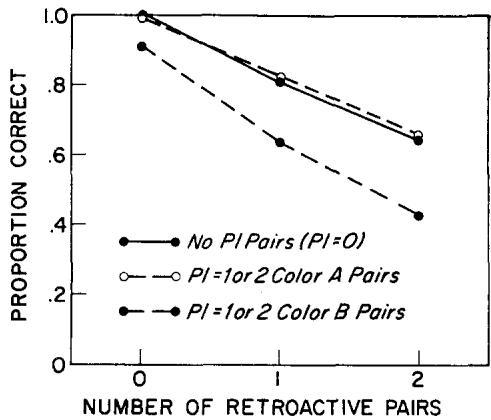
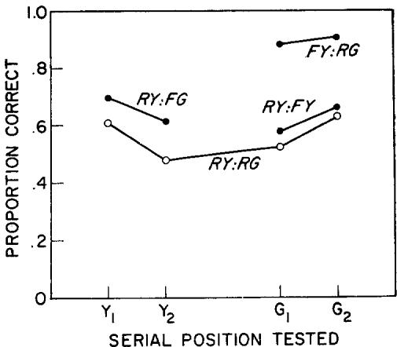

# Positive Forgetting: The Noninterference of Items Intentionally Forgotten

ROBERT A. BJORK

University of Michigan, Ann Arbor, Michigan 48104

Efficient remembering is clearly related to efficient forgetting: information no longer needed must be prevented from interfering proactively with the handling of new information. This paper reports three paired- associate probe experiments designed to assess whether Ss could take advantage of a signal to forget some or all of the pairs presented prior to the signal. As it turns out, the effects of a forget signal are considerable: to- be- forgotten pairs do not interfere at all with the recall of to- be- remembered pairs. A theory of intentional forgetting is proposed that assumes Ss (a) organize the remember items into a grouping that functionally separates them from the forget items and (b) devote all rehearsal activities following the forget instruction to the remember items.

Whatever else it may be, memory is at least partly a matter of discrimination. Any attempt to recall requires a judgment, on the basis of some criterion or another, of suitability or appropriateness. That is, any cue to recall, whether self- initiated or externally initiated, defines an item or set of items to be discriminated from possible competitors and retrieved. Thus, the recall problem is analogous in the foregoing sense to detecting a signal against a noise background.

There are a variety of operations that im

1 This report is an expurgated version of papers presented at the Midwest Mathematical Psychology Meetings in 1967 and 1968, at the University of Wisconsin and Indiana University, respectively. The research reported here was supported by the Advanced Research Projects Agency, Department of Defense, monitored by the Air Force Office of Scientific Research under Contract No. AF 404338- 1235 with the Human Performance Center, Department of Psychology, University of Michigan. The final writing of this report was completed while the author was a Visiting Assistant Professor at the Rockefeller University.

I thank Joan Kraus for her competent assistance in these experiments. I am also grateful to William K. Estes and Gordon H. Bower for their comments on some early pilot studies at Stanford University, and to the members of a seminar taught by Walter R. Reitman and myself during the winter of 1969 for their very critical and very helpful appraisal of the research reported here.

prove the discriminability of the item to be recalled and, hence, improve recall. Repetition, rehearsal, and mnemonics can all be thought of as such operations in the sense that they enhance the strength or uniqueness of the correct item. The discriminative process underlying memory can also be improved, however, by operating on the background out of which the item to be recalled must be selected. Reducing the number, similarity, or temporal proximity of presentation of other items in memory are all such operations.

The importance of understanding how memory traces are discriminated can hardly be overstated. The current active issues in memory research, e.g., decay versus interference, single process versus multiple process models, and visual versus acoustic versus semantic encoding, can all be rephrased as questions about the discrimination process.

This paper reports several studies based on a paradigm that provides new information as to how items to be recalled are stored, organized, and retrieved out of the noisy context of items not to be recalled. The paradigm involves an instruction to the subject (S) that he can forget some or all of the items he has seen and has tried to remember, that he will no longer be responsible for those items.

The paradigm represents a direct but unusual attack on the problem of understanding the discriminative process discussed above. Standard memory paradigms study intentional learning and, hence, incidental forgetting: any observed forgetting occurs in spite of  $S^{\prime}$  s attempt to remember. The forget- instruction paradigm, in a sense, is the logical converse. And in the same way that our understanding of memory has grown with the knowledge of what conditions do or do not produce performance decrements in standard paradigms, the knowledge of the conditions under which an instruction to forget selected items does or does not result in performance increments has important practical and theoretical implications.

The first experiment reported below was designed to investigate the extent to which proactive interference could be reduced through instructions to forget the proactive items. The second experiment served both to provide a baseline against which to measure the effects of the forget instruction in the first experiment and to clarify the interpretation of those effects. The third experiment constitutes an attempt to choose among alternative explanations of the intentional forgetting observed in the first experiment.

# EXPERIMENT I

The term "proactive interference" has come to label both an empirical performance decrement and a theoretical mechanism (response competition produced by stimulus overlap) assumed by interference theory to explain the decrement. This double usage can be troublesome: an effect on performance labeled as proactive interference has been frequently assumed by the labeler to be thereby explained when, in fact, the effect may be primarily due to factors other than associative interference.

Proactive interference could operate through several different mechanisms. In order to recall an item,  $S$  must store the item, hold the item over some retention interval, and retrieve

the item at the time of recall. Items presented prior to the item in question could (in principle) interfere with any one or more of the storage, holding, and retrieval phases.

To give the issue more specificity, consider an experiment by Murdock (1963). Murdock presented  $S$ s with lists of word- word paired associates and, at the end of each list, presented one of the stimuli in the list as a test of  $S$ 's memory for the paired response. The lists varied in length from two to nine pairs.

Murdock designated any pairs presented prior to a tested pair in a given list as PI (proactive interference) pairs, and he designated any pairs interpolated between the presentation and test of the tested pair as RI (retroactive interference) pairs. He found that not only did performance decrease with the number of RI pairs, but also that performance, for a fixed number of RI pairs, decreased with the number of PI pairs.

The proactive interference observed by Murdock could result from increased response competition owing to the proactive pairs, but it could result from other factors as well. For example, in Murdock's experiment, the number of proactive pairs is perfectly confounded with list length and, thus, with the  $S$ s memory load, since the  $S$  had to try to remember all pairs in the list until the test occurred. An increased memory load could result in decreased performance owing to less efficient storage or rehearsal. That is, the observed proactive interference might have little or nothing to do with associative interference resulting from response competition at the time of recall.

The present experiment was designed to clarify the extent to which proactive items produce performance decrements through associative interference and the extent to which they produce proactive interference through other mechanisms. The procedure was the same as that used by Murdock except that some of the lists contained a forget instruction; that is, in some of the lists there was a signal to  $S$  that he could forget the pairs presented

prior to the signal because the tested pair would be one of those presented after the signal.

prior to the signal because the tested pair would be one of those presented after the signal.The pairs  $S$  is instructed to forget do not contribute to his memory load: he need not remember them. They should, nonetheless, provide increased associative interference at the time of recall. The  $S$ s had to try to learn all the pairs as they were presented because they could not anticipate when there would or would not be a later forget instruction. Thus, all the conditions required by interference theory to produce proactive interference are satisfied by the pairs  $S$ s were instructed to forget. The experiment provides an opportunity to look at proactive interference owing to associative interference independent of proactive interference resulting from other causes.

# Method

Subjects. The Ss were 48 undergraduate and graduate women at the University of Michigan. They were each paid  $\mathfrak{S}1.50$  for their participation.

Apparatus and materials. Every  $s$  was presented 64 lists of paired associates. Each list varied in length from one to eight pairs. A single test of one of the pairs followed each list. The paired associates were constructed from nonsense syllables as stimuli and common words as responses. The nonsense syllables were selected from Archer (1960) within the range of 40- 60 on the Archer Norms. The words were drawn from Thorndike and Lorge (1944) with a G rating in the range 18- A.

The paired associates were prepared on slides. Each list was shown one pair at a time on a Carousel projector. One- half of the pairs appeared on a green background, the other half appeared on a yellow background. Test slides consisted of a stimulus member of a paired associate shown by itself on a white background.

Design. The Ss were carefully instructed that any time a list contained a color change, that is, any time the background changed from green to yellow or from yellow to green, they could forget the pairs shown on the first color. They were told that in such cases, the pair tested at the end of the list would always be one of the pairs shown on the second color.

The lists consisted of 0, 1, 2, or 3 pairs shown on a first color (color A), followed by 1, 2, 3, 4, or 5 pairs shown on a second color (color B). Combining every possible number of color A pairs with every possible number of color B pairs resulted in 20 different color A- color B list types. For any particular color A- color B combination, enough lists of that type were included in the experimental session to test every serial position in the color B pairs. Thus,  $n$  different occurrences of any list type containing  $n$  color B pairs were included. And, hence,  $4(1 + 2 + 3 + 4 + 5) = 60$  lists were required to present every color A- color B combination and to test every color B serial position.

In one- fourth of the lists (those containing 0 color A pairs), there was no color change in the list, that is, no forget instruction. The different types of lists were presented in random order, so Ss could never know when a list would or would not contain a forget instruction; thus, they had to try to learn each pair as it was presented.

Four lists were added to the end of each experimental session in order to actually test some of the pairs Ss had been asked to forget. Thus, of the last four lists, three were followed by a test of an "illegal" pair, a color A pair  $s$  had been instructed to forget. These illegal trials were tacked on to the very end of the session in order to avoid any possible contamination of the 60 preceding trials in the event that  $s$  was able to detect the nature of the three illegal trials.

All Ss saw the same random sequence of 64 trials in the sense that they saw the different list- type conditions in the same order. Across Ss, however, the color B sublists were rotated in terms of how many color A pairs preceded a particular color B sublist. This rotation insured that the same color B paired associates were tested in each color A condition. Also, the individual pairs in each color B sublist were rotated across Ss to insure that the same paired associates were tested in each particular serial position of a given color B sublist. These two counterbalancing procedures insure that data comparisons as a function of serial position or numbers of color A pairs are not contaminated by item differences.

Procedure. Subjects were tested in groups of three. Each  $s$  sat at a desk facing a wall on which the paired associates were projected. Before the experimental session began, Ss were read a set of instructions, and they were shown four example lists to familiarize them with the procedure.

Each trial started when the experimenter, sitting behind the Ss, said "ready." The paired associates were shown for 3 sec. each, and the test stimulus following each list stayed on until the subjects had responded. Each  $s$  wrote her responses on  $3 \times 5$  cards, one response per card, and when she finished writing, she placed the card in a tray at the front of her desk.

At the end of each experimental session, Ss were told that the last few lists had been followed by tests of color A pairs, and they were asked if they had noticed anything unusual at the time.

# Results

ResultsTable 1 exhibits the proportions correct for every combination of list type and serial position tested. The proactive effects of color A (forget) pairs can be assessed by looking across any row in Table 1. The forget pairs appear to provide no proactive interference whatsoever. If anything, performance in the 0 color A conditions seems slightly worse than does performance in the comparable 1, 2, and 3 color A conditions. The 1, 2, and 3 color A conditions seem to result in all but identical performance.

TABLE 1 CORRECT RESPONSE PROPORTIONS: EXPERIMENT I  

<table><tr><td rowspan="2">Number of color B pairs (tested pair)</td><td colspan="4">Number of color A pairs</td></tr><tr><td>0</td><td>1</td><td>2</td><td>3</td></tr><tr><td>1 (1)</td><td>1.00</td><td>.98</td><td>1.00</td><td>1.00</td></tr><tr><td>2 (1)</td><td>.81</td><td>.75</td><td>.90</td><td>.94</td></tr><tr><td>(2)</td><td>.85</td><td>.94</td><td>.96</td><td>.92</td></tr><tr><td>Ave.</td><td>.83</td><td>.84</td><td>.93</td><td>.93</td></tr><tr><td>3 (1)</td><td>.65</td><td>.65</td><td>.67</td><td>.50</td></tr><tr><td>(2)</td><td>.50</td><td>.71</td><td>.69</td><td>.79</td></tr><tr><td>(3)</td><td>.94</td><td>.88</td><td>.90</td><td>.90</td></tr><tr><td>Ave.</td><td>.69</td><td>.74</td><td>.75</td><td>.73</td></tr><tr><td>4 (1)</td><td>.33</td><td>.48</td><td>.44</td><td>.46</td></tr><tr><td>(2)</td><td>.44</td><td>.60</td><td>.52</td><td>.56</td></tr><tr><td>(3)</td><td>.67</td><td>.54</td><td>.60</td><td>.58</td></tr><tr><td>(4)</td><td>.94</td><td>.96</td><td>.92</td><td>.90</td></tr><tr><td>Ave.</td><td>.59</td><td>.65</td><td>.62</td><td>.63</td></tr><tr><td>5 (1)</td><td>.27</td><td>.40</td><td>.33</td><td>.35</td></tr><tr><td>(2)</td><td>.42</td><td>.40</td><td>.48</td><td>.50</td></tr><tr><td>(3)</td><td>.33</td><td>.31</td><td>.33</td><td>.27</td></tr><tr><td>(4)</td><td>.56</td><td>.67</td><td>.58</td><td>.67</td></tr><tr><td>(5)</td><td>.96</td><td>.83</td><td>.98</td><td>.88</td></tr><tr><td>Ave.</td><td>.51</td><td>.52</td><td>.54</td><td>.53</td></tr><tr><td>Ave.</td><td>.73</td><td>.75</td><td>.77</td><td>.76</td></tr></table>

The effect of serial position within a color B set looks in every way typical of such probe experiments. There is very little if any effect of primacy, and there is a marked effect of recency. Averaged across serial positions, performance declines systematically with color B list length.

Table 1 implies that Ss seem actually able to forget items when they are instructed to do so, at least in the sense that the forget items do not interfere with performance on items presented after the forget instruction. In contrast, proactive items  $S$  is responsible for remembering do interfere with performance on subsequent items. Figure 1 contrasts the proactive effects of remember items and the proactive effects of forget items. Interference theory notwithstanding, the effects of a forget instruction seem quite remarkable. At each level of retroactive interference, proactive color B items result in a marked decrease in performance, whereas proactive color A items have no effect.

  
FIG. 1. Proactive interference resulting from the to-be-forgotten (color A) pairs versus proactive interference resulting from the to-be-remembered (color B) pairs.

The errors committed in Experiment I contain information that permits us to specify sources of interference in more detail than do the performance data in Table 1. The errors occurring on each list type are analyzed in Table 2.

Table 2 provides further evidence that the forget instruction attenuates proactive interference. Color A responses intrude very infrequently, and the number of such intrusions does not increase with the number of color A responses in the list. Furthermore, there was not a single instance of a color A intrusion from a preceding list. Color B

TABLE 2 ERROR ANALYSIS: EXPERIMENT I  

<table><tr><td rowspan="2">Number of color A or color B pairs</td><td rowspan="2">Total errors (observations)</td><td colspan="2">Color A intrusions</td><td colspan="2">Color B intrusions</td><td colspan="2">Other intrusions</td><td colspan="2">Omissions</td><td></td></tr><tr><td>F</td><td>p</td><td>F</td><td>p</td><td>F</td><td>p</td><td>F</td><td>p</td><td></td></tr><tr><td>A = 0</td><td>256</td><td>(672)</td><td>—</td><td>—</td><td>166</td><td>.65</td><td>56</td><td>.22</td><td>34</td><td>.13</td></tr><tr><td>A = 1</td><td>235</td><td>(672)</td><td>13</td><td>.06</td><td>151</td><td>.64</td><td>30</td><td>.13</td><td>41</td><td>.17</td></tr><tr><td>A = 2</td><td>226</td><td>(672)</td><td>8</td><td>.04</td><td>151</td><td>.67</td><td>39</td><td>.17</td><td>28</td><td>.12</td></tr><tr><td>A = 3</td><td>230</td><td>(672)</td><td>6</td><td>.03</td><td>152</td><td>.66</td><td>32</td><td>.14</td><td>40</td><td>.17</td></tr><tr><td>B = 1</td><td>1</td><td>(144)</td><td>1</td><td>1.00</td><td>—</td><td>—</td><td>0</td><td>.00</td><td>0</td><td>.00</td></tr><tr><td>B = 2</td><td>29</td><td>(788)</td><td>4</td><td>.14</td><td>17</td><td>.59</td><td>3</td><td>.10</td><td>5</td><td>.17</td></tr><tr><td>B = 3</td><td>112</td><td>(432)</td><td>5</td><td>.04</td><td>69</td><td>.62</td><td>19</td><td>.17</td><td>19</td><td>.17</td></tr><tr><td>B = 4</td><td>213</td><td>(576)</td><td>7</td><td>.03</td><td>156</td><td>.73</td><td>26</td><td>.12</td><td>24</td><td>.11</td></tr><tr><td>B = 5</td><td>337</td><td>(720)</td><td>11</td><td>.03</td><td>212</td><td>.63</td><td>53</td><td>.16</td><td>61</td><td>.18</td></tr><tr><td>Sum</td><td>691</td><td>(2016)</td><td>27</td><td>.04</td><td>454</td><td>.66</td><td>101</td><td>.15</td><td>109</td><td>.16</td></tr></table>

Note: Lists containing one color B pair are excluded from the top section of the Table; color B intrusions are not possible in such lists. Lists containing no color A pairs are excluded from the bottom section of the Table; color A intrusions are not possible in such lists. The sums at the bottom of the Table exclude both  $\mathbf{B} = 1$  and  $\mathbf{A} = 0$  lists.

responses, on the other hand, intrude frequently, and the more color B pairs there are in the list, the more color B intrusions there are. Responses from color B items in earlier lists also occur as intrusions.

Three of the last four trials for each  $s$  illegally tested the  $s$  's memory for a pair she was instructed to forget. On the remaining trial, a list with no color change was presented in order to make it more difficult for Ss to suspect that something was wrong. The particular illegal lists were (1) 2 color A, 3 color B, test the second A, (2) 3 color A, 5 color B, test the second A, and (3) 1 color A, 1 color B, test the color A pair. On list (1), there were five correct responses and 43 errors. Of the errors, two were intrusions of color A responses and 32 were intrusions of color B responses. The breakdown on list (2) was similar: four correct responses and 44 errors of which one was a color A intrusion and 20 were color B intrusions. On list (3), there were 30 correct responses, 18 errors, no color A intrusions were possible, and eight of the errors were color B intrusions.

Performance on the illegal lists is clearly worse than performance on comparable to- be

Performance on the illegal lists is clearly worse than performance on comparable to- remembered pairs. Also, Ss tend not to intrude the response from the other color A pair in lists (1) and (2), though they frequently intrude responses from color B pairs. Note in addition, however, that performance is above zero: something remains of color A pairs even though that "something" does not interfere with performance on color B pairs.

# EXPERIMENT II

Experiment II was designed to provide control data against which to view the results of Experiment I. The procedure in Experiment II was exactly the same as the procedure in Experiment I except for one critical difference: when a color change occurred in a list, it had no significance. Subjects were equally likely to be tested on any pair in a list, independent of whether it was a color A or color B pair.

Experiment II serves as a control for Experiment I in two main ways. (a) Any proactive effects of color A pairs in Experiment II supply a measure of the extent to which the forget instruction in Experiment I facilitated performance. (b) If there are any effects of color change per se, they should be apparent in the

results of Experiment II. Even though test stimuli always occurred on a white background and, hence, provided no color information, it is conceivable that the partition of a list by color might aid performance.

# Method

Subjects. The Ss were 24 undergraduate women at the University of Michigan. They were each paid $1.50 for their participation.

Apparatus and materials. Every  $s$  was presented 64 lists of paired associates that varied in length from one to seven pairs. Each list was followed by a single test of one of the paired associates in the list. The paired associates were identical to those used in Experiment I. The same slides that were prepared for Experiment I were used in Experiment II, and they were again shown by means of a Carousel projector.

Design. The lists consisted of 0, 1, 2, or 3 pairs presented on a first color (color A), followed by 1, 2, 3, or 4 pairs presented on a second color (color B). Thus, there were 16 different list- types. Each list- type was presented often enough to test every serial position in the list. Forty trials were required to test every color B serial position, and 24 trials were required to test every color A serial position.

The lists that were followed by tests of color B pairs were identical to their counterparts in Experiment I. The lists that were followed by tests of color A pairs were constructed from the pairs used in the lists containing five color B pairs in Experiment I.

Every  $s$  received the same random sequence of conditions across the 64 trials of the experiment. As in Experiment I, however, the pairing of color B sublists with color A sublists was rotated across Ss to insure that the same color B paired associates were tested in each color A condition, and, similarly, to also insure that the same color A pairs were tested in each color B condition. Also, the pairs in each color A sublist and in each color B sublist were rotated across Ss to insure that the same paired associates were tested at each serial position of a particular sublist. Thus, any possible item differences were counterbalanced across list type and serial position.

Procedure. Subjects were tested in groups of two. Before an experimental session began, Ss were read a set of instructions, and they were shown four example lists to clarify the procedure. In order to insure that Ss would be neither unaware nor distracted by color changes, special effort was made in the instructions to point out that most of the lists would contain a color change, although it also was emphasized that such color changes had no significance.

The way in which the lists were shown, the manner in which Ss responded, and all other details of the

experimental procedure were exactly the same as in Experiment I.

# Results

Tests of color B pairs. The observed proportions of correct responses to tests of color B pairs as a function of list type are shown in Table 3 averaged over serial positions. In contrast to the results in the comparable conditions of Experiment I, the color A pairs appear to interfere systematically with performance on the color B pairs.

TABLE 3 CORRECT RESPONSE PROPORTIONS ON TESTS OF COLOR B PAIRS: EXPERIMENT II  

<table><tr><td rowspan="2">Number of color B pairs</td><td colspan="4">Number of color A pairs</td></tr><tr><td>0</td><td>1</td><td>2</td><td>3</td></tr><tr><td>1</td><td>1.00</td><td>.96</td><td>1.00</td><td>.96</td></tr><tr><td>2</td><td>.96</td><td>.92</td><td>.82</td><td>.73</td></tr><tr><td>3</td><td>.75</td><td>.63</td><td>.67</td><td>.70</td></tr><tr><td>4</td><td>.65</td><td>.62</td><td>.51</td><td>.49</td></tr><tr><td>Ave.</td><td>.84</td><td>.78</td><td>.75</td><td>.72</td></tr><tr><td>(Ave: Exp. I)</td><td></td><td></td><td></td><td></td></tr><tr><td>B = 1, 2, 3, 4</td><td>(.78)</td><td>(.80)</td><td>(.83)</td><td>(.82)</td></tr></table>

The averages at the bottom of Table 3 show the effects of the number of color A pairs on the recall of color B responses in both Experiment II and Experiment I. The difference in performance on lists that contain no color shift (0 color A lists) and, hence, have identical meaning in both experiments, implies that Ss as a group in Experiment II were somewhat better than Ss in Experiment I. In terms of errors, Ss in Experiment II average  $27\%$  fewer errors [P (error)  $= .16$ ] on lists without a color shift than did Ss in Experiment I [P (error)  $= .22$ ]. Nonetheless, Ss in Experiment II made  $10\%$  more errors when there was one color A pair (.22 versus .20),  $47\%$  more errors when there were two color A pairs (.25 versus .17), and  $56\%$  more errors when there were three color A pairs (.28 versus .18). There were nearly twice (1.75) as many errors in Experiment II on lists that contained three color A pairs as there were on lists that contained no color A pairs.

TABLE 4 ERROR ANALYSIS, TESTS OF COLOR B PAIRS: EXPERIMENT II  

<table><tr><td rowspan="2">Number of color A or color B pairs</td><td rowspan="2">Total errors (observations)</td><td colspan="2">Color A intrusions</td><td colspan="2">Color B intrusions</td><td colspan="2">Other intrusions</td><td colspan="2">Omissions</td><td></td></tr><tr><td>F</td><td>p</td><td>F</td><td>p</td><td>F</td><td>p</td><td>F</td><td>p</td><td></td></tr><tr><td>A = 0</td><td>54</td><td>(216)</td><td>—</td><td>—</td><td>41</td><td>.76</td><td>7</td><td>.13</td><td>6</td><td>.11</td></tr><tr><td>A = 1</td><td>67</td><td>(216)</td><td>10</td><td>.15</td><td>32</td><td>.47</td><td>16</td><td>.23</td><td>9</td><td>.13</td></tr><tr><td>A = 2</td><td>80</td><td>(216)</td><td>14</td><td>.18</td><td>33</td><td>.41</td><td>18</td><td>.23</td><td>15</td><td>.19</td></tr><tr><td>A = 3</td><td>87</td><td>(216)</td><td>24</td><td>.28</td><td>27</td><td>.31</td><td>24</td><td>.27</td><td>12</td><td>.14</td></tr><tr><td>B = 1</td><td>2</td><td>(72)</td><td>2</td><td>1.00</td><td>—</td><td>—</td><td>0</td><td>.00</td><td>0</td><td>.00</td></tr><tr><td>B = 2</td><td>27</td><td>(144)</td><td>13</td><td>.48</td><td>2</td><td>.07</td><td>8</td><td>.29</td><td>4</td><td>.15</td></tr><tr><td>B = 3</td><td>73</td><td>(216)</td><td>15</td><td>.21</td><td>26</td><td>.36</td><td>21</td><td>.29</td><td>11</td><td>.15</td></tr><tr><td>B = 4</td><td>134</td><td>(288)</td><td>20</td><td>.15</td><td>64</td><td>.48</td><td>29</td><td>.21</td><td>21</td><td>.16</td></tr><tr><td>Sum</td><td>234</td><td>(648)</td><td>45</td><td>.19</td><td>92</td><td>.39</td><td>58</td><td>.25</td><td>36</td><td>.15</td></tr></table>

Note: Data from  $\mathbf{B} = 1$  lists are excluded from the top section of the Table and data from  $\mathbf{A} = \mathbf{0}$  lists are excluded from the bottom section of the Table. The sums at the bottom of the Table exclude both  $\mathbf{B} = 1$  and  $\mathbf{A} = \mathbf{0}$  lists.

The errors that occurred in Experiment II when color B pairs were tested are analyzed in Table 4. In the top half of the Table, the frequencies and proportions of errors that were intrusions of color A responses, intrusions of color B responses, intrusions of responses from prior lists or somewhere else, or omissions are shown as a function of the number of color A pairs in the list. The bottom half of Table 4 exhibits the frequencies and proportions of the same error types as a function of the number of color B pairs in the list.

The general picture provided by Table 4 is quite clear. As the number of color A pairs in a list increases, the proportion of errors that are intrusions of color A responses increases, and the proportion of errors that are color B responses decreases. Conversely, as the number of color B pairs in a list increases, color B intrusions increase and color A intrusions decrease.

It is particularly striking to contrast the pattern of intrusions as a function of the number of color A pairs in Experiment II with the same analysis (the top of Table 2) of the errors in Experiment I. The following statements summarize the comparison.

1. The proportion of color A intrusions (.21)

in Experiment II is over five times the proportion of color A intrusions (.04) in Experiment I.

2. The proportion of color B intrusions (.39) in Experiment II is only a little over half the proportion of color B intrusions (.66) in Experiment I.

3. In contrast to Experiment I, in Experiment II the proportion of color A intrusions increases and the proportion of color B intrusions decreases with the number of color A pairs in the list.

The intrusion data from Experiments I and II imply, even more strongly than do the correct response proportions, that the forget instruction in Experiment I, in effect, truncates the list. Both in terms of performance level and in terms of the nature of errors, a list of  $n$  color A items followed by  $m$  color B items in Experiment I is functionally a list of  $m$  items.

Tests of color A Pairs. In Table 5 are shown the correct response proportions as a function of list type for tests of color A pairs. The data in the 0 color B column are from the lists without a color shift (referred to as 0 color A in Table 3); in Experiment II, it is completely arbitrary whether lists without a color shift are labeled 0 color A lists or 0 color B lists.

TABLE 5 CORRECT RESPONSE PROPERTIES ON TESTS OF COLOR A PAIRS: EXPERIMENT II  

<table><tr><td rowspan="2">Number of color A pairs</td><td colspan="5">Number of color B pairs</td></tr><tr><td>0</td><td>1</td><td>2</td><td>3</td><td>4</td></tr><tr><td>1</td><td>1.00</td><td>1.00</td><td>.75</td><td>.42</td><td>.42</td></tr><tr><td>2</td><td>.96</td><td>.67</td><td>.44</td><td>.38</td><td>.34</td></tr><tr><td>3</td><td>.75</td><td>.35</td><td>.36</td><td>.36</td><td>.28</td></tr><tr><td>Ave.</td><td>.90</td><td>.67</td><td>.52</td><td>.39</td><td>.33</td></tr></table>

Table 5 is shown primarily for the sake of completeness: it contains no surprises. Performance on the color A pairs suffers large and systematic retroactive interference from the color B pairs in the list. Also, the color A pairs interfere with each other: for a fixed number of color B pairs in the list, performance decreases with the number of color A pairs in the list.

The errors committed on tests of color A pairs are analyzed in Table 6 as a function of the number of color A pairs in the list and as a function of the number of color B pairs in the list. Table 6 tells the same story told by Table 4. Intrusions of color A responses increase with the number of color A pairs in the list and decrease with the number of color B pairs in the list. Color B intrusions increase with number of color B pairs and decrease with number of color A pairs.

In advance of conducting Experiment II, it seemed possible, though not likely, that presenting a list with a color A- color B structure might somehow facilitate performance compared to performance on the same list presented on an unchanging background. There is no evidence of any kind in the results of Experiment II that two- color lists are any different than the same list presented on one color. Level of performance, serial position effects, and patterns of intrusions are determined entirely by the number of pairs in the list and are independent of whether or where a color shift might occur in the list.

There is a final comparison of Experiment I and Experiment II that underscores the conclusion that the forget instruction in Experiment I essentially truncates the color A pairs from the list. If all the errors committed in Experiment II on lists whose total length (color A pairs + color B pairs) was two, three, four, or five pairs are divided into intralist intrusions, extralist intrusions, and omissions, the proportions of errors falling in each category are 0.65, 0.21, and 0.14, respectively. If the same analysis is performed on the errors in Experiment I, but the color B pairs in a list are considered to constitute the entire list, the proportions of intralist intrusions, extralist intrusions, and omissions for lists of two, three,

TABLE 6 ERROR ANALYSIS, TESTS OF COLOR A PAIRS: EXPERIMENT II  

<table><tr><td rowspan="2">Number of color A or color B pairs</td><td rowspan="2">Total errors (observations)</td><td colspan="2">Color A intrusions</td><td colspan="2">Color B intrusions</td><td colspan="2">Other intrusions</td><td colspan="2">Omissions</td><td></td></tr><tr><td>F</td><td>p</td><td>F</td><td>p</td><td>F</td><td>p</td><td>F</td><td>p</td><td></td></tr><tr><td>A = 1</td><td>34</td><td>(96)</td><td>--</td><td>--</td><td>24</td><td>.71</td><td>6</td><td>.18</td><td>4</td><td>.12</td></tr><tr><td>A = 2</td><td>102</td><td>(192)</td><td>14</td><td>.14</td><td>45</td><td>.44</td><td>22</td><td>.22</td><td>21</td><td>.21</td></tr><tr><td>A = 3</td><td>190</td><td>(288)</td><td>51</td><td>.27</td><td>64</td><td>.34</td><td>41</td><td>.21</td><td>34</td><td>.18</td></tr><tr><td>B = 0</td><td>20</td><td>(120)</td><td>14</td><td>.70</td><td>--</td><td>--</td><td>5</td><td>.25</td><td>1</td><td>.05</td></tr><tr><td>B = 1</td><td>60</td><td>(120)</td><td>26</td><td>.43</td><td>12</td><td>.20</td><td>16</td><td>.26</td><td>6</td><td>.10</td></tr><tr><td>B = 2</td><td>72</td><td>(120)</td><td>17</td><td>.24</td><td>28</td><td>.39</td><td>14</td><td>.20</td><td>13</td><td>.18</td></tr><tr><td>B = 3</td><td>77</td><td>(120)</td><td>14</td><td>.18</td><td>35</td><td>.45</td><td>11</td><td>.14</td><td>17</td><td>.22</td></tr><tr><td>B = 4</td><td>83</td><td>(120)</td><td>8</td><td>.10</td><td>34</td><td>.41</td><td>22</td><td>.26</td><td>19</td><td>.23</td></tr><tr><td>Sum</td><td>292</td><td>(480)</td><td>65</td><td>.22</td><td>109</td><td>.37</td><td>63</td><td>.21</td><td>55</td><td>.19</td></tr></table>

Note: Lists with  $\mathbf{B} = \mathbf{0}$  are excluded from the top section of the Table and lists with  $\mathbf{A} = 1$  are excluded from the bottom section of the Table. The sums exclude both  $\mathbf{B} = \mathbf{0}$  and  $\mathbf{A} = 1$  lists.

four or five color B pairs are 0.66, 0.19, and 0.16, respectively.

# EXPERIMENT III

The joint results of Experiments I and II pose an immediate challenge: to specify the processes by which Ss are able to forget items when instructed to do so. Several possible explanations of the intentional forgetting observed in Experiment I are outlined below. Experiment III was designed to suggest additional constraints on any adequate theory of intentional forgetting.

There are three general explanations of intentional forgetting, all of which are possible, if not reasonable. The most dramatic is the notion that Ss can actively erase or dump items from their short- term memory when instructed to do so. A second possibility is the notion that items Ss is instructed to forget receive no further rehearsal or processing of any kind, are therefore lost from memory very rapidly, and thus do not interfere with items the  $s$  is to remember. Such a notion depends on the idea that shortterm remembering requires an active effort: without any such effort, short- term forgetting proceeds rapidly and spontaneously. A final possibility is the notion that Ss are able to accomplish a kind of set differentiation between the items they are to forget and the items they are to remember. At the time of recall,  $s$  searches only the remember set and, thus, items in the "forgotten" set do not interfere, even though they may still exist in memory.

The active erasure, differential rehearsal, and differential grouping notions are not, of course, mutually exclusive. The differential rehearsal and differential groupings notions are even somewhat related: they both assume that  $s$  can discriminate within his memory items to be remembered from items to be forgotten. The mechanism of noninterference in the differential grouping notion does seem unique to that explanation. Both the active erasure and differential rehearsal ideas assert that the to- be- forgotten items are gone from memory, whereas the differential grouping idea assumes that they are in memory but segregated from items to be remembered.

In Experiment I, the signal to forget always occurred before the items to be remembered were presented. It is possible that the effectiveness of a forget instruction depends on its placement relative to the items to be forgotten. The nature of any such dependency might help to reveal the processes that underlie intentional forgetting. In Experiment III, forget instructions were presented either before or after the material to be remembered. The basic paired- associate probe procedure used in Experiments I and II was also used in Experiment III. Every list, however, contained two instructions to  $s$ , one in the middle of the list and one at the end of the list.

# Method

Subjects. The Ss were 36 undergraduate and graduate women at the University of Michigan. They were each paid $1.50 for their participation.

Apparatus and materials. Every  $s$  was presented 48 lists of paired associates. There were four pairs in each list; a single test of one of the pairs followed each list. The same paired associates used in Experiments I and II were used in Experiment III, and they were shown by means of a Carousel projector.

Design. Every list had the following structure: two pairs were presented on a yellow background, a first instruction was presented, two pairs were presented on a green background, a second instruction was presented, and one of the pairs in the list was tested by presenting the stimulus member of that pair on a white background.

The first instruction slide told  $s$  to forget or to remember the two yellow pairs. If the first slide was a remember instruction, the second instruction slide told Ss to either forget the yellow pairs, forget the green pairs, or remember the green pairs. If the first instruction was to forget the yellow pairs, the second instruction slide told Ss to either forget the green pairs or remember the green pairs. In the former case (forget yellow, forget green), there were no items left to test and the test slide said "no test." If such a case had not been included, Ss could have predicted that a "forget yellow" first instruction would always be followed by a "remember green" second instruction.

In every block of 12 trials in the experiment, there were four RY:RG (remember yellow, remember green) lists, two RY:FY (remember yellow, forget yellow) lists, two RY:FG (remember yellow, forget green) lists, two FY:RG (forget yellow, remember green)

lists, and two FY:FG (forget yellow, forget green) lists. Thus, the likelihood that a RG would follow a FY or a RY was 0.5 in either case. Every eligible serial position in a particular type of list was tested once in every block of 12 trials.

Across  $S_{\mathrm{S}}$ , which paired associate in a list was tested, the presentation order of any two yellow or green pairs in a list, and the nature of the instructions in any given list were rotated in such a way that every tested paired associate, whether yellow or green, was tested in every type of list in every yellow or green serial position.

Procedure. The 36  $S_{\mathrm{S}}$  were tested in 12 groups of three. The manner in which the lists were presented and the way in which  $S_{\mathrm{S}}$  responded were the same as in Experiments I and II. The instruction slides were presented at the same rate (3 sec) as the individual paired associates in a list. Forget instructions consisted of the word "FORGET" shown on a white background above a patch of yellow or a patch of green. Remember instructions consisted of the word "REMEMBER" shown on a white background.

Before the experimental session began,  $S_{\mathrm{S}}$  were shown five example lists to familiarize them with the procedure. The instructions to  $S_{\mathrm{S}}$  emphasized that once  $S$  was told to forget the yellow pairs, she would never subsequently be asked to remember them.

# Results

The correct response proportions are shown in Figure 2 as a function of serial position and instructional condition. Performance profits from a forget instruction in all cases relative to performance on the RY:RG list in which  $S_{\mathrm{S}}$  are responsible for all pairs in the list.

Figure 2 leaves no doubt, however, that it matters a great deal when the forget instruction is given. Performance on the green pairs is much better in the FY:RG condition than in the RY:FY condition. The extent of the per

  
FIG. 2. Correct response proportions as a function of list type.

The correct response proportions are shown in Figure 2 as a function of serial position and instructional condition. Performance profits from a forget instruction in all cases relative to performance on the RY:RG list in which  $S_{\mathrm{S}}$  are responsible for all pairs in the list.Figure 2 leaves no doubt, however, that it matters a great deal when the forget instruction is given. Performance on the green pairs is much better in the FY:RG condition than in the RY:FY condition. The extent of the performance difference between the FY:RG and RY:FY conditions is striking. When  $S_{\mathrm{S}}$  are told to forget the yellow pairs during the second instruction slide, performance on the green pairs profits only slightly compared to the RY:RG condition. In contrast, performance on the green pairs is very much better when  $S$  is told to forget the yellow pairs during the first instruction slide. There are more than three times as many errors in the RY:FY condition and nearly four times as many errors in the RY:RG condition as there are in the FY:RG condition.

The frequencies and proportions of the total errors that were intrusions of yellow responses, intrusions of green responses, intrusions of responses not in the list, and omissions are shown in Table 7 for the various list types.

TABLE 7 ERROR ANALYSIS: EXPERIMENT III  

<table><tr><td rowspan="2">List Type</td><td rowspan="2">Total errors#</td><td colspan="2">Yellow intrusions</td><td colspan="2">Green intrusions</td><td colspan="2">Other intrusions</td><td colspan="2">Omissions</td></tr><tr><td>F</td><td>p</td><td>F</td><td>p</td><td>F</td><td>p</td><td>F</td><td>p</td></tr><tr><td>RY: RG (test G)</td><td>123</td><td>59</td><td>.48</td><td>37</td><td>.30</td><td>18</td><td>.15</td><td>9</td><td>.07</td></tr><tr><td>RY: FY (test G)</td><td>110</td><td>54</td><td>.49</td><td>25</td><td>.23</td><td>18</td><td>.16</td><td>13</td><td>.12</td></tr><tr><td>FY: RG (test G)</td><td>31</td><td>1</td><td>.03</td><td>20</td><td>.65</td><td>10</td><td>.32</td><td>0</td><td>.00</td></tr><tr><td>RY: RG (test Y)</td><td>132</td><td>32</td><td>.24</td><td>44</td><td>.34</td><td>32</td><td>.24</td><td>24</td><td>.18</td></tr><tr><td>RY: FG (test Y)</td><td>100</td><td>36</td><td>.36</td><td>16</td><td>.16</td><td>24</td><td>.24</td><td>24</td><td>.24</td></tr></table>

"Out of 288 observations in each case.

The pattern of the error distributions in Table 7 echoes and amplifies the message conveyed by Figure 2. There is only one intrusion of a yellow response in the FY:RG condition, whereas half of the errors in the RY:FY condition are intrusions of yellow responses. In fact, the pattern of the error distribution in the RY:FY condition is very close to the pattern in the RY:RG condition.

The relative effectiveness of the different forget- instruction conditions (FY:RG > RY: FG > RY:FY), as judged in Figure 2, appears from Table 7 to result primarily from differential intrusion rates of the "forgotten" pairs. One of the 31 errors  $(3\%)$  in condition FY:RG, 16 of the 100 errors  $(16\%)$  in condition RY:FG, and 54 of the 110 errors  $(49\%)$  in condition RY:FY are intrusions of responses from the to- be- forgotten set.

# DISCUSSION

The introduction of this paper asserts that the forget- instruction paradigm has the potential to contribute in a general and positive way to our understanding of the storage and retrieval dynamics of forgetting. Actually, the initial goals of Experiment I were nowhere near so ambitious. The only motivations for Experiment I were  $(a)$  the desire to show that the classical proactive inhibition explanation of the performance decrements commonly called proactive interference was inadequate, if not wrong, and  $(b)$  simple curiosity as to whether Ss could or could not make use of a signal that they need no longer remember items presented prior to the signal. Only as the sequence of these experiments and others not reported here unfolded, did it become apparent that the forget- instruction procedure was both powerful in its effects on performance and general in its theoretical implications.

The first part of this discussion section outlines the importance of forgetting, whether intentional or unintentional, as a necessary component of any reasonable ongoing system for human information processing. The second

part of this section proposes a theory of intentional forgetting.

# The Importance of Forgetting

When people voice complaints about their memory, they invariably assume that the problem is one of insufficient retention of information. In a very real sense, however, the problem may be at least partly a matter of insufficient or inefficient forgetting. If one views the human cognitive apparatus as an ongoing information- handling system, it is clear that some mechanism to update the system, to keep the system current, is crucial. Computers handle the problem in a straightforward if somewhat drastic way. When new information is read into a location in memory, old information at that location is destroyed. Whatever the analogous human mechanism, it is certainly not so simple, nor so complete.

The positive function of any such forgetting mechanism is to prevent information no longer needed from interfering with the handling of current information. Consider the information processing task faced by the typical short- order cook. He must process one by one (not strictly) a sequence of orders that have high interorder similarity. Once he is through with "scramble two, crisp bacon, and an English," his later processing of similar but not identical orders can only suffer to the degree that he has not, in effect, discarded "scramble two, crisp bacon, and an English."

The results reported in this paper leave no doubt that Ss can use an instruction to forget to facilitate the handling of information that follows the instruction. But how?

# A Theory of Intentional Forgetting

No unelaborated version of interference theory or of decay theory seems to contain a hint as to how Ss make use of an instruction to forget. The theories are not so much wrong as they are mute. The basic assumptions of the theory proposed in this section could be phrased without difficulty in the language of interference theory or in the language of decay

theory, but the assumptions propose processing mechanisms outside the basic constructs of either theory.

The theory asserts that Ss are able to take advantage of a forget instruction in two ways: they organize the items they are to remember in a grouping that functionally separates them from the items they are to forget, and they devote all rehearsal, mnemonic, and integrative activities following the forget instruction to the items they are to remember. The forget instruction can vary from completely effective to completely ineffective depending on the degree to which the experimental situation permits these selective grouping and rehearsal operations.

Both processes assumed by the theory are necessary. The grouping notion alone would imply that performance in the RY: FY condition of Experiment III should be equal to performance in the FY: RG condition. That is, if  $s$  knows that he may be able to forget one or the other of two well- defined groups of items, he should be able to make as much use of an instruction to forget the first group presented after both groups as he can an instruction to forget the first group presented prior to the second group. In either case, he need search only one group at the time of recall. Figure 2 shows how wrong that prediction is. It could be, of course, that the burden of maintaining two sets in memory makes the differentiation of those sets more difficult. Such a qualification, however, is not very different from the notion that a rehearsal concentration mechanism is required.

That the rehearsal process assumed by the theory does not suffice by itself to explain intentional forgetting is shown clearly in an experiment by Reitman, Tanner, and Bjork (1970). Reitman et al. performed an exact replication of Experiment I except for one critical innovation. After a training session, they instructed Ss that during the main experimental session they would be tested very infrequently on one of the to- be- forgotten pairs in a list. The instructions emphasized that such tests would occur very infrequently, that asterisks next to the probe stimulus would signal such tests, and that Ss should make every effort to continue to intentionally forget when instructed to do so.

The experiment included a direct and an indirect control to insure that Ss were not trying to remember pairs they were instructed to forget. The direct control was a postexperimental interview; any  $s$  who said he did anything less than always try to forget was excluded (50 of 82 Ss were excluded). As an indirect control, an exact replication of Experiment I was included in the main experimental session: to the degree that Ss were trying to remember the pairs they were instructed to forget, their performance on the to- be- remembered pairs should suffer.

There are several striking aspects of the results obtained by Reitman et al. (a) Performance on the lists that constituted a replication of Experiment I was nearly identical in all respects to the results of Experiment I reported here. The level of performance, the lack of proactive interference resulting from to- be- forgotten pairs, and the pattern of intrusions were all replicated in detail. (b) Although there was no interference owing to the "forgotten" pairs, tests of those pairs indicated clearly that they were not gone. Performance was not as good as performance on comparable pairs in lists with no forget instruction, but performance was far better than chance and the frequency of intrusion of response members of other to- be- forgotten pairs increased markedly compared to the frequency of such intrusions when to- be- remembered pairs were tested. Also, the to- be- forgotten pairs suffered interference from each other: performance decreased with the number of to- be- forgotten pairs in a list.

The fact that the "forgotten" items are not gone rules out the differential rehearsal assumption in the theory as a complete explanation of intentional forgetting. In order to provide a sufficient explanation of intentional forgetting independent of the differential

grouping notion, the differential rehearsal assumption must be coupled with the assumption that the forget items are lost from memory. It appears, instead, that the pairs to be remembered and the pairs to be forgotten are in two separate groupings, one the recipient of all rehearsalefforts following the forgetinstruction and, hence, quite available, the other left unattended and, hence, less available.

To some extent the differential grouping and differential rehearsal notions co- imply each other. In order to concentrate rehearsal efforts on the to- be- remembered pairs, those pairs must be defined as a set in some sense. Similarly, concentrating rehearsal and integrative efforts on certain pairs creates, to some degree, a distinct set out of those pairs.

The most important and least well defined notion in the theory is the set differentiation idea. The basis on which the items to be remembered are separated from the items to be forgotten is unclear. There is not much doubt, however, that the abilities of humans to sort, group, and search selectively are considerable.

The theory asserts, in effect, that efficient forgetting of information no longer needed is as much a matter of reorganization as it is a matter of information loss. Items of information, no matter how similar and confusable, do not interfere with each other if they are organized into different groups.

The theory implies that a forget instruction should not be completely effective in situations that reduce the efficiency of the assumed rehearsal and grouping processes. The RY: FY condition in Experiment III is, as mentioned above, one such case. Several other cases in which a forget instruction does not entirely reduce interference also make sense in terms of the theory. In the standard Brown- Peterson paradigm (Brown, 1954; Peterson & Peterson, 1959) there is an implicit instruction to forget at the end of each trial. The presence of preceding trials nonetheless produces considerable proactive interference. Since the cue to recall in the Brown- Peterson paradigm does not point to the to- be- remembered item in

memory in the same specific way that a stimulus member of a paired associate designates the response member, it seems likely that any selective search process would be less efficient. The same argument applies to a study by Pollatsek (1969). In a variation of the Brown- Peterson paradigm, Pollatsek examined the effect of an explicit instruction to forget a first trigram on the recall of a second trigram presented on the same trial. Again, the forget instruction was not entirely effective.

In a continuous paradigm designed to prevent rehearsal, Bjork, LaBerge, and Le- Grande (1968) also found that a forget instruction reduced but did not eliminate interference from the to- be- forgotten item. The particular memory task employed by Bjork et al. would make selective rehearsal or grouping quite difficult.

The data are not yet available to formulate or test a theory of intentional forgetting in a precise way, although considerable work is in progress (see, e.g., Elmes, 1969; Turvey & Wittlinger, 1969; Weiner & Reed, 1969). If the present theory, or some other theory, holds up under scrutiny, it should be possible to specify the processes by which information no longer needed is set aside by the human information processor. To the degree that we can do that, we will better understand how needed information is retained.

# REFERENCES

REFERENCESBjork, R. A., LaBerge, D., & LeGrande, R. The modification of short- term memory through instructions to forget. Psychonomic Science, 1968, 10, 55- 56. Brown, J. The nature of act to learn and of intramaterial interferences in immediate memory. Quarterly Journal of Experimental Psychology, 1954, 6, 141- 148. Elmes, D. G. Supplementary report: Cueing to forget in short- term memory. Journal of Experimental Psychology, 1969, 80, 561- 562. Murdock, B. B. Short- term retention of single paired associates. Journal of Experimental Psychology, 1963, 65, 433- 443. Peterson, L. R., & Peterson, M. J. Short- term retention of individual verbal items. Journal of Experimental Psychology, 1959, 58, 193- 198.

POLLATSEK, A. Rehearsal, interference, and spacing of practice in short- term memory. Human performance Center Technical Report, University of Michigan, 1969.

REITMAN, W. R., TANNER, J. E., & BJORK, R. A. Strategy control and directed forgetting. Unpublished paper, 1970.

THORNDIKE, E. L., & LORG, I. The teacher's word book of 30,000 words. New York: Teachers College, 1944.

TURVEY, M. T., & WITTLINGER, R. P. Attenuation of proactive interference in short- term memory as a function of cueing to forget. Journal of Experimental Psychology, 1969, 80, 295- 298.

WEINER, B., & REED, H. Effects of the instructional sets to remember and to forget on short- term retention: studies of rehearsal control and retrieval inhibition (repression). Journal of Experimental Psychology, 1969, 79, 226- 232.

(Received January 23, 1970)