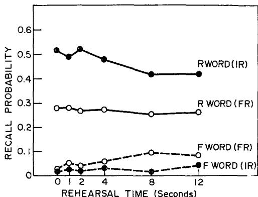
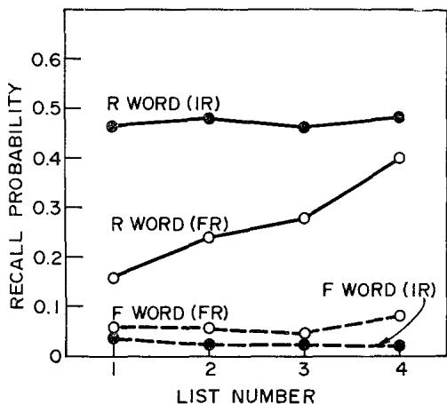
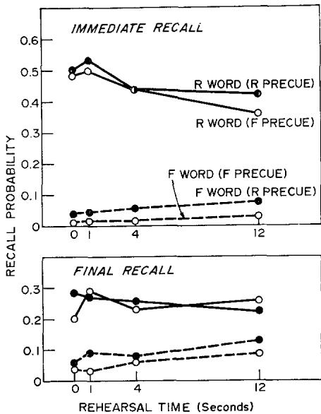
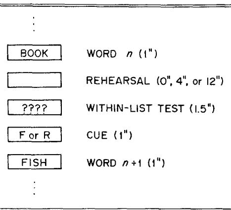
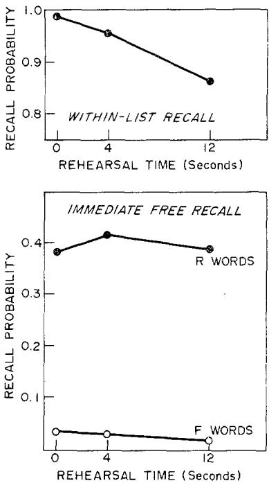
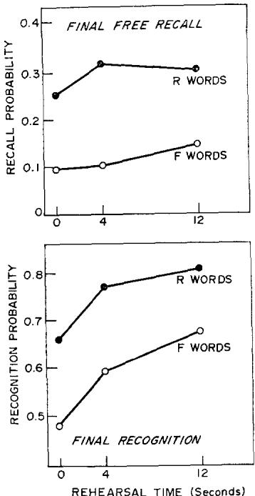

# Recall and Recognition as a Function of Primary Rehearsal1

ADIDSON E. WOODWARD, JR., ROBERT A. BJORK

Governors State University, University of Michigan

AND

ROBERT H. JONGEWARD, JR.

University of Michigan

Three free- recall experiments were motivated by the common- sense notion that an item should be better remembered and less easily forgotten the greater the rehearsal devoted to the item. In each experiment, four lists of words were presented and a cue to remember or to forget was presented after each word in a list in turn. Before each cue was presented, however, there was a variable blank period during which subjects were required to hold the current word in memory. Immediate and final recall of to- be- remembered and to- be- forgotten words were essentially independent of amount of rehearsal, whereas final recognition increased systematically with rehearsal. The results suggest the need for a distinction between rehearsal as a maintenance activity and rehearsal as a constructive activity.

The idea that a cue to forget should be less effective the longer an item has been studied or rehearsed is as compelling as the idea that learning should be an increasing function of study time. In two recent studies, however, this compelling notion has not been supported (Davis & Okada, 1971; Woodward & Bjork, 1971). This paper explores the extent to which subjects' recall and recognition of to- be remembered and to- be- forgotten items is dependent on processing time during input.

The dominant view of the role of rehearsal processes in memory, exemplified in theoretical papers by Waugh and Norman (1965), Atkinson and Shiffrin (1968), and Norman and Rumelhart (1970), ascribes two functions to rehearsal: The maintenance of items in short- term store and the transfer of items to long- term store. Although Brown (1958) and Broadbent (1958) questioned whether rehearsal does more than maintain items in short- term store, subsequent experimental results seemed to remove any doubt, at least until just recently; Bjork (1970, p. 324), for example, concluded a review of the question by saying "There are other relevant data that might be offered in support of the contention that rehearsal strengthens something, but there does not seem much doubt [that it does]."

The Woodward and Bjork (1971) and Davis and Okada (1971) experiments were designed to include a straightforward test of an implication of the dual- function conception of

rehearsal. In both studies, subjects were presented word lists in which each word in turn was followed by a cue to forget or to remember that word. The interval from the onset of a word until the cue was manipulated to test the idea that subjects should be less able to forget the longer the interval. The length of the interval had no effect on subjects' immediate or final free recall in either experiment, but in both cases the authors attributed the lack of effect to procedural problems and to subjects' strategies rather than to any deficiencies in the two- function conception of rehearsal.

The first of the experiments reported below was designed to overcome the possible procedural problems in the Woodward and Bjork (1971) and Davis and Okada (1971) experiments; the second was designed to overcome possible procedural problems in the first; and the third was designed to demonstrate that the results of the preceding experiments do not reflect procedural problems, but, rather, reflect some shortcomings in the standard dual- function conception of rehearsal.

# EXPERIMENT I

In Woodward and Bjork's (1971) experiment, each word was presented for 1, 2, or 4 sec before the cue to remember or to forget appeared. Thus, each word remained in view until the cue appeared; it might have been possible, therefore, for the subjects to have avoided any active rehearsal of the word, beyond keeping it in sight, until and if a remember cue appeared. Davis and Okada (1971) improved on Woodward and Bjork's procedure by having a blank period between the item's presentation and the subsequent cue. Since the word was not present during the blank interval, subjects had to hold it in memory. Davis and Okada used only two delays, however, and those delays (0 and 1 sec) covered such a minimal range that it is difficult to draw conclusions from their results. In the present experiment, a blank period of 0, 1, 2, 4, 8, or 12 sec followed the presentation of each word and preceded the cue to forget or remember.

period of 0, 1, 2, 4, 8, or 12 sec followed the presentation of each word and preceded the cue to forget or remember.

# Method

Subjects. Forty- eight subjects drawn from the University of Michigan summer subject pool participated in the experiment. They were paid $1.00 plus any bonuses that accrued from the payoff system employed in the experiment.

Materials and apparatus. Every subject viewed four 36- item lists composed of common four- letter nouns. Eighteen randomly selected words were followed by a remember instruction (R words), the other 18 words were followed by a forget instruction (F words). The apparatus employed was a high- speed memory drum (change time less than .05 sec). The words, the cues to forget or remember, and the instructions to recall or get ready for the next trial all appeared in the same window. The timing of advances of the memory drum was controlled by a high- speed paper- tape reader.

Design. After each item in a list, and before its cue, there was a rehearsal period of 0, 1, 2, 4, 8, or 12 sec. In each third of a list, there were six R words, one followed by each cue delay period, and there were six F words, one followed by each due delay period. Counterbalancing procedures insured that, across subjects, every word was an R word and an F word equally often, and that every word was followed by every cue delay equally often. After each list, there was an immediate free recall during which subjects were asked to recall R words and to avoid recalling F words. After all four lists had been presented and recalled, there was a final recall during which subjects were asked to recall all words from all lists.

Procedure. Subjects were tested individually. Each subject was read a set of instructions and was shown two practice lists of 12 nonsense syllables before the four experimental lists were presented.

Each list was preceded by a 3- sec ready signal. The individual words within a list were presented for 1 sec. After each word, the memory drum window was blank during the rehearsal period for that word. At the end of the rehearsal period, a red or green dot was presented for 1 sec. For half the subjects red meant forget and green meant remember; for the other subjects the assignments were reversed. Immediately after each cue, the next word appeared. At the end of a list a recall signal was in view for 30 sec, during which time subjects tried to write down as many of the R words as they could. Subjects received a 1- cent bonus for each R word recalled and they were penalized 1- cent for each F word intruded.

After the recall of the last list, there was a debriefing period lasting several minutes, after which subjects were asked to recall all of the words presented during the experimental session, F words as well as R words. Each item recalled earned a 1- cent bonus regardless of its initial cuing.

# Results

The primary results of the experiment are shown in Figure 1. Recall probability is plotted as a function of time of recall (immediate or final), word type (R word or F

  
FIG. 1. Immediate (IR) and final (FR) recall probabilities for to-be-remembered (R words) and to-be-forgotten (F words) items as a function of rehearsal time.

word), and cue delay (0, 1, 2, 4, 8, or 12 sec). The most important thing to note in Figure 1 is that the effects of rehearsal are very slight. The immediate intrusion and final recall of F words appear to increase with rehearsal, and the immediate recall of R words appears to decrease slightly, but the lack of any sizable effects is more striking than are those trends. The range over which rehearsal was manipulated in this experiment (0- 12 sec) is enough to create order- of- magnitude differences in recall in typical experiments [see, for example, the results of an experiment by Pollatsek reported by Bjork (1970, Figure 6)].

Overall, the subjects were remarkably adept at both recalling R words and avoiding the recall of F words on the immediate test. Averaged over cue delays, the probabilities of recalling R words and intruding F words were .473 and .025, respectively. The corresponding final recall probabilities were .269 and .059. These immediate and final recall probabilities are very similar to those obtained by Woodward and Bjork (1971) and by Bjork and Woodward (1973) who used more but shorter, word lists.

In Figure 2 immediate and final recall probabilities are shown as a function of serial

  
FIG. 2. Immediate (IR) and final (FR) recall probabilities for to-be-remembered (R words) and to-be-forgotten (F words) items as a function of serial input position.

input position, averaged over cue delay and list number. The effects of serial position shown in Figure 2 replicate exactly the effects found in earlier studies. The recall of F words, whether immediate or final, shows no effects of input position. The immediate recall curve for R words looks like a typical free- recall serial position curve, except for somewhat more primacy and somewhat less recency than is usually the case in standard free- recall experiments, and the final recall curve for R words exhibits the negative recency effect typical of final free- recall tests (e.g., Craik, 1970; Woodward & Bjork, 1971).

Finally, Figure 3 shows immediate and final probability for R words and F words as a function of the list in which they were presented. There is a clear list- recency effect in the final recall of R words, but otherwise there are no apparent effects of list number.

  
FIG. 3. Immediate (IR) and final (FR) recall probabilities for to-be-remembered (R words) and to-be-forgotten (F words) items as a function of input list.

# Discussion

The fact that R- word recall actually decreased with amount of rehearsal suggests a possible problem in the design of Experiment I. It might have been the case that subjects were not holding the current word in memory beyond a certain point during the delay inter

val; that is, they might have devoted most of their effort during a rehearsal period to actively rehearsing any R words they could remember from earlier in the list. The R words a subject would remember from earlier in the list would tend to be those that had been followed by shorter cue delays, because R words followed by longer cue delays would be more likely to have been lost prior to the onset of the R cue. On the other hand, the only rehearsal devoted to F words is that taking place during the cue delay period, and the amount of such rehearsal should increase with increasing delay of the F cue.

As a test of the plausibility of the preceding interpretation, recall of the nth word in a list was examined as a function of the length of the rehearsal period following the  $n + 1$ st word in that list. The outcome of that analysis was unambiguous: Recall of the nth word did not vary systematically with the length of the  $n + 1$ st rehearsal period (the recall proportions were .449, .400, .425, .419, .484, and .409 for rehearsal periods 0, 1, 2, 4, 8, 12, respectively), nor was there any apparent interaction between the nth and  $n + 1$ st rehearsal periods on the recall of R words.

Although the outcome of the preceding analysis inflicts severe damage on the time- sharing interpretation of the results of Experiment I, that damage may not be fatal. During any one rehearsal period a subject might be assumed to rehearse several prior R words, not just the most recent R word. At any rate, Experiment II was designed to include an added inducement to hold certain words in memory until the cue appeared.

# EXPERIMENT II

In Experiment II a precuing technique was employed to gain greater control over subjects' rehearsal processes. A given word was either highlighted or was not, which served to cue subjects whether that word was likely to be an R word or F word. The precue was then either confirmed or disconfirmed by a

postcue presented after a variable rehearsal period (the postcue was the defining cue as far as designating whether a word was an R word or F word). Confirmation was more likely than disconfirmation and subjects were urged to take advantage of the precues; they were told that the precues would aid their deciding how to rehearse even though the precue and postcue would occasionally be inconsistent.

# Method

Subjects. Forty- eight subjects were drawn from the summer subject pool at the University of Michigan. They received  $\mathbb{S}1.00$  plus any bonuses that accrued from the payoff system used in the experiment.

Materials and apparatus. Each subject was shown four 36- word lists. The words and the apparatus used were identical to the words and apparatus used in Experiment I.

Design. A given word in a list was either highlighted in yellow or it was not highlighted. After the word was presented, there was a variable blank period of 0, 1, 4, or 12 sec, which was followed by the presentation of a green or red dot. In each 12- word segment (one- third) or a list, six words were highlighted and six were not. Four of the highlighted words and two of the nonhighlighted words were followed by green dots, and the remaining words were followed by red dots. Thus, highlighting predicted a green postcue with probability .67, and no highlighting predicted a green postcue with probability .33. For half the subjects, a green postcue meant remember and a red postcue meant forget, and for the other subjects the assignments were reversed. In each one- third of a list, then, there were six R words and six F words, where four of each were consistent with the precue and two of each were not. Counterbalancing procedures insured that every word served in all precue- postcue combinations with each cue delay.

Procedure. The procedure was essentially the same as that employed in Experiment I. Prior to each list there was a 3- sec ready

Procedure. The procedure was essentially the same as that employed in Experiment I. Prior to each list there was a 3- sec ready signal, individual words were presented for 1 sec, and the postcues were presented for 1 sec. After each list there was a 30- sec recall period, and after all lists there was a final recall. The subjects were rewarded with a 1- cent bonus for any R word recalled on the immediate test following a list, and they were penalized 1 cent for any F word intruded. On the final recall, subjects were rewarded with a 1- cent bonus for any R word or F word recalled from any list.

# Results

In Figure 4, the probabilities of immediate (top panel) and final (bottom panel) recall are plotted as a function of rehearsal duration. The relatively elaborate precuing procedure appears to have had little effect. It would be difficult to assert that there are any meaningful differences in immediate or final recall of R words as a function of whether the precue predicted that the word was likely to be an R word or was likely to be an F word. There are

  
FIG. 4. Immediate (IR) and final (FR) recall probabilities as a function of rehearsal time for to-be-remembered (R words) items with consistent (R precue) or inconsistent (F precue) precues, and for to-be-forgotten items with consistent (F precue) or inconsistent (R precue) precues.

clear differences in the immediate and final recall of  $\mathbf{F}$  words as a function of precuing, but the absolute size of those differences is only a few percent. Once again, the lack of any sizable effects of rehearsal is more impressive than are any effects one might note in Figure 4.

The immediate and final recall of R words and  $\mathbf{F}$  words as a function of input serial position produced no surprises: The serial position curves were entirely similar in their essentials to those obtained in Experiment I (Figure 2). Similarly, immediate and final recall of R words and F words as a function of list number in the present experiment replicated the results of Experiment I (Figure 3) very closely.

# Discussion

Although the debriefing of subjects carried out in Experiments I and II was not systematic in terms of the questions asked, subjects often volunteered statements something like "I didn't do anything with a word until I saw the cue." Those statements together with the minimal effects of rehearsal obtained in Experiments I and II suggest the existence of a rehearsal process that simply holds or maintains items in short- term memory without transferring information to long- term memory. Such a rehearsal process would serve as a short- term holding operation, an example of which might be the way one holds a telephone number in memory during the walk from a phone book to a telephone. That is, in contrast to rehearsing to- be- remembered items in a constructive, mnemonic fashion for some long- term purpose, one simply cycles the items in a rote fashion to maintain them in short- term memory until they can be used for some short- term purpose. Experiment III was designed to explicate the rehearsal process implicated by the results of Experiments I and II.

# EXPERIMENT III

In Experiment III a simple and direct procedure was introduced to remove any

In Experiment III a simple and direct procedure was introduced to remove any doubt that subjects were holding the current word in memory during the cue- delay interval. At the end of any given interval, and before the cue to remember or forget the current word appeared, a row of question marks was presented for 1.5 sec, during which the subjects were required to recall the current word. Not only does such a within- list recall test constitute strong inducement to maintain the current word in memory during its rehearsal period, it also makes it possible to compute the probability of subsequent recall or recognition of an item conditional on the item's having been correctly recalled on the within- list test.

# Method

Subjects. Twelve subjects were drawn from the University of Michigan summer subject pool. They were each paid $1.50 plus any bonuses that accrued from the payoff system employed in the experiment.

Materials and apparatus. The words used were the same as those used in Experiments I and II, and they were shown on the same apparatus.

Design. After a practice list of nonsense syllables, subjects were shown the four 36- word experimental lists. In each one- half of a list there were nine R words and nine F words; three of the R words and three of the F words were followed by each of three rehearsal periods, 0, 4, or 12 sec. After each rehearsal period, and before the subsequent cue to forget or remember the current word, a row of question marks appeared as an instruction to subjects to recall the current word aloud. Figure 5 illustrates the nature and timing of the word- by- word sequence in each of the four lists.

Across subjects, counterbalancing procedures insured that every word in a list was an R word and F word equally often, and that, as either an R word or F word, it was followed by each rehearsal period equally often.

Procedure. Before each list there was a 2- sec ready signal, and at the end of each list

  
FIG. 5. Word-by-word sequence of events within any one list in Experiment III.

there was a 30- sec recall period during which subjects were to recall R words and to avoid recalling F words. There was a 1- cent bonus for any R word recalled and a 1- cent penalty for any F word intruded. After all lists had been presented and recalled, there was a final recall during which subjects were to recall any R words or F words they could remember from any list, and there was a 1- cent bonus for any word recalled. Finally, there was a final recognition test consisting of the 144 words presented during the experiment together with 144 new words. The two types of words were intermingled on two sheets of paper, and subjects were asked to circle any words they remembered having seen during the experiment. There was a 1- cent bonus for each hit and a 1- cent penalty for each false alarm.

# Results

In the top panel of Figure 6, the probability that a word was recalled on its postrehearsal within- list test is shown as a function of rehearsal time. As the duration of the rehearsal period increased, the frequency with which the subjects were unable to recall the current word increased, but failure to recall was very infrequent in absolute terms. In the bottom panel of Figure 6, immediate free

  
FIG. 6. Top panel: within-list recall probability as a function of rehearsal period; bottom panel: immediate free-recall probability as a function of rehearsal time for those to-be-remembered (R words) and to-be-forgotten (F words) items correctly recalled on the within-list test.

In the top panel of Figure 6, the probability that a word was recalled on its postrehearsal within- list test is shown as a function of rehearsal time. As the duration of the rehearsal period increased, the frequency with which the subjects were unable to recall the current word increased, but failure to recall was very infrequent in absolute terms. In the bottom panel of Figure 6, immediate free- recall probabilities for R words and F words are shown as a function of rehearsal. These probabilities are for only those R words and F words that were correctly recalled on the within- list test; that is, for only those words that one can be certain were held in memory during the rehearsal period. The results in Figure 6 are clear: Rehearsal time had no effect on either the immediate recall of R words,  $F(2, 22) = 1.02$ ,  $p > .25$ , or on the immediate intrusion of F words,  $F(2, 22) < 1.0$ . The analysis of variance was carried out on these data, and on the data reported below, as follows. For each subject, recall or recognition probability was computed conditional on within- list recall. The analysis was then carried out on an arcsin transformation of those conditional probabilities. Whenever a conditional probability was zero (not infrequent for the F words), the arcsin trans-

formation of .001 was substituted for the arcsin transformation of zero  $(- \infty)$ .

In the top panel of Figure 7, final free- recall probability is plotted as a function of rehearsal time for those R words and F words correctly recalled on the within- list test. Again, there is no significant effect of rehearsal time on the recall of either R words,  $F(2, 22) = 2.62$ ,

  
FIG. 7. Final free-recall and final recognition probability as a function of rehearsal time for those to-be-remembered (R words) and to-be-forgotten (F words) items that were correctly recalled on the within-list test. (The false alarm probability for new words on the final recognition task was .034.)

$p > .05$  or F words,  $F(2, 22) = 1.89$ ,  $p > .10$ . In the bottom panel of Figure 7, however, the picture is quite different. Final recognition of both R words,  $F(2, 22) = 4.82$ ,  $p > .05$ , and F words,  $F(2, 22) = 11.11$ ,  $p < .01$ , does increase as a function of rehearsal. As in the analyses of immediate and final free recall, the analysis of final recognition includes only those words correctly recalled on the within- list test.

# Discussion

There are several remarkable features of the results in Experiment III. On the one hand, large variations in the amount of time an item is held in memory have no effect on probability of subsequent recall of the item. On the other hand, a 1- sec postrehearsal cue to forget or remember is as potent in its effect on subsequent recall as the duration of rehearsal is impotent. And finally, duration of rehearsal has a heavy influence on final recognition in spite of there being no effects of rehearsal time on either of the two preceding recall tests.

The results of Experiment III suggest that the subjects' rehearsal of a word during its rehearsal period was fundamentally different from the type of rehearsal subjects typically employ during memory tasks such as the standard free- recall task. During the presentation of a typical free- recall list, subjects rehearse the list items in a constructive, associative fashion. They group similar items, form idiosyncratic associations between items, and their output of items during recall reflects their within- list rehearsal activity in a direct way. That recall profits from such rehearsal activity is obvious: When subjects are required to repeat aloud the current word and only the current word until the next word is presented, recall performance suffers (Atkinson & Shiffrin, 1971; Glanzer & Meinzer, 1967).

The procedure employed in the current experiments makes it inappropriate for subjects to rehearse a word in an active, constructive way during its rehearsal period. Since the rehearsal period may be followed by a cue to simply forget the current word, it is not in the subjects' interest to do more than hold the current word in memory until the cue appears. Associating or grouping the word with similar words presented earlier is counterproductive. Thus, subjects engage in a rote, nonassociative rehearsal process, the function of which is to maintain the current word in short- term memory, and the consequences of which are

quite different from those of constructive, associative rehearsal.

Why should rote, nonassociative rehearsal have no effect on subsequent recall and yet produce substantial increments in subsequent recognition? A possible reason is that retrieval from memory, and hence recall performance, depends heavily on interassociations and interrelations between items in memory. Since rote maintenance of items can be conceived of as a long- term- memory- independent cycling or refreshing of items in short- term memory, few if any associations are formed, which means that there is little if any increase in subsequent recall performance. On the other hand, rote nonassociative rehearsal might increase the strength of an item's representation in long- term storage, or in the strength of the item's association to the general situational context. Recognition, therefore, should improve with the amount of such rehearsal.

# CONCLUDING COMMENTS

That it is possible to maintain items in short- term memory without improving subsequent long- term recall of the items seems undeniable. In addition to the present results, the results of research by Jacoby and Bartz (1972), Meunier, Ritz, and Meunier (1972), Jacoby (1973), and Craik and Watkins (1973) involving several different procedures support the conclusion that items can be rehearsed without there being a transfer of information to long- term memory. In addition, Shiffrin (1973) has shown that increasing the duration during which items are held in memory does not lead to greater resistance to a subsequent interfering task in terms of postinterference recall. Shiffrin's research is an extension of Reitman's (1971) paradigm in which the presentation of a to- be- remembered item is followed by a period during which subjects are required to perform a signal detection task. Reitman's and Shiffrin's results show little or no memory loss during the signal detection task, and Shiffrin found in addition that the duration of the signal detection task, and hence the duration that items are held if not rehearsed, had no effect on recall measured after a subsequent interfering arithmetic task.

The present results go beyond other results by demonstrating that rote nonassociative rehearsal does more than maintain. The fact that recognition increases as a function of amount of rote nonassociative rehearsal suggests that the dominant conception of the role of rehearsal in memory (e.g., Atkinson & Shiffrin, 1968; Waugh & Norman, 1965) may not be totally wrong. That is, any rehearsal of an item may accomplish the transfer of information to long- term memory, but only constructive, associative rehearsal will result in an improvement in long- term recall. In an experiment by Bjork and Jongeward (1973), the same pattern of effects of rote nonassociative rehearsal was obtained—that is, substantial improvements in long- term recognition as a function of such rehearsal without any corresponding influence on long- term recall. In addition, Bjork and Jongeward were able to demonstrate, within the same experimental context, the differential consequences on long- term recall of rote nonassociative rehearsal and active associative rehearsal.

It might be useful to label the two distinct rehearsal processes implicated by the present research as primary and secondary rehearsal. The defining characteristics of primary and secondary memory as originally stated by James (1890) on the basis of his introspections, and as slightly modified by Waugh and Norman (1965) on the basis of a set of experimental findings, seem quite consistent with the proposed functional differences between the two types of rehearsal. Primary rehearsal consists of an ordered conscious cycling of items just presented, a kind of re- presentation scheme the purposes of which are primarily short- term. Secondary rehearsal is a more idiosyncratic, long- term- memory- sensitive process by which the items being rehearsed are associated with each other and with other

information in long- term memory. Primary rehearsal is "primary" in the sense of being a fundamental maintenance operation that provides a faithful short- term record of events, which in turn provides the basis for both short- term use of the items and for secondary rehearsal activities designed to facilitate long- term use of the items. Consistent with Tulving's (1968) distinction between primary and secondary organization, primary rehearsal is a process independent of one's prior familiarity with the items being rehearsed, whereas secondary rehearsal is heavily dependent on prior familiarity, and on semantic, phonetic, and other relations among the items being rehearsed.

# REFERENCES

ATKINSON, R. C., & SHIFFRIN, R. M. Human memory: A proposed system and its control processes. In K. W. Spence and J. T. Spence (Eds.) The Psychology of Learning and Motivation. Vol. 2. New York: Academic Press, 1968. ATKINSON, R. C., & SHIFFRIN, R. M. The control processes of short- term memory. Scientific American, 1971, 224, 82- 90. BJORK, R. A. Repetition and rehearsal mechanisms in models of memory. In D. A. Norman (Ed.) Models of human memory. New York: Academic Press, 1970. BJORK, R. A., & JONGEWARD, R. H., JR. Rehearsal as a short- term holding operation in memory. 1973 (Submitted for publication). BJORK, R. A., & WOODWARD, A. E., JR. The directed forgetting of individual words in free recall. Journal of Experimental Psychology, 1973, 99, 22- 27. BROADBENT, D. E. Perception and communication. London: Pergamon Press, 1958. BROWN, J. Some tests of a decay theory of immediate memory. Quarterly Journal of Experimental Psychology, 1958, 10, 12- 21.

CRAIK, F. I. M. The fate of primary memory items in free recall. Journal of Verbal Learning and Verbal Behavior, 1970, 9, 143- 148. CRAIK, F. I. M., & WARKINS, M. J. The role of rehearsal in short- term memory. Journal of Verbal Learning and Verbal Behavior, 1973, in press. DAVIS, J. C., & OKATA, R. Recognition and recall of positively forgotten items. Journal of Experimental Psychology, 1971, 89, 181- 186. JACOBY, L. L. Encoding processes, rehearsal, and recall requirements. Journal of Verbal Learning and Verbal Behavior, 1973, 12, 302- 310. JACOBY, L. L., & BARTZ, W. A. Rehearsal and transfer to LTM. Journal of Verbal Learning and Verbal Behavior, 1972, 11, 561- 565. JAMES, W. The principles of psychology. Vol. I. New York: Holt, 1890. GLANZER, M., & MEINZER, A. The effects of intralist activity on free recall. Journal of Verbal Learning and Verbal Behavior, 1967, 6, 928- 935. MEUNIER, G. F., RITZ, D., & MEUNIER, J. A. Rehearsal of individual items in short- term memory. Journal of Experimental Psychology, 1972, 95, 465- 467. NORMAN, D. A., & RUMALHART, D. E. A system for perception and memory. In D. A. Norman (Ed.) Models of human memory. New York: Academic Press, 1970. REITMAN, J. S. Mechanisms for forgetting in short- term memory. Cognitive Psychology, 1971, 2, 185- 195. SHIFFRIN, R. M. Information persistence in short- term memory. Journal of Experimental Psychology, 1973, 100, 39- 49. TULVING, E. Theoretical issues in free recall. In T. R. Dixon and D. L. Horton (Eds.) Verbal behavior and general behavior theory. Englewood Cliffs, N. J.: Prentice- Hall, 1968. WAUGH, N. C., & NORMAN, D. A. Primary memory. Psychological Review, 1965, 72, 89- 104. WOODWARD, A. E., JR., & BJORK, R. A. Forgetting and remembering in free recall: Intentional and unintentional. Journal of Experimental Psychology, 1971, 89, 109- 116.