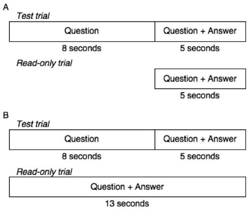
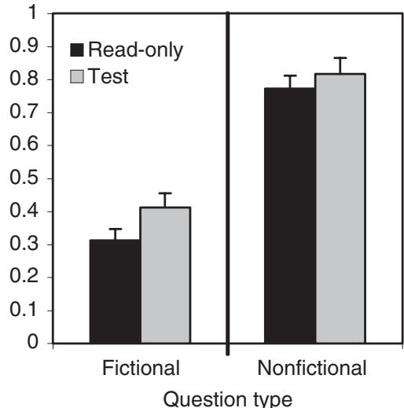
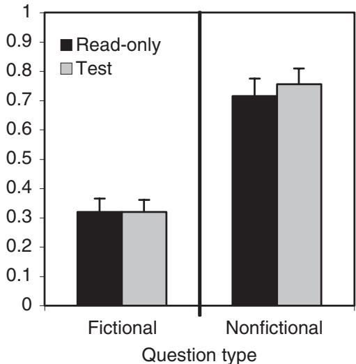
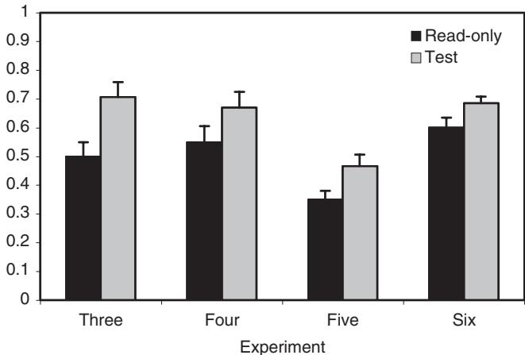
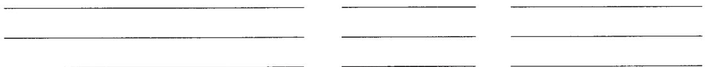
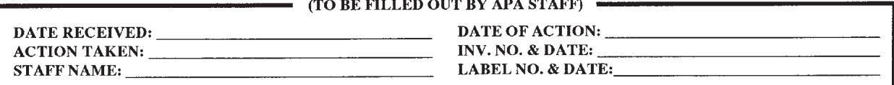

# Unsuccessful Retrieval Attempts Enhance Subsequent Learning

Nate Kornell, Matthew Jensen Hays, and Robert A. Bjork  University of California, Los Angeles

Taking tests enhances learning. But what happens when one cannot answer a test question—does an unsuccessful retrieval attempt impede future learning or enhance it? The authors examined this question using materials that ensured that retrieval attempts would be unsuccessful. In Experiments 1 and 2, participants were asked fictional general- knowledge questions (e.g., "What peace treaty ended the Calumet War?"). In Experiments 3–6, participants were shown a cue word (e.g., whale) and were asked to guess a weak associate (e.g., mammal); the rare trials on which participants guessed the correct response were excluded from the analyses. In the test condition, participants attempted to answer the question before being shown the answer; in the read- only condition, the question and answer were presented together. Unsuccessful retrieval attempts enhanced learning with both types of materials. These results demonstrate that retrieval attempts enhance future learning; they also suggest that taking challenging tests—instead of avoiding errors—may be one key to effective learning.

Keywords: memory, learning, testing, retrieval, education

The variety of ways to enhance learning are not easily enumerated or categorized, but one general and enduring principle is that active involvement in learning creates lasting memories (e.g., James, 1890). It is, therefore, a broad goal of instruction to foster such active involvement, and testing is one means of doing so. The dynamics of tests as learning events have long been of interest to investigators (see, e.g., Allen, Mahler, & Estes, 1969; Bjork, 1975, 1988; Donaldson, 1971; Gates, 1917; Hogan & Kintsch, 1971; Izawa, 1970; Landauer & Bjork, 1978; Landauer & Eldridge, 1967; Spitzer, 1939; Tulving, 1967; Whitten & Bjork, 1977; Young, 1971), and that interest has been recently reinvigorated by demonstrations that testing has substantial benefits for educationally realistic materials and retention intervals (e.g., Carrier & Pashler, 1992; Glover, 1989; Roediger & Karpicke, 2006a, 2006b).

From a learning standpoint, there are several benefits of being tested. First, there is abundant evidence that successfully retrieving information from memory increases the likelihood that the information in question can be recalled successfully at a later time (for a recent review, see Roediger & Karpicke, 2006a). This increase is considerably greater than when the information is merely presented. Related to that fact, successful tests appear to retard the forgetting that would otherwise occur (e.g., Hogan & Kintsch, 1971; Roediger & Karpicke, 2006b). Tests also have metacognitive value for the learner: They allow for a more accurate assess ment than do study events of whether information is likely to be recallable in the future (e.g., T. O. Nelson & Dunlosky, 1991). A final possible benefit of tests is that they may, as suggested by Izawa (1970), increase the efficiency of subsequent study, compared with the efficiency of such study when it is not preceded by a test. The focus of the present research is on whether failed tests enhance subsequent learning.

# Are the Effects of an Unsuccessful Test Positive or Negative?

There is extensive evidence that successful retrieval is a "memory modifier" (Bjork, 1975). What, though, is the effect of an unsuccessful retrieval attempt? If successful tests enhance learning, do unsuccessful tests impede learning—or do they also enhance learning? The literature supports predictions of either outcome. The foremost reason to expect unsuccessful tests to have negative consequences is the idea of errorless learning—that is, the idea that learning is most effective when errors are minimized. Errorless learning has had a long and influential history in psychology (e.g., Guthrie, 1952; Skinner, 1958). Although it is an idea that derives mainly from findings in studies of nonhuman animal learning, it has influenced suggestions about best practices for educators as well (for a discussion, see Pashler, Zarow, & Triplett, 2003), and it is used frequently and successfully in patient populations (e.g., Evans et al., 2000).

A related finding is that when students make an error on a multiple- choice test, that error tends to persist on a later test (Marsh, Roediger, Bjork, & Bjork, 2007; Roediger & Marsh, 2005), although the overall effect of such tests appears to be positive. Moreover, there is direct empirical evidence that a brief, unsuccessful cued- recall test followed by a presentation can hinder memory, versus a presentation not preceded by a test (Cunningham & Anderson, 1968). There is also reason to expect negative effects from a theoretical perspective: One explanation of the benefits of tests is that the process of recalling information from memory

strengthens retrieval routes that lead to correct answers (e.g., Bjork, 1975; McDaniel & Masson, 1985). Unsuccessful retrieval attempts could be counterproductive if they strengthen retrieval routes that lead down the wrong paths.

However, there are reasons to expect that unsuccessful tests might enhance memory. First, in educational settings, students who are asked questions about a topic before they begin to study it learn more from the subsequent study opportunity than do students who are shown the same questions but are not required to answer them and it is important to note that such prequestions are beneficial even if the student's initial answer is incorrect (Pressley, Tanenbaum, McDaniel, & Wood, 1990; Richland, Kornell, & Kao, 2009). Second, increasing the delay between successive tests increases error rates during learning, but, if feedback is provided, it also enhances learning as measured on a delayed test (Pashler et al., 2003). This effect derives from the benefits of spacing—that is, the benefit of spacing repeated learning events apart instead of massing them together (e.g., Cepeda, Pashler, Vul, Wixted, & Rohrer, 2006; Dempster, 1996; Glenberg, 1979)—but also reflects an apparent lack of harm caused by errors. Similarly, forcing students to guess when they are tested, which greatly increases error rates, does not appear to diminish performance on a later test (Pashler, Rohrer, Cepeda, & Carpenter, 2007).

Further evidence of possible benefits of unsuccessful tests comes from Kane and Anderson (1978), who asked participants to try to guess the last word in two types of sentences. In determined sentences, such as "The dove is a symbol of the answer was obvious; in undetermined sentences, such as "The dove appeared when the magician said ,participants rarely guessed the correct answer (peace). Testing was more effective than simply reading the sentences, even for undetermined sentences. This finding suggests that unsuccessful retrieval attempts played a role in enhancing learning of the undetermined sentences. Participants did guess the correct response on  $9\%$  of the undetermined trials, however, which may have contributed to the benefit of testing.

Following up on Kane and Anderson's (1978) work, Slamecka and Fevreiski (1983) asked participants to solve problems such as "The opposite of pursue a then presented participants with the answers to the problems before subsequently testing the answers. They found evidence for the generation effect when generation fails" (Slamecka & Fevreiski, 1983, p. 153) that is, enhanced memory for items participants attempted to generate, even if the attempt was unsuccessful. The authors pointed out, however, that the advantage of generation may have occurred because semantic generation succeeded (i.e., participants generated the semantic concept avoid) even if they failed to generate the surface, lexical features of avoid. As the authors stated,

In the course of this work it became increasingly clear that the term "generation failure" was fundamentally misleading in its connotations ... and that what was really being observed were instances of incomplete generation, that is, occasions where generation of the semantic attributes had not been followed by self- access to the proper lexical entry. (p. 160)

In other words, semantic generation did not necessarily fail, even when participants could not produce the correct verbal response.

Perhaps the most direct evidence that unsuccessful tests are beneficial comes from Izawa's research (e.g., Izawa, 1967, 1970). She showed that if one cannot recall an item, being tested on that item multiple times (without feedback) before being shown the answer (e.g., five tests followed by a presentation) results in more learning than does being tested on the item fewer times prior to the presentation (e.g., one test followed by a presentation) despite the fact that none of the tests resulted in successful recall. Izawa suggested that unsuccessful tests enhance the encoding that occurs on the subsequent presentation trial.

To summarize, unsuccessful recall attempts might enhance learning if they engage active learning processes and enhance future encoding. Retrieval failures might also impede learning if they strengthen inappropriate retrieval routes or otherwise reinforce errors.

# The Item-Selection Problem

Given the prior research on the testing effect and the frequency of retrieval failures on tests, one might expect that unsuccessful tests would have been compared with presentations in previous research. Making such a comparison is difficult, however, because of item- selection effect: In a test condition, it is easy to select items that were not recalled successfully (i.e., nonretrievable items), but selecting nonretrievable items is not possible in a read- only condition because there is no recall test. As Pashler et al. (2003) stated,

To know what causal impact an error had, uncontaminated by item selection issues, one would need to compare later performance after the subject makes an error on an item with performance on other items for which an error would have been made—but for which no test was ever given. Obviously, one has no way of picking out such items. (p. 1056)

No previous experiment has compared unsuccessful tests versus presentations without encountering item- selection problems.

# The Approach in the Present Experiments

In Experiments 1 and 2, we solved the item- selection conundrum by using a set of fictional trivia questions created by Berger, Hall, and Bahrick (1999). Participants never answered the fictional questions correctly during the experiment's initial study phase because there were no real answers. Using fictional questions allowed us to avoid item- selection problems: None of the questions, whether in the read- only or test condition, could have been recalled successfully during study.

It was crucial that the participants believe that the questions were real, so they would attempt to recall the answers in the test condition, so we included Berger et al.'s (1999) nonfictional questions (e.g., "What is the only word the raven says in Edgar Allen Poe's poem 'The Raven'?") as well as their fictional questions (e.g., "What is the last name of the person who panicked America with his book A plague of Fear?"). In Berger et al.'s studies and in our pilot work, when fictional items were intermixed with nonfictional items, participants did not become suspicious of the fictional items; instead, they interpreted such items as questions to which they happened not to know the answers.

In Experiments 3- 6, we used the same procedures as in Experiments 1 and 2, but instead of trivia questions, the materials were weak associates; for example, the word pond was presented and participants were asked to guess the answer (frog). We solved the

item selection problem—or at least rendered it insignificant—by simply removing from the analyses the rare trials on which participants guessed correctly during the initial study phase of the experiment.

All six experiments consisted of three phases: study, delay, and test. In the first two experiments, participants initially studied 40 trivia questions, 20 of which were fictional and 20 of which were nonfictional. There were two conditions during the initial study phase. In the read- only condition, the question and answer were presented together; in the test condition, the question was presented alone for several seconds—and participants were asked to try to produce the answer—before the answer was revealed. Experiments 1 and 2 differed only in the duration of the read- only condition. In Experiment 1, the answer was displayed for an equal amount of time in the read- only and test conditions. In Experiment 2, the total trial time in the two conditions was equal. Figure 1 summarizes the procedure used during study trials in all six experiments. After the study phase, there was a 5- min distractor task and then all 40 items were tested. Experiments 3 and 4 were procedurally identical to Experiments 1 and 2, respectively, with one major difference: The materials were 60 weak associates (e.g., skyscraper- tower); in the test condition, participants were presented with the cue and asked to produce the target. Experiment 5 was identical to Experiment 4, except that the delay between study and test averaged  $38~\mathrm{hr}$  instead of  $5\mathrm{min}$ ; Experiment 6 was also identical to Experiment 4, except that the learning condition (read- only vs. test) was manipulated between participants.

# Experiment 1

# Method

Participants, design, and materials. The participants were 25 University of California, Los Angeles (UCLA), undergraduates. We used a  $2\times 2$  within- participants design with two independent variables: question type (fictional or nonfictional) and condition (read only or test). The question set consisted of 40 questions taken from Berger et al. (1999), 20 fictional and 20 nonfictional. Berger et al. (1999) created matched pairs of questions that corresponded to one another, one fictional (e.g., "Who shot a fig out of a tree with a crossbow in the 11th century?") and one nonfictional (e.g., "Who shot an apple off of his son's head with an arrow in the 14th century?"). The question set used in the current experiment contained either the fictional or the nonfictional version of a given question, but not both.

  
Figure 1. Study trial procedure for Experiments 1-6. A: Procedure during study trials in Experiments 1 and 3. B: Procedure during study trials in Experiment 2, 4, 5 and 6.

Procedure. There were three phases to the experiment: study, distractor, and test. During the study phase, half of the items were presented in the read- only condition and half were presented in the test condition (see Figure 1A). A read- only trial consisted of the question and answer being presented on a computer screen together for  $5\mathrm{s}$ . A test trial consisted of the question being presented alone for  $8\mathrm{s}$ , during which time the participant was asked to try to type in the answer, after which the question- answer pair was presented for  $5\mathrm{s}$ . Thus, read- only trials were  $5\mathrm{s}$  long and test trials were  $13\mathrm{s}$  long, but the answer was displayed for  $5\mathrm{s}$  in both conditions. Half of the items in each condition were fictional and half were nonfictional. The assignment of questions to conditions and to their order during the study phase was determined randomly on a participant- by- participant basis.

The study phase was followed by a distractor task: Participants were given  $5\mathrm{min}$  to type the names of as many countries as they could.

The final phase of the experiment was a cued- recall test. All 40 questions were presented, one by one, in random order, and the participants were asked to type in their answers. No feedback was given during the cued- recall test.

After the test was completed, participants were asked, "Did you notice anything unusual about the set of questions you were asked to learn?" No participant reported any suspicion that some of the questions were fictional.

# Results and Discussion

The focus of our analyses was the fictional questions. During the study phase, as anticipated, participants answered none of the fictional questions correctly. The result of interest was participants' memory for the fictional items on the final cued- recall test. As shown in Figure 2, cued- recall accuracy was significantly higher in the test condition  $(M = .41, SD = .21)$  than it was in the read- only condition  $(M = .31, SD = .17)$ ,  $t(24) = 2.97, p < .01$ ,  $p_{\mathrm{rep}} = .96, d = 0.58$ . Trying to recall the answer to a trivia question during the study phase appears to have enhanced the encoding that took place when its answer was presented. If there was a negative effect of retrieval failures and/or errors made during a recall attempt, it seems to have been outweighed by the positive effect of activating relevant knowledge, which then aided the encoding of the answer.

Test performance on the nonfictional items was not the focus of the experiments, but we report it for completeness. During the study phase, participants answered correctly an average of  $32\%$  of the nonfictional items in the test condition. On the final test, cued- recall accuracy on nonfictional items was higher in the test condition  $(M = .82, SD = .24)$  than it was in the read- only condition  $(M = .77, SD = .20)$ , but the difference was not significant,  $t(24) = 1.20, p = .24$ . Items that were answered correctly in the test condition during the learning phase were answered correctly on the final cued- recall test  $100\%$  of the time; items that were not answered correctly on the initial test were answered correctly, on average, in  $73\%$  of the final test trials. The

  
Figure 2. Proportion correct on the final test for fictional (i.e., initially nonretrievable) and nonfictional questions in Experiment 1. Error bars represent 1 standard error of the mean.

fact that the nonfictional items that were tested but not recalled on the initial test were recalled at a lower rate than were the untested nonfictional items illustrates an item selection effect—the type of effect that was avoided by using fictional items.

The lack of a significant testing effect for nonfictional questions may be attributable to the fact that the answers to many of the nonfictional items existed in participants' memories before the experiment began, even when participants failed to access those answers on the initial test (cf. Slamecka & Fevreiski, 1983). That is, many of the answers may have been in what Berger et al. (1999) labeled marginal knowledge—and, thus, were relearned easily, in effect, when the answer was shown in either condition. Participants would likely answer such items correctly on the final test regardless of whether they studied them in the read- only or test condition.

We undertook an analysis of the fate of items that were initially answered incorrectly during the study phase (i.e., commission errors) versus items participants did not answer (i.e., omission errors). There were too few observations for such an analysis to be meaningful, however; when answering fictional questions during study, only  $48\%$  of participants made even more commission error, and only 3 of the 25 participants made more than one commission error. (Commission errors were more common in Experiments 3- 6, as discussed below.)

# Experiment 2

# Method

In Experiment 1, answers were presented for equal amounts of time in the test and read- only conditions during the study phase. In Experiment 2, we relaxed the constraint that participants spend equal time studying answers and, instead, held constant the time allotted for a complete trial. In the test condition, a question was presented alone for  $8\mathrm{~s~}$  and then the question and answer were presented together for  $5\mathrm{~s~}$  In the read- only condition, the question and answer were presented together for  $13\mathrm{~s~}$  see Figure 1B).Thus, it is important to note that participants were allowed more than twice as much time to study the question- answer pair in the read- only condition  $(13\mathrm{~s})$  than they were in the test condition  $(5\mathrm{~s})$ . On that basis, it seemed evident that participants should learn more in the read- only condition than in the test condition. If unsuccessful tests enhance subsequent learning, however, we predicted that the test condition could be as effective, or close to as effective, as the read- only condition. The materials were the same as in Experiment 1. The participants were 20 UCLA undergraduates. Again, no participants reported any suspicion that some questions were fictional.

# Results and Discussion

Again, as anticipated, none of the fictional questions were answered correctly during the study phase. As depicted in Figure 3—and despite the fact that effective study time in the read- only condition was more than double that in the test condition—there was no significant difference in cued- recall accuracy on fictional items between the read- only condition  $(M = .32, SD = .21)$  and the test condition  $(M = .32, SD = .18)$ ,  $t(19) = 0.00$ .

Again, for completeness, we report the findings from the nonfictional items. In the test condition, the nonfictional items were recalled at a rate of .18 during the study phase. On the final test, cued- recall accuracy on nonfictional items again was higher in the test condition  $(M = .76, SD = .24)$  than it was in the read- only condition  $(M = .72, SD = .26)$ , but again the difference was not significant,  $t(19) = 0.00$ ,  $p = .39$ . Items that were answered correctly on the initial test were answered correctly on the final test  $100\%$  of the time; items that were not answered correctly on the initial test were answered correctly on an average of  $70\%$  of the final test trials. Again, final test performance was lower for nonfictional tested items that were answered incorrectly than it was for nonfictional presented items, illustrating the effects of item selection.

  
Figure 3. Proportion correct on the final test for fictional (i.e., initially nonretrievable) and nonfictional questions in Experiment 2. Error bars represent 1 standard error of the mean.

There were not enough commission errors to make a meaningful comparison between the fates of items answered incorrectly versus items not answered at all, as in Experiment 1. Out of 20 participants, 8 made at least one commission error, and only 2 made more than one commission error.

There was no methodological difference between Experiments 1 and 2 with regard to the test trials that occurred during the study phase, and yet test performance during the study phase was less accurate in Experiment 2  $(M = .18)$  than in Experiment 1  $(M = .32)$ . This finding indicates that there were between- participant differences across the two experiments, which used the same participant pool but were conducted at different times. These between- participant differences help explain why overall performance on the final test was lower in Experiment 2 than it was Experiment 1, despite more time being allowed for study in the read- only condition in Experiment 2 compared with Experiment 1 (see Figures 2 and 3).

# Experiments 3, 4, 5, and 6

In Experiment 1, unsuccessful retrieval attempts were shown to enhance the learning that resulted from subsequent study. Experiment 2 provided evidence that unsuccessful retrieval attempts were just as effective as studying the answer. Although this finding suggests that unsuccessful tests enhance memory just as much as studying does, there was no evidence that unsuccessful tests were more effective than studying was. Therefore, we decided to pursue the possible benefits of unsuccessful tests further by using different materials in the experiments that follow.

The answers to the fictional trivia questions that we used, which were often names, were fairly arbitrary. This feature may have limited the benefits of testing that could be obtained from such materials. For example, when faced with a fictional question such as "Who is the bouncy and egotistical friend of Kenny Peters?" a participant may be able to think of related concepts, such as a friend they know named Kenny, or Winnie- the- Pooh's bouncy friend Tigger. The participant will have little chance of thinking of, or even coming close to, the correct fictional answer (Albert), in part because it is fictional, but also in part because names are somewhat arbitrary. The best the participant can do is to randomly guess a name, knowing that it is incorrect. Just as important is what happens after the answer is presented: If one knows nothing about the fictional Albert, it remains difficult to do semantic processing of the answer.

In most real- life unsuccessful retrieval attempts, the situation is very different, because (a) it is possible to do some semantic processing of an elusive answer before it is revealed or comes to mind and (b) once it is available, the answer, even if it is a name, is often familiar and semantically meaningful. For example, in attempting to answer the question "What fabled bird sprang to new life from the ashes of its nest?" one might be able to think of partial information (e.g., "the name begins with  $ph^{n}$ ); eliminate incorrect responses (e.g., "I know it's not Opus"); conjure a mental image of Fawkes, the phoenix in the Harry Potter stories; and/or even come close to the answer (e.g., "it shares its name with a city in the southwestern United States"). In other words, in real life, even if the participant cannot think of the correct verbal response ("phoenix"), he or she may be able to do deep semantic processing of the concept that it represents. In Experiments 1 and 2, by contrast, it was virtually impossible to do semantic processing of the fictional answers before or after they were presented.

The procedure in Experiments 3 and 4 was the same as the procedure in Experiments 1 and 2, respectively. Instead of trivia questions, however, the materials were weak associates (e.g., olive- branch, mouse- hole, whale- mammal, train- caboose). The participants were presented with the cue and asked to guess the target in the test condition, or they were presented with the cue and target together in the read- only condition. Because the targets were weak associates of the cues, participants rarely guessed correctly during study. The rare items that participants did guess were removed from the analyses. Removing these correct guesses from the test condition avoided item selection effects by biasing the final test in favor of the read- only condition. Experiment 5 was a replication of Experiment 4 in which the delay between study and test was  $38~\mathrm{hr}$  rather than  $5\mathrm{min}$ . In Experiment 6, which was also a replication of Experiment 4, the learning condition (read- only vs. test) was manipulated between participants.

The main advantage of the new materials was that, unlike fictional trivia questions, they allowed participants to process both the question and the answer semantically. Even if participants did not answer correctly, they could come close to doing so. For example, when presented with train, participants might not think of caboose, but they might think of related concepts. Moreover, it was possible to process caboose semantically once it was presented.

There is a second advantage of the weak associates: The cue is a single word and thus can be read quickly. A possible criticism of Experiment 1 is that participants were given more time to read the question in the test condition than in the read- only condition. Reading time might be important because trivia questions can take considerable time to read. The time required to read a single word, however, is negligible. If differences in reading time are the reason for the positive effects of testing in Experiment 1, the benefit of testing should be eliminated in the experiments that follow.

There is also a third important difference between associates and trivia questions: Many of the fictional trivia questions did not necessarily trigger the retrieval of any plausible answer—they were more likely to cause participants to draw a blank. A cue like train, by contrast, may not elicit the correct response (caboose) but it will likely elicit some response (e.g., track). If retrieving an incorrect answer causes that answer, instead of the correct answer, to be retrieved on a subsequent test (e.g., Evans et al., 2000; Marsh et al., 2007), then in the experiments that follow—which we expect to increase the retrieval of errors—the benefit of unsuccessful tests should be diminished or eliminated.

# Experiment 3

# Method

The procedure in Experiment 3 was the same as the procedure in Experiment 1 (see Figure 1A): In the test condition, the presentation of a cue alone for  $8\mathrm{~s~}$  was followed by the cue and target being presented together for  $5\mathrm{~s~}$ ; in the read- only condition, the cue and target were presented together for  $5\mathrm{~s~}$ . The only procedural change was that there were 60 items per participant in Experiment 3, whereas there were 40 in Experiment 1. The participants were 15 UCLA students.

The materials were 60 word pairs taken from D. L. Nelson, McEvoy, and Schreiber's (1998) norms (e.g., freckle- mole, star- night, factory- plant). The forward association strength of the pairs was within a narrow range of .050 to .054, meaning that when presented with the cue word, approximately  $5\%$  of participants produced the target word as their first free associate in Nelson et al.'s study. All of the words were a minimum of four letters long.

# Results and Discussion

During the study phase, participants responded correctly on  $4.4\%$  of the trials—that is, they guessed the target on approximately 1.3 of the 30 test trials. Items that participants responded to correctly were excluded from further analysis on a participant- by- participant basis. Items in the read- only condition could not be answered correctly (or answered at all) and were therefore never excluded. Because items answered correctly in the test condition were overwhelmingly answered correctly on the final test, if the exclusion of items answered correctly had any effect, it was to decrease apparent performance in the test condition and therefore favored the read- only condition.

As Figure 4 shows, cued recall accuracy on the final test was significantly higher in the test condition  $(M = .71, SD = .20)$  than it was in the read- only condition  $(M = .50, SD = .19)$ ,  $t(14) = 5.77$ ,  $p <.0001$ ,  $p_{\mathrm{rep}} >.99$ ,  $d = 1.49$ . Thus, the results of Experiment 1 were replicated: Unsuccessful retrieval attempts followed by feedback enhanced learning.

During the study phase, the majority of responses were errors of commission  $(81\%)$ , unlike in Experiments 1 and 2. There was no significant difference in final test performance between items that were initially left blank  $(M = .64, SD = .38)$  and items that were initially answered with a response we deemed incorrect  $(M = .70, SD = .22)$ ,  $t(11) = - 0.62$ ,  $p = .55$ . Thus learning was apparently unaffected by whether participants made errors of omission or commission (for similar results, see, e.g., Metcalfe & Kornell, 2007; Pashler et al., 2003).

  
Figure 4. Proportion correct on the final test for initially nonretrievable weak-associate target words in Experiments 3-6. In Experiment 3, participants were given 5 and  $13\mathrm{~s~}$  in the read-only and test conditions, respectively; in Experiments 4, 5, and 6, participants were given  $13\mathrm{~s~}$  in both conditions. Experiments 5 and 6 each differed from Experiment 4 in one respect: In Experiment 5, the delay between study and test was increased from  $5\mathrm{min}$  to  $38\mathrm{hr}$  in Experiment 6, the manipulation was between, rather than within, participants. Error bars represent a standard error of the mean.

# Experiment 4

# Method

Experiment 4 was a replication of Experiment 2 in which the materials were the 60 weak- associate pairs from Experiment 3. Like in Experiment 2, the total trial time in Experiment 4 (13 s) was the same in the read- only condition and the test condition. The cue and target were presented together for  $13\mathrm{~s~}$  in the read- only condition, whereas the cue was presented for  $8\mathrm{~s~}$  and then the cue and target were presented together for  $5\mathrm{~s~}$  in the test condition (see Figure 1B). The participants were 15 UCLA undergraduates, and the materials were the same weak associates that were used in Experiment 3.

# Results and Discussion

During the study phase, participants responded correctly on  $3.6\%$  of the trials, or about 1.1 times, in the test condition. Items that were answered correctly during study were removed from subsequent analyses. As Figure 4 shows, cued recall accuracy on the final test was significantly higher in the test condition  $(M = .67, SD = .21)$  than the read- only condition  $(M = .55, SD = .22)$ ,  $t(14) = 3.20$ ,  $p <.01$ ,  $p_{\mathrm{rep}} = .96$ ,  $d = 0.38$ . Thus, in Experiment 4, unsuccessful retrieval attempts—during which participants generated responses other than the response ultimately counted as correct and then received feedback—were, remarkably, more effective than was spending the same time studying the answer to be recalled later.

During the study phase,  $77\%$  of responses were errors of commission. There was no significant difference in final test performance between items that were initially left blank  $(M = .54, SD = .40)$  and items that were initially answered with a response we deemed incorrect  $(M = .62, SD = .21)$ ,  $t(10) = - 0.75$ ,  $p = .47$ . Thus, again, learning seemed to progress equally well following errors of commission and omission.

# Experiment 5

In the first four experiments, the delay between the study phase and the test phase was  $5\mathrm{~min}$ . Such short- term learning is representative of some common learning situations, such as the time- honored practice of last- minute cramming, but it is not representative of the long- term goals of education. Moreover, short- term learning is not necessarily evidence of long- term learning. For these reasons, and because the benefit of testing has been shown to grow larger as the delay between study and final test grows (as we discuss below), in Experiment 5, we replicated Experiment 4 using a delay between study and test of more than  $24\mathrm{~hr}$ .

# Method

In Experiment 5, like Experiment 4, total trial time (13 s) was the same in the read- only condition and the test condition (see Figure 1B). The only difference between Experiments 4 and 5 was that in Experiment 5 participants were dismissed at the end of the study phase. Approximately  $24\mathrm{~hr}$  later, participants were asked,

via e- mail, to log in to a Web page and complete the final test online. The delay between the first and second sessions, which depended on when participants chose to log in and participate, was an average of  $38~\mathrm{hr}$ , whereas the delay in the previous experiments was  $5\mathrm{min}$ . The participants were 30 UCLA undergraduates.

# Results and Discussion

During the study phase, participants guessed correctly on  $4.9\%$  of the trials, or about 1.5 times, in the test condition. Items that were guessed correctly during study were removed from subsequent analyses. As Figure 4 shows, cued recall accuracy on the final test was significantly higher in the test condition  $(M = .47$ $SD = .22)$  than the read- only condition  $(M = .35$ $SD = .17)$ $t(29) = 5.16$ $p < .0001$ $p_{\mathrm{rep}} > .99$ $d = 0.94$  . Thus, the benefits of unsuccessful tests persisted more than  $24\mathrm{hr}$  after study had ended.

During the study phase,  $89\%$  of responses were errors of commission. There was no significant difference in final test performance between items that were initially left blank  $(M = .51$ $SD =$  .38) and items that were initially answered with a response we deemed incorrect  $(M = .44$ $SD = .26$ $t(22) = 0.84$ $p = .41$  Thus, like in Experiments 3 and 4, learning seemed to progress equally well following errors of commission and omission.

Under conditions that allow retrieval success, past research has shown that the benefit of testing is greater after a relatively long delay than it is after a short delay, apparently because tests are more effective than read- only trials at preventing forgetting (Hogan & Kintsch, 1971; Roadiger & Karpicke, 2006c). In the present experiments, on test trials, participants often generated incorrect responses from memory before being presented with the correct answer. If generation prevents forgetting, then the incorrect responses that participants generated during study should have remained relatively intact over time, whereas the correct responses that were shown subsequently should have been forgotten more quickly. Those incorrect responses would be expected to cause confusion and interference and decrease the rate of correct responding on the final test. This line of reasoning suggests that the testing advantage should have been smaller after  $38~\mathrm{hr}$  than it was after  $5\mathrm{min}$ . Yet the magnitude of the testing advantage, approximately 12 percentage points, was approximately the same in Experiments 4 and 5.

# Experiment 6

Experiment 6 was designed to test the possibility that the benefit of testing would diminish or disappear in a between- participants design. In experiments on the generation effect, Slamecka and Katsaiti (1987) found a generation effect using mixed lists (i.e., lists including generate and read- only items) but no generation effect in a between- list design. They concluded, "The generation effect of recall is an artifact of selective displaced rehearsal that strengthens generated items at the expense of read items" (Slamecka & Katsaiti, 1987, p. 589). The same reasoning could be applied to Experiments 1- 5: It is possible that tested items were rehearsed during the presentation of read- only items; in addition, tested items might have been encoded more distinctly than read- only items were. If so, the mixing of read- only and test items could account for the testing advantage, and separating such items, in a between- participants design, might eliminate the benefits of testing.

# Method

In Experiment 6, like Experiments 4 and 5, total trial time (13 s) was the same in the read- only condition and the test condition (see Figure 1B). The delay between study and test was  $5\mathrm{min}$ , like in Experiment 4. Experiment 6 differed from Experiment 4 in only one respect: The learning condition (test or read only) was manipulated between participants rather than within participants. The participants were 84 UCLA undergraduates, 42 in each condition.

# Results and Discussion

During the study phase, participants responded correctly on  $5.4\%$  of the trials, or about 1.6 times, in the test condition. Items that were answered correctly during study were removed from subsequent analyses. As Figure 4 shows, cued recall accuracy on the final test was significantly higher in the test condition  $(M = .69$ $SD = .15)$  than the read- only condition  $(M = .60$ $SD = .22)$ $t(82) = 2.04$ $p < .05$ $p_{\mathrm{rep}} = .88$ $d = 0.44$  . Thus, Experiment 6 replicated Experiments 4 and 5: Unsuccessful retrieval attempts followed by feedback were more effective than was spending the same time studying the answer to be recalled later. Therefore, the benefits of unsuccessful tests cannot be attributed to selective attention to or rehearsal of tested items at the expense of read- only items.

During the study phase,  $77\%$  of responses were errors of commission. Unlike Experiments 3, 4, and 5, the type of initial error significantly affected final test performance: Items that participants initially answered with a response we deemed incorrect were answered correctly at a higher rate  $(M = .71$ $SD = .15)$  than were items that participants initially left blank  $(M = .63$ $SD = .25)$ $t(36) = 2.62$ $p < .05$ $p_{\mathrm{rep}} = .94$ $d = 0.42$  . This finding, which may have reached significance because of the relatively large number of participants in Experiment 6, is inconsistent with the idea that producing errors impairs learning. It should be interpreted cautiously, however, in light of the lack of significant results in Experiments 3, 4, and 5. (For comparison, final test accuracy was higher following commission errors than omission errors in Experiments 3, 4, and 6 by 6, 8, and 8 percentage points, respectively; in Experiment 5, however, accuracy was 7 percentage points higher following omission errors than commission errors.)

# General Discussion

Unsuccessful attempts to retrieve information from memory that were accompanied by feedback enhanced learning in the present experiments. In Experiments 1 and 2, learning benefited from attempts to produce the answer to fictional trivia questions. The learning enhancement derived from unsuccessful tests was equal to the benefit obtained by studying the question and answer together, despite the fact that the answer was unavailable during the retrieval attempts. Experiments 3- 6 went further, suggesting that when participants learned weak- associate word pairs, unsuccessful retrieval attempts followed by feedback led to more learning than did spending an equal amount of time studying the cue and target together—a result that was obtained after delays of  $5\mathrm{min}$  and 38

hr. Compared with questions initially left blank (omissions), questions initially answered incorrectly (commissions) were significantly more likely to be answered correctly on the final test in Experiment 6. (Initial error type did not have significant effects in Experiments 3, 4, or 5. ) This finding appears inconsistent with the notion that producing incorrect answers hinders learning.

The current findings support Izawa's (1970) argument that tests potentiate the learning that occurs when an answer is presented after a test, even if the test is unsuccessful. The results also suggest that, in situations where tests and study opportunities are interleaved or testing is followed by feedback, the benefits of testing go beyond the benefits attributable to the learning that happens on successful tests. With respect to theoretical explanations of the testing effect, this finding is important because it demonstrates that the benefits of testing are not limited to the benefits of successful retrieval; rather, for a theory to fully explain the benefits of tests, it needs to explain the benefits of retrieval failure as well as the benefits of retrieval success. Successful tests obviously play a role, and perhaps a unique role- the findings do not imply that unsuccessful tests and successful tests are equally effective or that they are necessarily effective for the same reasons- but unsuccessful tests can also have a positive effect on long- term retention.

Prior research has suggested that unsuccessful tests can be beneficial. In addition to Izawa's work (e.g., Izawa, 1970), Slamecka and Fevreiski (1983) found that "generation failures" (p. 153) benefited learning. As the authors pointed out, however, the generation failures were often actually successful generations of the searched- for semantic memory, accompanied by a failure to retrieve the correct word; thus, the semantic memories were accessible during the criterion test. The current findings extend previous results by showing that when retrievals are indeed unsuccessful and study time is precisely controlled, unsuccessful retrievals enhance learning.

A number of explanations of the testing effect revolve around the idea that making an effort to recall an answer from memory enhances learning (Roediger & Karpicke, 2006a). It is clear, though, that effort alone is not the underlying reason for the testing effect. Various findings across the history of memory research demonstrate that the primary determinant of long- term learning is not processing effort per se but, instead, the type or level of processing (e.g., Craik & Lockhart, 1972; Craik & Tulving, 1975).

Consonant with that basic finding, we think there are three retrieval- based explanations of the testing effect, each of which is applicable to the benefits of successful tests and unsuccessful tests alike. First, attempting to retrieve information from memory may result in deep processing at retrieval (Bjork, 1975; Carpenter & DeLosh, 2006), thereby producing benefits similar to the effects of deep processing at encoding (e.g., Craik & Watkins, 1973). Unsuccessful retrieval might promote deep processing as well, initially of the question and information related to the question and then of the answer once the answer is presented. For example, when faced with the fictional question "What is the name of the sailor who took the first solo voyage around Cape Evergreen?" a participant might activate concepts related to sailing, self- reliance, cold weather, endurance, and other firsts (e.g., the first person to scale Mount Everest). The attempt to retrieve the answer may enhance the activation of these related concepts, which may, in turn, create a fertile context for encoding the answer when it is presented. The semantic processing of the answer itself may have been limited in the trivia materials we used because the answers were mostly arbitrary names, however. This feature may have limited the benefits associated with unsuccessful tests in Experiments 1 and 2, although obviously some benefits remained.

We suspect that an important reason why the benefit of unsuccessful tests was larger with weak associates than with trivia questions was that with associates, testing enhanced deep semantic processing of the cue and the target. For example, when faced with the cue pond, participants might think of features of ponds, such as water, green, and creeks; when presented with frog, they might think of features of frogs (such as hopping), as well as frogs paired with ponds (such as imagining a green frog against the green background of a pond). Thus the current experiments provide support for explanations of the testing effect in which testing enhances deep processing, which, in turn, enhances learning.

A second conjecture is that retrieval strengthens retrieval routes from the question to the correct answer (e.g., Bjork, 1975, 1988; McDaniel & Masson, 1985). This explanation may seem inconsistent with the benefits of unsuccessful tests because searching memory in vain for an answer could strengthen retrieval routes that are actually dead ends, but it could be that exploring incorrect retrieval routes actually weakens, rather than strengthens, those routes. Carrier and Pashler (1992), for example, proposed that testing is a way of generating and then suppressing errors (for an interpretation of such dynamics in the context of connectionist models, see McClelland & Rumelhart, 1986). Unsuccessful tests may be even better than successful tests at culling inappropriate retrieval routes, making future recall easier. The fact that unsuccessful tests enhance learning can be seen as support for the proposal that suppression of errors is an important mechanism underlying the benefit of tests.

A third explanation is that information generated from memory during a retrieval attempt, even if it is incorrect, can serve to cue future recall attempts (e.g., Soraci et al., 1999). In other words, incorrect information can serve as a mediator, connecting the question with the correct answer. Again, unsuccessful retrieval attempts are likely to produce related information that can serve to mediate recall of the correct answer.

Each of these three retrieval- based explanations of the benefit of unsuccessful tests highlights the importance, when explaining the benefit of tests, of considering the contributions of unsuccessful tests as well as the contributions of successful tests. These three explanations also underscore the importance of distinguishing between processes at work during the retrieval attempt and processes at work after the answer has become available, through either successful retrieval or presentation.

# Concluding Comment

Educators often worry that unsuccessful tests will have negative effects. Indeed, the U.S. Department of Education recently released a guide for instructors that voiced the concern teachers often express: "Is it harmful for a learner to produce an answer that has a high likelihood of being an error? If so, should efforts be taken to discourage production of incorrect responses?" (Pashler, Bain, et al., 2007, p. 22). Most teachers would probably cringe at the thought of asking a student a question and withholding the answer—while knowing that the student had never been given a chance to learn it—as we did in the current experiments. The

present research indicates, however, that unsuccessful tests are helpful, not hurtful (with the stipulation that providing feedback is critical). A practical implication of the current research is that educators and learners should introduce challenges into learning situations, including using tests as learning events, even if doing so increases initial error rates.

# References

Allen, G. A., Mahler, W. A., & Estes, W. K. (1969). Effects of recall tests on long- term retention of paired associates. Journal of Verbal Learning and Verbal Behavior, 8, 463- 470. Berger, S. A., Hall, L. K., & Bahrick, H. P. (1999). Stabilizing access to marginal and submarginal knowledge. Journal of Experimental Psychology: Applied, 5, 438- 447. Bjork, R. A. (1975). Retrieval as a memory modifier: An interpretation of negative recency and related phenomena. In R. L. Solso (Ed.), Information processing and cognition: The Loyola Symposium (pp. 123- 144). Hillsdale, NJ: Erlbaum. Bjork, R. A. (1988). Retrieval practice and the maintenance of knowledge. In M. M. Gruneberg, P. E. Morris, & R. N. Sykes (Eds.), Practical aspects of memory: Current research and issues (Vol. 1, pp. 396- 401). New York: Wiley. Carpenter, S. K., & DeLosh, E. L. (2006). Impoverished cue support enhances subsequent retention: Support for the elaborative retrieval explanation of the testing effect. Memory & Cognition, 34, 268- 276. Carrier, M., & Pashler, H. (1992). The influence of retrieval on retention. Memory & Cognition, 20, 633- 642. Cepeda, N. J., Pashler, H., Vul, E., Wixted, J. T., & Rohrer, D. (2006). Distributed practice in verbal recall tasks: A review and quantitative synthesis. Psychological Bulletin, 132, 354- 380. Craik, F. I. M., & Lockhart, R. S. (1972). Levels of processing: A framework for memory research. Journal of Verbal Learning and Verbal Behavior, 11, 671- 684. Craik, F. I. M., & Tulving, E. (1975). Depth of processing and the retention of words in episodic memory. Journal of Experimental Psychology: General, 104, 268- 294. Craik, F. I. M., & Watkins, M. J. (1973). The role of rehearsal in short- term memory. Journal of Verbal Learning and Verbal Behavior, 12, 599- 607. Cunningham, D., & Anderson, R. C. (1968). Effects of practice time within prompting and confirmation presentation procedures on paired associate learning. Journal of Verbal Learning & Verbal Behavior, 7, 613- 616. Dempster, F. N. (1996). Distributing and managing the conditions of encoding and practice. In E. L. Bjork & R. A. Bjork (Eds.), Memory: Handbook of perception and cognition (2nd ed., pp. 317- 344). San Diego, CA: Academic Press. Donaldson, W. (1971). Output effects in multitrial free recall. Journal of Verbal Learning and Verbal Behavior, 10, 577- 585. Evans, J. J., Wilson, B. A., Schuwi, U., Andrade, J., Baddeley, A., Bruna, O., et al. (2000). A comparison of "errorless" and "trial- and- error" learning methods for teaching individuals with acquired memory deficits. Neuropsychological Rehabilitation, 16, 67- 101. Gates, A. I. (1917). Recitation as a factor in memorizing. In R. S. Woodworth (Ed.), Archives of psychology (Vol. VI, No. 40, pp. 1- 104). New York: Science Press. Glenberg, A. M. (1979). Component- levels theory of the effects of spacing of repetitions on recall and recognition. Memory & Cognition, 7, 95- 112. Glover, J. A. (1989). The "testing" phenomenon: Not gone but nearly forgotten. Journal of Educational Psychology, 81, 392- 399. Guthrie, E. (1952). The psychology of learning (Rev. ed.). New York: Harper. Hogan, R. M., & Kintsch, W. (1971). Differential effects of study and test trials on long- term recognition and recall. Journal of Verbal Learning and Verbal Behavior, 10, 562- 567. Izawa, C. (1967). Function of test trials in paired- associate learning. Journal of Experimental Psychology, 75, 194- 209. Izawa, C. (1970). Optimal potentiating effects and forgetting- prevention effects of tests in paired- associate learning. Journal of Experimental Psychology, 83, 340- 344. James, W. (1890). The principles of psychology. New York: Holt. Kane, J. H., & Anderson, R. C. (1978). Depth of processing and interference effects in the learning and remembering of sentences. Journal of Educational Psychology, 70, 626- 635. Landauer, T. K., & Bjork, R. A. (1978). Optimum rehearsal patterns and name learning. In M. M. Gruneberg, P. E. Morris, & R. N. Sykes (Eds.), Practical aspects of memory (pp. 625- 632). London: Academic Press. Landauer, T. K., & Eldridge, L. (1967). Effects of tests without feedback and presentation- test interval in paired- associate learning. Journal of Experimental Psychology, 75, 290- 298. Marsh, E. J., Roediger, H. L., III, Bjork, R. A., & Bjork, E. L. (2007). Memorial consequences of multiple- choice testing. Psychonomic Bulletin & Review, 14, 194- 199. McClelland, J. L., & Rumelhart, D. E. (1986). A distributed model of human learning and memory. In J. L. McClelland, D. E. Rumelhart, & the PDP Research Group (Eds.), Parallel distributed processing: Explorations in the microstructure of cognition: Vol. 2. Psychological and biological models (pp. 170- 215). Cambridge, MA: MIT Press. McDaniel, M. A., & Masson, M. E. J. (1985). Altering memory representations through retrieval. Journal of Experimental Psychology: Learning, Memory, and Cognition, 11, 371- 385. Metcalfe, J., & Kornell, N. (2007). Principles of cognitive science in education: The effects of generation, errors and feedback. Psychonomic Bulletin & Review, 14, 225- 229. Nelson, D. L., McEvoy, C. L., & Schreiber, T. A. (1998). The University of South Florida word association, rhyme, and word fragment norms. Available from http://w3. usf.edu/FreeAssociation Nelson, T. O., & Dunlosky, J. (1991). When people's judgments of learning (JOLs) are extremely accurate at predicting subsequent recall: The "delayed- JOL effect." Psychological Science, 2, 267- 270. Pashler, H., Bain, P., Bottge, B., Graesser, A., Koedinger, K., McDaniel, M., & Metcalfe, J. (2007). Organizing instruction and study to improve student learning (NCER 2007- 2004). Washington, DC: U.S. Department of Education, Institute of Education Sciences, National Center for Education Research. Available from http://ncer.ed.gov Pashler, H., Rohrer, D., Cepeda, N., & Carpenter, S. (2007). Enhancing learning and retarding forgetting: Choices and consequences. Psychonomic Bulletin & Review, 14, 187- 193. Pashler, H., Zarow, G., & Triplett, B. (2003). Is temporal spacing of tests helpful even when it inflates error rates? Journal of Experimental Psychology: Learning, Memory, and Cognition, 29, 1051- 1057. Pressley, M., Tanenbaum, R., McDaniel, M. A., & Wood, E. (1990). What happens when university students try to answer questions that accompany textbook material? Contemporary Educational Psychology, 15, 27- 35. Richland, L. E., Kornell, N., & Kao, L. S. (2009). The pretesting effect: Do unsuccessful retrieval attempts enhance learning? Manuscript submitted for publication. Roediger, H. L., III, & Karpicke, J. D. (2006a). The power of testing memory: Basic research and implications for educational practice. Perspectives on Psychological Science, 1, 181- 210. Roediger, H. L., III, & Karpicke, J. D. (2006b). Test- enhanced learning: Taking memory tests improves long- term retention. Psychological Science, 17, 249- 255. Roediger, H. L., III, & Marsh, E. J. (2005). The positive and negative consequences of multiple- choice testing. Journal of Experimental Psychology: Learning, Memory, and Cognition, 31, 1155- 1159.

Skinner, B. F. (1958, October 24). Teaching machines: From the experimental study of learning come devices which arrange optimal conditions for self- instruction. Science, 128, 969- 977. Slamecka, N. J., & Fevreiski, J. (1983). The generation effect when generation fails. Journal of Verbal Learning and Verbal Behavior, 22, 153- 163. Slamecka, N. J., & Katsaiti, L. T. (1987). The generation effect as an artifact of selective displaced rehearsal. Journal of Memory & Language, 26, 589- 607. Soraci, S. A., Carlin, M. T., Chechile, R. A., Franks, J. J., Wills, T., & Watanabe, T. (1999). Encoding variability and cuing in generative processing. Journal of Memory and Language, 41, 541- 559. Spitzer, H. F. (1939). Studies in retention. Journal of Educational Psychology, 30, 641- 656.

Tulving, E. (1967). The effects of presentation and recall of material in free- recall learning. Journal of Verbal Learning and Verbal Behavior, 6, 175- 184. Whitten, W. B., & Bjork, R. A. (1977). Learning from tests: Effects of spacing. Journal of Verbal Learning and Verbal Behavior, 16, 465- 478. Young, J. L. (1971). Reinforcement- test intervals in paired- associate learning. Journal of Mathematical Psychology, 8, 58- 81.

Received September 22, 2008  Revision received February 10, 2009  Accepted February 10, 2009

# AMERICAN PSYCHOLOGICAL ASSOCIATION  SUBSCRIPTION CLAIMS INFORMATION  Today's Date:

We provide this form to assist members, institutions, and nonmember individuals with any subscription problems. With the appropriate information we can begin a resolution. If you use the services of an agent, please do NOT duplicate claims through them and directly to us. PLEASE PRINT CLEARLY AND IN INK IF POSSIBLE.

<table><tr><td colspan="3">PRINT FULL NAME OR KEY NAME OF INSTITUTION</td></tr><tr><td colspan="3">ADDRESS</td></tr><tr><td>CITY</td><td>STATE/COUNTRY</td><td>ZIP</td></tr><tr><td colspan="3">YOUR NAME AND PHONE NUMBER</td></tr></table>

MEMBER OR CUSTOMER NUMBER (MAY BE FOUND ON ANY PAST ISSUE LABEL)

DATE YOUR ORDER WAS MAILED (OR PHONED)  PREPAID CHECK CHARGE  CHECK/CARD CLEARED DATE:

(If possible, send a copy, front and back, of your cancelled check to help us in our research of your claim.)  ISSUES: MISSING DAMAGED

# TITLE

# VOLUME OR YEAR

NUMBER OR MONTH

Thank you. Once a claim is received and resolved, delivery of replacement issues routinely takes 4- 6 weeks.

Send this form to APA Subscription Claims, 750 First Street, NE, Washington, DC 20002- 4242

PLEASE DO NOT REMOVE. A PHOTOCOPY MAY BE USED.