# A Stability Bias in Human Memory: Overestimating Remembering and Underestimating Learning

Nate Kornell Williams College

Robert A. Bjork University of California, Los Angeles

The dynamics of human memory are complex and often unintuitive, but certain features—such as the fact that studying results in learning—seem like common knowledge. In 12 experiments, however, participants who were told they would be allowed to study a list of word pairs between 1 and 4 times and then take a cued- recall test predicted little or no learning across trials, notwithstanding their large increases in actual learning. When queried directly, the participants espoused the belief that studying results in learning, but they showed little evidence of that belief in the actual task. These findings, when combined with A. Koriat, R. A. Bjork, L. Sheffer, and S. K. Bar's (2004) research on judgments of forgetting, suggest a stability bias in human memory—that is, a tendency to assume that the accessibility of one's memories will remain relatively stable over time rather than benefiting from future learning or suffering from future forgetting.

Keywords: stability bias, metacognition, prediction of learning, learning, memory

To manage one's own conditions of learning effectively requires gaining an understanding of the activities and processes that do and do not support learning. Such an understanding provides a basis for judgments about what one is likely to remember later and provides a foundation for choosing activities that will create lasting memories. Understanding the value of deep processing (Craik & Lockhart, 1972; Craik & Tulving, 1975), for example, can make everyday tasks like remembering a shopping list easier (even though, in general, people do not fully appreciate the benefits of deep processing; see Bieman- Copland & Charness, 1994; Matvey, Dunlosky, Shaw, Parks, & Hertzog, 2002; Pressley, Levin, & Ghatala, 1984; Shaughnessy, 1981; Shaw & Craik, 1989). Gaining an understanding of the processes and activities that support learning is especially important for students, who must constantly make decisions about how and when to study (e.g., Kornell & Bjork, 2007).

In the current article, we focus on two aspects of metacognition: beliefs about how memory works and the ability to monitor one's own memories. Flavell (1979) referred to beliefs about memory as metacognitive knowledge: "Metacognitive knowledge consists primarily of knowledge or beliefs about what factors or variables act and interact in what ways to affect the course and outcome of cognitive enterprises" (p. 907). We use the term metacognitive beliefs instead of metacognitive knowledge to avoid the implication that such beliefs are accurate (for reasons that become clear below).

Accurate beliefs about how memory works are especially important to students, who must continuously regulate their study activities. In the words of Schwartz, Benjamin, and Bjork (1997), "the complexity and accuracy of a person's mental model of memory play a crucial role in determining the person's accuracy in predicting his or her performance on a particular test" (p. 133).

Memory monitoring is no less important than metacognitive beliefs. Memory monitoring involves making judgments about specific memories—for example, making a confidence judgment after answering a question. Memory monitoring plays a basic role in how memory is used. Depending on the question one is asked (e.g., what is your name, what did you eat for breakfast 2 years ago yesterday), for example, one can answer readily, with trepidation, vaguely, or not at all, based on monitoring one's memory (e.g., Goldsmith, Koriat, & Weinberg- Eliezer, 2002). Again, students, in particular, must monitor their learning to decide what information they need to continue studying and what they can leave behind (see, e.g., Kornell & Metcalfe, 2006).

# Metacognitive Beliefs

The dynamics of learning and memory are both complex and unintuitive (see, e.g., Metcalfe & Shimamura, 1994). People cannot be expected to understand all of the complexities of their own memories (Kornell & Bjork, 2007); they clearly do not, and the list of metacognitive misconceptions is long. People are relatively—though not completely—insensitive to the amount they have studied (Koriat, Sheffer, & Ma'ayan, 2002), to what aspect of the studied material will be tested (Benjamin, Bjork, & Schwartz, 1998), and to when the test will occur (Koriat, Bjork, Sheffer, & Bar, 2004). They fail to recognize how much easier problems seem if one has already been shown the answer (e.g., Kelley & Jacoby, 1996). They also fail to appreciate the benefits of a number of interventions that increase the efficiency of learning, including spacing study trials as opposed to massing them together (i.e., the spacing effect; Baddeley & Longman, 1978; Dunlosky & Nelson,

1994;Kornell & Bjork,2008a;Simon & Bjork,2001;Zechmeister & Shaughnessy, 1980), the value of tests as learning events (e.g., Bjork, 1999;Kornell & Bjork, 2007;Roediger & Karpicke, 2006b), the value of interactive imagery as opposed to rote rehearsal (Rabinowitz, Ackerman, Craik, & Hinchley, 1982; Shaughnessy, 1981; but see Dunlosky & Nelson, 1994), and the value of deep, as opposed to shallow, processing (i.e., the levels of processing effect; Bieman- Copland & Charnois, 1994; Matvey et al.,2002;Shaw & Craik,1989).

As the examples above illustrate, people underestimate the effects of external influences on memory, including how information was studied and how it would be tested. There is wide support for the view that metacognitive judgments are not based on direct access to memory traces but instead rely on inferential processes grounded in a variety of internal and external cues (Schwartz et al., 1997). According to Koriat's (1997) cue- utilization framework of metacognitive judgments, for example, there are three categories of metacognitive cues that guide judgments of learning (JOLs): extrinsic cues, intrinsic cues, and mnemonic cues. Extrinsic cues comprise external influences on memory, such as the nature of the encoding and retrieval context (e.g., the study situation and the test situation) or the amount of time that the to- be- learned information is made available for study. People often fail to appreciate extrinsic cues, which causes a variety of metacognitive illusions. Intrinsic cues, which people usually do appreciate, include characteristics of the to- be- learned information itself—for example, whether the two words in a word pair are related. Mnemonic cues, which people rely on heavily, are based on one's own internal memory state—for example, whether one can recall the answer to a question (T. O. Nelson & Dunlosky, 1991) and the fluency with which the answer comes to mind (Benjamin et al., 1998).

The cue- utilization framework relates to another distinction in metacognition, one that is especially relevant in the present context: the distinction between theory- based JOLs and experience- based JOLs (Jacoby & Kelley, 1987; Koriat, 1997). Theory- based processes depend on a person's metacognitive beliefs—that is, a person's theory, or mental model, of how memory works (e.g., the belief that studying results in learning). Experience- based processes are cued by properties of the items themselves, such as their associability and concreteness, as well as internal cues, such as the fluency with which a response comes to mind. External factors, such as delay to test, do not affect experience- based processes. Theory- based processes are thought to be deliberate, in that they require thinking of and applying a theory of memory, whereas experienced- based processes are thought to arise automatically. In the cue- utilization framework, extrinsic cues often guide theory- based processes, whereas intrinsic and mnemonic cues guide experience- based processes.

# Predicting Forgetting

Although people do not understand all of the complexities of their own memories, some properties, at least, seem straightforward. One is that forgetting occurs over time. As Flavell (1979) noted, in discussing people's beliefs about memory, "There is the further insight that how well you understand something now may not be an accurate predictor of how well you will understand it later. For instance, you may forget later what you can easily bring to mind now" (p. 907).

Koriat et al. (2004) have, however, demonstrated that in some situations, people do not predict that they will forget over time. When participants were asked to predict the likelihood that they would remember each of a series of word pairs after a specific retention intervals, such as  $10\mathrm{min}$ , 1 day, 1 week, 1 month, or—in one experiment—1 year, they did not predict significantly different levels of memory performance, although their actual recall decreased dramatically with delay. These findings reflect what we refer to as a stability bias in human memory—that is, a failure to appreciate the degree to which memory can change over time. Participants predicted significant forgetting only when the concept of forgetting was made salient—as, for example, when a given participant was asked to make item- by- item predictions for various retention intervals across items, in which case their predictions were quite accurate. That is, participants' predictions were sensitive to forgetting when the retention interval was manipulated within- participants, which activated the concept of forgetting, but were insensitive to forgetting when the retention interval was manipulated between participants.

These findings highlight the difference between holding a belief (i.e., that forgetting happens) and putting that belief into practice (i.e., behaving as if forgetting happens). Koriat et al. (2004) suggested that people applied their theory- based judgments (i.e., their beliefs about memory) in the within- participants design because the requirement to predict performance for different items at different intervals made the concept of forgetting salient, whereas they applied only experience- based judgments (about the particular items being studied) in the between- participants design, without considering the concept of forgetting. That hypothesis was supported by a final experiment in which participants were asked to predict the number of items they would forget, instead of the number they would remember, which, by making the concept of forgetting salient, resulted in predictions that were sensitive to retention interval (though not as sensitive as was actual recall).

# Predicting Learning

Few characteristics of human memory are as (seemingly) obvious as the fact that forgetting occurs over time, but one candidate is that studying results in learning. Virtually anyone would agree that studying results in learning, which is why people study, why children are taught that practice makes perfect at a young age, and why the notion of a learning curve has entered public parlance. In the words of Roediger (2008), "Perhaps the oldest generalization about learning is that it improves with repetition" (p. 238).

In the current experiments, we asked people outright how much they would learn by studying. We also asked them to estimate the strength of their memory as it would be after various amounts of future studying. For example, we asked participants to predict their performance on a test that would occur after they had been given between zero and three additional opportunities to study a set of items. We then compared people's predictions with their actual learning.

It is important to distinguish the prediction- of- learning task used in the present research from the JOL task, which is the most commonly used measure of metacognitive monitoring. In part, JOLs are a popular measure because they relate to study decisions; as emphasized by Simon and Bjork (2001), JOLs are extremely common in real- world contexts. Whenever, for example, study or

practice is self- paced, people apportion their time and effort on the basis of subjective impressions of how well different aspects of the to- be- learned material have or have not been mastered.

Typically, when making a JOL, people are asked to estimate the likelihood that they will be able to remember a to- be- learned item on a later test; an example is asking participants how likely it is that they will be able to succeed on a subsequent cued- recall test. A prediction of learning (POL) differs from a JOL by requiring a judgment of the amount one will learn as a result of future study opportunities, whereas a JOL requires assessing the amount one has learned by virtue of past study opportunities. (Note that a POL is actually closer, in one sense, to being a JOL than is a JOL: It is a judgment about the amount that a memory will change—that is, the amount of learning that will occur—given future study opportunities.) People often give higher JOLs to items that they have studied more (e.g., Metcalfe & Finn, 2008) because people have stronger memories for those items at the time of the judgment. We investigated whether people would also give higher POLs for items that they would be allowed to study more in the future.

The difference between predictions about future learning and predictions about past learning are not simply methodological, as Koriat et al.'s (2004) experiments illustrate. In those experiments, participants were asked to make predictions about future forgetting, which we call POFs, and they failed to predict—under some circumstances—that they would forget. If those predictions about future forgetting had been JOLs, that is, if they had been made a day, a week, or a year after the study session, participants would surely have been more sensitive to the retention interval than they actually were when predicting future forgetting.

The majority of metacognitive research involves judgments that can be made on the basis of the state of one's current memory—including research on JOLs, feeling of knowing judgments, tip of the tongue states, and confidence judgments. One exception is a study by Coyne (1985), who asked participants to predict future test performance for six different word lists. College students and older adults were told that they would be allowed to study each list for a different amount of time, on a within- participant basis, ranging from 5 s to  $120~\mathrm{s}$ . They were asked how many of the 16 words in each list they would be able to remember. All of the predictions were made consecutively, at the beginning of the experiment, before any list items were presented for study. Thus, the only basis for judgment was the amount of study time that would be allowed. Participants' predictions were remarkably accurate: In the words of the author, "increases in predicted recall scores for both young and old as a function of longer hypothetical presentation times mirrored increases in actual recall that accompanied longer presentations" (Coyne, 1985, p. 148). These results suggest that people can make accurate POLs, although the fact that the amount of study time was the only basis for the judgments was somewhat unrealistic and might have created a demand characteristic.

# Overconfidence and Underconfidence

Overconfidence, which seems to be a natural human condition, has been demonstrated consistently in a range of domains (e.g., Fischhoff, Slovic, & Lichtenstein, 1977; Kruger & Dunning, 1999), including human memory (see, e.g., Metcalfe, 1998). One contributor to overconfidence is what Koriat and Bjork (2005) have termed a foresight bias: When an answer is available at the time of study, especially if it seems natural or obvious in response to the question, people are prone to overestimate the likelihood that the answer will come to mind when it is required, but absent, on the test.

Overconfidence can turn to underconfidence, however, with repeated study and test trials. This finding is referred to as the underconfidence with practice effect. In a typical study, participants go through a series of study and test cycles and predict, for each studied item, the likelihood they will be able to recall that item during the subsequent test cycle (see, e.g., Koriat, Sheffer, & Ma'ayan, 2002). The JOLs during the first study cycle typically exhibit overconfidence (i.e., predicted recall is higher than actual recall), but that overconfidence switches to underconfidence on subsequent study and test cycles. People seem to make their JOLs during the second and subsequent trials by predicting that they will do as well as they did on the previous test (test performance being a relatively strong mnemonic cue), but in so doing, they fail to appreciate that the second study trial, as well as the first test, are important learning events (Finn & Metcalfe, 2007). This finding illustrates another case in which people underappreciate external influences (i.e., studying and practice) on memory.

# Basic Procedure in the Current Experiments

The procedure used in the present experiments is similar to the basic procedure used in experiments on underconfidence with practice, but with an important difference: All predictions were made on the first study trial. That is, participants studied paired associates and were asked to predict their subsequent cued recall test performance, but all of their predictions were made during the first study trial, at which time they might be asked to predict their performance on any of the subsequent test cycles. Thus, the participants were asked to predict their future learning—that is, the effects of intervening study and test cycles on their ability recall the response member of a given word pair.

At issue is the extent to which participants predict that their recall performance will increase as a function of subsequent study and test cycles. One understandable reaction to that question might be to ask, how could it not be the case that participants would predict better recall given more study opportunities? There are two principal answers to that question. One is that people may indeed greatly undervalue the benefits of additional study. A second possibility is that people may hold the metacognitive belief that studying results in learning but that the application of that belief may be blocked by experience- based processes during the study of a given word pair. That is, a focus on intrinsic factors that influence subsequent recall, such the strength of cue- target associations, may block access to the role of extrinsic factors, such as the number of study and test trials. It should be the case that making the concept of studying salient should make participants' predictions more sensitive to the number of study opportunities—just as making the concept of forgetting salient resulted in more accurate predictions of forgetting (Koriat et al., 2004).

# The Current Experiments

Twelve experiments were designed as variations on a common theme: Participants were presented with a set of word pairs and

asked to predict how well they would remember the second word when cued with the first word on a later test. We varied the number of study trials (and, in some cases, test trials) that participants were told would occur between the time of the prediction and the time of the test for which the participant was asked to make the prediction. For example, a participant might be asked to make a POL for a pair that they would be allowed to study one time and then another POL for a pair that they would be allowed to study four times.

In Experiments 1- 4 and 5- 7, respectively, we used between- participants and within- participant designs to investigate predictions of learning when learning by studying was or was not made salient. Experiments 2 and 6 were also designed to explore whether the experience of participating in the task- under between- participants and within- participant conditions, respectively- - would induce participants to change the predictions they made for a similar subsequent task. In Experiments 8- 10, the goal was to measure participants' metacognitive beliefs about learning by making the manipulation of study opportunities so salient that participants could not ignore it; in Experiment 8, we told participants that they should expect to learn a lot by studying, and in Experiments 9 and 10, we asked participants outright how much they would learn by studying. In Experiment 11, we examined judgments of past performance. Finally, in Experiment 12, we investigated the cause of the underconfidence with- practice effect.

# Experiments 1 and 2

In Experiment 1, participants were asked to complete alternating study- test (ST) cycles on a list of 24 word pairs (i.e., all 24 items were studied; then, all 24 items were tested). The number of study and test cycles, which was manipulated on a between- participants basis, was between 1 and 4. During the first study cycle, participants were asked to predict, for each pair, their performance on the last test that they were scheduled to take (which was Test 1, 2, 3, or 4). Thus the conditions were ST, STST, STSTST, and STSTSTST. In Experiment 2, there was only one test, which was preceded by between 1 and 4 study trials (that is, ST, SST, SSST, and SSSST). We expected that removing intervening tests, in Experiment 2, would make salient the number of study opportunities and, thus, the idea that performance should increase across tests. In Experiment 2, we also included a second phase, after participants had completed the criterion test, in which participants were asked to predict how they would do if they did the experiment again with a new set of items.

# Experiment 1

We expected participants to be sensitive to the study manipulation because the number of times they would be allowed to study and the number of tests they would take was clearly stated and highly salient. We also expected participants to be sensitive to the study manipulation for a second reason: The question we asked matched the phenomenon we were asking participants to predict. When Koriat et al. (2004) asked participants to predict forgetting, rather than remembering, the participants predicted significant forgetting, if not at the level of their actual forgetting. That is, the word forgetting seemed to activate their existing concept of forgetting. By asking about learning, we expected participants to realize that they would learn and, hence, predict a higher level of recall with more study and test cycles.

# Method

Participants and design. The participants were 40 University of California, Los Angeles (UCLA), students who participated for course credit. The design was a  $2 \times 4$  mixed design: Item difficulty (easy vs. difficult) and number of study and test cycles (1, 2, 3, 4) were manipulated within- and between- participants, respectively.

Materials. We used a mixture of easy and difficult word pairs to verify that our participants were sensitive to item difficulty, an intrinsic, experience- based cue. Half the word pairs were relatively easy (e.g., hill- valley) and half were relatively difficult (e.g., clemency- idiom). The easy pairs were taken from the D. L. Nelson, McEvoy, and Schreiber (1998) norms. Pairs were selected that had a forward association strength between .050 and .054 (i.e., when presented with the first word in the pair, the first word that came to mind was the second word in the pair for roughly  $5\%$  of people). The difficult word pairs were taken from the Paivio, Yuille, and Madigan (1968) norms. Words were selected that had imagery and concreteness scores of between 1 and 4 (on a 1- 7 scale). The words were then randomly paired together. All words were a minimum of four letters long. See the Appendix for the full list of word pairs used in the current experiments.

Procedure. The procedure consisted of up to four study and test cycles. During the study phases, all 24 word pairs were presented, one by one, in random order, for 3 s each. Each study phase was followed by a test phase, during which the 24 cue words (e.g., causality) were shown one at a time, and participants were asked to type in the target word (e.g., adversity), after which they were given feedback (i.e., the correct answer was shown). After the test phase ended, the next study phase began. The same 24 word pairs were used during all of the study and test cycles.

During the first study cycle, participants were asked to make a POL for each pair. There were four groups of participants who, depending on their condition, were told that they would complete between 1 and 4 study and test cycles (i.e., ST, STST, STSTST, or STSTSTST). They were asked to make their predictions for their final test (e.g., the STST group was asked to predict their performance on Test 2).

Instructions. A number of steps were taken in this experiment, and in all of the experiments that follow, to ensure that participants understood the procedure. First, participants read instructions that described the study phase as follows:

In this experiment you're going to learn word pairs. First you'll be shown 24 pairs of words (e.g., orange- apple), one at a time. When that's done, you'll be tested on each pair; you'll be shown the first word (orange) and asked to type in the second (apple).

The participants then studied a practice list of 24 word pairs that were drawn randomly from the same pool of items that was used in the actual experiment. Participants then read detailed instructions further explaining the nature of the study and test trials and explaining the fact that feedback would be provided during the test.

The instructions also included the following statement (in this case taken from STSTST condition):

Now it's time for the real experiment. A new set of words will be used, similar to the ones you just saw. You'll study the new set and then take a test. Then, that process will repeat (using the same words) two times. Thus the procedure will go study, test, study, test, study, test. During the first (study) phase, you will be asked to make a rating of how likely it is that you will be able to remember each pair on the final test. Make the rating with respect to how you will do on the FINAL test (i.e., the 3rd test). Rate it anywhere from  $0\%$  chance to  $100\%$  chance. For example, for the pair orange- apple, you would rate the chance, from  $0\% - 100\%$ , that on the final test when you are shown orange you will be able to remember apple. Complete this sentence: When I make my  $0\% - 100\%$  rating, I will do it about test number ___.

# Results and Discussion

As shown in Figure 1, actual recall was affected by the number of study trials,  $F(3,117) = 234.51$ $p < .0001$ $\eta_p^2 = .86$  and by the item difficulty,  $F(1,39) = 250.70$ $p < .0001$ $\eta_p^2 = .87$  and there was an interaction,  $F(3,117) = 45.33$ $p < .0001$ $\eta_p^2 = .54$  Predicted recall, on the other hand, was affected by item difficulty,  $F(1,36) = 306.38$ $p < .0001$ $\eta_p^2 = .89$  but the number of study trials did not have a significant effect,  $F(3,36) = 0.84$ $p = .48$  nor was there a significant interaction,  $F(3,36) = 1.91$ $p = .15$  When actual and predicted recall were analyzed in a combined analysis of variance (ANOVA), there was a significant interaction whereby actual recall increased over trials more than did predicted recall,  $F(3,36) = 5.53$ $p < .01$ $\eta_p^2 = .32$  . Averaged across item difficulty, actual recall went up 36 percentage points between Tests 1 and 4; predicted recall went up by 8 percentage points. A planned comparison showed the latter increase to be nonsignifi cant,  $t(18) = 1.20$ $p = .25$  . Thus, making the number of study and test trials salient and asking about learning while manipulating learning did not lead participants to become sensitive to the importance of the number of times they were allowed to study. Instead, participants underestimated their learning ability.

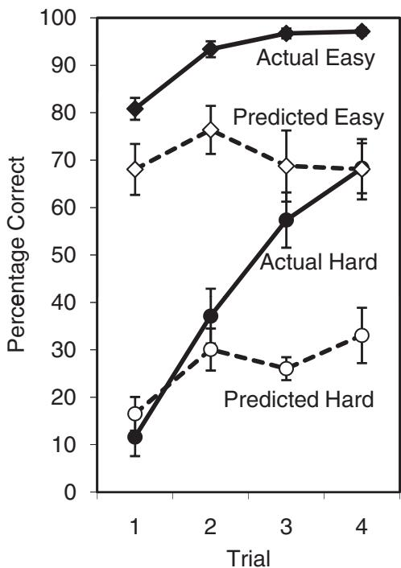  
Figure 1. Actual and predicted recall in Experiment 1. Participants completed between one and four study and test cycles. They were asked, during the first study trial on each item, to predict their accuracy on their final test (Test 1, 2, 3, or 4, between participants). Half of the items were easy and half were hard. Error bars represent 1 standard error of the mean.

# Experiment 2

Experiment 2 was similar to Experiment 1, with two important exceptions. First, instead of alternating study and test trials, participants studied between 1 and 4 times and then took a single test, again on a between- participants basis. We expected that removing the intervening tests might make the manipulation of the number of study trials more salient than it was in Experiment 1. The second change was that after the participants took the test they were asked to complete a second phase of the experiment in which, after being asked to imagine that they would participate in the experiment again with a new set of items, the participants were asked to predict the number of items they would remember after studying either 1 or 4 times.

# Method

Participants, materials, and design. The participants were 40 UCLA students who participated for course credit. The design was a  $2 \times 4$  mixed design: item difficulty (easy vs. difficult) and number of study and test cycles (1, 2, 3, 4) were manipulated within- and between- participants, respectively.

Procedure. The basic procedure was similar to the procedure used in Experiment 1: Participants studied and were tested on a list of 24 word pairs, and they made a prediction about their future test performance during the first study trial for each studied pair. The procedure differed, however, in that there were no intervening tests before the final test. Thus, each participant studied a list of words either 1, 2, 3, or 4 times and then took a single test (i.e., ST, SST, SSST, or SSSST). Again, participants had to respond correctly to the following sentence before the experiment began: "Complete this sentence: The number of times I will get to study each pair before I take the test is ______."

Immediately after completing the test, participants were given a sheet of paper that described the experiment that they had just completed, except that the sheet showed—as sample stimuli—24 word pairs that were not used in the first phase of Experiment 2. Participants were asked to make an aggregate prediction—that is, a prediction about a group of items, rather than a single item—regarding those 24 word pairs. They were asked to imagine that they were going to participate in the experiment described on the sheet and to make a POI, on a between- participants basis, for a test that would occur either after one study trial or after four study trials. Thus, the design for the second phase of the experiment was a  $4 \times 2$  between- participants design: original condition (ST, SST, SSST, SSSST) and Phase 2 condition (ST, SSSST) both were manipulated between- participants.

# Results and Discussion

Phase 1. As shown in the left panel of Figure 2, actual recall increased with the number of study trials,  $F(3,36) = 6.25$ $p < .01$ $\eta_p^2 = .34$  and decreased with item difficulty,  $F(1,36) = 500.63$

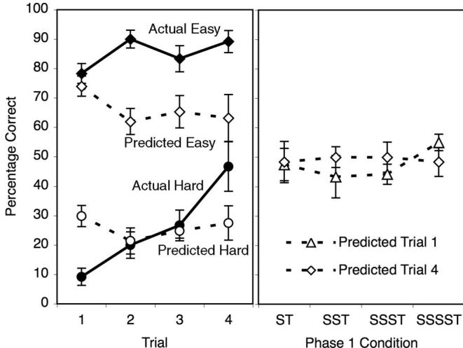  
Figure 2. In Experiment 2, actual and predicted recall in Phase 1 (left panel) and predicted recall in Phase 2 (right panel). During Phase 1 (left panel), participants completed 1, 2, 3, or 4 study trials per item (between participants) followed by a test trial. They were asked, during the first study trial on each item, to predict their accuracy on the test. Half of the items were easy, and half were hard. During Phase 2 (right panel), participants made aggregate predictions—that is, predictions of how many items they would recall on a 0–24 scale—assuming they would do the experiment again with new items. The data in the right panel are plotted as a function of the condition to which the participant was assigned during Phase 1 (abscissa) and the trial (1 or 4) for which he or she made predictions for during Phase 2. Error bars represent 1 standard error of the mean.  $\mathbf{S} =$  study;  $\mathrm{T} =$  test.

$p < .0001$ $\eta_p^2 = .93$  . There was also an interaction between item difficulty and number of study trials,  $F(3,36) = 5.88$ $p < .01$ $\eta_p^2 = .33$  , apparently because accuracy on easy items was near the ceiling after the first trial. Predicted recall, on the other hand, was significantly affected by item difficulty,  $F(1,36) = 287.04$ $p < .0001$ $\eta_p^2 = .89$  , but not by the number of study trials  $(F< 1)$  ,nor was there an interaction  $(F< 1)$

When actual and predicted recall were analyzed in a combined ANOVA, there was a significant interaction whereby actual recall increased over trials more than did predicted recall,  $F(3,36) = 5.89$ $p < .01$ $\eta_p^2 = .33$  . Averaged across item difficulty, actual recall went up 24 percentage points between test Trials 1 and 4, whereas predicted recall actually went down by 7 percentage points, a decrease that a planned comparison showed to be nonsignificant,  $t(18) = - 0.90$ $p = .38$  . Thus participants were sensitive to item difficulty, an experience- based cue, and were overconfident in their memories in their List- 1 POLs, but they were completely insensitive to the number of times they would be allowed to study—vastly underestimating, in effect, their own learning ability.

Phase 2. The right panel of Figure 2 shows plots of participants' Phase 2 predictions as a function of their Phase 1 condition (ST, SST, SSST, or SSSST) and whether they were predicting ST performance or SSSST performance. As the figure shows, during Phase 2, participants' aggregate predictions of Test 1 performance  $(M = 48\%)$  did not differ significantly from aggregate predictions of Test 4 performance  $(M = 49\%)$ $F(1,32) = 0.21$ $p = .65$  although, as noted above, actual recall increased by 24 percentage points. Thus, the experience of studying and being tested did not lead to accurate POLs. The condition to which a participant had been assigned in Phase 1 did not significantly affect the predictions, nor was there an interaction  $(F_{\mathrm{S}}< 1)$  .It is particularly surprising that participants who were allowed to study four times before being tested did not predict that better performance would result from four study trials than from one. The participants in Experiment 2 were not tested repeatedly, however, and as we elaborate below (see Experiment 6), being tested repeatedly during study might have made them more aware of the amount they were learning.

# Discussion of Experiments 1 and 2

In Experiments 1 and 2, participants were asked to predict, on a between- participants basis, how they would do on a cued- recall test after studying either 1, 2, 3, or 4 times. Actual recall increased significantly between Test 1 and Test 4 in both experiments (by an average of 33 percentage points), but despite our expectations, predicted recall did not increase significantly in either experiment (the average increase was 3 percentage points). These results reflect a stability bias in human memory: Participants predicted little difference between their current memory state and their future memory state, regardless of the amount of studying that would be allowed in the future. Participants were highly sensitive to item difficulty, an intrinsic cue, but in support of the distinction between theory- based metacognitive judgments and experience- based metacognitive judgments, they were not sensitive to the amount that they would be allowed to study, an extrinsic cue.

# Experiments 3 and 4

Experiments 3 and 4 were aggregate- judgment versions of Experiments 1 and 2—that is, after reading descriptions of either Experiment 1 or Experiment 2, participants were asked to predict how many of the 24 studied items they would remember were they to participate in the experiment. Because aggregate judgments are not made about individual items, we predicted that item difficulty, an intrinsic cue, would exert less control than it did in Experiments 1 and 2. We expected that being released from the control of an intrinsic cue might allow an extrinsic cue, the number of study opportunities, to exert more control. Consistent with that interpretation, aggregate judgments have been shown to be less subject to overconfidence than are item- by- item judgments (Griffin & Tversky, 1992; Koriat et al., 2002; Mazzoni & Nelson, 1995). In addition, participants did not experience learning the items when making aggregate judgments, so we expected them to rely less on the experienced- based processes that seemed dominant in the previous experiments and to rely more on theory- based predictions instead. For these reasons, we expected participants might be less subject to underconfidence in learning when making aggregate judgments.

# Experiment 3

# Method

Experiment 3 was an aggregate- judgment version of Experiment 1. Thirty- two UCLA students were asked to read a description of Experiment 1. The description included the 24 word pairs drawn

from the same pool as the words that were presented in Experiment 1. Participants were asked to imagine participating in the described experiment and to make a single aggregate judgment of how they thought they would do on the final test. One of the four conditions was described to each participant, on a between- participants basis, and thus the final test was, depending on the participant's condition, Test 1, 2, 3, or 4 (i.e., ST, STST, STSTST, or STSTSTST).

# Results

Predicted learning was not affected by the number of study and test cycles,  $F(3,28) = 0.41$ $p = .75$  (see the left panel in Figure 3). The predictions increased by 3 percentage points between Test 1  $M = 54\%$ $SD = 16$  and Test 4  $M = 57\%$ $SD = 19$  a difference that planned comparison showed to be nonsignificant,  $t(14) = 2.60$ $p = .77$

# Experiment 4

# Method

Thirty- two UCLA students were asked to read a description of Experiment 2. The description included 24 word pairs drawn from the same pool as the words that were presented in Experiment 2. Participants were asked to make a single aggregate judgment of how they would do on the final test if they were to be a participant in an identical experiment with different word pairs. Each participant was assigned to one of the four conditions (i.e., ST, SST, SSST, or SSSST).

# Results

Aggregate POLs did not vary as a function of the number of times a participant was told he or she would be allowed to study,  $F(3,28) = 0.23$ $p = .87$  (see the right panel in Figure 3). A planned comparison showed no significant difference between the predictions for the ST condition and the SSSST condition, which had identical means  $(62.5\%)$ $t(14) = 0.0$

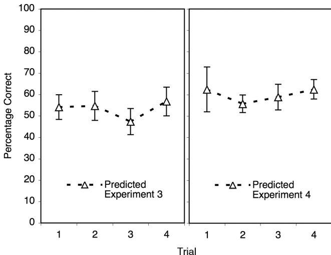  
Figure 3. Predicted recall in Experiments 3 (left panel) and 4 (right panel). Participants were asked to imagine participating in Experiments 1 and 2, respectively. They made predictions for a test that would occur following 1, 2, 3, or 4 study and test cycles (Experiment 3) or following 1, 2, 3, or 4 study cycles (Experiment 4) on a between-participants basis. Error bars represent 1 standard error of the mean.

# Discussion of Experiments 3 and 4

In Experiments 3 and 4, participants were asked to make aggregate predictions, on a between- participants basis, of how many items they would remember if they were to participate in one of the conditions of Experiments 1 and 2, respectively. The predictions were not sensitive to the number of study opportunities in either experiment, despite our expectation that aggregate judgments would be less influenced by differences between items than were the item- by- item predictions made in Experiments 1 and 2.

# Experiments 5 and 6

In Experiments 1- 4, we found that when asked to make predictions for an upcoming test, participants did not act as though more studying would lead to more learning, at least in a between- participants design. In Experiments 5 and 6, we made the study manipulation more salient. Participants were asked to make predictions on a within- participant basis. They were not asked to make multiple predictions for a given item (but see Experiments 9 and 10); instead, for each item, they were asked to make a prediction for one of the four tests. The predicted- for test was selected randomly on each trial (see Figure 4). This procedure made the manipulation of study opportunities unmistakably salient. Under similar within- participant conditions—in the context of predicting forgetting, rather than learning—Koriat et al.'s (2004) participants accurately predicted that they would forget with time.

Experiment 5 was similar to Experiment 1—in which the conditions were ST, STST, STSTST, and STSTSTST—except that the predictions were made on a within- participant basis. Experiment 6 was similar to Experiment 5, but the materials were word pairs whose difficulty was relatively homogeneous, which we thought would make item differences less salient, giving more prominence to the study manipulation and thereby increasing prediction accuracy. In Experiment 6, we also asked participants, after they had completed the test, to imagine doing the experiment again with a new set of word pairs and to predict how they would do on either Test 1 or Test 4.

# Experiment 5

# Method

Participants, materials, and design. The participants were 40 UCLA students who participated for course credit. The materials were taken from Experiment 1. The design was a  $2 \times 4$  within- participants design: Item difficulty (easy vs. difficult) and number of study and test cycles (1, 2, 3, 4) were manipulated within- participants.

Procedure. The procedure was similar to the procedure used in Experiment 1: Participants studied and were tested on a list of 24 word pairs, and during the first study trial on each pair, participants made a prediction of their ability to recall that pair on a subsequent test. Test trials intervened between study trials, as in Experiment 1.

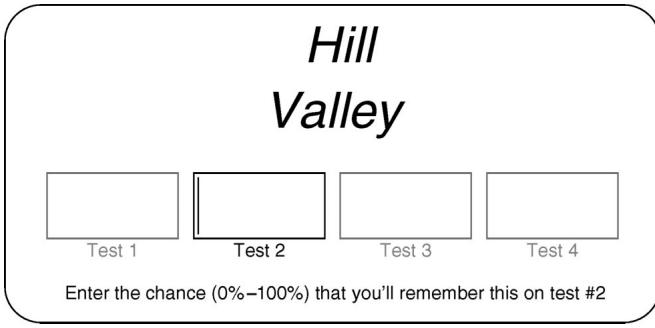  
Figure 4. Screen display during prediction trials in Experiments 5, 6, 7, and 8. Four boxes were displayed to make the manipulation of study and test cycles unambiguous. When the participant was asked to make a prediction for Test 2, as in this example, the Test 2 box was highlighted and contained a blinking cursor; typed characters appeared in the Test 2 box; and the test number was identified in the text below the boxes. In Experiment 7, the word remember was replaced with forget.

The procedure differed from Experiment 1 in one important way: Each participant made predictions for Tests 1, 2, 3, and 4 on a within- participant basis. Six of the 24 items were assigned to each of the four prediction conditions. We took pains to make the manipulation of study opportunities very obvious: When prompting a participant to make a prediction, the computer screen displayed four answer boxes that were labeled Test 1, Test 2, Test 3, and Test 4 (see Figure 4). If, for example, the current item had been randomly assigned to the Test 3 condition, a blinking cursor was placed in the answer box labeled Test 3, the Test 3 label was made bright orange, and a message on the screen read, "Enter the chance  $(0\% - 100\%)$  that you'll remember this on Test 3. " The procedure was also explained in detail in the instructions, and moreover, participants were only included in the analyses if they indicated on a postexperimental questionnaire that they had understood the directions and followed them correctly. In sum, we believe that during the predictions, the study manipulation was unmistakably salient.

# Results and Discussion

As shown in Figure 5, actual recall increased with the number of study trials,  $F(3,117) = 353.43$ $p < .0001$ $\eta_p^2 = .90$  and with item difficulty,  $F(1,39) = 381.62$ $p < .0001$ $\eta_p^2 = .91$  . There was also a significant interaction of pair type with trial, which appears to reflect a ceiling effect for easy items:  $F(3,117) = 62.00$ $p < .0001$ $\eta_p^2 = .61$

Predicted recall was also significantly affected by the number of study trials,  $F(3,117) = 4.82$ $p < .01$ $\eta_p^2 = .11$  as well as by item difficulty,  $F(1,39) = 343.95$ $p < .0001$ $\eta_p^2 = .90$  but the interaction was not significant,  $F(3,117) = 1.59$ $p = .20$  .The increase in actual recall across trials, however, was significantly larger than the increase in predicted recall across trials,  $F(3,117) = 59.23$ $p < .0001$ $\eta_p^2 = .60$  .Averaged across item difficulty, actual recall increased by 43 percentage points between study Trials 1 and 4, whereas predicted recall increased by 8 percentage points. As in the previous experiments, participants were overconfident in their current memories when predicting their performance on the first test but underconfident in their learning ability when predicting their performance on subsequent tests.

# Experiment 6

Predictions of learning increased only slightly, if significantly, across study trials in Experiment 5. The materials in Experiment 5, which were a mix of easy and difficult word pairs, varied with respect to item difficulty, an intrinsic cue that has been shown to influence metacognitive judgments more than do extrinsic cues, such as the number of study trials (Koriat, 1997; Koriat et al., 2004). We hypothesized that in the previous experiments, item difficulty may have been a strong cue that overshadowed the manipulation of study and test opportunities. In Experiment 6, we used a relatively homogeneous set of difficult word pairs. As in Experiment 2, we also asked participants, after they had completed the final test, how they thought they would do if they did the experiment again with a new set of items.

# Method

The procedures of Experiments 5 and 6, which were very similar (see Figure 4), differed only with respect to the materials. The materials in Experiment 6 were 24 homogeneously difficult, unrelated word pairs (e.g., causality- adversity; misconception- pacifism; see Appendix). They were randomly selected from the same pool of pairs as were the difficult pairs in Experiments 1- 5.

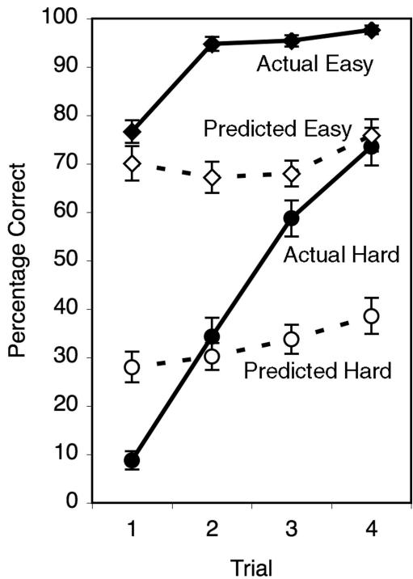  
Figure 5. Actual and predicted recall in Experiment 5. Participants completed four study and test cycles. They were asked, during the first study trial on each item, to predict their accuracy on Test 1, 2, 3, or 4. The test for which the participant made the prediction was assigned randomly on a within-participant basis. Half of the items were easy, and half were hard. Error bars represent 1 standard error of the mean.

The participants in Experiment 6 were 20 UCLA students who participated for course credit.

The participants in Experiment 6 were 20 UCLA students who participated for course credit.Immediately after completing the test, participants completed a second phase of Experiment 6. They were given a sheet of paper that described the experiment that they had just completed and were asked to imagine that they were going to do the experiment again with a new set of items. They were then asked, on a between- participants basis, to predict the number of items they would answer correctly on either Test 1 or Test 4. Because the study manipulation was within- participants during the first phase of the experiment, the design of the second phase was a between- participants design with two between- participant conditions: Participants were asked to predict for Test 1 or Test 4.

# Results and Discussion

Phase 1. As shown in the left panel of Figure 6, actual and predicted performance replicated the pattern for difficult items in Experiment 5, but predicted recall did not increase significantly across study trials,  $F(3,57) = 0.90$ $p = .45$  .Actual recall increased significantly across study trials,  $F(3,57) = 80.29$ $p<$  .0001,  $\eta_p^2 = .81$  , and the increase in actual recall between Trials 1 and 4  $(53\%)$  was greater than the nonsignificant increase in predicted recall  $(3\%)$ $F(3,57) = 51.88$ $p < .0001$ $\eta_p^2 = .73$  .The results of Experiment 6 did not, therefore, replicate the significant increase in predicted performance across study trials obtained in Experiment 5- even though making the pairs more homogeneous in difficulty seemed, in advance, to be a way of making study opportunities more salient. Again, participants were overconfident in their initial learning but were either undercoefficient in or un mindful of their ability to learn from subsequent study opportunities.

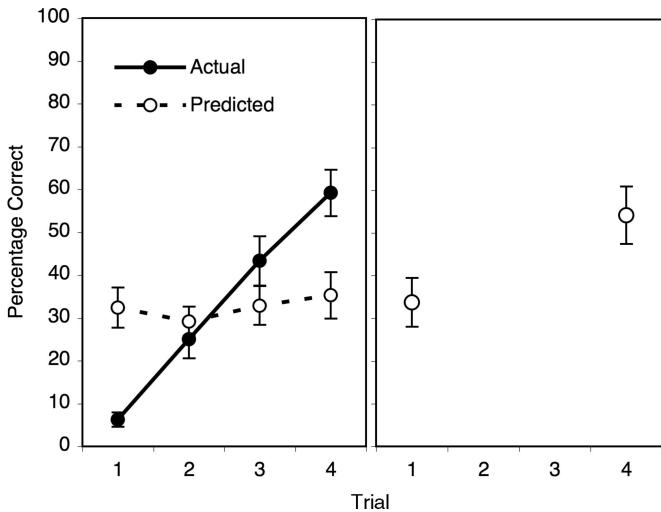  
Figure 6. In Experiment 6, actual and predicted recall in Phase 1 (left panel) and predicted recall in Phase 2 (right panel). During Phase 1 (left panel), participants completed four study and test cycles. They were asked, during the first study trial on each item, to predict their accuracy on Test 1, 2, 3, or 4. The test for which the participant made the prediction was assigned randomly on a within-participant basis. During Phase 2 (right panel), participants made aggregate predictions—that is, predictions of how many items they would recall on a 0–24 scale—assuming they would do the experiment again with new items, given either 1 or 4 study and test trials (between participants). Error bars represent 1 standard error of the mean.

Phase 2. As shown in the right panel of Figure 6, during Phase 2, participants' aggregate predicted recall increased by 20 percentage points between Test 1  $M = 34\%$  and Test 4  $M = 54\%$ $t(18) = 2.21$ $p < .05$ $d = .99$  .This increase was large and significant, although it was less than half of the 53 percentage points by which actual recall increased during Phase 1. Thus, after experiencing multiple study opportunities and tests, participants predicted better recall after four study and test trials than after one study and test trial, but their predictions greatly underestimated their actual learning.

# Discussion of Experiments 5 and 6

In Experiments 5 and 6, participants were asked to predict, on a within- participants basis, how they would do on a cued- recall test after studying either 1, 2, 3, or 4 times. We expected the within- participants manipulation to make the number of study opportunities salient and, therefore, make people predict that they would learn over time. Such a finding would have replicated Koriat et al.'s (2004) finding that people predict they will forget when the retention interval is manipulated within- participants. Contrary to our expectations, however, our participants predicted that they would learn very little by studying. Although participants predicted a significant, if small increase in learning across trials in Experiment 5, they did not predict a significant increase in Experiment 6. Once again, these results are consistent with a stability bias in human memory—that is, participants acted as though their memories would not change in the future, regardless of how much they would be allowed to study.

In Experiment 6, as in Experiment 2, participants were asked, on a between- participants basis, to make aggregate memory predictions for a hypothetical experiment immediately after completing an identical actual experiment. At issue was whether people learn from experience that studying results in learning—that is, would the participants' experience during the initial experiment, in which they learned and then took a test, lead participants to make accurate aggregate predictions. When the initial experiment only involved one test (Experiment 2), the subsequent predictions of performance on Test 1 and Test 4 were equivalent; when the initial experiment involved four study and test cycles (Experiment 6), participants predicted that they would learn by studying, although they underestimated their learning ability. Thus, being tested during the initial experiment seems to have been a critical factor in allowing participants to recognize the benefits of studying and being tested. In both experiments, participants were overconfident in their memory abilities and underconfident in their learning ability.

In Experiment 6, when participants were asked to imagine that they were going to participate in the experiment a second time, they underestimated the amount they would learn by more than half, despite direct evidence derived from their own performance just minutes earlier of how much they could actually learn.

# Experiments 7 and 8

# Experiment 7

Experiment 7 and 8Experiment 7Experiment 7 differed from the first phase of Experiment 6 in only one respect: Participants in Experiment 7 were asked to

predict their chance of forgetting each item on the final test instead of their chance of remembering that item (see Figure 4). We expected that asking participants about forgetting might make them mindful of the ways their memories change, including the fact that studying results in a resistance to forgetting and, thereby, make them more sensitive to the study manipulation. Koriat et al. (2004) found that participants, on a between- participants basis, did predict forgetting—though not to the extent of actual forgetting—when they were asked to predict forgetting rather than remembering. They concluded that making the concept of forgetting salient, by asking about forgetting, activated participants' knowledge that forgetting happens over time. Although we did not manipulate retention interval—or by extension forgetting—we reasoned that thinking about forgetting might nonetheless make participants think about external influences on memory, including the positive effect of studying on learning.

# Method

Participants in Experiment 7 were asked, in a procedure otherwise identical to the procedure used in Experiment 6, to predict their chance of forgetting each item on the final test. For example, if an item was assigned to the Test 2 condition, the instructions asked the participant to "Enter the chance  $(0\% - 100\%)$  that you'll forget this on Test 2. " The instructions emphasized that participants were being asked to predict forgetting, and again, only participants who reported that they understood the directions and followed them correctly were included in the analyses. The participants were 25 UCLA students who participated for course credit.

# Results and Discussion

Predicted recall accuracy was calculated by subtracting predicted forgetting from 100. As Figure 7 shows, actual recall increased significantly across study trials,  $F(3,72) = 65.01$ $p < .0001$ $\eta_p^2 = .73$  . Predicted recall did not increase significantly across study trials,  $F(3,72) = 0.15,p = .93$  . The increase in actual recall was greater than the increase in predicted recall,  $F(3,72) =$  34.08,  $p < .0001$ $\eta_p^2 = .59$  . Actual recall went up 49 percentage points between study Trials 1 and 4, whereas predicted recall went up by a nonsignificant 2 percentage points. Thus, once again, participants were overconfident in their memories but underconfident in, or unmindful of, their ability to learn.

Combined analysis. Combining Experiments 5, 6, and 7, actual recall increased by an average of 47 percentage points between Trials 1 and 4; predicted recall went up by 5 percentage points, an increase that a planned comparison showed to be marginally significant,  $t(84) = 1.90$ $p = .06$ $d = .21$  . Despite their sensitivity to item difficulty, which is an intrinsic cue, and their overconfidence in their memories on trial one, participants demonstrated a stability bias in human memory—that is, a combination of underconfidence in, or heedlessness to, their potential for future learning.

Framing of predictions. Experiments 6 and 7, which were identical except for the framing of the prediction, provide an opportunity to examine the effect of framing on predictions of learning. Framing the predictions in terms of forgetting, in Experiment 7, appears to have globally increased participants' predic tions. Averaged across tests, actual recall scarcely differed between Experiment 6 and Experiment 7  $33\%$  and  $36\%$  correct, respectively), but there was a pronounced difference in predicted recall  $M_s = 33\%$  and  $46\%$  correct, respectively). When the two experiments were combined, the interaction between experiment 6 or 7) and type of recall actual or predicted) did not reach significance,  $F(1,43) = 1.89$ $p = .18$  , but a separate analysis of predicted recall demonstrated a significant effect of experiment,  $F(1,43) = 6.78$ $p < .05$ $\eta_p^2 = .14$

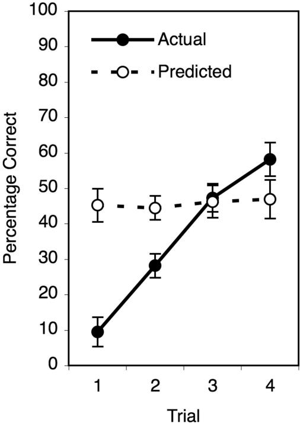  
Figure 7. Actual and predicted recall in Experiment 7. Participants completed four study and test cycles. They were asked, during the first study trial on each item, to predict their probability of forgetting on Test 1, 2, 3, or 4. The test for which the participant made the prediction was assigned randomly on a within-participant basis. Error bars represent 1 standard error of the mean.

Additional evidence that making predictions increased when they were framed in terms of forgetting comes from a curious and unexpected observation. Predictions of learning made about difficult items were often quite accurate on Test 2. This pattern emerged in Experiments 2, 5, and 6 and, to a lesser degree, in Experiment 1. (It also emerged in Experiments 9 and 12. ) It is unclear what led to this outcome—we presume participants' overconfidence in their current memory states was cancelled out by their underconfidence in their learning ability—but the consistency of the results makes Experiment 7 stand out. Participants in Experiment 7 clearly overestimated their Test 2 performance, indicating again that framing the prediction in terms of forgetting increased predictions. (The only other experiment that could have shown the pattern but did not was Experiment 8, for reasons that become clear below.)

It is unclear why making predictions in terms of forgetting rather than learning increased POLs; based on previous research, one might expect a question framed in terms of forgetting to make people more conservative, not more confident (Finn, 2008; Koriat, Lichtenstein, & Fischhoff, 1980).

# Experiment 8

Experiment 8In Experiment 8, we warned participants explicitly not to underestimate how much they could learn by studying. The goal, in light of the previous experiments, was to find out what it would take to make people predict that they would learn by studying. A second goal in Experiment 8, which became relevant because of the striking lack of accurate predictions across the first seven experiments, was to address the concern that some artifact in our procedure or materials prevented participants from accurately predicting that they would learn from studying.

# Method

The procedure of Experiment 8 was the same as the procedure in Experiment 6- that is, participants made predictions about four tests on a within- participants basis (see Figure 4), and the materials were homogeneously difficult word pairs. In Experiment 8, the following instruction was inserted into the instructions before the experiment began,

In this type of experiment, most people don't appreciate how much better they will do on Test 4 than Test 1. While you make your  $0\% - 100\%$  ratings, keep in mind that your memory will improveprobably more than you think on each test.

The participants in Experiment 8 were 20 UCLA students who participated for course credit.

# Results and Discussion

As Figure 8 shows, actual recall increased significantly across test trials,  $F(3,57) = 57.77$ $p < .0001$ $\eta_p^2 = .75$  . Predicted recall also increased significantly across trials, unlike in most of the previous experiments,  $F(3,57) = 9.03$ $p < .0001$ $\eta_p^2 = .32$  .When predicted and actual accuracy were compared, there was no overall difference between predicted performance and actual performance,  $F(1,19) = 0.57$ $p = .46$  , but there was a significant interaction between test number and recall measure (actual or predicted),  $F(3$ $57) = 18.14$ $p < .0001$ $\eta_p^2 = .49$  , indicating that participants underestimated the amount they could learn by studying- - between Tests 1 and 4, actual recall increased by 48 percentage points, whereas predicted recall increased by 15 percentage points- despite participants being warned not to do so.

The results of Experiment 8 suggest that given heavy- handed instructions, the stability bias can be attenuated. Perhaps more striking, though, is the extent to which the participants still underestimated the amount they would learn. The results also put to rest the concern that some artifact in our materials or procedure prevented participants from predicting learning.

# Experiments 9 and 10

The results of the previous experiments led us to take up a question that seemed obvious initially: Do people believe they learn by studying? To answer this question, we used a task that essentially amounted to asking participants directly how much they thought they could learn by studying. In Experiments 9 and 10, participants were asked to make within- item predictions- that is, during the first study trial, participants were asked to make two predictions for each pair. In Experiment 9, the predictions were for

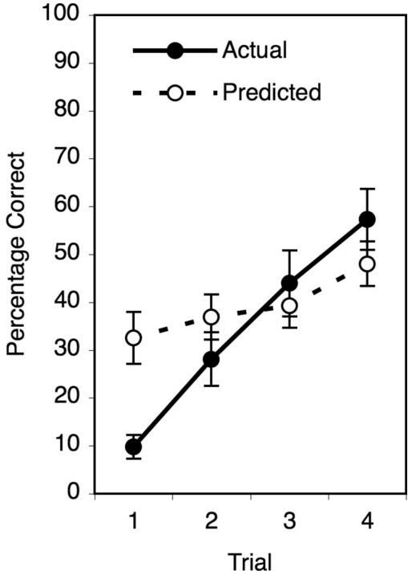  
Figure 8. Actual and predicted recall in Experiment 8. Participants completed four study and test cycles. They were asked, during the first study trial on each item, to predict their accuracy on Test 1, 2, 3, or 4. The test for which the participant made the prediction was assigned randomly on a within-participant basis. Before beginning the experiment, participants were given the following warning: "While you make your  $0\% -100\%$  ratings, keep in mind that your memory will improve—probably more than you think—on each test." Error bars represent 1 standard error of the mean.

Test 1 and Test 2; in Experiment 10, the predictions were for Test 1 and Test 4. This task allowed us to verify that the participants did indeed believe that studying results in learning and moreover that more studying results in more learning.

Asking participants to make predictions for two tests that were identical aside from the study manipulation created a demand characteristic that virtually forced participants to predict that their performance would improve with each successive test (which was also the case in the experiment by Coyne, 1985, discussed earlier). The important question was the degree to which their POLs tracked actual learning.

# Experiment 9

# Method

Experiment 9MethodThe participants were 25 UCLA students who participated for course credit. The procedure was similar to the procedure used in Experiment 6—participants completed four study and test cycles with the homogeneously difficult materials used in Experiments 6, 7, and 8. During the first study phase, however, participants were asked to make two predictions for each item, rather than just one: Two empty text boxes were shown on the computer screen after each pair was presented, and the participants were asked to type in the likelihood, from  $0\% - 100\%$ , that they would be able to recall the right- hand member of the pair when cued with the left- hand

member. The two boxes were labeled as corresponding to Test 1 and Test 2.

# Results

As the left panel in Figure 9 shows, actual recall increased by 23.2 percentage points between Test 1 and Test 2, a difference that was highly significant,  $t(24) = 8.32$ ,  $p < .0001$ ,  $d = 1.66$ , whereas predicted recall increased by 7 percentage points between Test 1 and Test 2,  $t(24) = 4.01$ ,  $p < .001$ ,  $d = .80$ . A two- way ANOVA revealed that the interaction of test number (one or two) and recall measure (actual or predicted) was also significant,  $F(1,24) = 27.92$ ,  $p < .0001$ ,  $\eta_p^2 = .54$ , reflecting the fact that actual recall increased much more than did predicted recall. Consistent with prior experiments, participants overestimated their first- test recall and underestimated their potential to learn.

# Experiment 10

# Method

Experiment 10 was identical to Experiment 9, with one exception: The participants were asked to predict their performance on Tests 1 and 4, not Tests 1 and 2. The participants were 25 UCLA students who participated for course credit.

# Results

As shown in the right panel of Figure 9, actual recall increased by 51 percentage points between Test 1 and Test 4, a difference that was significant,  $t(24) = 12.80$ ,  $p < .0001$ ,  $d = .256$ . Predicted recall increased by 20 percentage points between Test 1 and Test 4,  $t(24) = 4.94$ ,  $p < .0001$ ,  $d = .99$ . Again, there was a significant interaction whereby actual recall increased more than did predicted recall,  $F(1,24) = 41.90$ ,  $p < .0001$ ,  $\eta_p^2 = .66$ . As in Experiment 9, participants were overconfident in their List 1 predictions but underconfident in their learning ability—as measured by how much improvement they predicted from Test 1 to test 4.

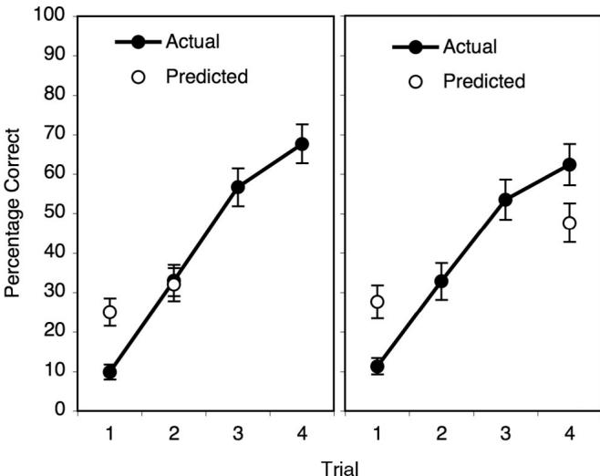  
Figure 9. Actual and predicted recall in Experiment 9 (left panel) and Experiment 10 (right panel). Participants completed four study and test cycles. They were asked, during the first study trial on each item, to predict their accuracy on both Test 1 and Test 2 (Experiment 9) or both Test 1 and Test 4 (Experiment 10). Error bars represent a standard error of the mean.

# Discussion of Experiments 9 and 10

The results of Experiments 9 and 10 exhibit a striking combination of overconfidence and underconfidence. The participants did demonstrate a belief that studying results in learning—and that more studying results in more learning—but they greatly overestimated their test 1 performance and greatly underestimated the value of additional ST cycles (see Figure 9). These outcomes occurred despite participants essentially being asked outright how much they would gain from additional ST cycles.

These findings are consistent with the findings—from Phase 2 of Experiment 6—that even when people's metacognitive beliefs are triggered overtly, they underestimate the amount they can learn. The participants seemed to hold the belief, corresponding to a stability bias in human memory, that learning is characterized by a kind of inertia: Given a current memory state, our participants acted as though their memories would remain relatively unchanged (although they did predict a small amount of learning), despite external influences and direct personal evidence to the contrary. We return to this point in the General Discussion.

# Experiments 11 and 12

# Experiment 11

The findings of the previous experiments, and those of Koriat et al. (2004), suggest that people act as though their memories will be the same in the future as they are now. Do they also act as though their memories now are the same as their memories were in the past? That is, does the stability bias apply to the past? If it does, then after completing four study and test trials, when their test performance has reached a high level, participants should overestimate their level of performance on Test 1—this is, they should rate it closer to their current memories than it actually was.

# Method

Participants completed four study and test cycles with the difficult materials used in Experiments 6–10. They were not asked to make predictions of future performance during the first study phase but instead were asked, after completing the fourth and final test, to make a retrospective judgment of how many items they had answered correctly on a previous test. There were two between- participant conditions: In the judge- Test 1 condition, participants were asked “Of the 24 word pairs, how many do you think you got right on Test 1 (i.e., the first test)? Please enter a number from 0 to 24. ” In the judge- Test 4 condition, the instruction were adjusted so that they asked about Test 4 (i.e., the last test). Twenty- six UCLA students, 13 in each condition, participated for course credit.

# Results and Discussion

As Figure 10 shows, judgments of prior recall were highly accurate in Experiment 11. We conducted an ANOVA in which actual performance was measured only on the test for which the participant made his or her judgment (i.e., based on the values in

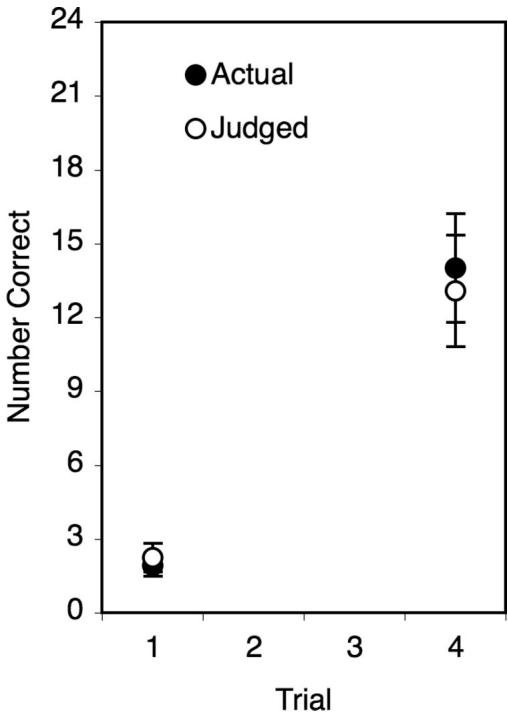  
Figure 10. Actual and predicted recall in Experiment 11. The number of items correct out of 24 is plotted on the ordinate. After they completed four study and test cycles, participants were asked to estimate how many items they had answered correctly on either Test 1 or Test 4. The test for which the participant made the prediction was assigned randomly on a between-participants basis. Actual performance was measured only on the test for which the participant made their judgment. Error bars represent 1 standard error of the mean.

Figure 10). There was a significant effect of trial,  $F(1,24) = 25.42, p < .0001, \eta_p^2 = .51$ , but there was no main effect of judged versus actual performance,  $F(1,24) = .74, p = .40, \eta_p^2 = .03$ , and the interaction between trial and judged versus actual performance was only marginally significant,  $F(1,24) = 2.97, p < .10, \eta_p^2 = .11$ . The marginal interaction, which indicates that the difference in actual performance between Trial 1 and Trial 4 was slightly larger than participants' judgments reflected, could be interpreted as consistent with a stability bias, but it could also be due to a tendency for judgments to regress toward  $50\%$ . The important point is that the participants' judgments were far more accurate in Experiment 11 than in any of the other experiments presented herein.

The results of Experiment 11, which demonstrate that people can judge accurately how much they were able to remember on a prior test even after remembering much more on subsequent tests, suggest that the stability bias may only apply to predictions of how one's memory will change in the future. It is, however, important to recognize that the predictions of future learning solicited in the prior experiments were hypothetical, whereas in Experiment 11, past recall could be estimated by recollecting the experience of succeeding and failing to recall actual word pairs—particularly given that participants received feedback on each test trial. In other situations, in which it is more difficult to estimate how well one did in the past—for example, if the judgments had been delayed until a week after participants completed the test, if feedback had not been provided, or if the task had required free recall of prose passages—it is possible a stability bias would emerge.

# Experiment 12

Experiments 1- 11 were not designed to examine the causes of the underconfidence with practice (UWP) effect—that is, the finding that people are often overconfident the first time they study and are tested on a set of word pairs but shift from overconfidence to underconfidence on subsequent study and test trials. Such effects, however, were present to a dramatic degree in our results, and Experiment 12 was designed to test an interpretation of the UWP effect suggested by the details of our findings.

A shift toward underconfidence, by definition, means that between trial  $i$  and trial  $i + 1$ , predicted accuracy increases less than actual accuracy. The current findings suggest that the reason for the shift to underconfidence is that people underestimate the amount they can learn by studying. This hypothesis is not new, or at least not entirely new. In the words of Koriat and Levy- Sadot (1999), "practice impaired calibration by increasing underconfidence. This impairment resulted from the tendency to discount the extrinsic cue of number of presentations" (p. 492).

Unlike the experiments described above, participants in Experiment 12 were asked to make predictions about their future test performance on every trial, as in a standard UWP experiment, rather than only on the first trial. Unlike a standard UWP experiment, however, participants were not asked to predict their performance on the immediately upcoming test. Instead, they were asked to predict their performance on the last test they were asked to complete, which, depending on the participant's condition, was either Test 1, Test 2, Test 3, or Test 4. Thus, for example, a participant in the second condition predicted how they would do on Test 2 during the first study phase and again during the second study phase. By asking for predictions of future learning, we were able to test the prediction that the UWP effect results from a failure to appreciate the benefits of studying.

# Method

The participants were 60 UCLA students, 15 in each of four conditions, who participated for course credit. The materials were the difficult word pairs that were used in Experiments 6- 11. Participants completed four study and test cycles. They were asked, on a between- participants basis, to make predictions about Test 1, 2, 3, or 4. Unlike the previous experiments, however, participants were asked to make predictions on each study trial prior to their target test, not just the first study trial; thus, for example, participants who were asked to predict their Test 2 performance made predictions of their Test 2 performance on Study Trial 1 and Study Trial 2, but not Study Trial 3 or Study Trial 4. As in the previous between- participants experiments, during the instructions, participants had to respond correctly to the following question before beginning the experiment: "Complete this sentence: When I make my  $0\% - 100\%$  rating, I will do it about test number ___"

# Results

Insensitivity to study. The four panels in Figure 11 display the predicted and actual performance of each of the four participant

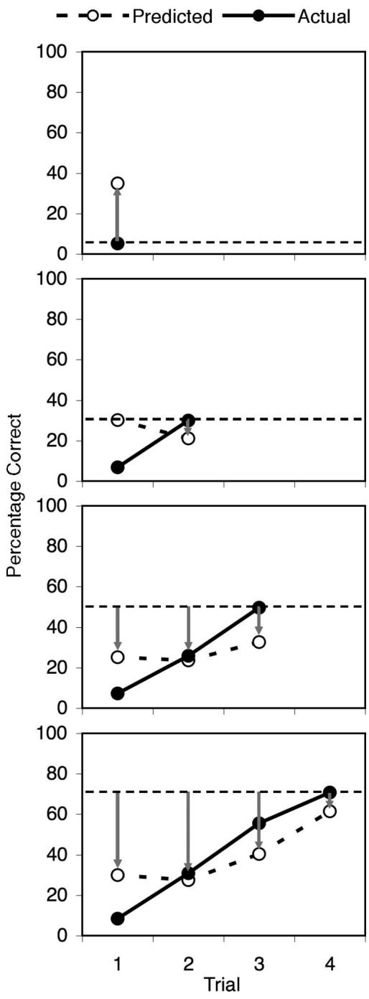  
Figure 11. Actual and predicted recall in Experiment 12. Participants completed 1, 2, 3, or 4 study and test cycles on a between-participants basis (Panels 1-4). They were asked, during every study cycle, to predict their accuracy on the final test. The dashed line represents perfect prediction calibration. Upward- and downward-facing arrows represent overconfidence and underconfidence, respectively.

groups in Experiment 12. In the figure, which includes plots of actual and predicted performance, the dashed line represents actual performance on the test for which participants made their predictions; therefore, perfectly calibrated predictions would fall on the dashed line. The arrows represent overconfidence (when pointing upward) or underconfidence (when pointing downward).

Perhaps the most striking feature of Figure 11 is the similarity across panels in both predicted and actual accuracy. For example, the ST group and the STSTSTST group predicted recall levels of  $35\%$  and  $30\%$ , respectively, during Study Trial 1, despite being asked to make predictions for different tests. By contrast, actual recall in the two groups, as measured on the test about which participants were asked to make their predictions, was  $5\%$  and  $71\%$ , respectively. The similarity in predictions suggests that participants were scarcely influenced by whether they were instructed to make predictions for Test 1, 2, 3, or 4.

UWP. Although the STSTSTST group was asked to predict their performance on Test 4, their responses appear to fit the standard UWP finding obtained when participants are asked to predict their performance on the upcoming test (e.g., to predict Test 1 performance on Trial 1, Test 2 performance on Trial 2, etc.): That is, their predictions were overconfident on Trial 1, calibrated on Trial 2, and underconfident on Trials 3 and 4. With respect to Test 4, however, participants' predictions were underconfident by 41, 43, 30, and 9 percentage points on Trials 1- 4, respectively (see arrows in Figure 11, bottom panel). In making predictions that were most underconfident on the first two trials, participants demonstrated a shift away from UWP, rather than toward UWP.

All groups made slightly lower predictions on Trial 2 than on Trial 1 (except the ST group, who did not make a prediction on Trial 2). This shift was consistent with the standard UWP effect, and it was reasonable (if inappropriate) for the STST group, given that group's overconfidence on List 1. It is, however, ironic that by adjusting downward, the STSTST and STSTSTST groups became even more underconfident on the second trial than they were on the first trial; for example, the STSTSTST group, after being 41 percentage points underconfident on Trial 1, adjusted the predictions so that they were 43 percentage points underconfident on Trial 2. It appears that our participants assumed their Test 2 performance would be similar to their Test 1 performance and, therefore, adjusted their predictions downward, all the while neglecting to consider the influence of the upcoming study and test trials.

Learning from experience. Participants in the STSTST and STSTSTST groups had an opportunity to learn about learning during the experiment. Although we did not explicitly tell them how many items they answered correctly at the end of each test, the results of Experiment 11 suggest that participants could report accurately how well they had done on previous tests. Thus, in Experiment 12, participants could have noticed that their recall rates had improved a great deal between Test 1 and Test 2, surmised that those rates would probably continue to improve on future trials, and adjusted their POLs on Trial 3 accordingly. They did not, however, appear to make such an adjustment. The STSTST group's actual performance increased by 19 percentage points between Test 1 and Test 2, but between Test 2 and Test 3 that group's predicted performance increased by 9 percentage points. Group 4's actual performance increased by 23 percentage points between Test 1 and Test 2, but between Test 2 and Test 3 that group's predicted performance—which, assuming a simple linear learning function, should have increased by 46 percentage points—increased by 13 percentage points. Moreover, Group 3 and Group 4 predicted similar increases in learning (9 and 13 percentage points, respectively), although Group 4 was expecting another study and test trial, and Group 3 was not. The reason the

predictions went up at all may be because the accuracy on the prior test had increased, not because of a belief that future studying results in learning. Thus it appears that neither group learned from experience, and in Experiment 12, like in Experiments 2 and 6, participants underestimated the amount they would learn by studying in the face of direct evidence of their own learning.

# Discussion of Experiment 12

Experiment 12 provided additional evidence of a stability bias in human memory- our participants did not take into account the effects of future study and test trials when making predictions about their learning, even in the face of direct personal evidence that such trials enhanced their learning. Moreover, Experiment 12 provided evidence that the UWP effect occurs, at least in part, because of an underappreciation of the benefit of studying.

The current findings support and expand on previous explanations of the UWP effect that have been put forward in the context of the cue- utilization framework (Koriat, 1997). People are thought to make judgments based on the items themselves during the first study trial, and then shift, on later trials, to making judgments based, at least in part, on how they did on the previous test (Finn & Metcalfe, 2007). In doing so, they shift from using intrinsic cues to using mnemonic cues (Koriat, 1997; Koriat et al., 2002). The amount people are allowed to study between the previous test and the upcoming test, however, is an additional, extrinsic cue, and as the current findings suggest, it is a cue to which people are surprisingly insensitive. Thus, the cause of the UWP effect may essentially be a stability bias: People base their predictions on their previous test performance and discount, or even ignore, the benefits of the studying and testing that have taken place, or will take place, between the previous test and future tests.

# General Discussion

Our findings suggest that people can be simultaneously overconfident in their memories and underconfident in their learning ability. Despite gains in actual learning that were often very large, our participants predicted that they would learn little or nothing as a result of future study opportunities and seemed to make predictions based on the current state of their memories. These predictions are evidence of a stability bias in human memory.

The present experiments suggest that people's metacognitive beliefs about studying are flawed in two fundamental ways. First, when asked (essentially outright) about the effects of studying, our participants underestimated the amount they would learn by studying (see Figure 9)—by more than  $50\%$  in the current experiments—even when warned not to do so (see Figure 8). This underestimation even occurred, in some cases, when they had already experienced large increases in their own test performance across previous test trials. Second, although people hold the metacognitive belief that studying results in learning, they did not apply that belief in our between- participants experiments (Figures 1, 2, and 3). Surprisingly—and unlike Koriat et al.'s (2004) findings—even when a within- participants experimental design was used to draw participants' attention to the number of study opportunities provided for each item, our participants again regularly failed to draw on their knowledge that studying aids learning (Figures 5, 6, and 7). When participants had experienced the change in their own performance across ST cycles, they did reliably predict that studying would enhance performance, but even in that case, they seriously underestimated the benefits of repeated study opportunities (Figure 6, right panel). Only when they were looking back at past changes in their memories, rather than predicting future changes in memory, did participants judge their memories accurately (see Figure 10).

# Predicting Changes in Memory

The current results suggest a distinction between two types of metacognitive judgment—namely, judgments made on the basis of one's current memory and judgments about the ways in which future events will change one's memory (see also Koriat et al., 2004). That the two types of judgment appear to differ in some fundamental ways is illustrated by the fact that participants in the current experiments were simultaneously overconfident in their current memory states (when predicting test 1 performance) and vastly underconfident in the amount their memories would change as a result of studying. Moreover, unlike predicting the effects of future study, prior research has illustrated that participants' JOLs do vary as a function of the amount of studying they have already done (e.g., Metcalfe & Finn, 2008).

There are reasons, of course, why the processes underlying JOLs should differ from the processes underlying predictions of future learning. JOLs can be made on two bases: (a) metacognitive beliefs about how memory works and (b) judgments of one's current memory state, which are influenced by factors such as the fluency with which an answer comes to mind (e.g., Benjamin et al., 1998; Schwartz et al., 1997). There is only one basis for predicting future memory: metacognitive beliefs. In the absence of metacognitive beliefs, neither the item itself nor one's memory of it is diagnostic of how one's memory will change in the future. Making an estimate of one's current memory strength plays a role, but only as a baseline from which memory will change depending on future events.

In the present experiments, however, it appears that participants made inaccurate predictions because they did not apply their metacognitive beliefs. Instead, they appear to have relied on standard JOL- type judgment processes, which led them to predict that they would do only as well on future tests as they anticipated doing on the upcoming test—that is, as well as their current memory state would allow. That is, they demonstrated a stability bias in human memory.

Participants' metacognitive misjudgments were very large in our experiments, even by the standards of metacognitive research—a characteristic they have in common with the results of Koriat et al. (2004).

# The Inaccuracy of Metacognitive Beliefs

Few metacognitive beliefs are more obvious than the beliefs that studying results in learning and the belief that forgetting happens over time. If people do not predict those outcomes, it is unlikely that they will predict other, subtler, effects on memory—and, as detailed in the introduction, they often do not. What our participants failed to do, in particular, was to act as though they believed that more studying results in more learning. Had we asked people how many words they would recall after studying a list zero, one,

or two times, they would have surely predicted that studying once was better than not studying at all, but it appears that people underappreciate the importance of amount of study.

The current results are consistent with a conjecture that people are prone, in various ways, to think of their memory as something like a computer's hard drive (or a tape recorder). That is, a computer does not form stronger memories by being exposed to the same information multiple times, nor does it forget over time. A computer either "knows" something or it does not. Unlike a human, a computer's memory is decidedly stable. To a surprising degree, the participants in the current experiments (see also Koriat et al., 2004) acted as though their memories worked roughly the same stable way. In reality, of course, human memory is a complex, cumulative process with characteristics very different from those of a computer's memory (Bjork, 1989) as the progressive increases in performance across tests in the current experiments demonstrated.

Even if people believe in the value of studying, they do not necessarily believe in the value of being tested. Tests enhance memory, but benefits of tests are uninuitive (e.g., Roediger & Karpicke, 2006a) and, in general, people tend to think of testing as a way of diagnosing memory, which it is, but not as a way of enhancing memory (Kornell & Bjork, 2007; Kornell & Son, 2009). In a number of the current experiments, study trials and test trials (with feedback) were interleaved together, meaning that any additional study trial was also accompanied by an additional test. Those test trials were clearly beneficial: Final recall in the STST- STST condition in Experiment 1  $(83\%)$  for example, exceeded final recall in the SSSST condition in Experiment 2  $(68\%)$ . Thus, a failure to appreciate the benefits of tests may have contributed to participants' underestimation of the value of additional study opportunities. It is important to note, though, that even in the absence of intervening tests, such as Experiment 2, our participants failed to realize the benefits of additional study.

# Forgetting Versus Remembering

The current findings with respect to predictions of learning resemble Koriat et al.'s (2004) findings with respect to predictions of forgetting, in that participants underestimated both their potential to forget and their potential to learn. Predictions about learning differed, however, from predictions about forgetting in two important ways. First, our participants failed to apply their theories of learning even when learning was made very salient, whereas Koriat et al.'s (2004) participants accessed their concept of forgetting when forgetting was made salient. Second, people's beliefs about learning appear to be less accurate than their beliefs about forgetting. We discuss each of these differences below.

The participants' failure to apply their metacognitive beliefs in the current experiments occurred in spite of a number of interventions designed to make the study manipulation salient. Foremost, we asked participants to make predictions for multiple different tests on a within- participant (but between- items) basis. Doing so resulted in significant predictions of forgetting in Koriat et al.'s (2004) research but did not reliably increase predictions of learning in the present research. In addition, we framed the predictions in terms of learning while manipulating learning—analogous to Koriat et al. (2004) framing participants' predictions in terms of forgetting while manipulating forgetting—but doing so did not increase our participants' tendency to access the concept that studying increases learning. We also tried to ensure that item difficulty did not overshadow the study manipulation by using to- be- learned materials that were relatively homogeneous with respect to difficulty, and we allowed participants to do a practice list before beginning all of the computerized experiments (and then only analyzed data from participants who understood the instructions). These interventions had a weak effect, at best, in terms of encouraging participants to apply the concept that studying increases learning.

When participants did apply their theories of learning, in Experiments 9 and 10 and during the second phase of Experiment 6—when we virtually asked them outright how much they would learn by studying—they underestimated their own learning ability by more than  $50\%$  in each instance. It is of course possible that this degree of inaccuracy is due, in part, to the to- be- learned materials. That is, it is possible that with less learnable materials, such as textbook passages, participants' learning rates would have been slower and their predictions of learning would have been closer to being accurate. It appears, however, that people's metacognitive beliefs about the impact of studying on learning are less accurate than are their beliefs about the impact of a retention interval on forgetting.

# Underconfidence in, Versus With, Practice

In light of the current findings, perhaps people are prone to UWP, at least in part, because of underconfidence in practice. The UWP effect refers to the finding that people are generally overconfident on the first study trial but shift to underconfidence thereafter (Koriat et al., 2002). Previous explanations have suggested that the UWP effect occurs because on Trial 2 (and beyond), people make predictions based on mnemonic cues such as their success on the previous test (Finn & Metcalfe, 2007). They become underconfident, the theory goes, because their memories improve between the previous test and the upcoming test—as a result of the previous test itself as well as the intervening study trial—but they fail to adjust their judgments upward to account for that learning. The current experiments, especially Experiment 12, support that conclusion. The participants in Experiment 12, for example, who were asked to predict their performance on Test 4, were not only radically underconfident, but they even adjusted their predictions downward on Trial 2 to match their relatively low Test 1 performance—which in turn, made their predictions even more underconfident on Trial 2 than they were on trial 1.

The common assumption that UWP reflects underconfidence in one's memory is obviously justified, in one sense, by the fact that the predictions are lower than actual performance. If, however, JOLs are broken down into two processes inherent in UWP predictions—estimating one's level of learning at the time of the last test and estimating the amount learning has changed since that test—it seems quite possible that people remain overconfident, or at least fairly well calibrated, with respect to their memories as they were at the time of the last test but become underconfident in the amount they have learned since then—that is, they fall victim to a stability bias in human memory. Thus, at a process level, we suggest that perhaps UWP reflects calibration or even overconfidence in one's memory as it was when last tested, coupled with underconfidence in one's ability to learn.

# The Plasticity of Memory

It is a fundamental feature of human psychology that people underestimate the importance of external influences on behaviorwhich our participants did by underestimating the value of studying. Our findings and the idea of a stability bias in human memory are reminiscent of the fundamental attribution error, a term coined by Lee Ross (1977) to refer to the assumption that others' actions reflect internal characteristics and not the control exerted by the environment. Although people ignore the situation when making attributions about others, they take it into account when making attributions about themselves (Jones & Nisbett, 1972). One way to avoid the fundamental attribution error is to take another's perspective, but perspective taking is another fundamentally difficult, nonautomatic task.

Perspective taking is a central problem in metacognition. One example in the domain of confidence judgments is the hindsight bias: When asked to predict what will happen in a hypothetical situation, a person who does not know the outcome might equivocate, but someone who already knows what happened will claim, in hindsight, that they knew it all along (Fischhoff, 1975).A related finding is that when people have been exposed to the answer to a problem (such as an anagram), they judge it to be easy, even when it would have seemed difficult without prior exposure Kelley & Jacoby,1996).In both cases,participants do not or cannot) take the perspective of one who does not know the answer- a situation that has been referred to as the "curse of knowledgeBirch & Bloom,2003).

The foresight bias (Koriat & Bjork, 2005) is a related finding: Even if people have been told that the conditions at the time of test will be quite different from the conditions at the time of study- in that the answer, present at study, will be absent and required at test- they seem largely unable to take the perspective of themselves taking the test later, and thus, they make predictions as though the two conditions will be much the same. It seems possible that if participants in the present experiments had imagined themselves taking the various tests- that is, taken their own perspective at a later time- they might have been more sensitive to the number of study trials and less subject to the stability bias.

The hindsight bias occurs because of a failure to estimate one's previous memory state (i.e., one's memory state before the answer was presented). In the present experiments, estimating one's previous memory state was the sole situation that led to highly accurate judgments. Such estimates could be made based on experience in the present experiments, however, which is not generally the case in experiments on the hindsight bias, nor was it the case when people were asked to predict future performance in the present experiments. Thus, although it appears that judgments about past memories may not be subject to a stability bias, it is also possible that such judgments would be susceptible to a stability bias in situations in which it is difficult to judge past memories based on experience.

# Practical Implications

A student's study decisions are guided by their beliefs about how learning works and by their ability to apply those beliefs appropriately. Students doing homework, for example, must constantly make decisions about what to study next, how much to study, and when to stop studying. These decisions all involve planning future study episodes. The importance of being able to estimate the potential benefits of future study episodes when planning future study episodes is obvious. The difficulty of such decisions is illustrated by a study (Kornell & Bjork, 2008b) in which participants had to decide whether they wanted to leave a given flashcard in a stack of flashcards so that they could encounter it in the future, or drop it from future study and test trials. Being in control of the decision had a negative impact on participants' learning- that is, they did better when they were not allowed to drop any cards- because they underestimated the value of future study and test trials, especially on difficult items, and therefore dropped them too quickly.

It is reasonable to assume that underconfidence can have a positive effect on studying, because it will make people study more (Finn & Metcalfe, 2007). Underconfidence in one's ability to learn may have the opposite effect, however. Every student believes that studying is useful, or they would not study. But if a student fails to apply that belief, which the participants in our experiments did quite stubbornly, they may choose not to study because of a belief that doing so will have little effect on advancing them toward their goals.

To the extent that the present findings point to a prevailing tendency for students to underestimate their potential to learn, they have implications for a serious problem: the prevalence of students dropping out of school. If a student who is struggling to pass a class surveys the amount she does not know, she may decide that it is hopeless and give up because she feels that there is too much to learn- but if she knew that her ability to learn is much greater than she realizes, she might not give up. Academic difficulties are only one of the many reasons students drop out, of course, and our findings, though suggestive, are far from proof that underestimating learning causes students to drop out (nor do they suggest a cure for the problem).

Our results are all the more surprising because there seems little doubt that our participants included people who have a strong belief in their ability to learn. According to Carol Dweck and colleagues (see, e.g., Dweck & Legget, 1988), students who believe that intelligence is malleable (incremental theorists) set learning goals and are able to overcome setbacks and achieve success, whereas students who believe intelligence is fixed (entity theorists) set performance goals and are vulnerable to a helpless response in the face of adversity. The finding that people undervalue, or place no value on, studying corresponds to the entity orientation, although the fact that all participants subscribed to the metacognitive belief that studying leads to learning corresponds to the incremental orientation.

It is always important to point out that laboratory research does not necessarily translate to classrooms or other real- life situations see Daniel & Poole,2009).More research is needed to explore how general the stability bias is and whether it occurs in other content domains, such as mitosis, gravity, and art history, and other modes of presentation, such as textbooks, novels, and lectures.

# Concluding Comment

Optimal learning requires that students- and all peoplemanage their own conditions of learning in an effective way,

which requires both that they understand the processes that support learning and that they monitor their learning accurately. An inaccurate mental model of how learning works will lead to counterproductive study decisions, and students whose model incorporates a stability bias—that is, an underestimation of their potential to learn and an overemphasis their current memory state—become susceptible not only to studying too little and giving up too quickly, but also to lowering, and/or failing to realize, their aspirations. Identifying our misconceptions about learning is a first step, but only a first step, toward remedying those misconceptions.

# References

Baddeley, A. D., & Longman, D. J. A. (1978). The influence of length and frequency of training session on the rate of learning to type. Ergonomics, 21, 627- 635.  Benjamin, A. S., Bjork, R. A., & Schwartz, B. L. (1998). The mismeasure of memory: When retrieval fluency is misleading as a metamnemonic index. Journal of Experimental Psychology: General, 127, 55- 68.  Bieman- Copland, S., & Charness, N. (1994). Memory knowledge and memory monitoring in adulthood. Psychological Aging, 9, 287- 302.  Birch, S. A. J., & Bloom, P. (2003). Children are cursed: An asymmetric bias in mental- state attribution. Psychological Science, 14, 283- 286.  Bjork, R. A. (1989). Retrieval inhibition as an adaptive mechanism in human memory. In H. L. Roediger & F. I. M. Craik (Eds.), Varieties of memory and consciousness: Essays in honor of Endel Tulving (pp. 309- 330). Hillsdale, NJ: Erlbaum.  Bjork, R. A. (1999). Assessing our own competence: Heuristics and illusions. In D. Gopher & A. Koriat (Eds.), Attention and performance XVII: Cognitive regulation of performance: Interaction of theory and application (pp. 435- 459). Cambridge, MA: MIT Press.  Coyne, A. C. (1985). Adult age, presentation time, and memory performance. Experimental Aging Research, 11, 147- 149.  Craik, F. I., & Lockhart, R. S. (1972). Levels of processing: A framework for memory research. Journal of Verbal Learning & Verbal Behavior, 11, 671- 684.  Craik, F. I., & Tulving, E. (1975). Depth of processing and the retention of words in episodic memory. Journal of Experimental Psychology: General, 104, 268- 294.  Daniel, D. B., & Poole, D. A. (2009). Learning for life: An ecological approach to pedagogical research. Perspectives on Psychological Science, 4, 91- 96.  Dunlosky, J., & Nelson, T. O. (1994). Does the sensitivity of judgments of learning (JOLs) to the effects of various study activities depend on when the JOLs occur? Journal of Memory and Language, 33, 545- 565.  Dweck, C. S., & Leggett, E. L. (1988). A Social Cognitive approach to motivation and personality. Psychological Review, 95, 256- 273.  Finn, B. (2008). Framing effects on metacognitive monitoring and control. Memory & Cognition, 36, 813- 821.  Finn, B., & Metcalfe, J. (2007). The role of memory for past test in the underconfidence with practice effect. Journal of Experimental Psychology: Learning, Memory, and Cognition, 35, 238- 244.  Fischhoff, B. (1975). Hindsight is not equal to foresight: The effects of outcome knowledge on judgment under uncertainty. Journal of Experimental Psychology: Human Perception and Performance, 1, 288- 299.  Fischhoff, B., Slovic, P., & Lichtenstein, S. (1977). Knowing with certainty: The appropriateness of extreme confidence. Journal of Experimental Psychology: Human Perception and Performance, 3, 552- 564.  Flavell, J. H. (1979). Metacognition and cognitive monitoring: A new area of cognitive- developmental inquiry. American Psychologist, 34, 906- 911.  Goldsmith, M., Koriat, A., & Weinberg- Eliezer, A. (2002). Strategic regulation of grain size memory reporting. Journal of Experimental Psychology: General, 131, 73- 95.

Griffin, D., & Tversky, A. (1992). The Weighing of evidence and the determinants of confidence. Cognitive Psychology, 24, 411- 435.  Jacoby, L., & Kelley, C. M. (1987). Unconscious influences of memory for a prior event. Personality and Social Psychology Bulletin, 13, 314- 336.  Jones, E. E., & Nisbett, R. E. (1972). The actor and the observer: Divergent perceptions of the causes of behavior. In E. E. Jones, D. E. Kanouse, H. H. Kelley, R. E. Nisbett, S. Vains, & B. Weiner (Eds.), Attribution: Perceiving the causes of behavior (pp. 79- 94). Morristown, NJ: General Learning Press.  Kelley, C. M., & Jacoby, L. L. (1996). Adult egocentrism: Subjective experience versus analytic bases for judgment. Journal of Memory & Language, 35, 157- 175.  Koriat, A. (1997). Monitoring one's own knowledge during study: A cue- utilization approach to judgments of learning. Journal of Experimental Psychology: General, 126, 349- 370.  Koriat, A., & Bjork, R. A. (2005). Illusions of competence in monitoring one's knowledge during study. Journal of Experimental Psychology: Learning, Memory, Cognition, 31, 187- 194.  Koriat, A., Bjork, R. A., Sheffer, L., & Bar, S. K. (2004). Predicting one's own forgetting: The role of experience- based and theory- based processes. Journal of Experimental Psychology: General, 133, 643- 656.  Koriat, A., & Levy- Sadot, R. (1999). Processes underlying metacognitive judgments: Information- based and experience- based monitoring of one's own knowledge. In S. Chaiken & Y. Trope (Eds.), Dual process theories in social psychology (pp. 483- 502). New York: Guilford Press.  Koriat, A., Lichtenstein, S., & Fischhoff, B. (1980). Reasons for confidence. Journal of Experimental Psychology: Human Learning and Memory, 6, 107- 118.  Koriat, A., Sheffer, L., & May- van, H. (2002). Comparing objective and subjective learning curves: Judgments of learning exhibit increased underconfidence with practice. Journal of Experimental Psychology: General, 131, 147- 162.  Kornell, N., & Bjork, R. A. (2007). The promise and perils of self- regulated study. Psychonomic Bulletin & Review, 14, 219- 224.  Kornell, N., & Bjork, R. A. (2008a). Learning concepts and categories: Is spacing the "enemy of induction"? Psychological Science, 19, 585- 592.  Kornell, N., & Bjork, R. A. (2008b). Optimizing self- regulated study: The benefits- and costs- of dropping flashcards. Memory, 16, 125- 136.  Kornell, N., & Metcalfe, J. (2006). Study efficacy and the region of proximal learning framework. Journal of Experimental Psychology: Learning, Memory, and Cognition, 32, 609- 622.  Kornell, N., & Son, L. K. (2009). Learners' choices and beliefs about self- testing. Memory, 17, 493- 501.  Kruger, J., & Dunning, D. (1999). Unskilled and unaware of it: How difficulties in recognizing one's own incompetence lead to inflated self- assessments. Journal of Personality and Social Psychology, 77, 1121- 1134.  Matvey, G., Dunlosky, J., Shaw, R. J., Parks, C., & Hertzog, C. (2002). Age- related equivalence and deficit in knowledge of cue effectiveness. Psychology and Aging, 17, 389- 397.  Mazzoni, G., & Nelson, T. O. (1995). Judgments of learning are affected by the kind of encoding in ways that cannot be attributed to the level of recall. Journal of Experimental Psychology: Learning, Memory, and Cognition, 21, 1263- 1274.  Metcalfe, J. (1998). Cognitive optimism: Self- deception or memory- based processing heuristics? Personality & Social Psychology Review, 2, 100- 110.  Metcalfe, J., & Finn, B. (2001). Evidence that judgments of learning are causally related to study choice. Psychonomic Bulletin & Review, 15, 174- 179.  Metcalfe, J., & Shimamura, A. P. (Eds.). (1994). Metacognition: Knowing about knowing. Cambridge, MA: MIT Press.  Nelson, D. L., McEvoy, C. L., & Schreiber, T. A. (1998). The University of South Florida word association, rhyme, and word fragment norms. http://w3. usf.edu/FreeAssociation/  Nelson, T. O., & Dunlosky, J. (1991). When people's judgments of learning (JOLs) are extremely accurate at predicting subsequent recall: The "delayed- JOL effect." Psychological Science, 2, 267- 270.

Paivio, A., Yuille, J. C., & Madigan, S. A. (1968). Concreteness, imagery, and meaningfulness values for 925 nouns. Journal of Experimental Psychology, 76, 1- 25. Pressley, M., Levin, J. R., & Ghatala, E. S. (1984). Memory strategy monitoring in adults and children. Journal of Verbal Learning & Verbal Behavior, 23, 270- 288. Rabinowitz, J. C., Ackerman, B. P., Craik, F. I. M., & Hinchley, J. L. (1982). Aging and meta- cognition: The roles of relatedness and imagery. Journal of Gerontology, 37, 688- 695. Roediger, H. L. (2008). Relativity of remembering: Why the laws of memory vanished. Annual Review of Psychology, 59, 225- 254. Roediger, H. L., & Karpicke, J. D. (2006a). Test- enhanced learning: Taking memory tests improves long- term retention. Psychological Science, 17, 249- 255. Roediger, H. L., & Karpicke, J. D. (2006b). The power of testing memory: Basic research and implications for educational practice. Perspectives on Psychological Science, 1, 181- 210.

Ross, L. (1977). The intuitive psychologist and his shortcomings: Distortions in the attribution process. Advances in experimental social psychology, 10, 173- 220. Schwartz, B. L., Benjamin, A. S., & Bjork, R. A. (1997). The inferential and experiential basis of metamemory. Current Directions in Psychological Science, 6, 132- 137. Shaughnessy, J. J. (1981). Memory monitoring accuracy and modification of rehearsal strategies. Journal of Verbal Learning & Verbal Behavior, 20, 216- 230. Shaw, R. J., & Craik, F. I. (1989). Age differences in predictions and performance on a cued recall task. Psychology and Aging, 4, 131- 135. Simon, D. A., & Bjork, R. A. (2001). Metacognition in motor learning. Journal of Experimental Psychology: Learning, Memory, and Cognition, 27, 907- 912. Zechmeister, E. B., & Shaughnessy, J. J. (1980). When you know that you know and when you think that you know but you don't. Bulletin of the Psychonomic Society, 15, 41- 44.

# Appendix

Word pairs used in the current experiments are listed in Table A1. Easy and difficult pairs were mixed in Experiments 1- 5; difficult pairs were used in Experiments 6- 12. The pairs were randomly assigned to be used as practice items during instructions, as target items during the experiment proper, or as on- paper items during Phase 2 of Experiments 2 and 6.

Table A1  

<table><tr><td>Cue</td><td>Target</td><td>Difficulty</td><td>Cue</td><td>Target</td><td>Difficulty</td></tr><tr><td>Abasement</td><td>Gender</td><td>Difficult</td><td>Origin</td><td>Eccentricity</td><td>Difficult</td></tr><tr><td>Abdication</td><td>Allegory</td><td>Difficult</td><td>Origin</td><td>Malice</td><td>Difficult</td></tr><tr><td>Aberration</td><td>Sobriety</td><td>Difficult</td><td>Perjury</td><td>Adage</td><td>Difficult</td></tr><tr><td>Advice</td><td>Boredom</td><td>Difficult</td><td>Pledge</td><td>Attribute</td><td>Difficult</td></tr><tr><td>Afterlife</td><td>Induction</td><td>Difficult</td><td>Profession</td><td>Menace</td><td>Difficult</td></tr><tr><td>Animosity</td><td>Ability</td><td>Difficult</td><td>Replacement</td><td>Ownership</td><td>Difficult</td></tr><tr><td>Banality</td><td>Rating</td><td>Difficult</td><td>Savant</td><td>Sentiment</td><td>Difficult</td></tr><tr><td>Blandness</td><td>Pact</td><td>Difficult</td><td>Sensation</td><td>Length</td><td>Difficult</td></tr><tr><td>Blasphemy</td><td>Ignorance</td><td>Difficult</td><td>Simile</td><td>Atrocity</td><td>Difficult</td></tr><tr><td>Causality</td><td>Adversity</td><td>Difficult</td><td>Subtraction</td><td>Crisis</td><td>Difficult</td></tr><tr><td>Clemency</td><td>Idiom</td><td>Difficult</td><td>Supplication</td><td>Violation</td><td>Difficult</td></tr><tr><td>Comparison</td><td>Increment</td><td>Difficult</td><td>Trouble</td><td>Temerity</td><td>Difficult</td></tr><tr><td>Confidence</td><td>Instance</td><td>Difficult</td><td>Unification</td><td>Fault</td><td>Difficult</td></tr><tr><td>Cooperation</td><td>Vanity</td><td>Difficult</td><td>Unreality</td><td>Intellect</td><td>Difficult</td></tr><tr><td>Cost</td><td>Hatred</td><td>Difficult</td><td>Upkeep</td><td>Expression</td><td>Difficult</td></tr><tr><td>Criterion</td><td>Attitude</td><td>Difficult</td><td>Vigilance</td><td>Thought</td><td>Difficult</td></tr><tr><td>Dalliance</td><td>Prediction</td><td>Difficult</td><td>Welfare</td><td>Equity</td><td>Difficult</td></tr><tr><td>Debacle</td><td>Disparity</td><td>Difficult</td><td>Wistfulness</td><td>Exclusion</td><td>Difficult</td></tr><tr><td>Deduction</td><td>Gist</td><td>Difficult</td><td>Impotency</td><td>Context</td><td>Difficult</td></tr><tr><td>Diffusion</td><td>Hope</td><td>Difficult</td><td>Improperiy</td><td>Competence</td><td>Difficult</td></tr><tr><td>Disconnection</td><td>Semester</td><td>Difficult</td><td>Impulse</td><td>Jopardy</td><td>Difficult</td></tr><tr><td>Eccentricity</td><td>Memory</td><td>Difficult</td><td>Inanity</td><td>Capacity</td><td>Difficult</td></tr><tr><td>Elaboration</td><td>Belief</td><td>Difficult</td><td>Inebriety</td><td>Fate</td><td>Difficult</td></tr><tr><td>Embezzlement</td><td>Reminder</td><td>Difficult</td><td>Ingratitude</td><td>Malady</td><td>Difficult</td></tr><tr><td>Episode</td><td>Majority</td><td>Difficult</td><td>Insolence</td><td>Proxy</td><td>Difficult</td></tr><tr><td>Excuse</td><td>Mercy</td><td>Difficult</td><td>Interest</td><td>Reheavement</td><td>Difficult</td></tr><tr><td>Explanation</td><td>Onslaght</td><td>Difficult</td><td>Interim</td><td>Velocity</td><td>Difficult</td></tr><tr><td>Feudalism</td><td>Creator</td><td>Difficult</td><td>Irony</td><td>Apitude</td><td>Difficult</td></tr><tr><td>Figment</td><td>Satire</td><td>Difficult</td><td>Loquacity</td><td>Suppression</td><td>Difficult</td></tr></table>

Table A1 (continued)  

<table><tr><td>Cue</td><td>Target</td><td>Difficulty</td><td>Cue</td><td>Target</td><td>Difficulty</td></tr><tr><td>Foible</td><td>Hearing</td><td>Difficult</td><td>Magnitude</td><td>Direction</td><td>Difficult</td></tr><tr><td>Forethought</td><td>Betrayal</td><td>Difficult</td><td>Mastery</td><td>Emancipation</td><td>Difficult</td></tr><tr><td>Franchise</td><td>Discretion</td><td>Difficult</td><td>Mind</td><td>Perception</td><td>Difficult</td></tr><tr><td>Hankering</td><td>Functionary</td><td>Difficult</td><td>Misconception</td><td>Parcism</td><td>Difficult</td></tr><tr><td>Heredity</td><td>Prestige</td><td>Difficult</td><td>Namesake</td><td>Vocation</td><td>Difficult</td></tr><tr><td>Hypothesis</td><td>Chance</td><td>Difficult</td><td>Obedience</td><td>Exactitude</td><td>Difficult</td></tr><tr><td>Immunity</td><td>Miracle</td><td>Difficult</td><td>Obsession</td><td>Situation</td><td>Difficult</td></tr><tr><td>Angle</td><td>Curve</td><td>Easy</td><td>Jelly</td><td>Bread</td><td>Easy</td></tr><tr><td>Antler</td><td>Horn</td><td>Easy</td><td>Linen</td><td>Towel</td><td>Easy</td></tr><tr><td>Aspirin</td><td>Drug</td><td>Easy</td><td>Mouse</td><td>Head</td><td>Easy</td></tr><tr><td>Cane</td><td>Able</td><td>Easy</td><td>Nurse</td><td>White</td><td>Easy</td></tr><tr><td>Ceremony</td><td>Marriage</td><td>Easy</td><td>Peaceful</td><td>Tranquil</td><td>Easy</td></tr><tr><td>Cinnamon</td><td>Roll</td><td>Easy</td><td>Plot</td><td>Theme</td><td>Easy</td></tr><tr><td>Cloak</td><td>Cape</td><td>Easy</td><td>Pond</td><td>Frog</td><td>Easy</td></tr><tr><td>Constitution</td><td>Government</td><td>Easy</td><td>Reason</td><td>Think</td><td>Easy</td></tr><tr><td>Cord</td><td>Plug</td><td>Easy</td><td>Routine</td><td>Standard</td><td>Easy</td></tr><tr><td>Doll</td><td>Child</td><td>Easy</td><td>Scare</td><td>Fear</td><td>Easy</td></tr><tr><td>Envy</td><td>Like</td><td>Easy</td><td>Sparrow</td><td>Robin</td><td>Easy</td></tr><tr><td>Factory</td><td>Plant</td><td>Easy</td><td>Stadium</td><td>Conecrt</td><td>Easy</td></tr><tr><td>Golf</td><td>Sport</td><td>Easy</td><td>Stand</td><td>Fall</td><td>Easy</td></tr><tr><td>Graduation</td><td>College</td><td>Easy</td><td>Trailer</td><td>House</td><td>Easy</td></tr><tr><td>Grow</td><td>Shrink</td><td>Easy</td><td>Train</td><td>Caboose</td><td>Easy</td></tr><tr><td>Helmet</td><td>Head</td><td>Easy</td><td>Usurp</td><td>Take</td><td>Easy</td></tr><tr><td>Hill</td><td>Valley</td><td>Easy</td><td>Vanity</td><td>Vain</td><td>Easy</td></tr><tr><td>Hive</td><td>Itch</td><td>Easy</td><td>Whale</td><td>Mammal</td><td>Easy</td></tr></table>

Received February 10,2009 Revision received July 7,2009 Accepted July 9,2009