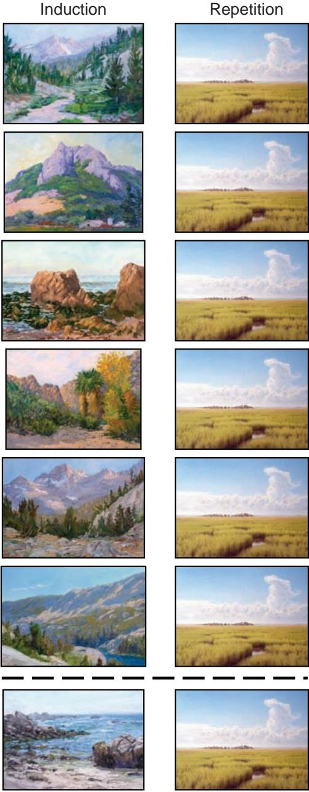
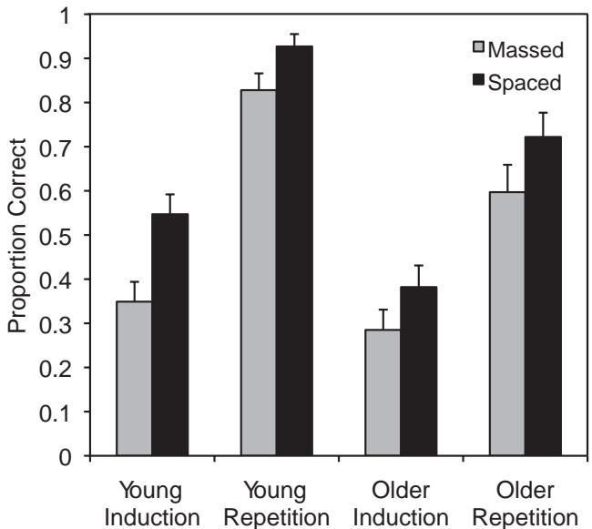

# Spacing as the Friend of Both Memory and Induction in Young and Older Adults

Nate Kornell Williams College

Alan D. Castel University of California, Los Angeles

Teal S. Eich Columbia University

Robert A. Bjork University of California, Los Angeles

We compared the effects of spaced versus massed practice on young and older adults' ability to learn visually complex paintings. We expected a spacing advantage when 1 painting per artist was studied repeatedly and tested (repetition) but perhaps a massing advantage, especially for older adults, when multiple different paintings by each artist were studied and tested (induction). We were surprised to find that spacing facilitated both inductive and repetition learning by both young and older adults, even though the participants rated massing superior to spacing for inductive learning. Thus, challenging learners of any age appears to have unintuitive benefits for both memory and induction.

Keywords: aging, induction, memory, metacognition, spacing

Making sense of the world involves learning to identify new concepts and categories by noticing and identifying recurring patterns. For example, learning to identify Spanish Colonial architecture involves encountering different buildings that share features but are not exactly the same. In the present study, our focus was on how the spacing of such encounters affects the efficiency of abstracting concepts and categories- - that is, inductive learning. Unlike classroom instruction, inductive learning begins at birth (if not before) and remains essential throughout the life span.

A century of laboratory research has shown that learning opportunities are more effective when they are spaced apart rather than massed together (e.g.,Cepeda,Pashler, Vul, Wixted,& Rohrer, 2006; Dempster, 1988; Glenberg, 1979). Such spacing effects have been obtained hundreds of times, with children (e.g., Vlach, Sandhofer, & Kornell, 2008), college students (e.g., Smith & Rothkopf, 1984), and older adults (e.g., Balota, Duchek, Sergent- Marshall, & Roediger, 2006). In nearly all of these studies, however, the same information (e.g., an object or a word pair) was presented multiple times to participants. Two then were tested. There are good reasons, as we describe in the following sections, to expect that the pattern for inductive learning might differ when the same information is not repeated.

# Spacing and Inductive Learning

The benefits of spacing seem to diminish or disappear when to- be- learned items are not repeated exactly (Appleton- Knapp, Bjork, & Wickens, 2005). Moreover, a number of studies have shown that massing, rather than spacing, promotes inductive learning. These studies have generally employed relatively simple perceptual stimuli that facilitate experimental control (Gagne, 1950; Goldstone, 1996; Kurtz & Hovland, 1956; Whitman & Garner, 1963). One intuitive explanation of these findings is that spacing may prevent learners from noticing commonalities between the exemplars that define a given concept or category—an idea we refer to as the massing- aids- induction hypothesis. When learning to identify an artist's style, for example, massing a certain artist's paintings makes it easier to notice characteristics that all of the paintings share and, thus, should aid in encoding a given artist's style. Spacing should make it more difficult to notice commonalities. This difficulty may be especially acute for older adults, who are frequently susceptible to rapid forgetting. The massing- aids- induction hypothesis was memorably captured by Ernst A. Rothkopf, the renowned educational psychologist, who remarked, "Spacing is the friend of recall, but the enemy of induction" (as quoted in Kornell & Bjork, 2008, p. 585).

Kornell and Bjork (2008) recently obtained findings that are inconsistent with the massing- aids- induction hypothesis. In their investigation, college undergraduates studied six different paintings by each of 12 relatively obscure artists, either massed (i.e., six paintings by the same artist placed in a row) or spaced (i.e., paintings by various artists interleaved). After studying, participants were shown unfamiliar paintings by the same artists and asked to select, from a list of 12 names, the name of the artist who painted each painting. Contrary to the massing- aids- induction hypothesis, final test performance was consistently and considerably superior in the spaced condition. A large majority of participants,

however, judged massing to be more effective than spacing, despite making the judgment after taking the test.

# Spacing Effects in Older Adults

Although adults' ability to remember new information typically declines with age, spacing appears to benefit young and older adults to a similar degree in standard verbal repetition learning e.g.BalotaDuchek,& Paullin1989Balota et al.2006Benjamin & Craik,2001Camp,Bird,& Cherry,2000;Logan & Balota, 2008). Aging- related decrements in learning and memory, however, may have particular implications for inductive learning. Learning a category requires remembering previous category instances when encountering a new instance (e.g., seeing a fir tree and remembering other fir trees that one has encountered), so that the new and old instances can be integrated into a unified concept. Spacing makes this remembering more difficult. We expected older adults to be particularly vulnerable to forgetting previously presented instances across spaced intervals during inductive learning. That is, we predicted that the massing- aids- induction hypothesis might apply to older, if not to young, adults.

There are also reasons, however, to expect the opposite. Gistbased memories remain relatively intact, relative to verbatim memories, in older adults Adams, 1991Castel, Farb,& Craik,2007; Craik, 2002; Koutstaal, 2003). Thus, older adults' abilities might be well suited to inductive learning. Moreover, if older adults can maintain conceptual memories of a painter's style, they may be well equipped to learn via spaced practice. These speculations lead to two competing hypothesis: Spacing might be particularly harmful to older adults' inductive learning if they forget previous instances of categories too often to form coherent concepts, or spacing might be beneficial to older adults' inductive learning if they are capable of forming and maintaining the sort of gist- based memories that support concept learning.

To examine the effects of aging on inductive learning, we tested both college students and healthy older adults in the present experiment. There were two learning tasks: (a) In the induction task, participants studied various paintings and then took a test, and no painting was ever repeated; and (b) in the repetition task, participants studied and were tested on a single painting by each artist (see Figure 1). According to the massing- aids- induction hypothesis, massing should promote learning in the induction task, particularly for older adults, whereas spacing should promote learning in the repetition task.

# Metacognition and Spacing

Metacognitive judgments- that is, judgments about one's own memory and cognition- are often based on feelings of fluency e.g.,see Benjamin, Bjork,& Schwartz,1998Rhodes & Castel, 2008). Because massing naturally leads to feelings of fluency and increases short- term task performance during learning, learners frequently rate spacing as less effective than massing, even when their performance shows the opposite pattern (Baddeley & Longman,1978Kornell & Bjork,2008Simon & Bjork,2001;Zechmeister & Shaughnessy, 1980). Averaged across Kornell and Bjork's (2008) experiments, for example, more than  $80\%$  of participants rated massing as equally or more effective than spacing, whereas only  $15\%$  of participants actually performed better in the massed condition than in the spaced condition.

  
Figure 1. A given artist's paintings were displayed six times, either massed or spaced, during study and once on the test. In the induction condition (left column), no painting was ever repeated during study or, below the dashed line, on the test. In the repetition condition (right column), one painting was displayed per artist, during study and again on the test.

We expected similar outcomes in the present induction task. When the task involved repetition, however, we expected that seeing six massed repetitions of the same item might seem like overkill, which would make massing relatively less appealing than spacing. The effects of spacing on older adults' metacognitive judgments has not been examined previously, but we expected

older adults, who are often aware that memory declines with age (Connor, Dunlosky, & Hertzog, 1997; Lachman, 2006), to be acutely aware of the retrieval difficulty that spacing creates and, thus, to be particularly prone to prefer massing over spacing.

# Method

Two groups of participants, college students and healthy older adults, were asked to learn the styles of 12 different artists. Each participant was assigned to either the induction condition or the repetition condition (see Figure 1). Spacing was manipulated within participants. Paintings by each of six of the artists were presented in massed fashion, and paintings by each of the other six artists were presented in spaced fashion—that is, interleaved among paintings by the other artists. After the learning phase, participants were shown paintings by the 12 artists and asked to select, from a list of the artists' names, the artist who had painted each painting. After the test, participants were asked which they thought had been more effective: massing or spacing.

# Participants

The undergraduate participants were 64 University of California, Los Angeles, undergraduates who participated for course credit. Thirty- two young participants were assigned to each task (repetition or induction). Their average age was of 21 years, and  $55\%$  were women. The older participants were 48 individuals recruited from the community. Twenty- four older participants were assigned to each task. Their average age was 77 years, and  $56\%$  were women. Forty- one of the 48 older participants had completed college, and of those, 24 had completed graduate studies. Of the remaining seven participants, two had completed trade school, and five had completed high school. The older participants reported that they were in good health.

# Materials

The materials, which were taken from the Kornell and Bjork (2008) study, were landscapes or skyscapes painted by 12 artists: Georges Braque, Henri- Edmond Cross, Judy Hawkins, Philip Juras, Ryan Lewis, Marilyn Mylrea, Bruno Pessani, Ron Schlorff, Georges Seurat, Ciprian Stratulat, George Wexler, and Yiemei. The painters were selected because they were relatively unknown (with the possible exceptions of Braque and Seurat).

# Procedure

During the study phase, participants were shown 72 paintings, six paintings by each of the 12 artists. Each painting was shown for 5 sec. While the painting was visible, a recording was played of the artist's last name being spoken aloud, and the artist's name was displayed on- screen.

Six artists were assigned to each condition (massed or spaced). The assignment was randomized for each participant. Massed artists' paintings were presented consecutively, whereas spaced artists' paintings were distributed throughout the study phase. Each successive block of six paintings consisted of six paintings by a given artist (massed, or M), or one painting by each of the six spaced artists (spaced, or S). The order of the blocks was MSSMSSMMSSM.

At the end of the study phase, there was a 15- s distractor task, during which participants counted backward by 3s from 547, followed by a test. A painting was presented on each test trial; participants indicated who they thought had painted it by clicking the mouse on one of 12 buttons labeled with the names of the artists. The experimenter operated the mouse for the older participants. After the participant made a response, feedback was provided: The word correct followed a correct selection, whereas the correct artist's name was presented following an error.

After the test phase, participants were told the meanings of the terms massed and spaced and asked, "Which do you think helped you learn more, massed or spaced?" They were given three response options: "massed," "about the same," and "spaced." They were also asked, "We want to know whether you were an 'expert' subject. Do any of the following apply to you? You are very knowledgeable about art; you were familiar with one or more of the painters; you recognized one or more of the paintings." They were given three options: "no," "yes—but it didn't help me," and "yes—and I did better because of it."

# Results

Mean proportion correct scores are displayed in Figure 2. We conducted a 2 (spaced or massed)  $\times 2$  (young or older)  $\times 2$  (induction or repetition) mixed analysis of variance (ANOVA). The advantage of spacing was significant,  $F(1,108) = 27.32, p < .0001$ ,  $\eta_{\mathrm{p}}^{2} = .20$ ; young participants performed better than older participants overall,  $F(1,108) = 18.67$ ,  $p < .0001$ ,  $\eta_{\mathrm{p}}^{2} = .15$ ; and performance was better in the repetition task than in the induction task,  $F(1,108) = 96.57$ ,  $p < .0001$ ,  $\eta_{\mathrm{p}}^{2} = .47$ . There were no significant interactions among spacing, age group, and task, nor was there a significant three- way interaction. Thus, contrary to the massing- aids- induction hypothesis, the benefit of spacing was not

  
Figure 2. Proportion of artists selected correctly on the multiple-choice test as a function of age group, task, and spacing. Error bars represent 1 standard error of the mean.

significantly influenced by whether the task was repetition or induction or by a participant's age group.

Separate ANOVAs conducted for the older and young adults produced similar results. For the older adults, there was a significant effect of spacing,  $F(1,46) = 8.29$ $p < .01$ $\eta_{\mathrm{p}}^2 = .15$  and task,  $F(1,46) = 25.52$ $p < .0001$ $\eta_{\mathrm{p}}^2 = .36$  but no significant interaction  $(F < 1)$  .For the young adults, again, there was a significant effect of spacing,  $F(1,62) = 21.75$ $p < .0001$ $\eta_{\mathrm{p}}^2 =$  .26, and task,  $F(1,62) = 88.07$ $p < .0001$ $\eta_{\mathrm{p}}^2 = .59$  but no significant interaction,  $F(1,62) = 2.42$ $p = .13$

The percentages of participants who judged massing or spacing to be most effective (or about the same) for learning revealed a similar and interesting pattern for both age groups. Of the young participants,  $56\%$  judged massing to be best for inductive learning, only  $19\%$  judged spacing to be best, and  $25\%$  chose "about the same." The pattern was similar for the older participants in the induction condition, but the preference for massing was stronger:  $75\%$  judged massing to be superior, only  $4\%$  thought spacing was superior, and  $21\%$  selected "about the same." By contrast, in the repetition condition, only  $16\%$  of the young participants and  $25\%$  of the older participants thought massing was superior, whereas  $59\%$  of the young participants and  $38\%$  of the older participants thought spacing was superior  $25\%$  and  $38\%$  of young and older participants, respectively, chose "about the same). Basically, both the young and older participants appeared to believe in the massing- aids- induction hypothesis- and, therefore, rated massing as most effective for inductive learning- even though the questionnaire was administered after a test on which most participants did better in the spaced condition than in the massed condition, replicating Kornell & Bjork (2008). The illusion that massing aids induction is apparently powerful (and, to be fair to the participants, it is an illusion that was shared by the experimenters in advance of the research by Kornell & Bjork, 2008). In the repetition condition, spacing was rated as effective more often than was massing, which indeed was the case.

More older adults than young adults reported that their art expertise helped them in the task  $29\%$  vs.  $6\%$ . However, self- proclaimed experts did not do significantly better on the tests  $64\%$  correct) than did novices  $60\%$  correct) overall, nor was there a significant difference when the age groups were analyzed separately.

# Discussion

The present experiment required participants to learn to identify painters' styles by viewing examples of their paintings. We tested the hypothesis that in the induction condition, spacing would make it difficult to form an accurate concept of painters' styles and, as a result, spacing would be less effective for inductive learning than repetition learning. This massing- aids- induction hypothesis was not supported. Although college students outperformed older adults overall, the two groups produced similar patterns of results: Spacing was superior to massing, and the size of the spacing effect did not depend significantly on whether the learning task involved repetition or induction. Unlike the actual results, the participants' metacognitive ratings conformed to the massing- aids- induction hypothesis. After taking the test, participants in both age groups judged massing to be more effective than spacing in the induction condition but preferred spacing in the repetition condition.

The results of the induction condition replicate Kornell and Bjork's (2008) findings and extend them to an older adult population. Kornell and Bjork (2008) argued that the benefit of spacing in the induction condition may have been due, at least in part, to the fact that spaced items were interleaved with one another. Juxtaposing paintings via interleaving may have helped participants in both age groups to notice differences and similarities among the artists' styles, which then helped participants to distinguish among the different artists on the final test.

By highlighting differences among categories, interleaving may be particularly useful when the ability to discriminate among categories is difficult but crucial, as it often is in real life. Learning what one medication looks like, for example, is a hollow exercise if one cannot distinguish it from another medication. Given the ecological validity of the present experiment and the importance of learning to discriminate among categories in real life, the benefits of spacing—especially, perhaps, interleaving—in inductive learning may be widespread.

# Aging, Spacing, and Induction

Contrary to some theoretical predictions outlined in the Introduction, older adults performed well in the inductive learning task (see Figure 2). In fact, averaged across the spaced and massed conditions, the difference between young and older adults is numerically smaller in the induction condition than it is in the repetition condition (although there was not a significant Age  $\times$  Task interaction), even though the induction task was clearly more difficult than the repetition task. This observation of strong performance by older adults in the more difficult inductive task may have occurred because older adults had relatively intact gistlike memory for the painters' styles. It may be that the engrossing nature of the materials allowed older adults to engage in the type of encoding processes that support schema abstraction (e.g., Castel, 2005, 2007). The observation that spacing can boost memory and induction in older adults, despite overall declines in episodic memory, has important implications for training and improving memory and learning in old age (e.g., Jamieson & Rogers, 2000).

# Theories of the Spacing Effect

There are a number of possible explanations of the spacing effect. According to the attention- attenuation explanation, recall of massed items is impaired because it is difficult to pay full attention to the second (and subsequent) presentations of massed items. In the present experiment, massed paintings were presented six times in a row. The six paintings were all different in the induction task, but in the repetition task, a single painting was presented repeatedly for  $30~\mathrm{s}$ . It seems fair to assume that there was more attention attenuation in the repetition condition than the induction condition. The attention- attenuation account would, therefore, predict a larger spacing effect in the repetition condition than in the induction condition. Because the actual size of the spacing effect did not differ depending on the type of task, the present results do not support the attention- attenuation account.

According to the study- phase retrieval account of the spacing effect, when an item is presented, previous presentations of the same item are retrieved from memory, and this retrieval process enhances learning. Moreover, the more difficult the retrieval, the

more learning is enhanced (see Bjork & Allen, 1970; Cuddy & Jacoby, 1982; Krug, Davis, & Glover, 1990). Up to some point, then, spacing between trials, which produces forgetting and increases the difficulty of retrieval, should enhance both repetition and induction learning. Beyond that point, however, spacing may produce retrieval failures, especially in induction learning and especially in older adults, which would make spacing the enemy of induction. The present results suggest that both the young and older participants achieved successful study- phase retrieval, at least most of the time, but a different procedure, one in which retrieval or concept formation is more difficult, might produce a benefit of massed practice (see Kornell & Bjork, 2008), particularly for older adults.

# Metacognition, Induction, and Spacing

Massing receives high metacognitive ratings, in our view, because it gives learners a sense of fluency, which, in turn, produces a strong metacognitive illusion favoring massing over spacing. Such an illusion was apparent in the induction condition. Contrary to previous research, however, participants gave higher ratings for spacing than massing during repetition learning (see, e.g., Simon & Bjork, 2001; Zechmeister & Shaughnessy, 1980). This outcome may have occurred because of a process of a habituation: Six presentations and a total of  $30~\mathrm{s}$  spent studying a single painting may have come to seem inefficient and pointless. Thus, these appears to be a turning point in metacognitive ratings based on fluency. As fluency increases, metacognitive ratings increase up to a point, but as fluency continues to increase and encoding or retrieval becomes too easy, metacognitive ratings may begin to decrease.

# Concluding Comment

Learning to generalize from examples—inductive learning—is implicated in a virtually limitless variety of unsupervised learning. Learning to identify different varieties of birds, butterflies, and bees; learning a new language or music style; and learning to recognize people's voices or writing styles are all examples of learning that occurs without the need for direct instruction. In advance of their research, Kornell and Bjork (2008) were convinced that such inductive learning would benefit from massing, yet their results showed the opposite. Undaunted, we remained convinced that spacing would be more beneficial for repetition learning than for inductive learning—especially for older adults, given their overall declines in episodic memory. The current results disconfirmed our expectations once again. If our intuitions are erroneous, despite our years spent probing and praising the spacing effect—including roughly 40 years' worth contributed by Robert A. Bjork—those of the average student are surely mistaken as well (as the inaccuracy of the participants' metacognitive ratings suggests). We have, perhaps, fallen victim to the illusion that making learning easy makes learning effective, rather than recognizing that spacing is a desirable difficulty (Bjork, 1994) that enhances inductive learning as well as repetition learning well into old age.

# References

Adams, C. (1991). Qualitative age differences in memory for text: A lifespan developmental perspective. Psychology and Aging, 6, 323- 336. Appleton- Knapp, S., Bjork, R. A., & Wickens, T. D. (2005). Examining the spacing effect in advertising: Encoding variability, retrieval processes and their interaction. Journal of Consumer Research, 32, 266- 276. Baddeley, A. D., & Longman, D. J. A. (1978). The influence of length and frequency of training session on the rate of learning to type. Ergonomics, 21, 627- 635. Balota, D. A., Duchek, J. M., & Paullin, R. (1989). Age related differences in the spacing of repetitions and retention interval. Psychology and Aging, 4, 3- 9. Balota, D. A., Duchek, J. M., Sergent- Marshall, S. D., & Roediger, H. L. (2006). Does expanded retrieval produce benefits over equal- interval spacing? Explorations of spacing effects in healthy aging and early stage Alzheimer's disease. Psychology and Aging, 21, 19- 31. Benjamin, A. S., Bjork, R. A., & Schwartz, B. L. (1998). The mismeasure of memory: When retrieval fluency is misleading as a metamnemonic index. Journal of Experimental Psychology: General, 127, 55- 68. Benjamin, A. S., & Craik, F. I. M. (2001). Parallel effects of aging and time pressure on memory for source: Evidence from the spacing effect. Memory & Cognition, 29, 691- 697. Bjork, R. A. (1994). Memory and metamemory considerations in the training of human beings. In J. Metcalfe & A. Shimamura (Eds.), Metacognition: Knowing about knowing (pp. 185- 205). Cambridge, MA: MIT Press. Bjork, R. A., & Allen, T. W. (1970). The spacing effect: Consolidation or differential encoding? Journal of Verbal Learning and Verbal Behavior, 9, 567- 572. Camp, C. J., Bird, M. J., & Cherry, K. E. (2000). Retrieval strategies as a rehabilitation aid for cognitive loss in pathological aging. In R. D. Hill, L. Backman, & A. Stigsdottner Neely (Eds.), Cognitive rehabilitation in old age (pp. 224- 248). New York, NY: Oxford University Press. Castel, A. D. (2005). Memory for grocery prices in younger and older adults: The role of schematic support. Psychology and Aging, 20, 718- 721. Castel, A. D. (2007). The adaptive and strategic use of memory by older adults: Evaluative processing and value- directed remembering. In A. S. Benjamin & B. H. Ross (Eds.), The psychology of learning and motivation (Vol. 48, pp. 225- 270). London, England: Academic Press. Castel, A. D., Farb, N., & Craik, F. I. M. (2007). Memory for general and specific value information in younger and older adults: Measuring the limits of strategic control. Memory & Cognition, 35, 689- 700. Cepeda, N. J., Pashler, H., Vul, E., Wixted, J. T., & Rohrer, D. (2006). Distributed practice in verbal recall tasks: A review and quantitative synthesis. Psychological Bulletin, 132, 354- 380. Connor, L. T., Dunlosky, J., & Hertzog, C. (1997). Age- related differences in absolute but not relative metamemory accuracy. Psychology and Aging, 12, 50- 71. Craik, F. I. M. (2002). Human memory and aging. In L. Bäckman & C. von Hofsten (Eds.), Psychology at the turn of the millennium (pp. 261- 280). Hove, England: Psychology Press. Cuddy, L. J., & Jacoby, L. L. (1982). When forgetting helps memory: An analysis of repetition effects. Journal of Verbal Learning & Verbal Behavior, 21, 451- 467. Dempster, F. N. (1988). The spacing effect: A case study in the failure to apply the results of psychological research. American Psychologist, 43, 627- 634. Gagne, R. M. (1950). The effect of sequence of presentation of similar items on the learning of paired- associates. Journal of Experimental Psychology, 40, 61- 73. Glenberg, A. M. (1979). Component- levels theory of the effects of spacing of repetitions on recall and recognition. Memory & Cognition, 7, 95- 112. Goldstone, R. L. (1996). Isolated and interrelated concepts. Memory & Cognition, 24, 608- 628. Jamieson, B., & Rogers, W. (2000). Age- related effects of blocked and random practice schedules on learning a new technology. The Journals

of Gerontology, Series B: Psychological Sciences and Social Sciences, 55, P343- P353.  Kornell, N., & Bjork, R. A. (2008). Learning concepts and categories: Is spacing the "enemy of induction"? Psychological Science, 19, 585- 592.  Koutstaal, W. (2003). Older adults encode—but do not always use—perceptual details: Intentional versus unintentional effects of detail on memory judgments. Psychological Science, 14, 189- 193.  Krug, D., Davis, B., & Glover, J. A. (1990). Mated versus distributed repeated reading: A case of forgetting helping recall? Journal of Educational Psychology, 82, 366- 371.  Kurtz, K. H., & Hovland, C. I. (1956). Concept learning with differing sequences of instances. Journal of Experimental Psychology, 51, 239- 243.  Lachman, M. (2006). Perceived control over aging- related declines: Adaptive beliefs and behaviors. Current Directions in Psychological Science, 15, 282- 286.  Logan, J. M., & Balota, D. A. (2008). Expanded vs. equal interval spaced retrieval practice: Exploring different schedules of spacing and retention interval in younger and older adults. Aging, Neuropsychology, and Cognition, 15, 257- 280.  Rhodes, M. G., & Castel, A. D. (2008). Memory predictions are influenced by perceptual information: Evidence for metacognitive illusions. Journal of Experimental Psychology: General, 137, 615- 625.

Simon, D. A., & Bjork, R. A. (2001). Metacognition in motor learning. Journal of Experimental Psychology: Learning, Memory, and Cognition, 27, 907- 912.  Smith, S. M., & Rothkopf, E. Z. (1984). Contextual enrichment and distribution of practice in the classroom. Cognition and Instruction, 1, 341- 358.  Vlach, H. A., Sandhofer, C. M., & Kornell, N. (2008). The spacing effect in children's memory and category induction. Cognition, 109, 163- 167.  Whitman, J. R., & Garner, W. R. (1963). Concept learning as a function of the form of internal structure. Journal of Verbal Learning & Verbal Behavior, 2, 195- 202.  Zechmeister, E. B., & Shaughnessy, J. J. (1980). When you know that you know and when you think that you know but you don't. Bulletin of the Psychonomic Society, 13, 41- 44.

Received April 10, 2009  Revision received July 16, 2009  Accepted July 20, 2009