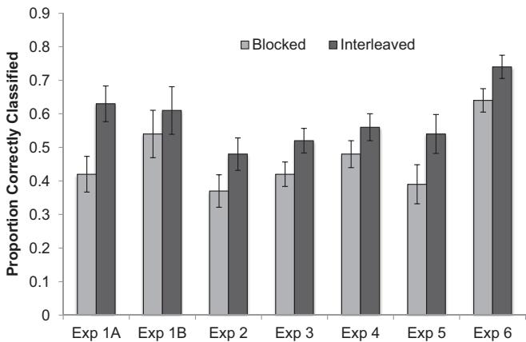
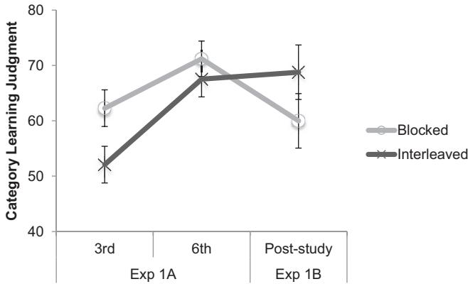
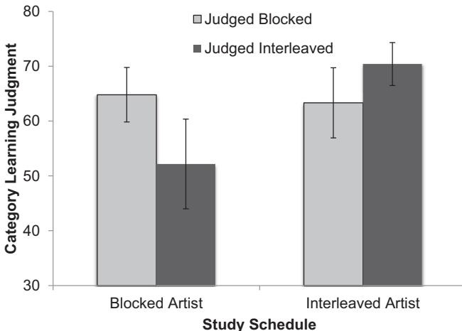
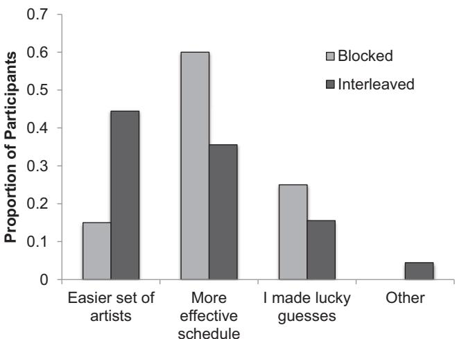
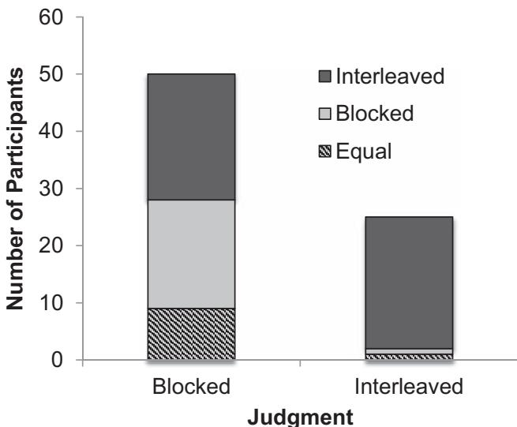
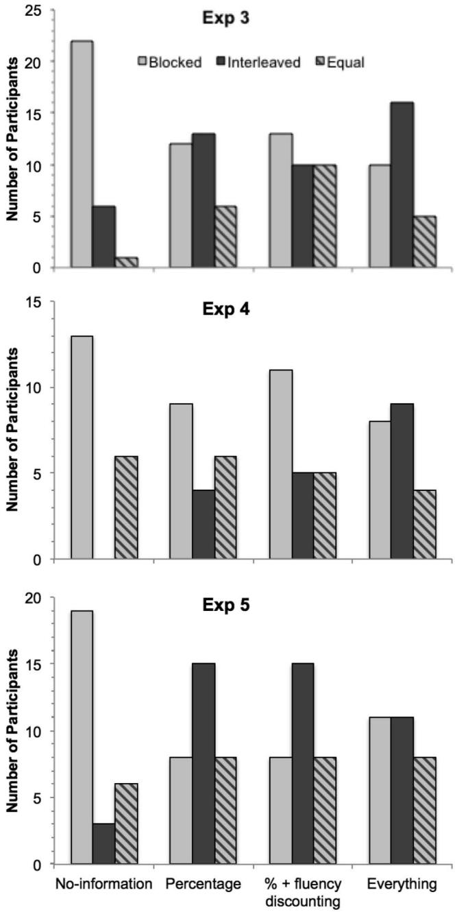
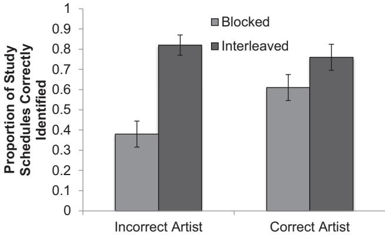
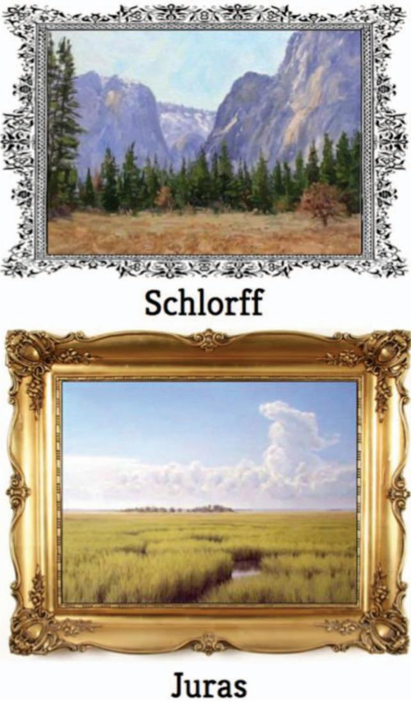
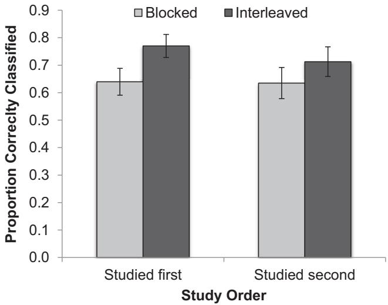
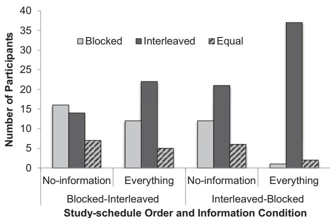

# On the Difficulty of Mending Metacognitive Illusions: A Priori Theories, Fluency Effects, and Misattributions of the Interleaving Benefit

Veronica X. Yan, Elizabeth Ligon Bjork, and Robert A. Bjork  University of California, Los Angeles

Interleaving exemplars of to- be- learned categories—rather than blocking exemplars by category—typically enhances inductive learning. Learners, however, tend to believe the opposite, even after their own performance has benefited from interleaving. In Experiments 1 and 2, the authors examined the influence of 2 factors that they hypothesized contribute to the illusion that blocking enhances inductive learning: Namely, that (a) blocking creates a sense of fluent extraction during study of the features defining a given category, and (b) learners come to the experimental task with a pre- existing belief that blocking instruction by topic is superior to intermixing topics. In Experiments 3–5, the authors attempted to uproot learners' belief in the superiority of blocking through experience- based and theory- based debiasing techniques by (a) providing detailed theory- based information as to why blocking seems better, but is not, and (b) explicitly drawing attention to the link between study schedule and subsequent performance, both of which had only modest effects. Only when they disambiguated test performance on the 2 schedules by separating them (Experiment 6) did the combination of experience- and theory- based debiasing lead a majority of learners to appreciate interleaving. Overall, the results indicate that 3 influences combine to make altering learners' misconceptions difficult: the sense of fluency that can accompany nonoptimal modes of instruction; pre- existing beliefs learners bring to new tasks; and the willingness, even eagerness, to believe that 1 is unique as a learner—that what enhances others' learning differs from what enhances one's own learning.

Keywords: interleaving, metacognition, induction, self- regulated learning

Given the increasing frequency with which learning is happening outside of formal classrooms and in unsupervised environments, knowing how to manage one's own learning is increasingly important. Multiple findings demonstrate, however, that most of us are prone to beliefs about how we learn that lead us to manage our learning in nonoptimal ways. Learners, for example, fail to appreciate (a) the pedagogical benefits of testing (e.g., Hartwig & Dunlosky, 2012; Karpicke, Butler, & Roediger, 2009; Kornell & Bjork, 2007); (b) that producing errors can sometimes enhance learning (e.g., Huelser & Metcalfe, 2012); and (c) that spacing, rather than massing, repeated practice or study sessions tends to enhance long- term retention (e.g., Cohen, Yan, Halamish, & Bjork, 2013; Simon & Bjork, 2001; Zechmeister & Shaughnessy, 1980).

Such findings raise two interesting questions: What are the sources of these metacognitive illusions and what kinds of expe

Such findings raise two interesting questions: What are the sources of these metacognitive illusions and what kinds of experiences and/or information might have the power to dislodge learners' preferences for nonoptimal conditions of learning? To pursue these issues, we focused on a particularly dramatic instance in which learners' judgments and preferences are at odds with their performance: the inductive learning of categories and concepts via exposure to interleaved or blocked exemplars. Learners hold a strong belief that blocking exemplars of to- be- learned categories enhances inductive learning, even after their own learning has profited more from inductive

Kornell and Bjork (2008) and Kornell, Castel, Eich, and Bjork (2010), for example, using a task in which participants learned the styles of artists from examples of their paintings, found that interleaving, not blocking, enhanced inductive learning—as measured by participants' subsequent ability to identify the studied artist responsible for never- before- seen paintings. In these studies (and this paradigm is replicated in the present experiments), participants study six paintings by each of 12 artists, with these paintings presented one at a time. For half of the artists, their paintings are presented blocked by artist (all six paintings by the same artist are presented consecutively); for the other artists, their paintings are presented interleaved (paintings by the six different artists are intermixed). On the final test, participants are shown new paintings and asked to select from a list of names the artist responsible for each. Interleaving benefits are robust and the effect size is large (e.g.,  $d = .99$  in Kornell & Bjork, 2008, Exp. 1A).

Similar benefits of interleaving exemplars have been found for the learning of a variety of categories (e.g., Birnbaum, Kornell, Bjork, & Bjork, 2013; Kang & Pashler, 2012; Kornell et al., 2010; Rohrer & Taylor, 2007; Vlach, Sandhofer, & Kornell, 2008; Wahl

heim, Dunlosky, & Jacoby, 2011; Zulkiply, McLean, Burt, & Bath, 2012). Nonetheless, as shown by Kornell and Bjork, the great majority of learners report that blocking, not interleaving, helped them learn better—even after their own final- test performance had exhibited greater benefits of interleaving. This striking mismatch between learning performance and metacognitive judgments was replicated in Kornell et al. (2010), who found that only  $19\%$  of younger adults and  $4\%$  of older adults judged interleaving to be better after taking the final test. Finally, learners appear to hold a priori beliefs that blocking is more effective: Tauber, Dunlosky, Rawson, Wahlheim, and Jacoby (2013) found that when allowed to select the order in which exemplars of bird families are studied, participants overwhelmingly blocked their study; McCabe (2011) found that when they described the Kornell and Bjork (2008) paradigm of learning artists' painting styles and asked undergraduates to predict which schedule would lead to better learning, only  $6.67\%$  correctly endorsed interleaving over blocking.

# Why Do Participants Judge That Blocking Is Superior?

In our opinion, one likely contributor to participants believing that blocking enhances induction is simply that blocked study and practice has been a common feature in their educational histories. That is, teachers tend to create course syllabi that are blocked by topic, trainers frequently structure practice sessions so that learners work on one skill at a time, and textbook authors tend to cover topics in a blocked fashion. In mathematics courses, for example, children often learn one formula and then practice multiple problems of that type before moving on to learning the next formula. This blocked method typically leads to excellent performance during practice, but—as shown by Rohrer and Taylor (2007)—interleaving (practicing four different problem types intermixed) leads to far better long- term learning. Another factor is that learners may intuit that inducing concepts from exemplars relies on being able to see the commonalities across exemplars that define a category, leading them to develop a belief that blocking will make those commonalities more apparent. In other words, there may also be theory- based reasons for learners' metacognitive illusions.

In addition, such pre- existing beliefs will tend to be supported by certain objective and subjective experiences. When learning motor and procedural skills, for example, blocking tends to produce better performance during acquisition (see, e.g., Shea & Morgan, 1979; Simon & Bjork, 2001). Subjective experiences during an induction task may also be influential: Viewing blocked exemplars of a given category can lead to a sense of fluency, reinforcing the feeling that blocking enhances inductive learning. Prior studies (e.g., Begg, Duft, Lalonde, Melnick, & Sanvito, 1989; Hertzog, Dunlosky, Robinson, & Kidder, 2003; Koriat & Ma'ayan, 2005) have shown that a higher subjective ease of processing can lead to higher judgments of learning (JOLs; i.e., use of the heuristic: "easily learned means easily remembered"; Koriat, 2008), and it may simply feel easier to study exemplars in a blocked schedule. Such experiences, therefore, may be another source of the metacognitive illusion that blocking is more effective than interleaving.

To examine participants' subjective experiences of blocked and interleaved learning, in the present Experiment 1A, we elicited item- by- item category- learning judgments (CLJs)—in other words, given that the learners' task is to learn the categories, we asked them to judge the likelihood they would be able to classify new exemplars of the studied categories. In contrast, the memory literature typically elicits JOLs from participants, in which participants are asked to judge the likelihood that they would be able to recall specific items on a future test. These CLJs were elicited for only half of the artists and only twice for each of those artists—once early during acquisition and late in acquisition—rather than for every single item (as is often common in JOL studies). Doing so not only avoided overly disrupting the participants' learning, but also allowed us to compare changes in the subjective experience of learning. In Experiment 1B (separate, so as to avoid contamination by the item- by- item judgments), we asked participants to provide CLJs after study, and we also asked participants to recall how each category had been studied after they made the CLJs, thereby more directly examining how participants might connect their CLJs with the study schedule. Next, in Experiment 2, we informed learners of how well they classified new paintings by the blocked and interleaved artists, thereby revealing to them which study schedule had led to their better learning. We then compared the reasons participants gave for why they performed better in that condition to answer the following question: When faced with an interleaving advantage in their own performance, will participants attribute that benefit to interleaving being a more effective study schedule, or will they attribute their better performance to some other factor?

# What Does It Take to Dislodge Learners' Belief in Blocking?

When it comes to assessing what learners understand about managing their own learning, the findings that people do not understanding the benefits of interleaving are not an exception to the rule. As mentioned earlier, many other effective study strategies also go underappreciated, but how much intervention is needed to improve learners' metacognitive accuracy appears to vary by strategy. For example, deWinstanley and Bjork (2004) found that just the experience of a benefit of generating over reading on a first test passage was enough for participants to learn about the benefit of generation and transfer that to their learning of a second test passage. Tullis, Finley, and Benjamin (2013) asked participants to learn cue- target word pairs and found that more guidance (than simply experiencing their own test performance) was required for participants to learn about the benefits of testing over restudying: Item- by- item JOLs were only improved if they were elicited at a delay and in the presence of the cue- only, and aggregate JOLs only improved when full feedback—indicating how many of the tested items and how many of the restudied items were answered correctly on the final test—was provided.

Tullis et al. (2013) concluded that in order to improve metacognitive accuracy, participants must be able to notice a difference between study conditions in their own test performance, attribute these differences to study conditions, and acknowledge the discrepancy between their prior beliefs and the actual results. To preview the results of Experiments 1 and 2, participants had a tendency both to rate blocked learning as more fluent and effective, despite the fact that poststudy judgments were higher for the interleaved categories and despite their own test performance, and

to discount interleaving benefits when full feedback was provided, attributing interleaving benefits instead to item effects.

Koriat and Bjork (2006) made a distinction between "theorybased" and "experience- based" methods of "mending metacognitiv illusions" in their work that sought to teach participants about "foresight bias"- the tendency for people to fail to predict how difficult an answer will be to generate on a later test while that answer is in front of them when making a judgment. For example, when people are told to expect a cued- recall test, where they will be provided a cue and asked to recall the target word associated to that cue, they give very similar JOLS to the pairs lamp- light and light- lamp, even though the latter is far more difficult of an item than the former (consider how many other strong associates there are for the word light, and which will come to mind during a test where light- ?? is presented). They found that only a combination of both experience- based (i.e., experiencing the memorial differences between the conditions) and theory- based (i.e., an explanation as to why this occurs) debiasing methods improved metacognitive accuracy for a new set of word pairs.

Given that metacognitive illusions can come from both a priori theories that participants bring into the lab as well as from the experience that blocking is more fluent, mending the metacognitiv illusions may well require addressing both theory and experience components together. In Experiment 3, we examined the effect of theory- based debiasing (by providing participants with different levels of information regarding the benefits of interleaving, such as why interleaving has those benefits even though blocking may seem better) on participants' metacognitive judgments about the relative efficacy of the two schedules. In Experiments 4- 6, we combined experience- based and theory- based debiasing. Our experience- based debiasing manipulations consisted of attempts to draw participants' attention to their actual test performance vis- a- vis presentation schedules by (a) asking participants during the test how a given artist's paintings had been scheduled during study (Experiment 4), by (b) presenting paintings by blocked and interleaved artists set against different frames (Experiment 5), and by (c) separating blocked and interleaved learning phases (Experiment 6).

# General Method

General MethodOur basic task (unless otherwise noted) replicated Kornell and Bjork's (2008) Experiment 1A. During study, a total of 72 landscape paintings (six by each of 12 artists; a list of their names can be found in Kornell & Bjork, 2008) were presented with the artist's name shown below each painting, one at a time, and at a 3- s rate. The six paintings by a given artist were either blocked or interleaved with those of other artists, with assignment of an artist to study schedule condition randomized across participants (except as noted in Experiments 2 and 6). The order of presentation followed the scheme: B I I B B I I B B I I B, where every B refers to a set of six paintings by the same artist and every I refers to a set of six paintings by six different artists (the order of these six artists was always randomized). To ensure that there was no effect of the order of the B and I sets, we counterbalanced the order (i.e., half of the participants started with the I set) in Experiments 1B and 2. The specific ordering did not interact with any effect, and therefore, is not discussed further, nor was it counterbalanced in any of the subsequent experiments.

Participants were instructed that their task was to learn the artists' styles in preparation for a final test on which they would be shown new paintings and have to identify the studied artist responsible for that painting (selecting the artist's name from a response panel). A 45- s interval during which participants played Tetris intervened between the study and test phase.

In the test phase, participants were shown new paintings by each of the 12 studied artists. The order of the test images was block randomized, with each "block" consisting of one painting by each of the 12 artists. For each painting, they were presented with the 12 artist names and had to select the name of the artist they believed was responsible for each painting (selecting from one of 12 buttons presented below the painting). After they made their selection for each image, they were given feedback with the correct artist's name before moving onto the next test image (except in Experiment 2, where feedback was only given after the test was completed).

We chose to provide item- by- item feedback because our central research question concerns the ways in which we might be able to teach people about the interleaving benefit: If we want learners to be able to attend to their own learning performance, then they need to receive feedback. Without such feedback, the only cue available on which to base their metacognitive judgments might simply be the fluency experienced during study.

After the final test, participants were debriefed that they had studied half the artists in a blocked sequence (all six examples by one artist appearing in a row) and half of the artists in an interleaved sequence (the presentations of the six paintings of that artist's spread across the experiment and interspersed with paintings of other artists). In Experiments 3- 5, where attempts of theory- based debiasing occurred, the relevant information was inserted at this point. Finally, the main metacognitive question present in every study (except Experiment 2) was asked after the test: "Which learning schedule led to the most effective learning?" Participants selected their response from one of three options: blocked (studying all six examples by one artist in a row), interleaved (all six of a given artist's paintings were spread out throughout the study phase), or the two schedules were equally effective.

All experiments were programmed using Collector, an opensourced, PHP- based experimental platform (https://github.com/gikeymarcia/Collector).

# Sample Selection and Replication of the Interleaving Benefit

Sample Selection and Replication of the Interleaving BenefitSeveral of the earlier studies were run with the aim of collecting data from 30 participants per condition (e.g., Experiments 3, 4, and 5). Although these were slightly underpowered as individual studies for the purposes of analyzing the metacognitive judgments, the converging results combined are presented and discussed toward

the end of the present article. In Experiments 1A and 1B, we aimed for 50 participants per condition (enough power to detect even a small effect size between CLJs for blocked and interleaved artists), and in Experiment 6, we aimed for 100 participants per condition to allow more reliable analysis of participants' metacognitive judgments (given how few tend to select interleaving over blocking).

In all present studies, we replicated the benefit of interleaving over blocking (except in Experiment 1B, in which the benefit was marginally significant, likely a result of the specific experimental design). Figure 1 displays the averaged correct classification performance for the blocked and interleaved artists for each experiment.

# Experiments 1A and 1B

Experiment 1 was designed to investigate participants' feelings of fluency as they experienced blocked and interleaved study. In Experiment 1A, we collected item- by- item CLJs halfway through study and at the end of study for half of the blocked and half of the interleaved artists. Soliciting CLJs for only half of the artists allowed examination of the effect of making CLJs during study while also reducing the number of interruptions participants experienced during study (in comparison to eliciting judgments after every single item).

In Experiment 1B, we collected CLJs poststudy, exploring whether—given a chance to reflect on their learning at the very end of the entire study phase—participants would be sensitive to the benefit of interleaving over blocking. Our thinking was that such a poststudy CLJ would be the category- learning analog to the delayed- JOL (Nelson & Dunlosky, 1991; as used by Tullis et al., 2013) in memory and metacognition studies. In making item- by- item JOLs, participants are often captured by item information and current fluency, which can be a poor indicator for the likelihood of future recall. Delayed JOLs, however, are made after a delay, at which point participants may have a better sense for how quickly that information is forgotten. This delay, therefore, gives participants access to a different, and oftentimes more reliable, cue for judging likelihood of future recall. In the present study, therefore, we assessed participants' judgments of category learning for all the artists after the study phase has ended.

  
Figure 1. Classification results for blocked and interleaved artists across each of the experiments (Exp) in the present research. Error bars represent  $95\%$  confidence intervals around the mean difference between blocked and interleaved schedules. Note that the relatively reduced interleaving benefits in Experiment 1B and Experiment 4 are likely a result of two interleaved presentations of paintings during the poststudy/pretest phase and of feedback during the test phase, respectively.

Finally, in both Experiments 1A and 1B, we collected aggregate metacognitive judgments at the end of the experiment, asking participants whether they believed that they had learned more from the blocked or the interleaved schedule. Prior studies show that even after receiving feedback regarding their performance on the final test, participants overwhelmingly believe that blocking is better. It is possible that the very act of eliciting CLJs may give learners insight into the interleaving benefit.

# Method

Participants, design, and materials. In Experiment 1A, a total of 109 undergraduates from the University of California, Los Angeles, participated for partial course credit. The experiment manipulated schedule (blocked vs. interleaved) and CLJ (CLJ vs. no- CLJ) in a  $2 \times 2$  within- subjects design. Two CLJs were made for half of the artists: one immediately after study of the third painting and one immediately after study of the sixth (last) painting.

In Experiment 1B, 50 U.S.- based Amazon Mechanical Turk workers were paid \(\) 0.80\(for their participation (seven were eliminated from the analyses because they either indicated that they had seen the stimuli before\)(n=5)\(or had taken notes during the study\)(n=2)\(. Study schedule (blocked vs. interleaved) was manipulated within - subjects.

Procedure. For Experiment 1A, the procedure was similar to that described in the General Method section above with the following exceptions: For the study phase, participants were additionally informed prior to beginning study that they would occasionally be asked to judge how likely they would be able to recognize a new painting by the just- studied artist on the final test using a rating scale of 0 (not at all) to 100 (definitely). These CLJs were solicited for a randomly selected half of the blocked and half of the interleaved artists and were made after the third and sixth paintings of each of those artists had been studied. The three blocked artists for whom CLJs were solicited were studied as either the first, third, and fifth blocked artists or the second, fourth, and sixth blocked artists. In total, CLJs were solicited 12 times throughout the study phase. In the test phase, participants were tested on one new painting per artist, with trial- by- trial feedback. Finally, they were asked to make the metacognitive judgment about which schedule was more effective for learning.

For Experiment 1B, the procedure was largely the same as described in the General Method section with the following exceptions: Between the study phase and the test phase, participants were informed that we were interested in learners' assessments of how well they think they have learned each artist's style at this point (i.e., the end of the study phase). Participants were shown one new painting by each artist (with the artist name written below and in a random order) and asked to rate on a scale of 0–100 ( $0 =$  not at all;  $100 =$  definitely) how likely it was that they would be able to recognize new paintings by each artist on the final test. Unlike in prior CLJ studies, we presented an exemplar together with the category name when eliciting these judgments to ensure

that participants were not confusing the category labels. After participants had rated each of the artists, the two study schedules were described to them. They were then shown the same new painting by each artist (again in a random order) and asked to think back to the initial study phase and indicate whether that artist had been studied in a blocked or interleaved manner. The remainder of the procedure (i.e., the test phase and aggregate metacognitive judgment) proceeded as described in the General Method, with two new paintings by each artist and no feedback on the final classification test.

# Results and Discussion

Classification performance. In both Experiments 1A and 1B, a benefit of interleaving over blocking was observed. In Experiment 1A, a  $2 \times 2$  (Schedule  $\times$  CLJ) within- subjects analysis of variance (ANOVA) revealed only a significant main effect of schedule,  $F(1,121) = 71.77$ ,  $MSE = .08$ ,  $p < .001$ ,  $\eta_p^2 = .37$ . Participants were better able to classify new paintings by artists that had been studied interleaved  $(M = .63$ ,  $SD = .25)$  than paintings by artists that had been studied blocked  $(M = .42$ ,  $SD = .25)$ . The main effect of CLJ was not significant,  $F(1,121) = 2.10$ ,  $MSE = .06$ ,  $p = .15$ ,  $\eta_p^2 = .02$ . No Schedule  $\times$  CLJ interaction was observed,  $F < 1$ .

In Experiment 1B, performance following interleaved study  $(M = .61$ ,  $SD = .24)$  was only marginally significantly better than performance following blocked study  $(M = .54$ ,  $SD = .26)$ ,  $t(42) = 1.99$ ,  $p = .053$ ,  $d = .30$ , likely a result of the fact that participants were exposed to two cycles of interleaved presentation before beginning the final test (i.e., during the poststudy CLJs and recall of initial study schedules for each artist).

Item- by- item CLJs (Experiment 1A). Average CLJs made during the study phase after the third and sixth paintings for half of the artists studied in a blocked manner and half of the artists studied in an interleaved manner are shown in the left panel of Figure 2. A  $2 \times 2$  (schedule x judgment position) within- subjects ANOVA performed on these data revealed a significant main effect of schedule,  $F(1,108) = 19.74$ ,  $p < .001$ ,  $\eta_p^2 = .16$ , a significant main effect of position,  $F(1,108) = 139.77$ ,  $p < .001$ ,

  
Figure 2. Averaged category learning judgments (CLJs) made after study of the third and sixth paintings for a random half of the blocked and interleaved artists in Experiment (Exp) 1A (left two points) and poststudy in Experiment 1B (right-most points). Error bars represent  $95\%$  confidence errors around the mean difference between blocked and interleaved schedules.

$\eta_p^2 = .56$ , and a significant interaction,  $F(1,108) = 11.63$ ,  $p < .01$ ,  $\eta_p^2 = .10$ . Overall, participants gave higher CLJs to the blocked artists  $(M = 66.74$ ,  $SD = 17.26)$  than they did to the interleaved artists  $(M = 59.80$ ,  $SD = 19.11)$ , and they gave higher CLJs after studying the sixth painting  $(M = 69.36$ ,  $SD = 16.88)$  than after studying the third painting  $(M = 57.18$ ,  $SD = 17.41)$ . Post hoc comparisons revealed that after the third painting, CLJs were significantly higher for the blocked  $(M = 62.28$ ,  $SD = 18.62)$  artists than for the interleaved artists  $(M = 52.09$ ,  $SD = 21.38)$ ,  $t(108) = 5.36$ ,  $p < .001$ ,  $d = .51$ , and this remained true for judgments made after the sixth painting  $(M = 71.20$ ,  $SD = 17.24$  and  $M = 67.52$ ,  $SD = 20.99$  for blocked and interleaved artists, respectively),  $t(108) = 2.10$ ,  $p < .05$ ,  $d = .19$ . As can be seen in the left panel of Figure 2, however, this difference in CLJs was much smaller after the sixth than after the third paintings. In other words, the item- by- item CLJs favored blocking over interleaving, supporting the hypothesis that blocking leads to greater subjective fluency than does interleaving.2

Poststudy CLJs (Experiment 1B). In contrast to the item- by- item CLJs made during study, the poststudy CLJs were significantly higher for the interleaved artists  $(M = 68.77$ ,  $SD = 23.52)$  than for the blocked artists  $(M = 60.00$ ,  $SD = 25.11)$ ,  $t(42) = 3.59$ ,  $p = .001$ ,  $d = .55$ . Thus, when presented with a new painting of an artist that had been studied in an interleaved manner versus a blocked manner, participants were, in general, sensitive to having learned the styles of the interleaved artists better than those of the blocked artists.

A statistically significant difference in resolution of these CLJs between the blocked (Goodman- Kruskal  $\gamma = .38$ ,  $SD = .59$ ) and interleaved (Goodman- Kruskal  $\gamma = .20$ ,  $SD = .72$ ) conditions was not observed,  $t(38) = 1.33$ ,  $p = .19$ ,  $d = .21$ . In other words, correlations between participants' CLJs and their final classification performance (i.e., their ability to distinguish between the artists that were more or less likely to be correctly classified) were not significantly different for the blocked and interleaved artists.

Aggregate metacognitive judgments. Despite the fact that the item- by- item CLJs for the blocked and interleaved artists were very close by the end of study (Experiment 1A) and the fact that poststudy CLJs favored interleaving (Experiment 1B), the aggregate judgments about which schedule was more effective for learning revealed that an overwhelming  $72\%$  of participants judged blocking to be more effective for learning than interleaving, with the remaining participants equally split between believing (accurately) that interleaving was better or that the two schedules were equally effective. Table 1 (top and middle panels display the

Table 1 Frequency Count (and Percentage) of Participants Making Each Metacognitive Judgment of Schedule Efficacy by Their Actual Schedule Efficacy in Experiments 1A and 1B, Respectively and Combined  

<table><tr><td rowspan="2">Experiment</td><td rowspan="2">Actual performance</td><td colspan="3">Metacognitive judgment</td></tr><tr><td>Blocked is more effective</td><td>Equal efficacy</td><td>Interleaved is more effective</td></tr><tr><td rowspan="4">1A: Item-by-item CLJs</td><td>Blocked &amp;gt; interleaved</td><td>8 (62%)</td><td>2 (15%)</td><td>3 (23%)</td></tr><tr><td>Equal</td><td>5 (71%)</td><td>1 (14%)</td><td>1 (14%)</td></tr><tr><td>Interleaved &amp;gt; blocked</td><td>18 (78%)</td><td>4 (17%)</td><td>1 (4%)</td></tr><tr><td>All</td><td>31 (72%)</td><td>7 (16%)</td><td>5 (12%)</td></tr><tr><td rowspan="4">1B: Poststudy CLJs</td><td>Blocked &amp;gt; interleaved</td><td>13 (93%)</td><td>1 (7%)</td><td>0 (0%)</td></tr><tr><td>Equal</td><td>6 (40%)</td><td>5 (33%)</td><td>4 (27%)</td></tr><tr><td>Interleaved &amp;gt; blocked</td><td>57 (74%)</td><td>9 (12%)</td><td>11 (14%)</td></tr><tr><td>All</td><td>76 (72%)</td><td>15 (14%)</td><td>15 (14%)</td></tr><tr><td rowspan="4">Combined</td><td>Blocked &amp;gt; interleaved</td><td>21 (78%)</td><td>3 (11%)</td><td>3 (11%)</td></tr><tr><td>Equal</td><td>11 (50%)</td><td>6 (27%)</td><td>5 (23%)</td></tr><tr><td>Interleaved &amp;gt; blocked</td><td>75 (75%)</td><td>13 (13%)</td><td>12 (12%)</td></tr><tr><td>All</td><td>107 (72%)</td><td>22 (15%)</td><td>20 (13%)</td></tr></table>

Note.CLJs  $=$  category-learning judgments. The bolded numbers indicate the overall percentage of participants making each judgment, collapsed across actual performance.

results from Experiments 1A and 1B, respectively) summarizes participants' aggregate judgments of which schedule led to more effective learning of artists' painting styles in relation to whether their performance did in fact reflect an interleaving advantage, blocking advantage, or equivalent performance for artists from the two study schedules. Eliminating the "equal" responses from analyses, chi- square tests of independence revealed that judgments of whether blocking or interleaving was more effective was independent of which schedule was actually better in both Experiment 1A,  $\chi^2 (1) = 2.43$ $p = .12$  , and Experiment 1B,  $\chi^2 (1) = 2.92$ $p = .09$  This discrepancy between learners' CLJs and their aggregate judgments suggests that they either make their judgments based heavily on the fluency that is experienced early during acquisition or that their aggregate judgments are likely not based solely on fluency of blocked versus interleaved study (i.e., based on prior beliefs).

Recall of initial study schedules. Experiment 1B found that interleaved artists were given higher post study CLJs than blocked artists. Does this finding reflect an understanding that the interleaved artists were better learned? Aside from the results of the aggregate metacognitive judgments, which suggest that participants did not link this poststudy experience to initial study schedule, we also asked participants to explicitly identify the schedule by which an artist had been studied. Overall, they correctly recalled the initial study schedule of  $62\%$  of the blocked artists  $SD = 23\%$  and  $76\%$  of the interleaved artists  $SD = 21\%$  .Their average CLJs did not differ between the artists that they judged to be interleaved  $M = 64.34$ $SD = 23.10$  and the artists that they judged to be blocked  $M = 64.40$ $SD = 25.63$ $p > .20$

Figure 3, however, in which participants' CLJs are shown broken down by the schedule in which an artist had actually been studied and the schedule in which the participant judged that artist to have been studied, reveals an interesting difference in the pattern of CLJs made for artists participants' later judged to have been studied blocked versus those they later judged to have been studied interleaved. Namely, for artists that were studied interleaved, their CLJs were relatively similar whether they later judged that artist to be studied blocked  $M = 63.33$ $SD = 31.66$  or interleaved  $M = 70.42$ $SD = 27.95$  ), and if anything, were higher for the latter. For artists that were studied blocked, however, the artists later judged to have been blocked  $M = 64.80$ $SD = 31.62$  received higher CLJs than those later judged to have been interleaved  $M = 52.18$ $SD = 32.08$  .A 2 judged schedule)  $\times 2$  (actual schedule) within- subjects ANOVA provided support for this interaction,  $^3 F(1,26) = 4.69$ $MSE = 231.01$ $p = .04$ $\eta_p^2 =$  .15. In other words, it appears that when confidence (i.e., as represented by low category learning judgments) is particularly low on an artist that had been blocked, participants have a tendency to judge that artist as having been studied in an interleaved manner (i.e., If it was difficult, it must have been interleaved).

# Experiment 2

Experiments 1A and 1B asked participants what schedule they thought led to more effective learning, and we found that despite participants' subjective experience that interleaved artists are better learned by the end of study, their posttest judgments consistently favored blocked over interleaved study. In Experiment 2, we investigated whether such judgments might change if individuals were told how they actually performed. In the face of evidence that one has learned better under one schedule or another, to what would learners attribute their test performance?

# Method

Participants. Eighty- five U.S. residents recruited from Amazon Mechanical Turk were paid $0.80 each for their participation (10 participants were eliminated from the analyses because they either indicated that they had seen the stimuli before,  $n = 6$ , or had taken notes during the study,  $n = 4$ ).

Procedure and materials. Other than two exceptions, the procedure largely followed that described in the General Method, with four new paintings by each artist presented in the final

  
Figure 3. Average category learning judgments (CLJs) in Experiment 1B for artists that were in fact studied in a blocked or interleaved manner as a function of whether they were judged by participants to have been presented blocked or interleaved. Error bars represent  $95\%$  confidence intervals around the means.

classification test. Our first exception was that, instead of randomly assigning the artists to schedule condition, we created two matched sets of artists based on how well participants had classified each artist in prior experiments: Set A consisted of Cross, Seurat, Hawkins, Mylrea, Yiemei, and Peissani and Set B consisted of Wexler, Juras, Schlorff, Stratulat, Lewis, and Braque. Based on prior studies, these two sets should be roughly equal in difficulty. The assignment of artist set to study schedule was counterbalanced across participants.

Second, instead of providing trial- by- trial feedback on the final test, participants were given feedback after completion of the test phase regarding their performance for interleaved versus blocked artists: "On the test, you got X/24 correct for the interleaved artists, and Y/24 correct for the blocked artists. In other words, you did better on the [blocked/interleaved] artists," where X and Y represent their actual scores. Participants who scored equally on the blocked and interleaved artists  $(n = 10)$  were eliminated from all metacognitive analyses. We then examined to what participants attributed their better performance on one of the schedules, asking them to select the biggest reason for their better performance on the interleaved or blocked schedule: "I made lucky guesses;" "That schedule was more effective for learning than the other schedule;" or "That particular set of artists was easier than the other set of artists." Participants were also given the opportunity to respond "Other reason." Finally, participants were asked: "Imagine that you are an art teacher and have to teach your students to recognize the painting styles of different artists. What schedule would you present the paintings in?" They were then asked to choose between a blocked or interleaved schedule.

# Results and Discussion

Classification test performance. We once again replicated the interleaving benefit: The interleaved schedule led to significantly better performance  $(M = .48, SD = .25)$  than did the blocked schedule  $(M = .37, SD = .20)$  on the final classification test,  $t(74) = 4.62, p < .001, d = .53$ .

The two "sets" of artists were well matched on difficulty: The new paintings by artists in Set A were correctly classified at essentially the same rate  $(M = .42, SD = .22)$  as were the new paintings by artists in Set B  $(M = .43, SD = .22)$ . A marginally significant interaction between study schedule and artist set was observed,  $F(1, 73) = 3.20, p = .08, \eta_p^2 = .04$ . Namely, although there was only a marginally significant benefit of interleaved study  $(M = .45, SD = .25)$  over blocked study  $(M = .39, SD = .21)$ ,  $t(37) = 1.94, p = .06, d = .32$ , for Set A, the interleaved schedule  $(M = .51, SD = .25)$  was significantly better than the blocked schedule  $(M = .35, SD = .18)$ ,  $t(36) = 4.88, p < .001, d = .80$ , for Set B.

Out of the 75 participants, 45 experienced an interleaving benefit  $(M$  benefit  $= .24, SD = .14)$ , 20 experienced a blocking benefit  $(M$  benefit  $= .13, SD = .11)$ , and 10 performed equally well on the blocked and interleaved artists.

Attribution of test performance. Participants' attributions for their performance are illustrated in Figure 4. When asked what was the biggest reason for why they did better in identifying new paintings by artists whose painting had been presented either blocked or interleaved, participants who had performed better on the blocked artists were most likely to attribute the difference to the greater effectiveness of the blocked schedule (12/20 participants, or  $60\%$ ). Only three (15%) attributed their blocking benefit to that particular set of artists being easier to learn than the other set, and five (25%) attributed their performance to lucky guesses. On the other hand, those participants who performed better in identifying new paintings by the artists studied via an interleaved schedule were most likely to attribute their performance to the interleaved artists being an easier set of artists (20/45, or  $44\%$ ), and only 16 (36%) attributed their performance to interleaving being a more effective study schedule. Seven participants chalked their performance down to making lucky guesses and two selected "other" (when prompted to explain, one said, "Not sure" and the other wrote that they had studied art in high school and taken an art appreciation course).

A chi- square test- of- independence conducted on only the "easier" and "more effective" responses (the other two attribution

  
Figure 4. Participants' attributions for why one schedule was better for learning than the other in relation to whether blocking was better or interleaving was better for each participant in Experiment 2.

options were eliminated from analyses due to low cell counts) revealed that the pattern of attributions was significantly different between those who had a blocked advantage and those who had an interleaved advantage,  $\chi^2 (1) = 5.41$ $p = .02$

Aggregate metacognitive judgments. Finally, when participants were asked how they would teach their hypothetical art students, 50 participants  $(67\%)$  chose blocked presentation and only 25  $(33\%)$  participants chose interleaved presentation. These responses, separated by which schedule was in fact most effective for each participant, are displayed in Figure 5. A chi- square test of independence revealed that the judgments of which schedule participants would use to teach hypothetical students was dependent on the actual condition in which an individual participant had actually performed better,  $\chi^2 (2) = 16.08$ $p < .001$  . Nine out of the 10  $(90\%)$  participants for whom the two conditions led to equal performance and 19 out of the 20  $(95\%)$  participants for whom blocking led to better performance answered that they would teach their hypothetical students using a blocked schedule. For those participants for whom interleaving led to better performance than did blocking, only 23 out of 45  $(51\%)$  responded that they would teach using an interleaved presentation schedule. What this pattern shows, again, is that participants readily accept that blocking is more effective for learning but are less receptive to accepting the possibility that interleaving is more effective for learning despite evidence based on their own performance.

# Experiment 3

Experiments 1A, 1B, and 2 not only replicated prior findings that learners fail to appreciate the benefits of interleaving, but also revealed some details regarding the nature of this illusion: Blocking leads to greater fluency during study (especially early on, as evidenced by the earlier during- study CLJs from Experiment 1A),4 learners fail to connect their test performance to initial study schedules (Experiment 1B), and learners are even willing to discount their own test performance in favor of pre- existing beliefs that blocking should be more effective for learning (Experiment 2). In the subsequent experiments, we target both learners' experiences and theories in attempts to mend the metacognitive illusion that blocking is more effective for learning than is interleaving. In Experiment 3, we explore the efficacy of theory- based debiasing (providing information as to why interleaving is superior to blocking).

  
Figure 5. Participants' judgments of what schedule they would use to teach their students if they were art teachers in relation to whether blocking had been better or interleaving had been better for them in Experiment 2.

# Method

Participants. A total of 124 U.S. residents were recruited from Amazon Mechanical Turk and paid \(\) 0.50$ each for their participation.

Design and procedure. The procedure was largely as described in the General Method section, but with the following changes. Before the final test, which included one new painting by each studied artist, participants were made aware of the two presentation schedules and told that, after selecting the artist they thought responsible for a given new painting, they would receive feedback regarding the correct artist. In addition, after the final test on which they received trial- by- trial feedback (i.e., the correct answer for each trial), but before collecting their metacognitive judgments, participants were randomly assigned to one of four information conditions: no information  $(n = 29)$  percentage  $(n = 31)$  percentage  $^+$  fluency discounting  $(n = 33)$  ,and everything  $(n = 31)$  . The no- information condition replicated the procedure of Kornell and Bjork (2008). The additional information received by participants in the other three conditions is shown below.

Percentage: "In fact, previous research has shown that, contrary to many people's intuitions, an overwhelming  $90\%$  of individuals actually learn better when the paintings of an artist are presented intermixed with paintings by other artists. Seeing all the paintings by one artist consecutively is not as good for learning as mixing all the artists up."

Percentage  $^+$  fluency discounting: "In fact, previous research has shown that- even though it might feel easier to focus on one artist at a time- an overwhelming  $90\%$  of individuals actually learn better when the paintings by an artist are presented intermixed with paintings by other artists. Seeing all the paintings by one artist consecutively is not as good for learning as mixing all the artists up."

Everything: Same information given to participants in the percentage  $^+$  fluency- discounting conditions plus: "This comes as a surprise to many people, as there is a strong sense- while you are studying the paintings- that it seems easier to pick out the defining characteristics of an artist if you study all of his/her paintings consecutively. However, the benefit of interleaving the artists is that your attention was drawn to the DIFFERENCES between the

artists, and this is really what is crucial for the task of learning artists' styles."

Finally, all participants were again reminded of the two learning schedules and asked, "Which schedule do you think led to better learning of the artists' styles?," after which they were asked to choose from the following options: Blocking was better, interleaving was better, or that the two schedules were equally effective.

# Results and Discussion

Consistent with the results of previous studies, overall correct classification of new paintings (i.e., identifying which studied artist had been responsible for it) was significantly better for those artists whose paintings were studied in an interleaved manner  $(M = .52, SD = .30)$  versus a blocked manner  $(M = .42, SD = .24)$ ,  $t(124) = 4.12, p < .001, d = .49$ .

The top panel in Figure 6 displays participants' judgments about the effectiveness of the two study schedules (represented by the height of the bars) as a function of their information condition. Broadly speaking, as the reasons provided for why interleaving, not blocking, enhances inductive learning became more detailed, fewer participants judged blocking as more effective and more participants judged interleaving as more effective. A chi- square test of independence (eliminating participants who judged the two schedules to be "equal," as there were too few of them) confirmed that metacognitive judgments were dependent on information- condition,  $\chi^2 (3) = 9.68, p = .02$ .

What is most impressive, however, is how relatively ineffective all of the information conditions were in modifying participants' belief that blocking facilitated their learning. In the no- information condition, only six of 29 participants judged interleaving to be superior. Being told that interleaving was superior for  $90\%$  of learners increased the proportion (13/31) of participants willing to judge interleaving as better, but the majority (18/31) still judged blocking to be as good or better than interleaving. Telling participants that interleaving produces better performance for  $90\%$  of learners, while also giving them a reason (fluency) why they might be fooled into thinking otherwise, had—if anything—a smaller effect: Only 10 participants in that condition judged interleaving to be better, whereas 23 judged blocking as good or better than interleaving.

Even in the very heavy- handed "everything" condition, where participants received the full set of reasons why interleaving produces better inductive learning plus the caution that people are prone to feel that the opposite is true, only a slight majority of participants (16/31) responded that interleaving was better. Basically, participants, overall, were very willing to believe that any benefits of interleaving for other participants did not offset the benefits of blocking for their own learning.

# Experiment 4

Given the results of Experiment 3, we speculated that one factor in participants' holding fast to their faith in blocking is that they did not link their performance on the final test to the blocking- versus- interleaving manipulation. We attempted, therefore, to draw participants' attention to this connection in Experiment 4.

  
Figure 6. Participants' judgments of what schedule led to better learning as a function of their information condition in Experiments (Exp) 3 (top), 4 (middle), and 5 (bottom).

# Method

Participants and procedure. Participants were 80 U.S. residents recruited from Mechanical Turk, and each received $0.50 for participating. Participants were randomly assigned to the same information conditions as in Experiment 3: no- information  $(n = 19)$ , percentage  $(n = 19)$ , percentage + fluency discounting  $(n = 21)$ , and everything  $(n = 21)$ . The same procedure was used except that (a) the final test presented four 12- item randomized blocks of new paintings—rather than just a single block of one new painting

by each artist—with the goal of allowing participants to accumulate more test- phase experience; and (b) after receiving feedback on the artist responsible for each new painting, participants were asked, "Was this artist's paintings presented massed (consecutive) or spaced (intermixed with other artists)?" to which they responded by selecting one of two buttons.

# Results and Discussion

Classification performance. Classification performance replicated Kornell and Bjork's (2008) results very closely: Interleaving produced better performance than blocking, and performance improved across test blocks (particularly for the blocked artists) owing to feedback. A 2 (schedule)  $\times 4$  (test block) repeated measures ANOVA revealed a significant main effect of schedule,  $F(1,76) = 14.80, MSE = .07, p < .001, \eta_p^2 = .16$ , with classification performance being better in the interleaving  $(M = .56, SD = .21)$  than in the blocking condition  $(M = .48, SD = .23)$ . A significant main effect of test block was also obtained,  $F(3,237) = 4.27, MSE = .03, p < .01, \eta_p^2 = .05$ , with performance improving across test blocks. Finally, there was a marginal interaction,  $F(3,237) = 2.20, MSE = .03, p = .09, \eta_p^2 = .03$ , reflecting the increasing performance in the blocked condition across test blocks (from .44 to .54) and the essential lack thereof in the interleaved condition (from .57 to .58). Interestingly, the improvement for the blocked artists may reflect an interleaving benefit: Given feedback was provided on each test trial, blocked artists were receiving, for the first time, what amounted to interleaved practice.

Memory for study schedule. Overall, participants correctly recalled the study schedule  $64\%$ $SD = 15\%$  of the time.Participants' accuracy in identifying the study schedule of each artist, conditional upon correct identification of the artist responsible for the painting, is presented in Figure 7. A  $2\times 2$  within- subjects ANOVA confirmed that schedule memory for interleaved artists  $(M = .79$ $SD = .25$  was significantly higher than for blocked artists  $(M = .50,SD = .29)$ $F(1,76) = 41.29$ $p < .001$ $\eta_p^2 = .35$  and schedule memory for correctly identified artists  $(M = .68$ $SD = .34)$  was significantly higher than for incorrectly identified artists  $(M = .60,SD = .30)$ $F(1,76) = 21.62,p < .001$ $\eta_p^2 = .22$

  
Figure 7. The proportion of study schedules correctly identified as a function of correct artist identification for each presentation schedule in Experiment 4. Error bars represent  $95\%$  confidence intervals around the means.

These main effects, however, were qualified by a significant interaction,  $F(1,76) = 47.26, p < .001, \eta_p^2 = .38$ . When an artist's paintings had been interleaved during study, participants were actually more likely to report that that artist's paintings had been interleaved when they incorrectly identified the painting as by a different artist  $(M = .82, SD = .22)$  than when they correctly identified the artist  $(M = .76, SD = .29)$ ,  $t(77) = 2.90, p < .01, d = .33)$ . When an artist's paintings had been blocked during study, however, participants were more likely to report that that artist's paintings had indeed been blocked when they correctly identified the artist  $(M = .61, SD = .29)$  than when they incorrectly identified the artist  $(M = .38, SD = .29)$ ,  $t(79) = 6.90, p < .001, d = .77$ .

In other words, when participants were incorrect in identifying the artist of a particular painting they were more likely to judge that the artist's paintings had been interleaved. Seemingly, participants' judgments appear to be influenced by the heuristic, "If I was wrong, I must have studied that artist's paintings interleaved"—a heuristic that seems likely to be mediated by a belief that fluency during study is an indicator of better learning. Notably, this pattern of results is consistent with what was found in Experiment 1B—participants were more likely to incorrectly judge that a blocked artist's paintings had been interleaved when their category- learning judgment was lower.

Metacognitive judgments. Participants' judgments concerning which schedule led to better learning for each information condition are shown in the middle panel of Figure 6. Despite our attempts to draw participants' attention to their own performance, an even greater majority judged blocking to be superior to interleaving! Notably, not a single participant in the no- information condition reported that interleaving was better (vs.  $21\%$  in Experiment 3).

Again, more participants indicated that interleaving was better for learning as more information was provided regarding why that might be the case, although this trend did not reach significance: Eliminating those who judged the two schedules to be equal, metacognitive judgments did not differ significantly across the information- conditions,  $\chi^2 (3) = 5.78, p = .12$ .

When told that  $90\%$  of participants learn better given an interleaved schedule (i.e., the percentage condition), only four of 19 participants responded that interleaving was better for them. When also given the information that the feeling of fluency can be misleading (i.e., the percentage + fluency discounting condition), only five of 21 participants judged that interleaving was better. Only in the everything condition did more participants choose interleaving than blocking (9 vs. 8), but the majority (57%) of even the participants in the everything condition still judged blocking to be as good or better than interleaving.

Clearly, our attempt to draw learners' attention to the relationship between initial study schedule and final test performance did not dislodge their misplaced faith in the benefits of blocking. Overall, participants were very willing to believe that they fell in the  $10\%$  of learners who benefit from blocking, not interleaving: Excluding those in the no- information condition who were not told that  $90\%$  of people learn better interleaved, and those in the everything condition who were told in detail why blocking may appear superior but is not,  $78\%$  of the participants placed themselves in the  $10\%$  of individuals who learn as well or better from a blocked schedule. Even in the everything condition, which

included a complete explanation for why interleaving is better, only  $43\%$  of participants judged interleaving to be better for learning.

Perhaps, however, we observed this pattern of results because our attempt to enhance participants' awareness of the link between test performance and study schedule was not effective. Participants identified the correct schedule only about two thirds of the time, and, furthermore, were more likely to state that an artist had been studied interleaved when they incorrectly, not correctly, identified the artist responsible for a given test painting (similar to what was found in Experiment 1B). We reasoned, therefore, that our manipulations might have elicited participants' a priori theories about the superiority of blocking instead of linking test performance to prior study schedules. Another possible factor is that our use of four tests- with- feedback blocks, which allowed successful classification rates for blocked and interleaved artists to became similar by the final test block, made it less clear to participants which schedule had actually led to better test performance.

# Experiment 5

In Experiment 5, we attempted to make the two schedules more salient by (a) forewarning participants of the two schedules and (b) by surrounding the paintings being shown via the two schedules within two very different frames.5

# Method

Participants and design. Participants were 120 U.S. residents, recruited via Amazon Mechanical Turk, each receiving \(\) 1.00\(for participating, and were randomly assigned into one of the four experimental conditions: no - information\)(n=28)\(, percentage\)(n=31)\(, percentage\)+\(fluency discounting\)(n=31)\(, and everything\)(n=30)\(. For each participant, paintings by the blocked and interleaved artists were presented within two very different frames, a gold frame or a black frame, as shown in Figure 8, and the mapping of frame to schedule was counterbalanced across participants.

Materials and procedure. The procedure for Experiment 5 was designed to increase participants' awareness of the mapping of artists to the blocked and interleaved schedules.

Pretraining phase. Participants were first forewarned that the paintings by half of the artists would be presented consecutively (i.e., blocked) while the paintings by the other half of the artists would be all mixed together (i.e., interleaved). In addition, they were told that the blocked and interleaved artists would be presented inside different frames, and they were then shown two short demonstrations—using paintings by famous artists who were not among the studied artists—designed to ensure they knew what blocked and interleaved study meant. Three paintings by Vincent van Gogh were shown for 3 s each, with the appropriate frame and artist name written beneath each image (the "blocking" demonstration), and then four paintings by four different artists (Claude Monet, Leonardo da Vinci, Salvador Dali, and Vincent van Gogh) were shown, again with the appropriate frame and appropriate name printed beneath each image (the "interleaving" demonstration). Before and after each demonstration, they were reminded of what schedule each series of paintings represented.

Participants were then informed that the different frames would be used to help them keep track, during the study phase, of whether a blocked or interleaved artist was being studied, and that- in addition to being tested on whether they had learned the artists' painting styles they would also be asked to identify how an artist's painting had been studied (blocked or interleaved). Next, they were tested on whether they could recall the frame- schedule mapping (selecting from one of two multiple choice options), and given immediate feedback of the correct mapping.

  
Figure 8. An example of the two frames used to denote blocked and interleaved schedules of study in Experiment 6. Top image courtesy of Ron Schlorff, California, USA; bottom image courtesy of Philip Juras, Georgia, USA. See the online article for the color version of this figure.

Finally, prior to the study phase, participants were trained on the 12 names of the artist that they would be studying. They were shown the six names of the interleaved artists and given 30

seconds to study them, before engaging in a free recall test of the names, with feedback. This same process was repeated with the six names of the blocked artists (the order of studying and testing blocked and interleaved names was counterbalanced between participants). Participants then engaged in one more test- with- feedback cycle on each of the two sets of artists' names.

Study and test phases. The study and test phases were administered as described in the General Method section above, but with the following exceptions: Paintings by blocked and interleaved artists were shown inside different frames (see Figure 8) during the study phase and during the test phase; participants were reminded of the frame- schedule mapping right before the final test; and feedback during the test phase was a little more elaborate (instead of just being presented with the name of the correct artist, participants were shown, "Correct/Incorrect! [Name] was the answer"). Only one new painting per artist is was tested on the final test.

Posttest information and questions. Participants were reminded of the two study schedules and were then shown one of the information prompts (no- information, percentage, percentage + fluency discounting, or everything). They were then asked to recall which frame mapped onto which study schedule ("blocked = gold frame; interleaved = black frame," or "blocked = black frame; interleaved = gold frame," or "I don't remember"), and then they were asked to judge which schedule led to better learning. Finally, participants were shown the 12 artist names and asked to select the six names that were studied interleaved, and then the six names that were studied blocked (order counterbalanced across subjects).

# Results and Discussion

Classification performance. Again, we replicated the basic interleaving benefit: Paintings by artists that were studied interleaved  $M = .54$ $SD = .30$  were correctly classified at a significantly higher rate than paintings by artists that were studied blocked  $M = .39$ $SD = .25$ $t(119) = 5.29$ $p < .001$ $d = .97$

Memory for frame colors. We checked whether participants could recall the frame- schedule mapping twice: Once before they studied any paintings, and a second time after the final test. At both time points, participants were highly accurate in recalling the correct frame- schedule mapping  $- 95\%$ $SD = 22\%$  and  $97\%$ $SD = 18\%$  , respectively. The manipulation to make presentation schedule salient, therefore, was successful.

Classification of artists' names. Participants were reasonably good at selecting the names of the blocked and interleaved artists at the end of the study: On average, participants correctly selected 4.39  $SD = 1.98$  names and incorrectly selected only 1.5  $SD = 1.99$  names.

Metacognitive judgments. Participants' judgments concerning which schedule led to better learning for each information condition are shown in the bottom panel of Figure 6. Again, there is a general trend that the more information a learner receives, the less likely they are to endorse a blocked schedule,  $\chi^2 (3) = 15.86$ $p < .01$  (as with the analogous analyses in Experiments 3 and 4, we removed the participants who judged the two schedules to be of equal efficacy from this analysis).

Despite forewarning participants of the two schedules, pretraining on the names of the blocked and interleaved artists, presenting the frames around the images throughout the test phase, explicitly telling people whether they were correct or not, and the fact that almost every single participant could tell us (after the test), the mapping between frame and schedule, there remained a clear tendency for participants to believe that blocked study leads to more effective learning than does interleaved study. This pattern is most striking in the "no- information" condition: Despite all the measures taken to draw learners' attention to the schedules, 19 out of 28  $(68\%)$  still claimed that blocking was better than interleaving, and only 3  $(11\%)$  appreciated the benefits of interleaving over blocking.

Among the other three conditions in which extra information was provided, there still was no condition in which a convincing majority of participants believed that interleaving was better than blocking: Only  $48\%$ $48\%$  and  $36\%$  of the percentage, percentage + fluency discounting, and everything conditions, respectively, reported that interleaving was more effective than blocking.

# Combined Metacognitive Results of Experiments 3, 4, and 5

In Experiment 3, we found that participants tended not to attend spontaneously to their own test performance, not even when they were told that interleaving should be better because it enhances discrimination. In Experiment 4, we found that our efforts to draw participants' attention to the link between their test accuracy and schedule led to the elicitation of the heuristic, "If my answer was incorrect, it was probably difficulty; ergo, it was probably an interleaved artist." And in Experiment 5, we found that our efforts to tie a participant's test accuracy unambiguously to the initial study schedule failed to shift participants' majority opinion in favor of interleaving.

Table 2 summarizes the metacognitive judgments by actual performance (i.e., whether an individual experienced higher classification accuracy for the interleaved artists, the blocked artists, or that the two schedules were equally effective) for each information condition, combined across Experiments 3- 5. Overall (collapsed across actual performance), metacognitive judgments were significantly dependent on information- condition,  $\chi^2 (6) = 32.35$ $p < .001$ . Within none of the information conditions, however, was metacognitive judgment dependent on actual performance, largest  $\chi^2 (4) = 6.44$ , smallest  $p = .17$ , meaning that participants' sensitivity to their own performance did not change across conditions. Most critically, the percentage of participants who judged interleaving to be more effective than blocking never exceeded  $50\%$  (see the right most column).

# Experiment 6

In Experiments 3- 5, the study of artists whose paintings were blocked versus interleaved was always intermixed. In Experiment 6, we attempted to produce less ambiguity as to how a given artist had been studied by completely separating blocked and interleaved schedules into different study- test phases.

# Method

Participants. Participants were 197 U.S. residents recruited from Mechanical Turk, and each received $0.80 for participating. Participants were randomly assigned to one of two information

Table 2 Frequency Count (and Percentage) of Participants Making Each Metacognitive Judgment of Schedule Efficacy by Their Actual Schedule Efficacy in Each Information Condition, Combined Across Experiments 3, 4, and 5  

<table><tr><td rowspan="2">Information condition</td><td rowspan="2">Actual performance</td><td colspan="3">Metacognitive judgment</td></tr><tr><td>Blocked is more effective</td><td>Equal efficacy</td><td>Interleaved is more effective</td></tr><tr><td rowspan="4">No information</td><td>Blocked &amp;gt; interleaved</td><td>19 (76%)</td><td>4 (16%)</td><td>2 (8%)</td></tr><tr><td>Equal</td><td>11 (85%)</td><td>1 (8%)</td><td>1 (8%)</td></tr><tr><td>Interleaved &amp;gt; blocked</td><td>24 (63%)</td><td>8 (21%)</td><td>6 (16%)</td></tr><tr><td>All</td><td>54 (71%)</td><td>13 (17%)</td><td>9 (12%)</td></tr><tr><td rowspan="4">Percentage</td><td>Blocked &amp;gt; interleaved</td><td>11 (35%)</td><td>11 (35%)</td><td>9 (29%)</td></tr><tr><td>Equal</td><td>7 (32%)</td><td>6 (27%)</td><td>9 (41%)</td></tr><tr><td>Interleaved &amp;gt; blocked</td><td>14 (41%)</td><td>5 (15%)</td><td>15 (44%)</td></tr><tr><td>All</td><td>29 (35%)</td><td>20 (25%)</td><td>32 (40%)</td></tr><tr><td rowspan="4">Percentage + fluency discounting</td><td>Blocked &amp;gt; interleaved</td><td>14 (48%)</td><td>15 (17%)</td><td>10 (34%)</td></tr><tr><td>Equal</td><td>2 (13%)</td><td>9 (56%)</td><td>5 (31%)</td></tr><tr><td>Interleaved &amp;gt; blocked</td><td>16 (40%)</td><td>9 (23%)</td><td>15 (38%)</td></tr><tr><td>All</td><td>32 (37%)</td><td>23 (27%)</td><td>30 (35%)</td></tr><tr><td rowspan="4">Everything</td><td>Blocked &amp;gt; interleaved</td><td>8 (27%)</td><td>7 (23%)</td><td>15 (50%)</td></tr><tr><td>Equal</td><td>6 (40%)</td><td>2 (13%)</td><td>7 (47%)</td></tr><tr><td>Interleaved &amp;gt; blocked</td><td>15 (41%)</td><td>8 (22%)</td><td>14 (38%)</td></tr><tr><td>All</td><td>29 (35%)</td><td>17 (21%)</td><td>36 (44%)</td></tr></table>

Note. The bolded numbers indicate the overall percentage of participants making each judgment, collapsed across actual performance in each information condition.

conditions (with the same wording as in Experiments 3- 5): the no- information condition  $(n = 100)$  or the everything condition  $(n = 97)$ . The results from 42 participants were eliminated (24 from the no- information condition and 18 from the everything condition), as they indicated either taking notes during study  $(n = 11)$  or having seen these materials before  $(n = 32)$ , resulting in a total sample size of 155 (79 and 76 participants in the no- information and everything conditions, respectively).

Design, materials, and procedure. The procedure in Experiment 6 differed from that described above in the General Method section in the following ways. First, instead of intermixing blocked and interleaved study in one single study list, participants studied the blocked and interleaved artists in two separate study- test cycles. Six of the artists were assigned to the first cycle, and the remaining six artists were assigned to the second cycle. The "sets" of six artists were the same as those used in Experiment 2. Assignment of artist "set" to cycle (first or second) was counterbalanced. One of the study- test cycles presented the artists' paintings in a blocked schedule, and the other cycle presented the artists' paintings in an interleaved schedule. The order in which participants experienced the schedules (blocked- then- interleaved, or interleaved- then- blocked) was also counterbalanced.

In addition, in each study- test cycle, participants studied six paintings by each of six artists (for 3 s per painting), played Tetris for  $45\mathrm{s}$  after the study phase was completed, and then were tested on their ability to classify two new paintings by each of the studied artists (with immediate feedback) by having them select among the relevant six names. After completing both study- test cycles, participants were debriefed on the two schedules that they had experienced. Those in the everything- condition were then presented with the theory debiasing instructions (see Method section of Experiment 3 for the specific wording). All participants were then asked to make their metacognitive judgment about which schedule was more effective for learning.

# Results and Discussion

Classification test performance. Figure 9 displays classification performance on the test by type of study schedule and also by order of study schedule (i.e., whether the blocked or interleaved set of artists was studied first). A 2 (schedule)  $\times 2$  (study order) mixed ANOVA revealed only a significant main effect of schedule,  $F(1,153) = 35.59$ ,  $MSE = .02$ ,  $p < .001$ ,  $\eta_v^2 = .19$ , replicating a significant benefit of interleaved study  $(M = .74$ ,  $SD = .21)$  over blocked study  $(M = .64$ ,  $SD = .23)$ . A significant main effect of study order was not observed,  $F < 1$ , and only a marginal Sched

  
Figure 9. Classification performance by type of study schedule (blocked vs. interleaved) and the order in which the study schedule was experienced for a given participant (first or second) in Experiment 6. Error bars represent  $95\%$  confidence intervals around the means.

ule  $\times$  Order interaction emerged,  $F(1,153) = 3.06$ ,  $MSE = .02$ ,  $p = .08$ ,  $\eta_p^2 = .02$ .

Post hoc comparisons revealed that for the blocked artists, classification performance did not differ when the blocked artists were studied first  $(M = .64, SD = .03)$  compared to when they were studied second  $(M = .64, SD = .03)$ ,  $t(153) = .11$ ,  $p > .05$ ,  $d = .02$ . For the interleaved artists, however, classification performance was marginally better when they were studied first  $(M = .77, SD = .02)$  than when they were studied second  $(M = .71, SD = .02)$ ,  $t(153) = 1.67$ ,  $p = .10$ ,  $d = .27$ .

Metacognitive judgments. Participants' metacognitive judgments of what schedule led to better learning of the artists' styles are shown in Figure 10, separated by study- schedule order (i.e., whether the blocked study schedule occurred first—labeled blocked- interleaved—or the interleaved study schedule occurred first—labeled interleaved- blocked) and the theory debiasing condition. When no theory- based information was provided,  $46\%$  (i.e., 35/76) of participants reported interleaving to be more effective than blocking,  $37\%$  (28/76) reported blocking to be more effective, and  $17\%$  (13/76) reported the two schedules to be equally effective. These rates did not vary significantly by whether the blocked or interleaved study schedule was experienced first,  $\chi^2 (2) = 2.00$ ,  $p > .20$ , although participants who had experienced interleaving before blocking were somewhat more likely to appreciate the interleaving benefit (54% vs. 38%). Although not perfect, the responses in Experiment 6 represent a very dramatic shift when contrasted with the  $13\%$  of participants who report believing that interleaving is more effective in Experiments 3, 4, and 5 (when no theory- based information is provided).

Participants' metacognitive judgments are even more accurate in the everything condition:  $75\%$  (59/79) of the participants reported interleaving to be more effective than blocking,  $9\%$  (7/79) reported the two schedules to be equally effective, and only  $16\%$  (13/79) favored blocking as the more effective schedule. In the everything condition, however, metacognitive judgments were dependent on study order,  $\chi^2 (2) = 14.40$ ,  $p < .001$ . When participants experienced blocked study before interleaved study,  $56\%$  reported that interleaving was more effective and  $31\%$  reported that blocking was more effective. When participants experienced interleaved study before blocked study,  $93\%$  reported interleaving to be more effective and only  $3\%$  reported blocking to be more effective. It appears then, that exposure to interleaved study first (as a study- and- test experience separate from blocking), particularly in conjunction with theory- based debiasing, can be effective at dislodging the otherwise compelling illusion that blocking is optimal for inductive learning.

  
Figure 10. Participants' metacognitive judgments of what schedule led to better learning, as a function of study-schedule order and information condition in Experiment 6.

Unlike the previous experiments where metacognitive judgments were independent of actual schedule efficacy, the judgments made in Experiment 6 were dependent on schedule efficacy in both the no- information condition,  $\chi^2 (4) = 13.36$ ,  $p = .001$  and everything condition,  $\chi^2 (4) = 10.80$ ,  $p < .01$ . Of those participants who showed better performance in the interleaved condition,  $64\%$  (28/44) in the no- information condition and  $86\%$  (43/50) in the everything condition correctly judged interleaving to be better than blocking. Only  $25\%$  (11/44) and  $8\%$  (4/50) in the no- information and everything conditions, respectively, judged blocking to be better than interleaving. Of those who showed better performance in the blocked condition,  $71\%$  (12/17) and  $47\%$  (7/15) in the no- information and everything conditions, respectively, correctly judged blocking to be better than interleaving for their learning of the artists' styles.

# General Discussion

In teaching individuals that interleaving is effective for learning—and by extension, how better to self- regulate their own learning—a number of obstacles must be overcome. First, the subjective experience during blocked and interleaved study is that blocking makes learning feel easier, especially near the beginning of study (Experiment 1A). Although the difference in category learning judgments between blocked and interleaved study schedules is either reduced by the end of study, or even, reversed—poststudy (Experiment 1B)—learners seemed to be incapable of recognizing this shift and of connecting their final test performance to study schedule. Only  $13\%$  of participants in Experiments 1A and 1B judged interleaving to be more effective than blocking.

Second, learners come into the experiment with a priori beliefs that blocking should be more effective than interleaving. These a priori beliefs are surprisingly strong: In Experiment 2, when learners were confronted with their own test performance, those who experienced a blocking benefit readily attributed their performance to the blocked schedule being more effective for learning than the interleaved schedule. On the other hand, those who had experienced an interleaving benefit were more likely to attribute their performance to the interleaved set of to- be- learned artists simply being easier than the blocked set of to- be- learned artists, even though we had taken measures to ensure that the two sets of artists were of equal difficulty. Furthermore, the participants who had experienced an interleaving benefit were much less likely than those who had experienced a blocking benefit to attribute their interleaved success to the efficacy of the study schedule, despite the fact that the average interleaving benefit (24%) was substantially larger than the average blocking benefit (13%).

Mending the metacognitive illusion that blocking is more effective for learning proved a daunting task. Experiment 3 demonstrated that simply allowing people to experience the interleaving benefit and then informing them of the theory behind the interleaving benefit was not sufficient to alter their preference for

blocking in any significant way. Experiment 4 revealed that participants appear to use a heuristic that makes it difficult, during the test, to draw their attention to how artists had been studied (echoing a result found in Experiment 1B). Specifically, participants were more likely to judge artists they failed to identify correctly as being ones studied in an interleaved manner, suggesting at least a partial (many of the correctly classified interleaved artists were correctly judged as having been interleaved) reliance on the heuristic, "If I'm wrong, it must have been difficult and, therefore, it must have been interleaved."

Even when such a heuristic is not activated during the test, however, and study schedules are made clear, as in Experiment 5 (where paintings from the two schedules are placed against different frames), participants still failed in any significant way to learn from experience that interleaving is more effective than blocking. In fact, across Experiments 3- 5, even the most heavy- handed theory- based debiasing was fairly ineffectual in convincing participants that interleaving was the more beneficial schedule for learning, with only  $52\%$ $43\%$  and  $44\%$  of participants in the everything conditions in Experiments 3, 4, and 5, respectively, judging interleaving as better for learning. Only in Experiment 6, when (a) blocked and interleaved study and test were experienced separately, (b) theory- based debiasing information was provided, and (c) participants experienced interleaved study first, before experiencing blocked study, did the great majority of learners express a belief that interleaving had been more effective for learning than blocking.

Overall, our metacognitive results seem quite remarkable, especially given the heavy demand characteristics present in the information conditions: Participants were asked which schedule led to better learning for them immediately after being told which schedule ought to lead to better learning, and furthermore, that it does so for  $90\%$  of learners. Even were a strong theory- debiasing method to be successful at convincing learners that interleaving is better for a particular set of stimuli, how to convince individuals to use interleaving as a general study strategy in their everyday learning of various types of study materials presents a clear challenge.

Why is a belief in the effectiveness of blocking so firmly entrenched? The present results suggest several, not necessarily mutually exclusive, sources of this belief. First, as we conjectured earlier, participants may carry with them the belief that blocking is good because their teachers, coaches, and textbook authors have tended to block, not interleave, instruction—a belief that is then difficult to dislodge in a single experimental session. In addition, the apparent, if misleading, ease of learning felt when studying exemplars in a blocked manner—and the lack thereof when studying exemplars in an interleaved manner—is probably very difficult to discount and serves to support individuals' prior belief in the benefits of blocking. Finally—perhaps as a note of interest, rather than as something we directly tested—the participants in our studies demonstrated a surprising eagerness to place themselves in the minority  $10\%$  for whom they were told that interleaving was not better than blocking.

As a general note of caution, we are not arguing here that interleaving will always be better than blocking for all types of category learning. A few studies have demonstrated that this interleaving benefit might be moderated by category structure e.g.Carvalho & Goldstone,2014NohYanBjork,& Maddox, 2016). What is striking in the present studies is that we have created a learning situation in which interleaving is clearly better and yet learners are insensitive to their own performance, even despite fairly extensive debiasing attempts. This "stickiness" of learners to blocking is simply one example of the many metacognitive illusions that learners hold, and although the focus so far has largely been on individual learners managing their own learning, it is also critical that instructors those in charge of managing the learners of others- also understand how we learn. The present research therefore adds to the growing body of literature illustrating that learners and instructors alike are prone to certain misconceptions about how to learn and strikingly demonstrates that overcoming such misconceptions- however crucial to achieving our potential as learners and as instructors- is remarkably difficult.

# References

Begg, I., Duft, S., Lalonde, P., Melnick, R., & Sanvito, J. (1989). Memory predictions are based on ease of processing. Journal of Memory and Language, 28, 610- 632. http://dx.doi.org/10.1016/0749- 596X(89)90016- 8Birnbaum, M. S., Kornell, N., Bjork, E. L., & Bjork, R. A. (2013). Why interleaving enhances inductive learning: The roles of discrimination and retrieval. Memory & Cognition, 41, 392- 402. http://dx.doi.org/10.3758/s13421- 012- 0272- 7Carvalho, P. F., & Goldstone, R. L. (2014). Putting category learning in order: Category structure and temporal arrangement affect the benefit of interleaved over blocked study. Memory & Cognition, 42, 481- 495. http://dx.doi.org/10.3758/s13421- 013- 0371- 0Cohen, M. S., Yan, V. X., Halamish, V., & Bjork, R. A. (2013). Do students think that difficult or valuable materials should be restudied sooner rather than later? Journal of Experimental Psychology: Learning, Memory, and Cognition, 39, 1682- 1696. http://dx.doi.org/10.1037/a0032425deWinstanley, P. A., & Bjork, E. L. (2004). Processing strategies and the generation effect: Implications for making a better reader. Memory & Cognition, 32, 945- 955. http://dx.doi.org/10.3758/BF03196872Dunlosky, J., Mueller, M. K., & Tauber, S. K. (2015). The contribution of subjective fluency and theories of memory to people's judgments of memory. In D. S. Lindsay, C. M. Kelley, A. P. Yonelinas, & H. L. Roediger, III (Eds.), Remembering: Attributions, processes, and control in human memory: Papers in honour of Larry L. Jacoby (pp. 46- 64). New York, NY: Psychology Press.Hartwig, M. K., & Dunlosky, J. (2012). Study strategies of college students: Are self- testing and scheduling related to achievement? Psychonomic Bulletin & Review, 19, 126- 134. http://dx.doi.org/10.3758/s13423- 011- 0181- yHertzog, C., Dunlosky, J., Robinson, A. E., & Kidder, D. P. (2003). Encoding fluency is a cue used for judgments about learning. Journal of Experimental Psychology: Learning, Memory, and Cognition, 29, 22- 34. http://dx.doi.org/10.1037/0278- 7393.29.1.22Huelse, B. J., & Metcalf, J. (2012). Making related errors facilitates learning, but learners do not know it. Memory & Cognition, 40, 514- 527. http://dx.doi.org/10.3758/s13421- 011- 0167- zKang, S. H. K., & Pashler, H. (2012). Learning painting styles: Spacing is advantageous when it promotes discriminative contrast. Applied Cognitive Psychology, 26, 97- 103. http://dx.doi.org/10.1002/acp.1801Karpicke, J. D., Butler, A. C., & Roediger, H. L., III (2009). Metacognitive strategies in student learning: Do students practice retrieval when they study on their own? Memory, 17, 471- 479. http://dx.doi.org/10.1080/09658210802647009Koriat, A. (2008). Easy copies, easy goes? The link between learning and remembering and its exploitation in metacognition. Memory & Cognition, 36, 416- 428. http://dx.doi.org/10.3758/MC.36.2.416

Koriat, A., & Bjork, R. A. (2006). Mending metacognitive illusions: A comparison of mnemonic- based and theory- based procedures. Journal of Experimental Psychology: Learning, Memory, and Cognition, 32, 1133- 1145. Koriat, A., & Ma'ayan, H. (2005). The effects of encoding fluency and retrieval fluency on judgments of learning. Journal of Memory and Language, 52, 478- 492. http://dx.doi.org/10.1016/j.jml.2005.01.001Kornell, N., & Bjork, R. A. (2007). The promise and perils of self- regulated study. Psychonomic Bulletin & Review, 14, 219- 224. http://dx.doi.org/10.3758/BF03194055Kornell, N., & Bjork, R. A. (2008). Learning concepts and categories: Is spacing the “enemy of induction”? Psychological Science, 19, 585- 592. http://dx.doi.org/10.1111/j.1467- 9280.2008.02127. xKornell, N., Castel, A. D., Eich, T. S., & Bjork, R. A. (2010). Spacing as the friend of both memory and induction in young and older adults. Psychology and Aging, 25, 498- 503. http://dx.doi.org/10.1037/a0017807McCabe, J. (2011). Metacognitive awareness of learning strategies in undergraduates. Memory & Cognition, 39, 462- 476. http://dx.doi.org/10.3758/s13421- 010- 0035- 2Mueller, M. L., Tauber, S. K., & Dunlosky, J. (2013). Contributions of beliefs and processing fluency to the effect of relatedness on judgments of learning. Psychonomic Bulletin & Review, 20, 378- 384. http://dx.doi.org/10.3758/s13423- 012- 0343- 6Nelson, T. O., & Dunlosky, J. (1991). When people's judgments of learning (JOLs) are extremely accurate at predicting subsequent recall: The “delayed- JOL effect”. Psychological Science, 2, 267- 270. http://dx.doi.org/10.1111/j.1467- 9280.1991. tb00147. xNoh, S. M., Yan, V. X., Bjork, R. A., & Maddox, W. T. (2016). Optimal sequencing during category learning: Testing a dual- learning systems perspective. Manuscript under review.Rohrer, D., & Taylor, K. (2007). The shuffling of mathematics practice problems boosts learning. Instructional Science, 35, 481- 498. http://dx.doi.org/10.1007/s11251- 007- 9015- 8

Shea, J., & Morgan, R. L. (1979). Contextual interference effects on the acquisition, retention, and transfer of a motor skill. Journal of Experimental Psychology: Human Learning and Memory, 5, 179- 187. http://dx.doi.org/10.1037/0278- 7393.5.2.179Simon, D. A., & Bjork, R. A. (2001). Metacognition in motor learning. Journal of Experimental Psychology: Learning, Memory, and Cognition, 27, 907- 912. http://dx.doi.org/10.1037/0278- 7393.27.4.907Tauber, S. K., Dunlosky, J., Ravson, K. A., Wahlheim, C. N., & Jacoby, L. L. (2013). Self- regulated learning of a natural category: Do people interleave or block exemplars during study? Psychonomic Bulletin & Review, 20, 356- 363. http://dx.doi.org/10.3758/s13423- 012- 0319- 6Tullis, J. G., Finley, J. R., & Benjamin, A. S. (2013). Metacognition of the testing effect: Guiding learners to predict the benefits of retrieval. Memory & Cognition, 41, 429- 442. http://dx.doi.org/10.3758/s13421- 012- 0274- 5Vlach, H. A., Sandhofer, C. M., & Kornell, N. (2008). The spacing effect in children's memory and category induction. Cognition, 109, 163- 167. http://dx.doi.org/10.1016/j.cognition.2008.07.013Wahlheim, C. N., Dunlosky, J., & Jacoby, L. L. (2011). Spacing enhances the learning of natural concepts: An investigation of mechanisms, metacognition, and aging. Memory & Cognition, 39, 750- 763. http://dx.doi.org/10.3758/s13421- 010- 0063- yZechmeister, E. B., & Shaughnessy, J. J. (1980). When you know that you know and when you think that you know but you don't. Bulletin of the Psychonomic Society, 15, 41- 44. http://dx.doi.org/10.3758/BF03329756Zukliply, N., McLean, J., Burt, J. S., & Bath, D. (2012). Spacing and induction: Application to exemplars presented as auditory and visual text. Learning and Instruction, 22, 215- 221. http://dx.doi.org/10.1016/j.learninstruc.2011.11.002