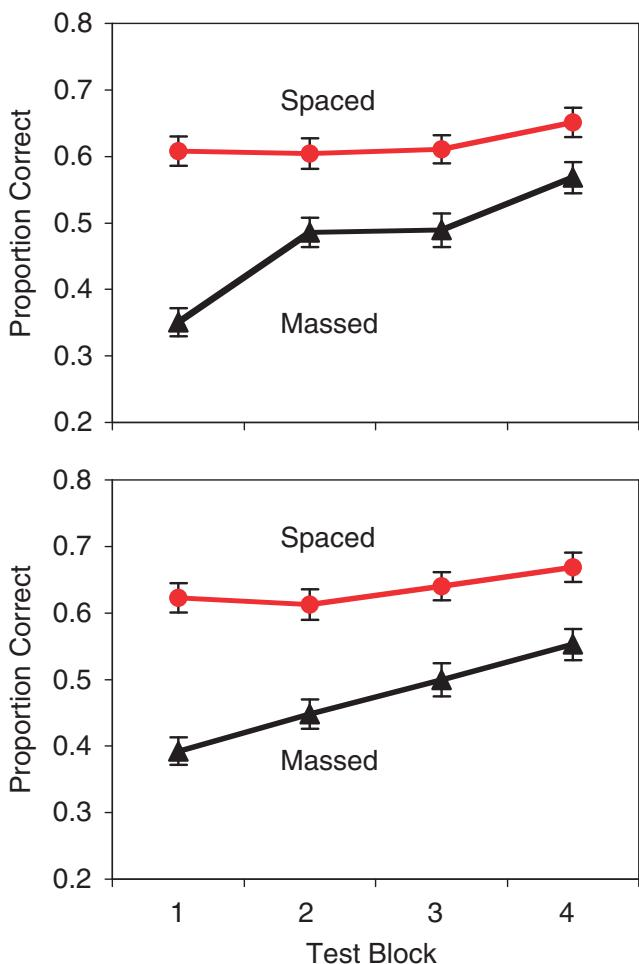
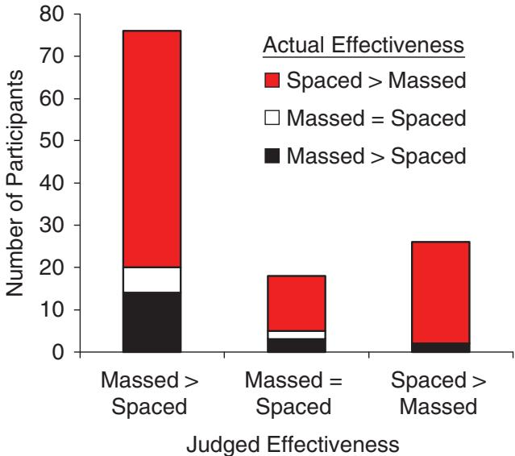
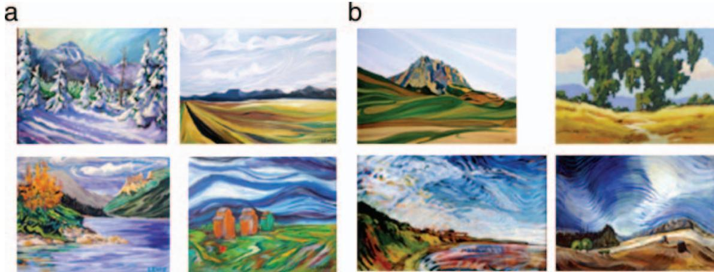
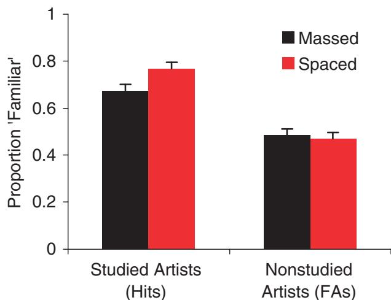

Research Article

# Learning Concepts and Categories

Is Spacing the "Enemy of Induction"?

Nate Kornell and Robert A. Bjork

University of California, Los Angeles

ABSTRACT- Inductive learning- that is, learning a new concept or category by observing exemplars- happens constantly, for example, when a baby learns a new word or a doctor classifies  $\mathbf{x}$  - rays. What influence does the spacing of exemplars have on induction? Compared with massing, spacing enhances long- term recall, but we expected spacing to hamper induction by making the commonalities that define a concept or category less apparent. We asked participants to study multiple paintings by different artists, with a given artist's paintings presented consecutively (massed) or interleaved with other artists' paintings (spaced). We then tested induction by asking participants to indicate which studied artist (Experiments 1a and 1b) or whether any studied artist (Experiment 2) painted each of a series of new paintings. Surprisingly, induction profited from spacing, even though massing apparently created a sense of fluent learning: Participants rated massing as more effective than spacing, even after their own test performance had demonstrated the opposite.

The spacing effect refers to the nearly ubiquitous finding that items studied once and revisited after a delay are recalled better in the long term than are items studied repeatedly with no intervening delay (e.g., Ceperda, Pashler, Vul, Wixted, & Rohrer, 2006; Dempster, 1996; Glenberg, 1979; Hintzman, 1974; Melton, 1970). The positive effects of spacing on long- term recall are large and robust, and have been demonstrated in a variety of domains, such as conditioning (even in animals as simple as Aplysia; see Carew, Pinsker, & Kandel, 1972), verbal learning (e.g., Bahrick, Bahrick, Bahrick, & Bahrick, 1993; Ebbinghaus, 1885/1964), motor learning (e.g., Shea & Morgan, 1979), and learning of educational materials (e.g., Bjork, 1979; Dempster, 1988).

In many everyday and educational contexts, however, what is important to learn and remember transcends specific episodes, instances, and examples. Instead, it is most important to learn the principles, patterns, and concepts that can be abstracted from related episodes or examples. In short, educators often want to optimize the induction of concepts and patterns, and there are reasons to think that such induction may be enhanced by massing, rather than by spacing. As stated by E.Z. Rothkopf (personal communication, September 1977), "spacing is the friend of recall, but the enemy of induction."

# SPACING AS THE ENEMY OF INDUCTION

There is a compelling logic behind Rothkopf's assertion. Massing allows one to notice the similarities between successive episodes or exemplars, whereas spacing makes doing so more difficult. Thus, for example, spacing presentations of individual paintings by a given artist will make it more difficult to notice any characteristics that define the artist's style because spacing increases the chances that those characteristics will be forgotten between successive presentations.

# MASSING AS THE FRIEND OF INDUCTION

The logic behind Rothkopf's assertion is so compelling that, to our knowledge, it has never been tested. Perhaps the most direct evidence that massing facilitates induction comes from a study by Kurtz and Hovland (1956), who asked participants to study simple drawings that varied on four dimensions: size, shape, position, and coloring. There were four categories of drawings that participants learned to identify; for example, a "Kem" was defined as a drawing containing a circle positioned near the top of the display. Each category was presented eight times, with the individual items either interleaved with items from the other

categories (i.e., spaced) or massed together. No item was ever repeated exactly. On a memory test following the study phase, participants' performance was better for drawings in the massed condition than for drawings in the spaced condition. Gagne (1950) obtained a similar result using four categories of nonsense- figure/nonsense- syllable pairs: Error rates were reduced when the highly similar category members were grouped together, instead of being interleaved.

Less direct evidence comes from experiments that compared exact and nonexact repetitions (i.e., verbatim repetitions vs. paraphrased or gist repetitions). In such experiments, the spacing effect appears to diminish or disappear altogether for nonverbatim repetitions (e.g., Appleton- Knapp, Bjork, & Wickens, 2005; Dellarosa & Bourne, 1985; Glover & Corkill, 1987). Similarly, Melton (1970) demonstrated that spacing effects do not occur when participants fail to recognize that a repeated item is a repetition. Given such findings, and given that inductive learning involves exposure to a variety of different exemplars and does not involve exact repetition, it seems possible that spacing effects will disappear or turn into massing effects in tasks requiring induction.

Finally, research in the domain of motor learning also provides indirect evidence that inductive learning may profit from massing, rather than spacing. Learning a motor skill, such as a tennis serve, involves induction in the sense that exposure to one's own proprioceptive feedback is an important component of learning—and such repetitions are, by necessity, not exact, especially for novices learning complex skills. Although spaced practice is effective in many areas of motor learning (e.g., Shea & Morgan, 1979), massed practice can be more effective for learning complex motor skills (Wulf & Shea, 2002).

# GOALS OF THE PRESENT RESEARCH

Thus, there are both logical and empirical reasons to expect massing, not spacing, to facilitate induction. One goal of the experiments reported here was to investigate the size of the massing effect—that is, the advantage of massed study over spaced study—in an inductive- learning context relevant to educational practice.

Another goal was to investigate participants' subjective assessments of massed versus spaced study in the context of induction. Prior research has demonstrated that people often rate massing as more effective than spacing, even in contexts in which spacing is actually superior (Baddeley & Longman, 1978; Simon & Bjork, 2001; Zechmeister & Shaughnessy, 1980). Such massing illusions may derive from the fact that metacognitive judgments are often grounded in feelings of fluency (e.g., see Benjamin, Bjork, & Schwartz, 1998). Presenting the same item twice consecutively makes processing the second presentation seem highly fluent, providing a (misleading) impression of learning, whereas spacing decreases the fluency of processing the second presentation. In other words, massing provides a sense of ease, which learners assume will translate to good memory on a later test, whereas spacing is often a "desirable difficulty" (Bjork, 1994) in the sense that it enhances long- term retention. If massing produces a sense of fluency of induction, participants may prefer massing to spacing in the induction task we used in these experiments.

# EXPERIMENTS 1A AND 1B

In this experiment, participants were asked to learn the styles of 12 different artists by viewing six different paintings by each artist. In Experiment 1a, spacing was manipulated within participants: Paintings by each of 6 of the artists were presented massed, and paintings by each of the other 6 artists were presented spaced. In Experiment 1b, spacing was manipulated between participants: For a given participant, the paintings were presented either all massed by painter or all interleaved (spaced). After the learning phase, participants were shown new paintings by the same 12 artists and asked to select, from a list of all the artists' names, the artist who had painted each new painting. After the test, participants in Experiment 1a were asked what presentation condition, massing or spacing, they felt had been more effective for learning a given artist's style.

# Method

# Participants

The participants were University of California, Los Angeles, undergraduates, who participated for course credit. There were 120 participants in Experiment 1a and 72 participants, 36 in each condition, in Experiment 1b.

# Materials

The materials were 10 paintings by each of 12 artists (Georges Braque, Henri- Edmond Cross, Judy Hawkins, Philip Juras, Ryan Lewis, Marilyn Mylrea, Bruno Pessani, Ron Schlorff, Georges Seurat, Ciprian Stratulat, George Wexler, and YieMei). Six paintings by each artist were presented during the study phase, and 4 more were presented during the test phase. All the paintings were landscapes or skyscapes. We selected artists who would be relatively unknown to the participants, although some of the paintings by Braque and Seurat may have been familiar to some of the participants (however, on the final test, average performance on paintings by those two artists was not better than average performance on paintings by all 12 artists). The paintings were cropped to remove identifying characteristics such as names and signatures, if necessary, and then resized to fit into a  $15 - \times 11$ - cm rectangle on a computer screen.

# Procedure and Design

Participants were instructed about the nature of the study and test phases and were then shown 72 paintings, 6 paintings by each of the 12 artists. Each painting was shown for  $3\mathrm{~s~}$  on a

computer screen, with the last name of the artist displayed below.

In Experiment 1a, the paintings by each of six of the artists were presented consecutively (massed), whereas the paintings by each of the other six artists were intermingled with paintings by other artists (spaced). The artists assigned to the massed and spaced conditions were determined randomly for each participant. Each successive block of six paintings consisted of six paintings by a given artist (massed, or M) or one painting by each of the six artists (spaced, or S). The order of the blocks was MSSMMSSMMSSM (see Fig. 1). In Experiment 1b, depending on the condition to which a participant was assigned, either all of the paintings were presented in the massed condition or all of the paintings were presented in the spaced condition.

At the end of the study phase, there was a 15- s distractor task, during which participants counted backward by 3s from 547; the test phase began when participants completed the distractor task. On each test trial, an unfamiliar painting by one of the 12 artists was presented. Participants indicated who they thought had created each painting by clicking their computer's mouse on 1 of 13 buttons, 12 labeled with the names of the artists and 1 labeled "I don't know." After this response, feedback was provided: The word "correct" followed a correct selection, and the correct artist's name was presented following an error.

There were 48 test trials divided into four blocks of 12 paintings. Each block consisted of one new painting by each of the 12 artists, presented in random order. After the test phase in Experiment 1a, participants were told the meanings of the terms massed and spaced and asked, "Which do you think helped you learn more, massed or spaced?" They were given three response options: "massed," "about the same," and "spaced." The same question could not be asked in Experiment 1b because participants did not experience both conditions.

# Results

In marked contrast to our expectations, spaced study resulted in significantly better test performance than did massed study, as measured by the proportion of artists identified correctly on the test (Fig. 2). (Experiment 1b was conducted after we came up with a convoluted conjecture that mixing massed and spaced paintings in a single learning phase created a spacing effect in Experiment 1a.) The advantage of spacing was significant in both Experiment 1a,  $F(1,119) = 77.35, p < .0001, \eta_p^2 = .39$ , and Experiment 1b,  $F(1,70) = 15.63, p < .001, \eta_p^2 = .18$ .

Not surprisingly, given that feedback was provided, test performance increased across test blocks- Experiment 1a:  $F(3,$ $357) = 26.99$ $p < .0001$ ${\eta_p}^2 = .18$  Experiment 1b:  $F(3,210)$ $= 11.56,p < .0001$ ${\eta_p}^2 = .14$  . The interaction of presentation condition and test block was significant- Experiment 1a:  $F(3,$ $357) = 13.25$ $p < .0001$ ${\eta_p}^2 = .10$  Experiment 1b:  $F(3,210)$ $= 3.33,p < .05$ ${\eta_p}^2 = .046$  This interaction appears to reflect the large increase from the first to the second test block in the massed condition, which may have been a consequence of the first test block acting as an additional, spaced study opportunity that benefited previously massed items in particular. A planned comparison of performance during the first test block, which

  
Fig. 1. The first 12 paintings presented to 1 of the participants in Experiment 1a (the artists in each condition were determined randomly for each participant). The first 6 paintings (left column) were all by the same artist (massed, or M), and the next 6 paintings (right column) were all by different artists (spaced, or S). In total, there were 12 blocks of 6 paintings in the order MSSMMSSMMSSM. Therefore, in the spaced condition, a given artist was represented by 1 painting in each S block.

  
Fig. 2. Proportion of artists selected correctly on the multiple-choice tests in Experiments 1a (top panel) and 1b (bottom panel) as a function of presentation condition (spaced or massed) and test block. Error bars represent standard errors.

was, presumably, largely unaffected by the presence of feedback, showed that participants performed significantly better in the spaced condition than in the massed condition, in both Experiment 1a  $M = .61$ $SD = .24$  vs.  $M = .35$ $SD = .24$ $t(119) = 10.82$ $p < .0001$ $p_{\mathrm{rep}} \approx 1.00$ $d = 0.99$  and Experiment 1b  $M = .59$ $SD = .22$  vs.  $M = .36$ $SD = .18$ $t(70) = 4.94$ $p < .0001$ $p_{\mathrm{rep}} \approx 1.00$ $d = 1.28$

The advantage of spacing over massing is all the more surprising given participants' responses on the questionnaire administered after the test. As Figure 3 shows, participants in Experiment 1a judged massing to be more effective than spacing, regardless of their performance in the two conditions. Overall,  $78\%$  of the participants did better with spaced presentations than they did with massed presentations, but  $78\%$  of the participants said that massing was as good as or better than spacing.

# Discussion

The results of Experiments 1a and 1b pose two puzzles. First, why did spacing, not massing, foster induction when there were compelling reasons to expect otherwise? Second, why did par Participants remain unaware that spacing was more effective than massing, even after taking the test? With respect to the second puzzle, we hypothesized that participants, while taking the test, might not have remembered which artists had been presented in which condition. To investigate this hypothesis, we presented 28 participants in Experiment 1a with a list of the artists' names, and asked them to indicate—after they had completed the test—how each artist's paintings had been presented (spaced or massed). Accuracy on the identification task was significantly above chance for artists whose paintings had been presented spaced  $M = .74$ $SD = .17$ $t(27) = 7.48$ $p < .0001$ $p_{\mathrm{rep}} \approx 1.00$ $d = 1.41$  but not for artists whose paintings had been presented massed  $M = .55$ $SD = .21$ $t(27) = 1.19$ $p = .25$ $p_{\mathrm{rep}} = .69$ $d = 0.23$  Participants' inability to remember which artists' paintings had been presented massed suggests that participants often, if not always, made their metacognitive judgments on the basis of their subjective experience during the study phase.

  
Fig. 3. Number of participants (out of 120) who judged massing as more effective than, equally effective as, or less effective than spacing in Experiment 1a. For each judgment, the number of participants is divided according to their actual performance in the spaced condition relative to the massed condition.

With respect to the puzzle of why spacing enhanced induction, one possible explanation is that the test required recalling a given artist's name, not just knowing his or her style, and spacing facilitates recall. It seems possible that participants did indeed induce an artist's style more effectively in the massed condition than in the spaced condition, but recalled the name associated with that style better in the spaced condition. Experiment 2 was designed to test that possibility by assessing participants' recognition, not recall, so that they did not need to remember name- style associations.

# EXPERIMENT 2

The learning phase in Experiment 2 was identical to the learning phase in Experiment 1a. However, during the test phase, par

ticipants were given a style- recognition test. All of the tested paintings were new paintings, as in Experiment 1, but participants were asked only to categorize a given test painting as by a "familiar artist" (i.e., by an artist whose paintings had been presented during the study phase) or as by an "unfamiliar artist." Thus, the test required remembering only studied artists' styles, not their names.

# Method

# Participants

The participants were 80 undergraduate students at the University of California, Los Angeles, who participated for course credit.

# Materials

The materials consisted of the same set of paintings used in Experiment 1, plus, for each studied artist, an additional set of four distractor paintings. Each distractor painting was chosen to be stylistically similar to a studied artist's paintings, and each distractor was by a different artist (see Fig. 4).

# Procedure

The study phase was exactly the same as in Experiment 1a, as was the questionnaire at the end of the experiment. The only difference from Experiment 1a was in the test phase (and associated instructions).

During each trial of the test phase, a painting was presented with two buttons on the computer screen; one button was labeled "familiar artist," and one was labeled "unfamiliar artist." Participants were instructed to select the "familiar artist" button if they thought the painting was by an artist whose paintings had been presented during the study phase, and to select the "unfamiliar artist" button if they thought the painting was by an artist whose paintings had not been presented during the study phase. There were four test blocks, each of which included one target painting and one distractor painting by a corresponding nonstudied artist, making a total of 24 paintings per block. No feedback was given during the test.

# Results

Recognition test trials are, inevitably, also learning events. A side effect of falsely endorsing a painting as by a familiar artist was that a participant might alter his or her concept of the familiar artist's style by incorporating aspects of a painting by an unfamiliar artist into that concept. On each successive test block, the potential for contamination created by false alarms grew, resulting in a significant decrease in recognition accuracy across test blocks,  $F(3,237) = 3.60$ ,  $p < .05$ ,  $\eta_p^2 = .04$ . Therefore, to gain maximum leverage on the question of interest, we restricted our analyses to the first test block, which provided the purest measure of the learning that occurred during the study phase of the experiment.

Again, we were surprised to find that performance in the spaced condition was superior to performance in the massed condition. As Figure 5 shows, the spaced and massed conditions produced similar rates of false alarms (i.e., saying that a painting by a nonstudied artist was by a studied artist), but the hit rate (i.e., correctly categorizing a new painting by a studied artist as by a familiar artist) was higher in the spaced condition ( $M = .77$ ,  $SD = .22$ ) than in the massed condition ( $M = .67$ ,  $SD = .24$ ), ( $79) = 3.28$ ,  $p < .01$ ,  $p_{\mathrm{rep}} = .98$ ,  $d = 0.41$ ). Consequently, there was a significant interaction between spacing condition and response type,  $F(1,79) = 7.84$ ,  $p < .01$ ,  $\eta_p^2 = .09$ . There was also a main effect of response type,  $F(1,79) = 177.82$ ,  $p < .0001$ ,  $\eta_p^2 = .69$ , with more hits than false alarms; this pattern of results shows that participants could distinguish between the target and distractor paintings. Thus, even in a situation that did not require participants to recall name- style associations, spacing led to more effective induction than did massing.

  
Fig. 4. Examples of four target (a) and four associated distractor (b) paintings from the test phase of Experiment 2. The target paintings were the same as those used in Experiment 1. The distractors were all by different artists, and each was selected to be similar to the paintings of a given studied artist.

  
Fig. 5. Results from the recognition test in Experiment 2: proportion of paintings judged to be painted by a studied artist as a function of whether the artist had been studied (hits) or had not been studied (false alarms, or FAs), separately for the spaced and massed conditions. Only data from the first test block were analyzed and plotted here. Error bars represent standard errors.

As in Experiment 1a, the participants' metacognitive judgments were strikingly at odds with their actual prior performance. Of the 72 participants who did not say that learning in the massed condition and learning in the spaced condition were "about the same," 64 thought massing had been more effective than spacing.

One possible explanation of the current findings is that schema induction happened early in the study phase. For example, the induction for each artist may have been "done" by the third study trial, so that the next three study trials amounted to either massed or spaced memory practice. To test this possibility, we conducted an additional experiment. The test phase was the same as in Experiment 2, but in the study phase, only two paintings by each artist (instead of six) were presented. We obtained the same pattern of results: There was a significant benefit of spaced study, but participants thought massed study had been more effective.

# GENERAL DISCUSSION

A common way to teach students about an artist is to show, in succession, a number of paintings by that artist. Counterintuitive as it may be to art- history teachers—and our participants—we found that interleaving paintings by different artists (spacing) was more effective than massing all of an artist's paintings together. A possible key to understanding the present findings involves the relationship between induction and discrimination.

# Induction and Discrimination

Experiment 1 required that participants discriminate among different artists' styles; that is, on the test, they had to decide which artist, among the 12 studied artists, had painted a given new painting. The interleaving of artists that was intrinsic to the spaced condition might have fostered such discrimination. For example, the key to deciding whether a tree is a maple or an oak (or some other tree) is learning to appreciate the differences among trees, not learning about a given type of tree in isolation. Interleaving had the effect of juxtaposing different paintings and therefore might have enhanced discrimination learning. (In fact, we have presented no evidence regarding the effects of temporal spacing in the absence of interleaving, and it may be interleaving, not spacing itself, that is the key to enhancing inductive learning.)

With respect to this possibility, the following observation by Kurtz and Hovland (1956) seems relevant: "When the degree of discriminability is low, it might be expected that placing of instances from different concepts in juxtaposition would facilitate discrimination learning, whereas with greater discriminability, like that obtaining in the present study, the reverse might obtain" (p. 242). Thus, if discrimination is not difficult, as was the case in Kurtz and Hovland's experiment, massing may be advantageous, but if discrimination is difficult, as it was in our experiments, spacing might be more effective.

This argument is appealing, but it is not entirely consistent with the results from Experiment 2. The recognition test in Experiment 2 required discriminating between paintings by previously studied artists and similar paintings by artists who had not been studied; it did not require distinguishing among artists whose work had been presented, and yet there was a benefit from spacing.

It could be argued that a by- product of being better able to distinguish among the presented artists is being able to distinguish those artists, as a group, from other artists. It may be rare, in fact, that a concept or category (such as what psychology is or how to fly a kite) is ever learned without the need to discriminate it from other categories (such as sociology or ways to make a kite fall).

Our results notwithstanding, there surely are situations in which massing is more effective for induction than is spacing. We attempted to create one such situation by asking participants to figure out, and remember on a later test, the single word that could be used to fill in the blanks in each of 12 sets of six words; for example, in the case of __cracker, __wood, __side, __ant, __truck, __arm, the word to be generated and remembered was fire. The design was similar to the design of Experiment 1a—that is, half of the sets that defined a to- be- remembered word were presented massed, whereas the other half were presented spaced—and 20 undergraduate participants were tested. In this case, spacing made it nearly impossible to solve the problems, and, thus, later memory for the target words was significantly better in the massed condition than in the spaced condition (.34 vs. .22),  $t(19) = 2.78, p < .05$ ,  $p_{\mathrm{rep}} = .94, d = 0.65$ .

Admittedly, this simple experiment was contrived to be a situation in which massing, not spacing, would enhance the

generation and memory of the critical words. The experiment demonstrates, however, that whether spacing is the friend or enemy of induction is a matter for sophisticated theorizing, because induction is a product of conceptual and memory processes that are open to multiple situational influences. The important point, though, is that in less contrived and more complex real- world learning situations, spacing appears to facilitate induction.

# Practical Implications

Inductive learning—that is, learning from examples—is a key element of formal education, and of how humans (and other animals) informally learn about the world. There are many inductive- learning situations that would seem, from an intuitive standpoint, to lend themselves to massed study, but may not. Examples include a baby learning what chair means by observing people talking about chairs; an older child learning the rules of a language, such as that most plural English words end in  $s$ , by listening to people speak the language; a student in school learning how words are spelled by reading them (as well as through more direct instruction); a quarterback learning to recognize a complex pattern of motion that predicts an interception by gaining experience in practice and during games; a monkey learning to recognize the warning signs that another monkey is acting threateningly by observing other monkeys' behavior; and a medical student learning to recognize warning signs of lung cancer by reading x- rays under an expert's supervision. Our results cannot necessarily be generalized to all of these situations, of course, but they do suggest that in inductive- learning situations, spacing may often be more effective than massing, even when intuition suggests the opposite.

Our results also suggest that individuals responsible for the design and evaluation of instruction that involves induction are susceptible to being very misled by their own intuitions and subjective experiences. Although prior experiments (Baddeley & Longman, 1978; Simon & Bjork, 2001; Zechmeister & Shaughnessy, 1980) have shown that people can experience an illusion that massing is effective, we know of no experiment that can match the current findings in terms of sheer inaccuracy of judgments. In Experiments 1a and 2 combined,  $85\%$  of the participants did at least as well in the spaced condition as in the massed condition, but  $83\%$  of the participants rated the massed condition as equally effective as or more effective than the spaced condition. The illusion of effective learning in the massed condition, based, apparently, on a sense of fluency of induction, was clearly powerful in the experiments presented here. In real- world inductive- learning tasks, therefore, it seems likely that people will be heavily influenced by the illusory benefits of massing when making decisions about their own learning or the learning of their students or children. That is, most people are likely to prefer massing in inductive- learning situations, but our results suggest that they may do so at their own (and their students' and children's) peril from a learning standpoint.

# CONCLUSION

Looking back at our own inability to foresee the benefits of spacing, perhaps we fell victim to the same illusion that we have railed against (e.g., Bjork, 1994, 1999; Kornell & Bjork, 2007), namely, the illusion that a sense of ease or fluency accompanies effective learning, whereas a sense of difficulty signifies ineffective learning. In the case of induction, as in many other types of learning, spacing appears to be sometimes, if not always, a desirable difficulty (Bjork, 1994).

Acknowledgments—We thank Makah Leal and Timothy Wong for their invaluable contributions to all facets of the experiments, Elizabeth Bjork for her insights, and Katherine Huang and Jeri Little for their help carrying out the experiments. Grant 29192G from the McDonnell Foundation supported this research.

# REFERENCES

Appleton- Knapp, S., Bjork, R.A., & Wickens, T.D. (2005). Examining the spacing effect in advertising: Encoding variability, retrieval processes and their interaction. Journal of Consumer Research, 32, 266- 276. Baddeley, A.D., & Longman, D.J.A. (1978). The influence of length and frequency of training session on the rate of learning to type. Ergonomics, 21, 627- 635. Bahrick, H.P., Bahrick, L.E., Bahrick, A.S., & Bahrick, P.E. (1993). Maintenance of foreign language vocabulary and the spacing effect. Psychological Science, 4, 316- 321. Benjamin, A.S., Bjork, R.A., & Schwartz, B.L. (1998). The mismeasure of memory: When retrieval fluency is misleading as a metamnemonic index. Journal of Experimental Psychology: General, 127, 55- 68. Bjork, R.A. (1979). An information- processing analysis of college teaching. Educational Psychologist, 14, 15- 23. Bjork, R.A. (1994). Memory and metamemory considerations in the training of human beings. In J. Metcalfe & A. Shimamura (Eds.), Metacognition: Knowing about knowing (pp. 185- 205). Cambridge, MA: MIT Press. Bjork, R.A. (1999). Assessing our own competence: Heuristics and illusions. In D. Gopher & A. Koriat (Eds.), Attention and performance XVII: Cognitive regulation of performance: Interaction of theory and application (pp. 435- 459). Cambridge, MA: MIT Press. Carew, T.J., Pinsker, H.M., & Kandel, E.R. (1972). Long- term habituation of a defensive withdrawal reflex in Aphysia. Science, 175, 451- 454. Cepeda, N.J., Pashler, H., Vul, E., Wixted, J.T., & Rohrer, D. (2006). Distributed practice in verbal recall tasks: A review and quantitative synthesis. Psychological Bulletin, 132, 354- 380. Dellarosa, D., & Bourne, L.E. (1985). Surface form and the spacing effect. Memory & Cognition, 13, 529- 537. Dempster, F.N. (1988). The spacing effect: A case study in the failure to apply the results of psychological research. American Psychologist, 43, 627- 634. Dempster, F.N. (1996). Distributing and managing the conditions of encoding and practice. In R. Bjork & E. Bjork (Eds.), Memory (pp. 317- 344). San Diego, CA: Academic Press.

Ebbinghaus, H.E. (1964). Memory: A contribution to experimental psychology (H.A. Ruger & C.E. Bussenius, Trans.). New York: Dover. (Original work published 1885)Gagne, R.M. (1950). The effect of sequence of presentation of similar items on the learning of paired- associates. Journal of Experimental Psychology, 40, 61- 73. Glenberg, A.M. (1979). Component- levels theory of the effects of spacing of repetitions on recall and recognition. Memory & Cognition, 7, 95- 112. Glover, J.A., & Corkill, A.J. (1987). Influence of paraphrased repetitions on the spacing effect. Journal of Educational Psychology, 79, 198- 199. Hintonman, D.L. (1974). Theoretical implications of the spacing effect. In R.L. Solso (Ed.), Theories in cognitive psychology: The Loyola symposium (pp. 77- 97). Potomac, MD: Erlbaum.Kornell, N., & Bjork, R.A. (2007). The promise and perils of self- regulated study. Psychonomic Bulletin & Review, 14, 219- 224. Kurtz, K.H., & Hovland, C.I. (1956). Concept learning with differing sequences of instances. Journal of Experimental Psychology, 51, 239- 243.

Melton, A.W. (1970). The situation with respect to the spacing of repetitions and memory. Journal of Verbal Learning and Verbal Behavior, 9, 596- 606. Shea, J.B., & Morgan, R.L. (1979). Contextual interference effects on the acquisition, retention, and transfer of a motor skill. Journal of Experimental Psychology: Human Learning and Memory, 5, 179- 187. Simon, D.A., & Bjork, R.A. (2001). Metacognition in motor learning. Journal of Experimental Psychology: Learning, Memory, and Cognition, 27, 907- 912. Wulf, G., & Shea, C.H. (2002). Principles derived from the study of simple skills do not generalize to complex skill learning. Psychonomic Bulletin & Review, 9, 185- 211. Zechmeister, E.B., & Shaughnessy, J.J. (1980). When you know that you know and when you think that you know but you don't. Bulletin of the Psychonomic Society, 15, 41- 44.