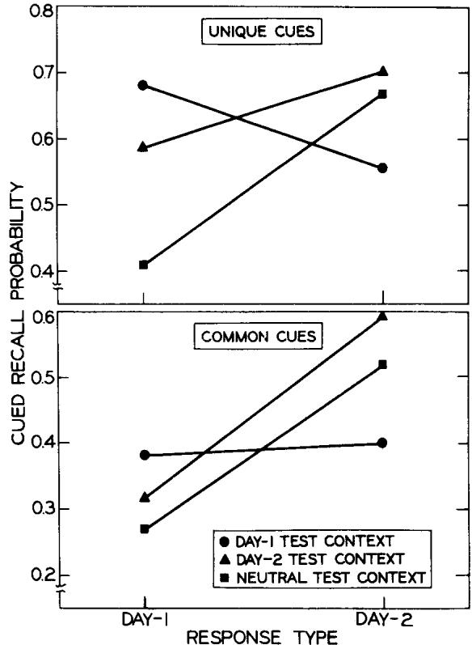

# Environmental context and human memory

STEVEN M. SMITH and ARTHUR GLENBERG  University of Wisconsin, Madison, Wisconsin 53706

and

ROBERT A. BJORK  University of California, Los Angeles, California 90024

Five experiments examined the effects of environmental context on recall and recognition. In Experiment 1, variability of input environments produced higher free recall performance than unchanged input environments. Experiment 2 showed improvements in cued recall when storage and test contexts matched, using a paradigm that unconfounded the variables of context mismatching and context change. In Experiment 3, recall of categories and recall of words within a category were better for same- context than different- context recall. In Experiment 4, subjects given identical input conditions showed strong effects of environmental context when given a free recall test, yet showed no main effects of context on a recognition test. The absence of an environmental context effect on recognition was replicated in Experiment 5, using a cued recognition task to control the semantic encodings of test words. In the discussion of these experiments, environmental context is compared with other types of context, and an attempt is made to identify the memory processes influenced by environmental context.

That one's ability to retrieve (or recognize) an item is heavily influenced by the relation between that item's storage and retrieval contexts is indisputable. "Context," however, is a kind of conceptual garbage can that denotes a great variety of intrinsic or extrinsic characteristics of the presentation or test of an item. The particular concern of this article is whether the general environmental context in which an item is presented or tested can be conceptualized to function in the same fashion as contextual factors that have more obvious influences on the encoding of an item, such as the nature of surrounding items (Gartman & Johnson, 1972). A second concern of this article is to identify specific cognitive processes affected by the environmental context.

Context has been named as the agent responsible for a number of phenomena. It may induce one The first two experiments are based upon a thesis submitted by the first author to the University of Michigan in partial fulfillment of the requirements for an undergraduate honors degree. The last four experiments are based upon a thesis submitted by the first author to the University of Wisconsin in partial fulfillment of the requirements of the Masters of Science degree. The authors are indebted to Elizabeth Bjork, who helped with the design of Experiment 1, and to William Epstein for helping to clarify certain theoretical issues. Thanks are also due to David Grant and Marian Schwartz for participating on the first author's masters oral examination committee. This research was partially supported by the United States Public Health Service Grant 1- R01- MH26643- 01 to A.M. Glenberg. Requests for reprints should be sent to Steven M. Smith, Department of Psychology, University of Wisconsin, Madison, Wisconsin 53706.

encoding or another, it may be an intrinsic part of a memory trace, it may be used in matching and decision processes for recognition memory, it may provide a retrieval cue for recall, and it may be used for resolution of lexical and semantic ambiguity. The type of context being referred to, however, is not always specified, and it is not empirically clear that all types of context play identical roles with respect to these mental phenomena. Bower states that context is made up of "background external and interoceptive stimulation prevailing during presentation of the phasic experimental stimuli ... [plus the subject's] mental set" (1972, p.93). Anderson and Bower add to the definition "physical characteristics of an item's presentation, implicit associations to the items, and some cognitive elements representing the list in question" (1974, p.409). To attribute an identical formal effect to all such aspects of an item's context may or may not turn out to be a valid speculative leap, but there is little in the way of empirical evidence that would argue for or against such a notion.

Context has been referred to and examined in a variety of forms. Carr (1917, 1925), one of the original investigators of context, found that changes in maze orientation and illumination disrupted the maze- running performance of rats. Burri (1931) studied context in the form of audience vs. no audience; Dulsky (1935) examined effects of the background color of response words; and Reed (1931) studied changes of sensory mode and posture. Gartman and Johnson (1972) investigated contextual effects of nearby list words; Epstein (1961) examined syntactic context; and Eich,

Weingartner, Stillman, and Gillin (1975) studied context as a state of mind associated with the presence or absence of a drug. It is not obvious that one should expect all of these "contexts" to play the same functional role in human memory.

The present set of experiments deals with the physical aspects of the experimental situation, referred to in this paper as environmental context. Elements of the environmental context include such things as the time of day, the building and room in which to- be- remembered items are presented, the appearance of the experimenter, and the sensory mode of the stimuli. Past studies of environmental context have found that recall and relearning performance improves if the subject is tested in his original learning environment, rather than a changed one (Reed, 1931; Smith & Guthrie, 1924), and that retroactive interference (RI) is reduced if interpolated learning occurs in an environment different from that of original learning (Bilodeau & Schlosberg, 1951; Greenspoon & Banyard, 1957; Strand, 1970).

The interpretation of these environmental context effects has generally been that the learned material is somehow connected or associated with an internal representation of the physical environment. Strand (1970), however, asserted that environmental context was being confused with what she termed "psychological disruption." Strand pointed out that subjects in the Bilodeau and Schlosberg (1951) investigation were disrupted in the changed- context condition, but not in the same- context condition. This disruption, she stated, enabled subjects to more easily distinguish between the two sets of words, thus causing less interference. To test this hypothesis, she added another condition to the Bilodeau and Schlosberg (1951) experiment, having subjects momentarily leave and return to the same room before the interpolated learning session. Strand found that disruption and environmental context change reduced RI to the same extent when contrasted with the same- context undisrupted condition.

The effect of psychological disruption was contrasted with the effects of environmental change by Godden and Baddeley (1975), whose two environments were dry land and underwater (with Scuba divers as subjects). Although there were strong effects of environmental context change upon free recall performance, they found no effect of psychological disruption.

In the present set of experiments, psychological disruption was controlled rather than studied; all subjects were similarly disrupted in all conditions. Whether or not disruption provides a means of delimiting sets of words in memory, the paradigms we employ provide a means of viewing the effects of environmental context uncontaminated by any possible influence of psychological disruption.

In addition to a comparison of environmental context with other types of context, a second concern is to identify the locus of the environmental context effects. It has become clear that memory tasks such as recall and recognition involve more than a single mental process. The present set of studies represents a first attempt to isolate the effects of environmental context on encoding, retrieval, and decision processes. Experiments 1 and 2 examine effects of environmental context at input and output, respectively. Experiment 3 tests environmental effects on recall of a categorized word list, and Experiments 4 and 5 contrast environmental context effects on retrieval and decision processes.

# EXPERIMENT 1

The intralist spacing (lag) of repetitions of individual words has been a topic of considerable interest and investigation. The predominate finding has been that recall increases directly with the spacing of the presentations of repeated words (the lag effect). The types of theoretical explanations that have held up best under these investigations are derived from considerations of encoding variability (Bower, 1972; Estes, 1955; Glenberg, 1976) and differential organization (Glenberg, 1977; Melton, 1970). These theories assume that the encoding of an item (and consequently, the way that item can be retrieved) is a function of the context in which the item is repeated. In addition, the context is subject to "random contextual drift" (Bower, 1972); that is, it changes as a function of time. Items repeated after a short lag, in the same context, derive little benefit from the second presentation since no new retrieval information is encoded. Items repeated after longer lags are likely to be repeated in different contexts so that different retrieval information is developed at the two presentations. Therefore, the items repeated after the longer lags are more accessible and are recalled more often than the items repeated after the shorter lags.

Rather than relying upon "random contextual drift," Gartman and Johnson (1972) varied the intralist contexts (preceding the presentations of repeated items) orthogonally with the interpresentation lag. Repeated items were placed within semantic contexts intended to induce either two different sets of encodings or the same encoding twice. For example, if the presentations of the word "foot" were preceded first by the list words "inch" and "meter" and then later by "arm" and "hand," two different contexts (and encodings) would be induced. Preceding the second presentation of "foot" by "mile" and "yard" would induce the same context and the same encoding. Using this paradigm, Gartman and Johnson (1972) found that words repeated within two different contexts were recalled much more often than words repeated within similar contexts, regardless of the interpresentation lag.

Experiment 1 was designed to be similar to the

Gartman and Johnson (1972) experiment, but with two important differences: The repeated item was not a single word, but a list of words, and the contexts that were manipulated were not semantic contexts, but environmental contexts. A list was repeated after a 3- h interval either in the same or in a different environmental context, and subjects were then tested for free recall in a neutral context after an additional 3- h interval. The neutral context was not obviously similar to either of the input contexts, and hence, should not have favored retrieval from one context of the other. If the two contexts induce two sets of retrieval information, then subjects in the different input- context condition would be expected to recall more than subjects in the same input- context condition.

# Method

Subjects. The 16 subjects were undergraduate men and women from the paid subject pool of the Human Performance Center at the University of Michigan. Eight subjects were assigned to each condition. Each was paid \(\) 3.50$ after the final session.

Materials and Apparatus. The to- be- remembered list contained 40 unrelated, common, four- letter English nouns, presented in a fixed order for all conditions. In one of the two contexts, the words were presented by means of a cassette recorder, and in the other context, they were projected via a Carousel slide projector.

Design. In the same input- context condition, subjects studied the to- be- remembered list in exactly the same physical setting on each of two learning sessions, and in the different input- context condition, subjects studied the list in two quite different physical settings. After the two learning sessions, subjects in both conditions were tested for their free recall of the list in a neutral context.

Contexts. Although the same word list was presented in both contexts, the physical appearances of the two contexts were very dissimilar. Context P (Perry School) involved a small room in an old building off the main University of Michigan campus. The room had a large blackboard, glass cabinets, no windows, and a general clutter very different from that in the other context (Context M). Words were presented on slides in a semidarkened room where only a small red light and the slide projector provided illumination. Context M (Mason Hall) involved a very tiny compartment within the animal laboratories in a large, modern, central campus building. Two windows overlooked a large courtyard, and a one- way mirror covered another wall. Instructions and word lists were presented by a female voice on a tape recorder. The neutral context was a large classroom with large windows overlooking a busy street, and there was little clutter around the room. Although the same experimenter was present in all contexts, the appearance of the experimenter was varied systematically and substantially. He wore a coat and tie in Context P, a flannel shirt and jeans in Context M, and something in between in the neutral context.

Procedure. Subjects were tested in groups of two. In the first session, subjects were instructed to try to learn the words in any way possible, after which they were presented the 40- word list at 3- sec intervals on the tape, or at 2- sec intervals on the slides. The subjects were then asked to rate each word in terms of its affective value. Each rating consisted of placing a mark on a continuum where "good" was printed on one side and "bad" on the other. The same list was again presented, and subjects were allowed 10 sec/word to rate each word on the continuum. The purpose of this affect test was to give the session a sense of closure, so that subjects would not actively rehearse words between sessions (they were not informed that they would be asked to recall the words at a later session).

Table 1 Proportion of Words Recalled in Neutral Context as a Function of the Contexts of the Two Learning Sessions  

<table><tr><td rowspan="2">Session 2 Learning Context</td><td colspan="2">Session 1 Learning Context</td></tr><tr><td>P</td><td>M</td></tr><tr><td>P</td><td>.41</td><td>.69</td></tr><tr><td>M</td><td>.53</td><td>.39</td></tr></table>

The second session  $^{13}\mathrm{h}$  after the first, involved the same procedure as the first, either in the same context or in the other context.

Three hours after the second session, subjects were brought to the neutral context and were given a surprise free recall test in which they were given  $10\mathrm{min}$  to write down any experimental words they could remember. Afterward, subjects were asked if they had rehearsed any words between the sessions.

# Results and Discussion

Table 1 shows free recall probabilities for both same (main diagonal) and different input- context conditions. The results are clear and striking. Subjects whose list inputs were repeated in the same environmental context recalled an average of 15.9 words from the 40- word list, whereas subjects who were presented the list in two different contexts recalled an average of 24.4 words.

A 2 by 2 (first input context by second input context) analysis of variance was computed for the data. The environmental context effect of interest here is the First Input Context by Second Input Context interaction, which was significant  $[\mathrm{F}(1,12) = 50.63$ $\mathbf{M}\mathbf{S}\mathbf{e} = 5.71$ $\mathbf{p} < .001]$

The main effects for first and second input context were also significant. Subjects recalled most if given Context M for the first session  $[\mathrm{F}(1,12) = 7.40$ $\mathbf{M}\mathbf{S}\mathbf{e} = 5.71$ $\mathbf{p} < .05]$  and Context P for the second session  $[\mathrm{F}(1,12) = 6.31$ $\mathbf{M}\mathbf{S}\mathbf{e} = 5.71$ $\mathbf{p} < .05]$  .The affect tests appear to have served their purpose since subjects were unanimous in reporting that they did not rehearse list words between sessions.

The superiority of the different input- context group is consistent with at least the following three hypotheses: a search- set hypothesis, a single- link hypothesis, and a retrieval- decision hypothesis. According to the search- set hypothesis, context serves to delimit or cue entire sets of items in memory. Thus, the different input- context condition in Experiment 1 might have resulted in two distinct sets of encoded items (although the items within the sets, the list of words, would be similar), whereas the same input- context condition yielded only one set of encodings. Given that the subject could access both of these distinct sets at the test, the probability of retrieving an item from two possible sets should be greater than the probability of retrieving that item from one search set.

The single- link hypothesis states that the environ

mental context is directly linked with the internal representations of the individual list items. According to this hypothesis, the different input- context condition resulted in more retrieval information stored with the encodings of each list exemplar, making those items more likely to be recalled than exemplars encoded with less contextual information.

Finally, given that the contextual information is stored with each encoding, the changed context may have affected decision processes in recall. That is, according to the retrieval- decision hypothesis, environmental context may not influence trace access, but may have facilitated the decision whether a given trace represented an item presented in the experiment. Experiments 3, 4, and 5 are relevant to deciding among these three alternative accounts of the influence of environmental context.

# EXPERIMENT 2

In Experiment 1 environmental context was varied at input, leaving test conditions constant for both groups. Inferences about the effects of environmental context in that experiment, therefore, suggest that the environmental context influences what is stored in memory. Experiment 2 examined effects of environmental context at test by holding input conditions constant for all groups and varying the output environments.

The basic context effect, that same- context recall is better than different- context recall, suggests that performance is facilitated by reinstatement of one's learning environment. It is possible, however, that this basic result is not a result of matching or mismatching input and output environments, but rather reflects a recall decrement caused by being in a new environment. Subjects in Experiment 2 learned paired associate lists in different environmental contexts on 2 consecutive days and were tested on the third day for cued recall in their Day 1 context, Day 2 context, or in a third (neutral) context. The two lists used completely different response terms. Some of the stimuli, however, were common to both lists, being paired with different responses in the different contexts. If context matching, rather than context change, is responsible for the environmental context effect, then subjects tested in their Day 1 environment should recall more responses learned on Day 1 than subjects tested in their Day 2 or neutral environments, and subjects tested in their Day 2 environments should recall more Day 2 responses than subjects tested in the Day 1 or neutral contexts.

# Method

Subjects. The 24 subjects were University of Michigan undergraduates. Each was paid $4 after the final session.

Materials. The two lists consisted of 45 word pairs each. Target words were high- frequency English nouns, and the cue words paired with them were designed to be weak cues: That is, the relation between the cue word and its target word was strong enough that the subject would not have great difficulty pairing the two, but weak enough that, given the cue word, a subject would free associate the target word with a very low frequency. Examples are: car- BODY, smell- CABBAGE, and black- SPIDER.

Fifteen of the cue words were common to both lists. For example, in List 1 the pair black- SPIDER would appear and in List 2 would be black- TRAIN. The remaining 30 cue words in each list were unique.

Design. On Day 1 the subject was presented with one list in one context, after which he was tested for cued recall on 15 of the 30 unique pairs from that list. On Day 2 he was presented the other list in the other context and was tested on 15 unique pairs from that list. On Day 3 subjects were tested in their Day 1 context (Group 1), in their Day 2 context (Group 2), or in the neutral context (Group N). The final cued recall test consisted of the 15 common- cue items, followed by the 30 untested unique pairs from the two lists. Since the greatest concern was response to the common cues, they were tested first in order to avoid recreating either list context. For example, if a number of unique List 1 items preceded the testing of a common cue, then the List 1 response to the common cue might be dominant, and list context would be confounded with environmental context.

The order of presentation of lists and contexts was counterbalanced. There were eight subjects in each of Groups 1, 2, and N.

Contexts. The environmental contexts used were the same as those used in Experiment 1, except that in addition, the two contexts differed in time of day. Context M was used at 8:00 a.m., Context P at 4:00 p.m., and Context N at 12:00 noon. Cue words in the final test were on slides in Context P, on a tape recorder in Context M, and in Context N they were read aloud by the experimenter as they were shown printed on index cards.

Procedure. Subjects were tested in pairs. Before a presentation session (Days 1 and 2), subjects were asked to relate and associate each cue word with its target word since they would be tested on the pairs at the end of the session. A pair was read every 4 sec on the tape recording, or it was seen every 3 sec on the slides. A list was presented four times in a presentation session, the order of the pairs being changed for each presentation. As a test, 15 unique cue words were presented at 10- sec intervals, and the subject was asked to write the appropriate response for each.

On Day 3, the final test session, subjects were asked to write appropriate responses to each cue word and they were cautioned that there might be more than one appropriate response, in which case they were to give all appropriate responses. Cue words were presented at 15- sec intervals.

After the test subjects were asked to label each response they had made according to the context in which they had been presented that target word. If they could not remember, they were instructed to label that response with an "O." Subjects were also asked if they had rehearsed the words outside of the experimental sessions.

# Results and Discussion

The results for common cues and unique cues are shown in Figure 1. Both sets of data bear out the primary prediction, that events are recalled best when tested in the environment where they were learned. Day 1 type responses (words from the Day 1 list) were remembered best by Group 1, whose average improvement over Group 2 and Group N was 31% for the common cues and 34% for the unique cues. Group 2 recalled the most Day 2 type responses with an average

  
Figure 1. Experiment 2 recall probabilities for unique cues and common cues: Circles indicate a Day 1 test context, triangles indicate a Day 2 context, and squares indicate a neutral test context.

recall improvement over Group 1 and Group N of  $28\%$  for common cues and  $12\%$  for unique cues.

A 3 by 2 by 2 by 2 (context by order of context by response type by cue type) analysis of variance revealed significant effects of cue type  $[\mathrm{F}(1,18) = 60.6$ $\mathbf{MSe} = 3.2$ $\mathbf{p} < .001]$  and of response type  $[\mathrm{F}(1,18) = 13.2$ $\mathbf{MSe} = 9.6$ $\mathbf{p} < .01]$ .

The critical interaction, that of Context by Response Type, was not significant  $[\mathrm{F}(1,18) = 2.2$ $\mathbf{MSe} = 9.6$ $\mathbf{p} > .05]$ , even though the interaction seems apparent in the data. This null finding is caused by Group N, which inflated the error variability while dampening the critical comparison between Groups 1 and 2. An additional analysis of variance was computed, excluding Group N. This analysis revealed a significant Context by Response Type interaction  $[\mathrm{F}(1,12) = 4.8$ $\mathbf{MSe} = 7.4$ $\mathbf{p} < .05]$ .

Group 1 yielded more double responses to common cues than did Group 2, which scored lowest on this measure. Although interpretation of this measure is speculative, it seems reasonable to suggest that the combination of a recency effect for Day 2 responses plus the environmental context effect for Day 1 responses produced the frequent double responses for Group 1.

When recall was finished, subjects were asked to identify the environment in which each response had been presented. Context- identification performance was nearly identical for all three groups, about  $70\%$ .

Two anomalous findings were the difference between Groups N and 2 for memory of Day 1 items, and the difference between Groups N and 1 on Day 2 items. These effects were not predicted, nor are they readily explained by any of the present theories of environmental context.

To briefly summarize, Experiments 1 and 2 have demonstrated large effects due to the environmental context over and above those effects that can be attributed to disruption (Strand, 1970). These environmental context effects appear to be similar to other context effects in that (1) the environmental context at input affects what is stored in memory, and (2) performance on a memory test is affected by the match or mismatch between the input and test contexts as suggested by the encoding specificity principle (Thomson & Tulving, 1970) and state- dependent learning phenomena (e.g., Eich et al., 1975).

# EXPERIMENT 3

The intent of the remaining experiments is to begin to localize the specific processes that are influenced by environmental context. Recall of a categorized word list should allow us to examine at least two distinct types of retrieval processes that may be so affected. The first is retrieval and delimitation of an entire set of information in memory, and the other is an associative or hierarchical chaining throughout the elements of a chosen search set. The search- set hypothesis predicts that category recall will be adversely affected by a change in the context between input and test, but that recall of words within a category will not be so affected. If, however, contextual information is an integral part of each encoding or is associated with it (the single- link hypothesis), then recall of both categories and words within categories will be affected by the context change.

Independence of recall of categories and recall of elements within categories has been frequently demonstrated (e.g., Cohen, 1966; Tulving & Pearlstone, 1966). The present experiment was not intended to test the independence of these two retrieval processes; rather, we wanted to examine whether one or both of these processes are influenced by environmental context.

Categorized list recall has been reported by Eich et al. (1975), who studied the effects of what they called an "inner experiential context" associated with a drug state. Eich et al. found impaired category recall when the input and output drug states did not match, but the decrease in words recalled per category associated with the inner context change did not quite reach statistical significance. It is possible that the small category size used in that study (four items per category) may have reduced the chance of detecting

a small context effect upon recall of words within a category. To avoid this possibility, the present study used a category size of eight items. We tried to insure that all eight items were represented as belonging to the same category (or search set) by having subjects categorize the words during the learning task.

# Method

Subjects. Twenty introductory psychology students at the University of Wisconsin were given course credit for serving in the experiment.

Materials. Ten categories with eight exemplars from each category were selected from the Marshall and Cofer (1970) word- association norms. High- and low- frequency exemplars were selected from each category. Category names were printed on a sheet of paper, and one exemplar was printed on each of 80 cards.

Contexts. The two environmental contexts were quite different, each having characteristic locations, appearance, and time- of- day referents. Context A was on the second floor of the Brogden Psychology building on the University of Wisconsin- Madison campus. Its walls were barren, the floors were tile, and a considerable amount of electronic equipment (e.g., timers, tape recorder, videotape machine, etc.) was strewn about. The experimenter wore a T- shirt and jeans, and Context A was used only in the morning. Context B was in the basement of the building. The walls were decorated with pictures and posters, the floor was carpeted, and there were books and plants arranged about the room. Covering the ceiling was a brightly colored drapery, and there was the scent of perfume present. The experimenter wore a suit and a tie, and Context B was used only in the afternoon. The environmental contexts described here were also used in Experiments 4 and 5.

Design and Procedure. Subjects attended two 20- min sessions separated by a 1- day interval. Subjects were informed at the first session that the experiment dealt with the way that verbal materials are categorized. Instructions were to sort the shuffled pile of category exemplars into 10 piles, placing each pile next to its proper superordinate on the list of category names. Subjects then wrote the exemplars in their distinct categories, designating for each word whether it seemed to be a "good or common" exemplar of the category or a "poor or uncommon" exemplar. This procedure was adopted so that subjects would devote a good deal of processing to the words, but would not rehearse words between sessions.

On the second day, in the same or in a different context, subjects were given a blank page and asked to write all of the category exemplars they could recall, recall could be done in any order. Subjects were given a maximum of  $15\mathrm{min}$  for free recall. Payment was made after the second session.

# Results and Discussion

The mean recall scores for Experiment 3 are shown in Table 2. Two separate 2 by 2 by 10 (context by test context by category) analyses of variance were computed, one using the number of categories recalled, and the other using the number of words recalled per recalled category as the dependent measure.

The analysis of the number of categories recalled showed a significant effect of context  $[\mathrm{F}(1,16) = 5.65$ $\mathbf{MSe} = .13$ $\mathsf{p} < .05]$  . Eight out of 10 categories were recalled more frequently by subjects in the same- context condition. This finding is consistent with the hypothesis that states that environmental context facilitates retrieval and delimitation of a search set.

Table 2 Mean Recall in Experiment 3  

<table><tr><td rowspan="2"></td><td rowspan="2">Total Possible</td><td colspan="2">Context</td></tr><tr><td>Same</td><td>Different</td></tr><tr><td>Words</td><td>80</td><td>48.9</td><td>34.7</td></tr><tr><td>Categories</td><td>10</td><td>8.8</td><td>7.6</td></tr><tr><td>Words per Recalled Category</td><td>8</td><td>5.6</td><td>4.5</td></tr></table>

The effect of environmental context was also significant in the analysis of the number of words recalled per recalled category  $[\mathrm{F}(1,16) = 8.95$ $\mathsf{p} < .01]$  . Same- context subjects, on the average, recalled more words in every category than different- context subjects.

This result does not necessarily indicate that category recall and recall of words within a category are not independent processes. What it does imply is that some memory process other than search- set retrieval is affected by changes of environmental context. This result is consistent, for example, with the idea that the environment, or its representation in memory, is more directly linked with encoded verbal material than is implied by the search- set hypothesis. It is possible that the environment, or a part of it, is directly associated with individual list words, or that the environment helps a subject to determine whether a potential retrieval route is a correct one. Another possibility is that encodings of list words contain environmental information, as suggested by Anderson and Bower (1974). In this case, recognition of implicitly retrieved words would be improved by contextual reinstatement; the composite test stimulus (i.e., the implicitly retrieved word plus environment) would have more overlap with the encoded memory trace and would be more likely to be recognized as a correct response.

Finally, it is important to point out that the searchset hypothesis has not been rejected. The results of Experiment 3 show only that the search- set hypothesis alone is an insufficient explanation of environmental effects.

# EXPERIMENT 4

Experiment 4 contrasted the effects of environmental context on free recall and recognition memory tasks. Subjects in Experiment 4 were presented with a list of words to learn and were tested on a few of the words with a brief recognition test. The next day subjects were taken either to the same or to a different context and were given either a free recall test or a recognition test. A recall task may be analyzed as consisting of at least two general classes of processes: retrieval, or accessing previously encoded traces, and a decision whether the recovered trace represents an item actually presented in the experiment (e.g., Kintsch, 1970). Either or both of these types of processes could be influenced by environmental context. Experiments 4 and 5 investigated this possibility.

The simplest and most common method of studying the decision subprocess of recall has been via a recognition memory paradigm, where the assumption is made that the decision processes in recall and recognition tasks are very similar. A recognition test, however, may require more than just a decision process; for example, the subject might first have to access an encoded semantic sense from the test word, and then apply the decision process to the semantically disambiguated trace (Anderson & Bower, 1974). The set of stimuli used in Experiment 4 allowed us to look separately at context effects in the encoding and decision stages. If environmental context influences the semantic encoding of a word, then it would be expected to have more of an effect upon recognition of balanced homographs and high- frequency words than upon polarized homographs and low- frequency words. The former two groups of words have larger repertoires of semantic senses (Reder, Anderson, & Bjork, 1974) and, hence, are more likely to be encoded differently in different contexts. If environmental context only affects the decision, then all types of words used should be affected.

To summarize the predictions for Experiment 4, if retrieval is affected by environmental context, then we should find large effects for free recall, but small (if any) effects for recognition for all word types. If the decision process is affected by environmental context, then effects should be found regardless of word type or type of test. Finally, if environmental context affects the semantic encoding of words, then there should be differential context effects for the different types of words on the recognition test.

# Method

Subjects. The 112 subjects were undergraduates attending the University of Wisconsin- Madison. Subjects were given introductory psychology course credit or were paid \(\) 2.50$ for their participation in the experiment.

Apparatus and Materials. Words were printed on slides in capital letters and projected via a Carousel slide projector, controlled by a Hunter timer.

All experimental words were nouns, High- and low- frequency words were selected from the Kudera and Francis (1967) word frequency norms, using the criteria that high- frequency words must be of frequency 50/million or more, and that low- frequency words must be of frequency 5/million or less.

Homographs were selected from studies by Cranser (1970), Kausler and Kollasch (1970), and Wunograd and Geis (1974). It was required that both the primary and secondary meanings of a homograph be nouns. Primary meaning was defined as that meaning most frequently attributed to the stimulus, and the secondary meaning was the next most common meaning. Dominance was determined on the basis of free associations to the homographs. If  $70\%$  or more of the associations to a homograph related to the primary semantic meaning, then the homograph was classified as polarized, or high dominance. If  $64\%$  or less of the associations related to the primary meaning, then the homograph was classified as balanced, or low dominance. The average proportion of primary associations for polarized homographs was .79 as compared with .50 for balanced homographs. The two groups of homographs were equated for frequency of usage. The average frequency for the polarized homographs was 66/million, and for the balanced homographs, 64/million.

polarized homographs was 66/million, and for the balanced homographs, 64/million.

Lists. The practice list consisted of eight high- frequency and eight low- frequency words, as did the practice recognition test. The two experimental lists consisted of 32 homographs and 64 nonhomographs. One- half of the homographs were polarized and half were balanced. Half of the nonhomographs were high- frequency words, and half were low- frequency words. To control for primacy and recency serial- position effects, the first eight words and last eight words were separated from the rest of the list with respect to the analysis. These primacy and recency buffers each consisted of eight nonhomographs, and the rest of the words were randomly distributed throughout the middle portion of the list.

The immediate test list on the first day was made up of four words from the primacy buffer, four recency words, eight other nonhomographs from the list, and 16 nonhomograph distractors. Half of the test words were high- frequency words, and half were low- frequency words.

For subjects who had a recognition test on the second day, the first 16 test words were the untested eight primacy and recency words, plus similar (high- and low- frequency) distractors. The first block of 16 test words was considered to be warm- up, and it was not considered in the subjects' scores. The remaining 144 items were equated with respect to number of new and old words, which were balanced and polarized homographs, and high and low- frequency nonhomographs.

Contexts. The environmental contexts used were the same as those used in Experiment 3.

Design and Procedure. Subjects were tested either singly or in pairs and were required to attend two 20- min experimental sessions separated by a 1- day interval. Payment was made after the second session. Instructions on the first day indicated that the subject would see a list of words, followed by a recognition test.

Prior to the presentation of the experimental list, subjects were given the 16- word practice list and the practice recognition test consisting of eight (old) list words and eight (new) distractors.

A 96- word experimental list was then presented, followed immediately by a recognition test with 16 old words and 16 distractors. List words were presented for study at 3- sec intervals, and test words were given a 5- sec presentation. The purpose of this partial test was twofold: to get an initial measure of the subject's performance, and to give the first session a sense of closure so that subjects would not actively rehearse list words between sessions. On this recognition test, subjects gave confidence ratings on a 1- 6 scale as to whether they judged a test word to be new or old. A response of "1" indicated that the subject was absolutely certain that a test word was old, "2" meant he was fairly certain the word was old, and "3" meant he was only slightly certain that the word was old. Responses of "4," "5," and "6" indicated increasing certainty that a word was new.

On the second day subjects were taken either to the same room used on the first day (same- context condition), or they were taken to a different room (different- context condition). The subjects tested on free recall of words from the previous session (including all first words and test words from the first day) were offered a bonus of 5 cents for each correctly recalled word after the first 10, and they were given up to 15 min for recall. Subjects who were given a recognition test during the second session were told that they would be tested for their memory of the words from the previous day, and that the testing procedure was to be the same as that previously used. They were shown the 80 untested list words intermixed with 80 distractor words. The test form consisted of a 10- page booklet with space for 16 responses/page. A blank slide followed every 16 test slides to give the subject an opportunity to turn a page in the booklet.

Context order was counterbalanced; half of the different

context subjects went from Context A on Day 1 to Context B on Day 2, and the order for the other half was reversed. Subjects in the same- context condition had both sessions either in Context A or in Context B.

Two different experimental lists were used, one for each half of the subjects, so that the results would be more general. The two lists were identical in structure with respect to word frequency and dominance of homographs, but the individual words were changed.

On the recognition test, list words and distractors were interchanged for one- half of the subjects. Within each of these counterbalancings, the order of the test words on the recognition test was changed for half of the subjects.

The three between- subjects factors, context (same or different), context order, and word counterbalancing (i.e., input list) resulted in eight between- subjects cells. Four subjects in each of the cells were tested for free recall of the words, and 10 were given the recognition test. A larger number of subjects was used for the recognition condition to increase the power of the statistical analysis.

# Results and Discussion

Free recall. A 2 by 2 by 2 by 6 (context by word counterbalancing by test context by type of word recalled) analysis of variance was computed for the subjects' recall scores from the free recall test on Day 2. The most important finding in the free recall analysis was the significant effect of environmental context  $\left[\mathrm{F}(1,24) = 12.79, \mathrm{MSe} = 2.29, \mathrm{p} < .01\right]$  (see Table 3). Subjects tested in the different- context condition recalled an average of 9.06 words (8.1% of total), whereas same- context subjects recalled an average of 13.61 words (12.2% of total), an increase of 50% over the different- context subjects.

Types of words recalled were separated into previously tested words from the Day 1 test (old words and distractors) and untested words (high frequency, low frequency, polarized homographs, and balanced homographs). The effect of type of words recalled was significant  $\left[\mathrm{F}(5,120) = 53.50, \mathrm{MSe} = 1.63, \mathrm{p} < .001\right]$ . Orthogonal contrasts indicated that previously tested words were recalled more frequently than untested words  $\left[\mathrm{F}(1,120) = 50.57, \mathrm{MSe} = 1.63, \mathrm{p} < .01\right]$ . Of the previously tested words, old test words were recalled more than new test words  $\left[\mathrm{F}(1,120) = 107.60, \mathrm{MSe} = 1.63, \mathrm{p} < .001\right]$ . With untested words, high- frequency words were recalled more often than low- frequency words  $\left[\mathrm{F}(1,120) = 45.49, \mathrm{MSe} = 1.63, \mathrm{p} < .001\right]$ , and polarized homographs were recalled more than balanced homographs  $\left[\mathrm{F}(1,120) = 4.22, \mathrm{MSe} = 1.63, \mathrm{p} < .05\right]$ . The interactions of Context by Word Frequency  $\left[\mathrm{F}(1,120) = 613, \mathrm{MSe} = 1.63\right]$  and Context by Homograph Dominance  $\left[\mathrm{F}(1,120) = .010, \mathrm{MSe} = 1.63\right]$  were not significant. For every word type, recall was greater in the same- context condition than in the different- context condition.

One interaction, Context by Word Type by Word Counterbalancing, was significant  $\left[\mathrm{F}(5,120) = 5.25, \mathrm{MSe} = 1.63, \mathrm{p} < .001\right]$ . This effect is not readily explainable, although it appears to be due, at least in

Table 3 Mean Percent Recalled in Experiment 4  

<table><tr><td rowspan="2"></td><td rowspan="2">Word Type</td><td colspan="2">Context</td></tr><tr><td>Same</td><td>Differ-ent</td></tr><tr><td rowspan="4">Tested Words</td><td>Old</td><td>32.4</td><td>23.0</td></tr><tr><td>New</td><td>7.8</td><td>6.6</td></tr><tr><td>High Frequency</td><td>17.5</td><td>10.9</td></tr><tr><td>Low Frequency</td><td>7.0</td><td>3.1</td></tr><tr><td rowspan="3">Untested Words</td><td>Polarized Homographs</td><td>6.3</td><td>4.7</td></tr><tr><td>Balanced Homographs</td><td>2.0</td><td>.8</td></tr><tr><td>Mean Total</td><td>12.2</td><td>8.1</td></tr></table>

part, to the low level of recall of new words from the immediate test on Day 1, by all groups.

Superiority of recall of high- frequency words over low- frequency words and superiority of recall of polarized over balanced homographs are consistent with prior findings (Geis & Winograd, 1975; Kintsch, 1970).

Recognition. Since analyses of  $\mathbf{d}^{\prime}$  scores (measure of discriminability from signal- detection theory, Green & Swets, 1966), confidence scores, and hit rates yielded essentially the same results, the recognition data reported in Experiments 4 and 5 will be in terms of  $\mathbf{d}^{\prime}$  measures. The hit rates, false alarm rates, and  $\mathbf{d}^{\prime}$  scores in the major conditions of Experiment 4 are shown in Table 4.

Separate 2 by 2 by 2 by 2 (context by word counterbalancing by test context by word type) analyses of variance were computed for homographs and nonhomographs. Probably the most striking result is the absolute lack of an environmental context effect both for homographs  $\left[\mathrm{F}(1,72) = .12, \mathrm{MSe} = .75, \mathrm{p} > .25\right]$  and for nonhomographs  $\left[\mathrm{F}(1,72) = .001, \mathrm{MSe} = .59, \mathrm{p} > .25\right]$ . This result is especially remarkable in the light of the finding that testing memory of the exact same materials in the exact contexts, but using free recall instead of recognition testing, produced a strong effect of environmental context.

The Context by Word Frequency interaction was small but significant  $\left[\mathrm{F}(1,72) = 4.12, \mathrm{MSe} = .11\right]$

Table 4 Mean Hit Rates (HR), False Alarm Rates (FAR), and d' Scores in Experiment 4  

<table><tr><td rowspan="3">Word Type</td><td colspan="6">Context</td></tr><tr><td colspan="3">Same</td><td colspan="3">Different</td></tr><tr><td>HR</td><td>FAR</td><td>d&#x27;</td><td>HR</td><td>FAR</td><td>d&#x27;</td></tr><tr><td>High Frequency</td><td>.66</td><td>.39</td><td>.73</td><td>.59</td><td>.37</td><td>.63</td></tr><tr><td>Low Frequency</td><td>.78</td><td>.26</td><td>1.41</td><td>.77</td><td>.25</td><td>1.52</td></tr><tr><td>Polarized Homographs</td><td>.70</td><td>.37</td><td>.85</td><td>.67</td><td>.33</td><td>.97</td></tr><tr><td>Balanced Homographs</td><td>.72</td><td>.30</td><td>1.16</td><td>.65</td><td>.31</td><td>.94</td></tr><tr><td>Mean</td><td>.72</td><td>.33</td><td>1.04</td><td>.67</td><td>.31</td><td>1.02</td></tr></table>

Note-Hit rate refers to the proportion of old items called old; false alarm rate refers to the proportion of new items called new.

$\mathsf{p} < .05]$  . This indicates that the change in environmental context adversely and differentially affected the words most susceptible to encoding variability (high- frequency words), suggesting a context effect that influences accessing a semantic sense from a word. This suggestion is mitigated, however, by several considerations. First, the context by word frequency effect is only marginally significant. Second, the Context by Homograph Dominance interaction was not significant  $[\mathrm{F}(1,72) = 3.92$ $\mathbf{MSe} = .29$ $\mathsf{p} < .10]$  although such an interaction is predicted by the same reasoning. Finally, recognition of low- frequency words was slightly better for different- context subjects than for same- context subjects. If this small increase is due to chance, as seems likely, then the marginal level of significance may well be due to sampling error.

The frequency effect, as expected, was significant  $[\mathrm{F}(1,72) = 229.24$ $\mathbf{MSe} = .11$ $\mathsf{p} < .001]$  with lowfrequency words being recognized better than highfrequency words. The effect of Homograph dominance was not significant  $[\mathrm{F}(1,72) = 2.75$ $\mathbf{MSe} = .29$ $\mathsf{p} < .10]$  although recognition of balanced homographs was superior to that of polarized homographs, in agreement with Winograd and Geis (1974).

One other interaction, that of Word Counterbalancing by Word Frequency, was significant  $[\mathrm{F}(1,72) = 16.69$ $\mathbf{MSe} = .11$ $\mathsf{p} < .001]$  . The high- frequency words in the first counterbalancing were recognized better than high- frequency words in the second counterbalancing, and low- frequency words in the second counterbalancing were recognized better than those in the first counterbalancing. Nonetheless, in both counterbalancings low- frequency words were recognized better than high- frequency words.

The  $\mathrm{d}^{\prime}$  scores for different- context subjects had a larger variance than did the same- context scores. This heterogeneity of variance was marginally significant for homographs  $[\mathrm{F}_{\mathrm{max}}(4,40) = 2.77$ $\mathsf{p} < .05]$  ,but not significant for nonhomographs  $[\mathrm{F}_{\mathrm{max}}(4,40) = 2.26$ $\mathsf{p} > .05]$  . This may be a true effect of context since the two groups did not differ in either mean performance  $[\mathrm{t}(78) = .63$ $\mathsf{p} > .6]$  or variability  $[\mathrm{F}(39,39) = 1.32$ $\mathsf{p} > .25]$  on the Day 1 tests.

Apparently, changes of environmental context have little effect upon recognition memory performance. There may be a small effect of context at the stage of accessing a semantic sense of a word, as indicated by the small but significant interaction of Context by Word Frequency. If this is indeed the case, then this interaction should not be present in Experiment 5, where accessing a semantic sense is more directly controlled with accompanying cue words.

# EXPERIMENT 5

To examine more closely the effects of environmental context upon the decision process, Experiment 5 attempted to remove variability caused by encoding a semantic sense of the word. Words were presented at input and at test in the presence of a cue word designed to bias accessing of one semantic sense or another. This procedure is essentially the one used by Reder et al. (1974), with the additional manipulation that such testing was carried out in either the same or a different environmental context. In this way it could be determined whether environmental context had an effect upon recognition memory over and above influencing the accessing of a semantic sense from a word. Specifically, this design should be sensitive to influences of environmental context upon the decision process in recognition memory.

Reder et al. (1974) found that changing the accompanying cue word had an adverse effect upon recognition of high- frequency words, leaving lowfrequency words relatively unaffected. This result was attributed to the greater susceptibility of high- frequency words to variable encodings, since high- frequency words have a larger repertoire of semantic senses than do low- frequency words. This cuing interaction was expected to occur in Experiment 5.

# Method

The contexts, design, procedure, apparatus, and materials used in Experiment 5 were identical to those used in Experiment 4, except for the changes listed below.

Slides were changed by electronic impulses from one channel of a tape recorder. Another channel of the tape recorder played a single cue word over a speaker during the presentation of each slide.

The cue words accompanying the slides were designed to bias the encodings of the words on the slides. For example, a cue word for "glass" was either "drink" or "mirror," and the cue word for "feet" was "inches" or "legs." Cue words were chosen by three judges, using the criterion that the two cue words for each critical word biased semantic encodings that were as different as possible for the critical word.

Subjects were instructed that they would be tested only for their memory of the words on the slides, but they were advised that the accompanying cue words might aid their memory for the critical items. To further insure that subjects would make use of the biasing cue words, the test words on Day 1 tests (i.e., practice test and immediate test) were accompanied by cue words identical to those used at input.

On the second day subjects were reminded that they were being tested only for their memory of the words on the slides.

Output cue words were identical to those used at input for the first block of 16 words, which was comprised of eight primacy and recency items plus eight distractors. In the remaining nine blocks of 16 words, however, one- half of the critical words were accompanied by cues identical to input cue words, and one- half of the critical words had different biasing cue words.

Subjects. Sixty- four introductory psychology students at the University of Wisconsin served as subjects. Course credit was given for participation in the experiment.

# Results and Discussion

The results of Experiment 5 are listed in Table 5. Separate 2 by 2 by 2 by 2 by 2 (context by word counterbalancing by test context by word type by

Table 5 Mean Hit Rates (HR), False Alarm Rates (FAR), and d' Scores in Experiment 5  

<table><tr><td rowspan="3">Cue</td><td rowspan="3">Word Type</td><td colspan="6">Context</td></tr><tr><td colspan="3">Same</td><td colspan="3">Different</td></tr><tr><td>HR</td><td>FAR</td><td>d&#x27;</td><td>HR</td><td>FAR</td><td>d&#x27;</td></tr><tr><td rowspan="7">Same</td><td>High Frequency</td><td>.68</td><td>.32</td><td>1.01</td><td>.74</td><td>.37</td><td>.97</td></tr><tr><td>Low Frequency</td><td>.74</td><td>.24</td><td>1.48</td><td>.81</td><td>.26</td><td>1.59</td></tr><tr><td>Polarized Homographs</td><td>.72</td><td>.33</td><td>1.10</td><td>.77</td><td>.43</td><td>.96</td></tr><tr><td>Balanced Homographs</td><td>.71</td><td>.29</td><td>1.13</td><td>.78</td><td>.29</td><td>1.34</td></tr><tr><td>Mean</td><td>.71</td><td>.30</td><td>1.18</td><td>.76</td><td>.34</td><td>1.21</td></tr><tr><td>High Frequency</td><td>.52</td><td>.32</td><td>.62</td><td>.62</td><td>.37</td><td>.66</td></tr><tr><td>Low Frequency</td><td>.71</td><td>.24</td><td>1.36</td><td>.77</td><td>.26</td><td>1.45</td></tr><tr><td rowspan="3">Different</td><td>Polarized Homographs</td><td>.56</td><td>.33</td><td>.67</td><td>.71</td><td>.43</td><td>.74</td></tr><tr><td>Balanced Homographs</td><td>.54</td><td>.29</td><td>.74</td><td>.63</td><td>.29</td><td>.88</td></tr><tr><td>Mean</td><td>.58</td><td>.30</td><td>.85</td><td>.68</td><td>.34</td><td>.93</td></tr></table>

Note-The same false alarm rate was used in the same- and different-cue conditions.

cuing condition) analyses of variance on the  $\mathbf{d}^{\prime}$  scores were computed for homographs and nonhomographs. Again, the most striking finding was the absence of any effect of environmental context, either in main effects or in interactions with other variables. The main effect of environmental context for homographs  $[\mathrm{F}(1,56) = .28$ $\mathbf{MSe} = 1.12$ $\mathbf{p} > .25]$  and for nonhomographs  $[\mathrm{F}(1,56) = .12$ $\mathbf{MSe} = 1.09$ $\mathbf{p} > .25]$  may again be contrasted with the strong context effect found with a recall test in Experiment 4.

The effect of word frequency was significant  $[\mathrm{F}(1,56) = 42.41$ $\mathbf{MSe} = .53$ $\mathbf{p} < .001]$  with lowfrequency words recognized better than high- frequency words. The effect of homograph dominance, however, did not reach significance  $[\mathrm{F}(1,56) = 3.22$ $\mathbf{MSe} = .48$ $\mathbf{p} < .10]$  . The effect of cue- word condition (same or different cue word) was very strong for homographs  $[\mathrm{F}(1,56) = 33.01$ $\mathbf{MSe} = .28$ $\mathbf{p} < .001]$  and for nonhomographs  $[\mathrm{F}(1,56) = 22.46$ $\mathbf{MSe} = .16$ $\mathbf{p} < .001]$  The disadvantage associated with the different- cue condition is assumed to have occurred because the cue influenced the subject to encode a semantic sense of the test word that did not occur at input.

The Cue Word by Word Frequency interaction, although not significant  $[\mathrm{F}(1,56) = 3.70$ $\mathbf{MSe} = .21$ $\mathbf{p} < .10]$  exhibited the same trend as that found by Reder et al. (1974); that is, high- frequency words were more adversely affected by a cue change than were low- frequency words. This trend is attributed to the larger repertoire of semantic senses available to the high- frequency words, as compared with the lowfrequency words, which often can be encoded only in terms of one meaning. In addition, this trend is another indicator that the cue words were successful at biasing the encoding of a particular semantic sense of a list word.

Since a homograph, by definition, has at least two semantic senses available, and since the accessing of those semantic senses could be directly influenced by different cue words, the cue- word condition would not be expected to differentially affect balanced and polarized homographs. The Cue Word by Homograph Dominance interaction was not significant  $[\mathrm{F}(1,56) = .52$ $\mathbf{MSe} = .29$ $\mathbf{p} > .25]$

The absence of the Context by Word Frequency interaction  $[\mathrm{F}(1,56) = .32$ $\mathbf{p} > .25]$  and the Context by Homograph Dominance interaction  $[\mathrm{F}(1,56) = 1.43$ $\mathbf{p} > .10]$  indicates that environmental context had no effect of influencing the semantic encoding of a list word over and above the influence caused by the cue word. This is still another indication that the cue words successfully controlled this source of variance in Experiment 5.

Two other effects were significant: word counterbalancing for homographs  $[\mathrm{F}(1,56) = 4.55$ $\mathbf{MSe} = 1.12$ $\mathbf{p} < .05]$  , and for nonhomographs, the Word Counterbalancing by Test Context by Word Frequency interaction  $[\mathrm{F}(1,56) = 4.49$ $\mathbf{MSe} = .53$ $\mathbf{p} < .05]$  . The word counterbalancing effect results from different levels of performance for the two different lists of homographs in the two word counterbalancings. The reason for the triple interaction is not readily apparent.

The results of Experiment 5 may be interpreted to mean that recognition of a word whose semantic sense has been disambiguated is not affected by the environmental context. In recall, the recognition or decision subprocess may be assumed to be applied to an implicitly retrieved (disambiguated) semantic sense. Therefore, the inference may be drawn that the decision subprocess of recall is not affected by changes of environmental context.

# GENERAL DISCUSSION

GENERAL DISCUSSIONThe experiments presented here have shown some parallels and differences between environmental context and other types of context. Experiment 1 showed strong recall improvements with variation of environmental

context, just as Gartman and Johnson (1972) found improved recall when semantic context was varied. Experiment 2 illustrated that the environmental context can influence processes at the time of a memory test, and that matching the input and test context results in better performance than mismatching the context (cf. Thomson & Tulving, 1970). Experiment 3 found same- context better than different- context performance on recall of categories and recall of words within a category. This result parallels a finding by Eich et al. (1975), who manipulated the "inner experiential context" associated with drug states, although they found only a small and nonsignificant effect of context on the number of words per category recalled.

On the other hand, Experiments 4 and 5 indicate that (1) recognition of a semantically disambiguated word is not affected by environmental context, and (2) accessing a semantic sense of a word is only weakly affected by environmental context. These results contrast sharply with the consistent finding that recognition memory and semantic encoding of words are strongly influenced by semantic context (e.g., Light & Carter- Sobell, 1970; Reder et al., 1974; Thomson, 1972).

The fact that environmental context influences recall, but not recognition, suggests that retrieval processes are affected by the environment. The retrieval- decision hypothesis seems inadequate to account for the results of Experiment 5, which indicate that the decision subprocess in recall is not influenced by environmental context. Although the search- set hypothesis accurately predicted environmental context to affect recall of categories in Experiment 3, it did not predict the context effect upon recall of words within a category. The latter result suggests a more direct linkage between words and the environmental context of their presentation (the single- link hypothesis) than is implied by the search- set hypothesis. The single- link hypothesis also does not fare too well, however; it does not seem consistent with the lack of context effects in tests of recognition. A close linking of context and list words would be expected to affect recognition memory (e.g., Anderson & Bower, 1974).

A closer examination of the search- set and single- link hypotheses shows that their differences break down for very small search sets, and the hypotheses become indistinguishable for search sets of one word. It is possible that subjects in Experiment 3 devised and recalled their own subjective subcategories, rather than using the category scheme supplied by the experimenter. If so, forgetting a very small subjective subcategory could have caused the previously noted effect of context on the number of words recalled per category.

Another type of explanation of the results can be found in Tulving and Watkins' (1973) continuity hypothesis, which states that recall and recognition require essentially the same retrieval process(es), but that free recall involves such processes to a greater extent than does recognition. In free recall, where the experimenter provides few explicit retrieval cues, the subject must make use of varied sources of cues to provide access to the stimuli. Environmental context could be one such source of cues. In cued recall there is more specific retrieval information, and in recognition memory the subject is supplied with highly effective, explicit cues, thereby reducing his dependence on other cue sources. Although the experiments in the present investigation are not directly comparable with each other, it seems that the continuity hypothesis is consistent with the robust effects of environmental context found for free recall (Experiments 1, 3, and 4), the moderate effects on cued recall (Experiment 2), and the lack of effect of environment on recognition memory (Experiments 4 and 5).

An interesting feature of these experiments is that the incidental nature of the relations between environmental contexts and the to- be- learned material produced such potent effects. Contextual relations are not always designed to be so incidental. Gartman and Johnson (1972) and Light and Carter- Sobell (1970), for example, employed semantic contexts intentionally designed to bias specific word encodings. Environmental contexts used in the present investigation were designed merely to be very different from each other, and relations between list words and environments were not considered. It may be possible, however, to arrange such relations; for example, the words "knot" and "bow" might be memorized differently if learned on an ocean liner rather than in a gift- wrapping shop.

The empirical questions generated by the environmental context studies are numerous. For example, is it possible to overcome the disadvantage of context change by cuing the subject to regenerate his learning context? What aspects of the environment (e.g., time of day, color of walls, appearance of the experimenter) are important? The environmental context effect has been demonstrated for list- learning studies of episodic memory and for one classroom situation (Abernethy, 1940); will environmental context be as important for remembering connected discourse, mathematical or logical relations, and motor skills? Is the context effect dependent on how well information is learned? The range of empirical questions is too wide to cover here, but it is obvious that the relevance of the matter of context extends to more areas than have been examined in the present investigation.

# REFERENCES

ABERNETHY, E. M. The effect of changed environmental conditions upon the results of college examinations. Journal of Psychology, 1940, 10, 293- 301. ANDERSON, J. R., & BOWER, G. H. A propositional theory of recognition memory. Memory & Cognition, 1974, 2, 406- 412.

BILODEAU, I. M., & SCHLOSBERG, H. Similarity in stimulating conditions as a variable in retroactive inhibition. Journal of Experimental Psychology, 1951, 41, 199- 204. BOWER, G. H. Stimulus- sampling theory of encoding variability. In A. W. Melton & E. Martin (Eds.). Coding processes in human memory. Washington, D.C: Winston, 1972. BURRI, C. The influence of an audience upon recall. Journal of Educational Psychology, 1931, 22, 683- 690. CARR, H. A. Maze studies with the white rat. In I. Normal animals. Journal of Animal Behavior, 1917, 259- 275. CARR, H. A. Psychology: A study of mental activity. New York: Longmans Green, 1925. COHEN, B. H. Some- or- none characteristics of coding behavior. Journal of Verbal Learning and Verbal Behavior, 1966, 5, 182- 187. CRAMER, P. A study of homographs. In L. Postman & G. Keppel (Eds.). Norms of word association. New York: Academic Press, 1970. DULSKY, S. G. The effect of a change of background on recall and relearning. Journal of Experimental Psychology, 1935, 18, 725- 740. EICH, J. E., WEINGARTNER, H., STILLMAN, R. C., & GILLIN, J. C. State- dependent accessibility of retrieval cues in the retention of a categorized list. Journal of Verbal Learning and Verbal Behavior, 1975, 14, 408- 417. EPISTEIN, W. The influence of syntactical structure on learning. American Journal of Psychology, 1961, 74, 80- 85. Estes, W. K. Statistical theory of spontaneous recovery and regression. Psychological Review, 1956, 62, 145- 154. GARTMAN, L. M., & JOHNSON, N. F. Measured versus distributed repetition of homographs: A test of the differential encoding hypothesis. Journal of Verbal Learning and Verbal Behavior, 1972, 11, 801- 808. GEIS, M. F., & WINOGRAD, E. Semantic encoding and judgments of background and situational frequency for homographs. Journal of Experimental Psychology: Human Learning and Memory, 1975, 104, 385- 392. GLENBERG, A. M. Monotonic and monmonotonic lag effects in paired- associate and recognition memory paradigms. Journal of Verbal Learning and Verbal Behavior, 1976, 15, 1- 16. GLENBERG, A. M. Influences of retrieval processes on the spacing effect in free recall. Journal of Experimental Psychology: Human Learning and Memory, 1977, 3, 282- 294. GODDEN, D. R., & BADDELEY, A. D. Context- dependent memory in two natural environments: On land and underwater. British Journal of Psychology, 1975, 66, 325- 331. GREEN, D. M., & SWETS, J. A. Signal detection theory and psychophysics. New York: Wiley, 1966. GREENSPOON, J., & RANYARD, R. Stimulus conditions and retroactive inhibition. Journal of Experimental Psychology, 1957, 53, 55- 59. KAUSLER, D. H., & KOLLASCH, S. F. Word associations to homographs. Journal of Verbal Learning and Verbal Behavior, 1970, 9, 444- 449. KINTSCH, W. Models for free recall and recognition. In D. A. Norman (Ed.), Models of human memory. New York: Academic Press, 1970. Pp. 303- 373.

Kucera. H.& FRAncs. W. N. Computational analysis of present- day American English. Providence: Brown University Press, 1967. LIGHT. L. L., & CArTER- SobELL, L. Effects of changed semantic context on recognition memory. Journal of Verbal Learning and Verbal Behavior, 1970, 9, 1- 11. MARSHALL, G. R., & CAFER, C. N. Single- word free association norms for 328 responses from the Connecticut cultural norms for verbal items in categories. In L. Postman & G. Keppel (Eds.), Norms of word association. New York: Academic Press, 1970. MELTON, A. W. The situation with respect to the spacing of repetitions and memory. Journal of Verbal Learning and Verbal Behavior, 1970, 9, 596- 606. REDER, L. M., ANDERSON, J. R., & BJORK, R. A. A semantic interpretation of encoding specificity. Journal of Experimental Psychology, 1974, 102, 648- 656. REED, H. J. The influence of a change of conditions upon the amount recalled. Journal of Experimental Psychology, 1931, 14, 632- 649. SMITH, S., & GUTHRIE, E. R. General psychology in terms of behavior. New York: Appleton- Century, 1924. STRAND, B. Z. Change of context and retroactive inhibition. Journal of Verbal Learning and Verbal Behavior, 1970, 9, 202- 206. THOMSON, D. M. Context effects in recognition memory. Journal of Verbal Learning and Verbal Behavior, 1972, 11, 497- 511. THOMSON, D. M., & TULVING, E. Associative encoding and retrieval: Weak and strong cues. Journal of Experimental Psychology, 1970, 86, 255- 262. TULVING, E., & PEARLSTONE, Z. Availability versus accessibility of information in memory for words. Journal of Verbal Learning and Verbal Behavior, 1966, 5, 381- 391. TULVING, E., & WATKINS, M. J. Continuity between recall and recognition. American Journal of Psychology, 1973, 86, 739- 748. WINOGRAD, E., & GEIS, M. F. Semantic encoding and recognition memory: A test of encoding variability theory. Journal of Experimental Psychology, 1974, 102, 1061- 1068.

# NOTES

1. Context refers to the test room (i.e., Day 1, Day 2, or neutral environmental contexts). Order of context indicates whether the order of input environments was M-P or P-M. Response type indicates whether recalled words were from the Day 1 or Day 2 lists. Cue type was common cue or unique cue. 
2. The two levels of context are same and different context. The test-context variable indicates the environment (A or B) in which the subjects were given their final recall or recognition test.

(Received for publication February 13, 1978; revision accepted May 8, 1978. )