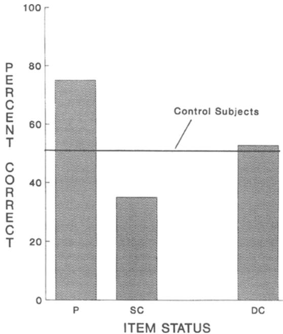

# Retrieval-induced forgetting in an eyewitness-memory paradigm

JOHN S. SHAW III  University of Texas, El Paso, Texas  and

ROBERT A. BJORK and ALLISON HANDAL  University of California, Los Angeles, California

The potential impact of repeated questioning of a witness was examined. Subjects were shown slides depicting the aftermath of a theft and subsequently were asked several times to recall selected details of what they saw. Previous experiments employing simple verbal materials have demonstrated that information addressed by questioning becomes more recallable in the future than it would have been without such retrieval practice, but other information, especially that bearing a categorical similarity to the practiced items, becomes less recallable. Such positive and negative effects appeared in subjects' later recall of crime- scene details in the present experiment. These results have an important implication for legal practice: Repeated interrogation of a witness can modify the witness's memory—enhancing the recall of certain details while inducing the forgetting of other details—even when no misinformation is contained or implied in the questioning.

Eyewitnesses to a crime typically are exposed to a barrage of questions intended to probe their memory for the incident under investigation. From immediately after the crime until a trial that may take place months or even years later, an eyewitness may be interrogated, often repeatedly, by arresting officers, police detectives, district attorneys, friends, other witnesses, private investigators, and defense attorneys, among others. Such probing is usually a well- intentioned effort to get at the facts of what happened—to extract as much information as possible from a memory representation that is typically, and understandably, incomplete.

It is inappropriate, however, to think of such questioning, whether well- intentioned or not, as a simple matter of taking a reading on the witness's memory. Among the known influences of questioning on a witness's later recall or recognition are retrieval- practice effects (i.e., that the process of retrieval can alter later recall performance of the practiced items; see, e.g., Allen, Mahler, & Estes, 1969; Bjork, 1975; Landauer & Bjork, 1978), freezing effects (i.e., that witnesses tend to stick, often stubbornly, to their first account of the event in question; see, e.g., Loftus, 1979), and postevent misinformation effects (i.e., that exposing eyewitnesses to inconsistent or misleading postevent information can impair later memory reports of the original target event; see, e.g., Loftus, 1975, 1979; Loftus, Miller, & Burns, 1978; Loftus & Palmer, 1974).

As a result of the intensive research in these areas, there is now some appreciation in the legal community that postevent questioning can alter a witness's memory for the information that is the subject of the interrogation (e.g., Wells, 1993). What is unappreciated, in our view, is the impact of an eyewitness's prior retrieval of information from her or his memory on details that are not the object of postevent interrogation.

Recent research in the verbal- memory domain by Anderson, Bjork, and Bjork (1994; also see Anderson & Bjork, 1994) suggests that the later recall of details that are not the object of questioning may be impaired by that questioning, even when no misinformation is provided. That is, the act of retrieving certain information can actually impair a person's performance on a future memory task for other previously unretrieved items. Anderson et al. refer to this phenomenon as retrieval- induced forgetting. Their results are supportive of earlier findings (e.g., Bjork & Geiselman, 1975; Richardson- Klavehn, 1988) and arguments (e.g., Bjork, 1988; Bjork & Bjork, 1992) concerning the negative effects of retrieval practice.

In each of Anderson et al.'s three experiments, subjects first studied long lists of category- exemplar pairs from several categories (such as Fruit ORANGE or Tree MAPLE). Subjects were then given retrieval practice on half of the members of half of the categories. During the retrieval- practice phase, subjects were directed to retrieve the complete exemplar when presented with the category name and the first two letters of the exemplar as a cue (e.g., Fruit OR or Tree MA). Typically, subjects were cued to practice retrieving each of the designated items three times across a series of such tests. After a short retention interval (typically 20 min), sub-

jects were then asked to free recall all of the studied exemplars in each of the studied categories. The key finding is that unpracticed items in the same semantic category as items that were previously given retrieval practice suffered retrieval- induced forgetting relative to unpracticed items in unpracticed categories. That is, subjects had more difficulty recalling unpracticed items in the same semantic category as the previously practiced items than they did recalling comparable unpracticed items from a completely unrelated category.

Such "negative consequences" of information retrieval are particularly relevant to the study of eyewitness identification. Interviews of eyewitnesses conducted by police, investigators, and attorneys often constitute incomplete retrieval tasks. A police detective may ask a witness about the assailant's hair color and eye color but not about whether she was wearing jewelry; a prosecuting attorney may inquire extensively about the gun that was used but ask no questions about the robber's voice. Although there are many reasons that some information may not be the target of questioning (e.g., the interviewer has incomplete information, lacks the time to properly conduct the interview, or, simply, has an overriding concern with some single aspect of the situation), the important point is that such information, which could eventually become material to the case, may suffer impaired recall later at trial.

1974; Payne, 1987; Roediger & Challis, 1989; Roediger, Payne, Gillespie, & Lean, 1982; Scrivner & Safer, 1988). However, when the retrieval practice is limited to a subset of items from a target episode, does the later recall of other unpracticed items from the episode exhibit hypermnesia? From Anderson et al.'s results, one cannot determine whether the recall of unpracticed items from unpracticed categories is impaired or enhanced relative to the overall recall of subjects who do not engage in any retrieval practice or even whether the recall of unpracticed items from practiced categories is impaired or enhanced relative to a between- subject control.

# OVERVIEW OF THE EXPERIMENT

In an initial crime- view phase, subjects watched a series of color slides that depicted the inside of a student's apartment. Included in the slides were two categories of target items (college schoolbooks and college sweatshirts), with each category containing eight members. Next, in the interrogation phase, subjects in the interrogation condition were questioned three times over a 20- min period about a subset of the crime- scene details, while subjects in the no- interrogation control condition engaged in alternative filler tasks. In the final- testimony phase, all subjects were asked to recall as many of the target items as they could from the initial criminal episode.

# Goals of the Present Research

The general purpose of the present research was to examine whether retrieval- induced forgetting occurs in an eyewitness- memory research paradigm. More specifically, the present experiment was designed to extend Anderson et al.'s (1994) results in two directions that are not only theoretically interesting but also relevant to eyewitness testimony. First, we utilized experimental materials and procedures more analogous to the typical witness experience than those used by Anderson et al. Thus, instead of simple verbal materials consisting of category- exemplar pairs, we used more complex visual stimuli that depicted an event about which a witness might have to testify; and, in place of repeated retrieval practice of the category exemplars, we employed a more complex questioning procedure that roughly simulates the type of interrogation typically faced by real witnesses.

Second, we added a between- subject control group to the basic Anderson et al. design. The addition of a nointerrogation control group has both practical and theoretical interest. From a practical standpoint, it addresses an issue of direct interest to legal practitioners: Could it be that interrogated witnesses might show poorer recall of some details than witnesses who are not interrogated at all?

From a theoretical standpoint, a noninterrogated control group permits one to assess whether the unpracticed items in unpracticed categories are affected, positively or negatively, by the retrieval- practice process. Previous studies have demonstrated that repeated testing of all items in a set can lead to hypermnesia (increased levels of total recall) on later recall tests (see, e.g., Erdelyi & Becker,

# Method

# Subjects

The subjects were 80 undergraduate students (47 females and 33 males) at the University of California, Los Angeles, who participated in partial fulfillment of a requirement of an introductory psychology course.

# Materials and Procedure

Crime- view phase. In sessions involving 1- 6 subjects, the subjects were asked to imagine that they had attended a party, and that when the time came to leave, they noticed that their wallet was missing from their jacket pocket. They were then told that they were about to see a slide presentation that represented their search for the missing wallet in the bedroom where their jacket had been during the party. The subjects were directed to pay close attention to the contents of the slides and to remember what they saw in the slides so that they might be able to assist the police in a later investigation of the case.

Twenty- one color slides were presented at the rate of 5 sec per slide. The slides depicted a small bedroom containing a variety of objects, including a bed, a desk, a personal computer, a telephone, and numerous personal items. Contained within the slide sequence were two categories of target items—college sweatshirts and college schoolbooks—with eight members each.

Interrogation phase. After viewing the slides, each subject received an 18- page booklet. The subjects were informed that the booklet contained seven timed cognitive tasks, some of which related to the slides they had just seen, and they were instructed to proceed one task at a time through the booklet. The first six tasks in the booklet comprised the interrogation phase. For the no- interrogation control subjects, Task 1 (1 min) consisted of a block- counting exercise, Task 2 (4 min) a word- search problem, Task 3 (1 min) a state- naming exercise, Task 4 (6 min) simple arithmetic problems, Task 5 (1 min) another state- naming exercise, and Task 6 (6 min) simple anagrams.

For the interrogated subjects, Tasks 2, 4, and 6 were the same as for the subjects in the no- interrogation control condition, but Tasks 1, 3, and 5 consisted of retrieval practice on half of the items in one of the two categories (e.g., four sweatshirts). Because prior research suggests that the effects of practice are maximal when the sequence of tests be

comes successively harder (e.g., Landauer & Bjork, 1978), the three retrieval- practice sessions in the present study were designed to demand progressively more difficult retrieval over the course of the interrogation phase.

The first retrieval- practice episode (Task 1) contained four true- false questions, asked from the perspective of the apartment owner, one for each of the four target items to be practiced. Each question suggested the correct response (e.g., "I think my friend Julia wore her Harvard sweatshirt. Was there a Harvard sweatshirt on my desk?"). The second retrieval- practice episode (Task 3) contained cued- recall questions concerning the same four items that were practiced in Task 1, and these questions were asked from the perspective of a police officer arriving on the scene. Although they varied slightly in form, all of the questions involved recall of the name of a sweatshirt or schoolbook (e.g., "Was there a gray sweatshirt on Jank's desk? If so, what was the name of the university on that sweatshirt?"). Task 5, the third retrieval- practice exercise, consisted of cued- recall questions that were asked from the perspective of a police detective investigating the case. Again, these questions concerned the same four items (e.g., "Were there any sweatshirts on the desk? What was written on those sweatshirts?"). None of the questions in Tasks 1, 3, and 5 contained misleading or inconsistent information.

Final- testimony phase. For all subjects, Task 7 was a one- page category- cued- recall task in which subjects were asked to recall as many items in each of the two categories (sweatshirts and schoolbooks) as they could remember. For half of the subjects, the sweatshirt question appeared at the top of the page; for the other half, the schoolbook question appeared first.

# Design

For the 40 interrogated subjects, item status was manipulated within subjects and had three levels: practiced items (P items), unpracticed members of the same category as the practiced members (SC items), and unpracticed members of the different category (DC items). Counterbalancing procedures ensured that, across the interrogated subjects, all category members (sweatshirts and schoolbooks) served equally often in the P, SC, and DC conditions. The other half of the subjects served as a no- interrogation control group. For all subjects, the dependent measure was the percentage of items correctly recalled on the final category- cued- recall test.

# Results

As shown in Figure 1, there was clear evidence of both positive and negative consequences of retrieval practice. A one- way analysis of variance (ANOVA) of the data from the subjects in the interrogation condition revealed that the three levels of the item- status factor differed significantly \[F(2,78) = 31.44, MS_{\mathrm{e}} = 1.61, p < .001\]. Planned comparisons confirmed the pattern that seems apparent in Figure 1: The final recall of the P items  $(M = 75.0\%)$  was significantly higher than the final recall of both SC  $(M = 35.0\%)$  and DC  $(M = 52.3\%)$  items  $[F(1,39) = 42.67, MS_{\mathrm{e}} = 3.20, p < .001$ , and  $F(1,39) = 25.21, MS_{\mathrm{e}} = 0.98, p < .001$ , respectively]—demonstrating the positive consequences of retrieval practice—and the mean recall of SC items was significantly lower than that of DC items  $[F(1,39) = 16.18, MS_{\mathrm{e}} = 0.63, p < .001]$ —demonstrating the negative consequences of retrieval practice.

A one- way ANOVA was also used to analyze the between- subject comparisons. The mean level of recall for subjects in the no- interrogation control condition  $(M = 51.1\%)$  was significantly lower than the mean recall of P items by subjects in the interrogation condition  $[F(1,78) = 27.30, MS_{\mathrm{e}} = 1.14, p < .001]$ —indicating between- subject facilitation—and was significantly higher than the mean recall of SC items by subjects in the interrogation condition  $[F(1,78) = 10.46, MS_{\mathrm{e}} = 0.52, p < .002]$ —indicating between- subject impairment. Additionally, the mean level of recall for subjects in the no- interrogation control condition did not differ significantly from the mean recall of DC items by subjects in the interrogation condition  $[F(1,78) < 1]$ .

  
Figure 1. Percent final category-cued recall as a function of item status for interrogated subjects (P denotes practiced items; SC and DC denote items in the same or different category, respectively, as the practiced items). The line across the figure indicates the percent final category-cued recall of subjects who were not interrogated (control subjects).

# Discussion

These results provide general support for the proposition that retrieval is a dynamic process and that retrieval practice can have both positive and negative consequences (see, e.g., Anderson et al., 1994, Bjork, 1988; Bjork & Bjork, 1992). On the positive side, postevent interrogation enhanced later recall for practiced items—relative not only to the recall of other unpracticed items for the interrogated individual but also to the recall of those same items by someone who was not questioned about the crime prior to the final criterion test. Although this finding was not unexpected (see, e.g., Allen et al., 1969; Bjork, 1975; Carrier & Pashler, 1992; Landauer & Bjork, 1978), this experiment demonstrates, in an eyewitness memory context, that even a minimal amount of interrogation can have a substantial positive impact on later recall of items that were the subject of that interrogation.

Of more importance (in the sense of being a result that is both less expected and more problematic for the legal profession) are the negative effects of interrogation on the later recall of unpracticed items bearing a categorical similarity to the practiced items. In particular, this experiment replicates the retrieval- induced forgetting of categorically similar items found by Anderson et al. (1994), and it adds to those results in two important ways. First, retrieval- induced forgetting was clearly demonstrated on both a within- and a between- subject basis: For subjects in the interrogation condition, the level of recall for SC items was significantly lower than that for DC items, and the level of recall for SC items was also significantly lower than the overall level of recall for subjects in the no- interrogation control condition. Second,

between- subject retrieval- induced forgetting did not extend to the DC items. That is, there was no significant difference between the level of recall for the DC items for the interrogated subjects and the overall level of recall for the noninterrogated control subjects.

Three aspects of the present results are relevant to the hypermnesia literature. First, as expected, repeated practice of a subset of items from an episode did lead to increased performance for those practiced items (see, e.g., Payne, 1987). Second, consistent with Roediger et al.'s (1982) finding that practice in one category did not lead to hypermnesia in a different category, the level of recall of the unpracticed items in the unpracticed category was not enhanced by the retrieval practice.

Finally, the present experiment demonstrates that repeated practice of a subset of items in a category actually can lead to reduced recall performance for other unpracticed items in the same category, consistent with previous findings of Anderson et al. (1994). At least on the surface, this result seems inconsistent with findings in the hypermnesia literature that repeated testing of an entire set of materials leads to increasingly greater levels of recall over a series of tests. Although subjects in a typical hypermnesia paradigm generally recall the same set of materials on each test, they are also able to recall a few new items each time, thus leading to an overall increase in recall. In contrast, we found in the present experiment that, rather than benefiting from the retrieval practice, the level of recall of the unpracticed items in the practiced category actually suffered.

This apparent inconsistency may be explained by examining the mechanism involved in retrieval- induced forgetting. Anderson and his colleagues (Anderson et al., 1994; Anderson & Spellman, 1995) conclude that retrieval- induced forgetting results from the suppression of selected- against responses. Thus, in the present study, the instructions to recall only some of the members of a category causes subjects to actively suppress those other members that are not the subject of the retrieval practice. This suppression results in lower levels of later recall for the unpracticed items in the practiced category. In the typical hypermnesia experiment, however, subjects are asked to recall all of the items of a particular set (e.g., all of the details of a videotaped burglary in Scrivner & Safer, 1988) and thus do not have to select against any members of the practiced set. In such a task, retrieval- induced forgetting would not be expected to occur.

It should be emphasized that factors other than retrieval- induced forgetting per se may have played a role in the negative effects of interrogation observed in the present experiment. One possibility is that the retrieval- practice procedures invoked inhibition owing to part- set cuing, which refers to the finding that presenting some of the members of a set of to- be- recalled items as "cues" to aid in the recall of the remaining items actually impairs, not helps, the recall of the remaining members of the set (see, e.g., Nickerson, 1984, and Roediger & Neely, 1982, for reviews of such phenomena).

The interrogation process in the present experiment can be viewed as a mixture of part- set cuing and retrieval practice: The initial questions to subjects during the interrogation phase included the names of some of the items from the categories that were to be recalled on the final test (e.g., "Was there a Harvard sweatshirt on my desk?"). Although the questioning in the two subsequent retrieval- practice sessions did not include any of the names of the category members, it could still be argued that the negative effects of interrogation observed in the present experiment were a function of effects relating to the presentation of items as cues as well as to retrieval- induced forgetting.

A second factor that merits discussion- - output interference- - refers to the phenomenon that the first items retrieved during a recall task may interfere with the production of additional items (e.g., Roediger, 1974; Roediger & Schmidt, 1980; Tulving & Arbuckle, 1963). Although the order of final recall in the present experiment was counterbalanced in one respect- - that is, half of the subjects were asked to recall members of the practiced category first and the other half were asked about the unpracticed category first- - subjects were free to recall the items within each category in whatever order they wanted.

As expected from previous findings (see, e.g., Roediger, Stellon, & Tulving, 1977), in the present experiment the practiced items were relatively more likely to be produced at the beginning of the final recall task than at the end. Across all interrogated subjects, of the first three items recalled in a given practiced category,  $76.5\%$  had been practiced earlier; for the final four items, however, only  $52.5\%$  had been prac ticed earlier. For the interrogated subjects, the mean recall from the practiced category was 3.0 practiced items and 1.4 unpracticed items. No subject recalled all eight items from the practiced category. This suggests, then, that the early recall of practiced items from a practiced category may have inhibited the subsequent recall of unpracticed (and less accessible) items from the same category.

The observed forgetting of certain unpracticed items in the present experiment was probably due to a combination of the effects of retrieval practice, part- set cuing, and output interference. Whereas Anderson et al. (1994) controlled for the effects of part- set cuing and output interference, we chose not to, given the goals of the present research. The interrogations to which actual eyewitnesses are exposed often involve a mixture of retrieval practice and representation of some of the original items, and subjects frequently recall the "strongest" items first during their courtroom testimony. In allowing for the impact of both part- set cuing and output interference, then, the procedures used in the present experiment were more faithful to the real- world situations they were designed to emulate.

There may be interrogation techniques that can ameliorate the effects of retrieval- induced forgetting. One such possibility is the "cognitive interviewer" developed by Geiselman and Fisher (Fisher, Geiselman, & Amador, 1989; Geiselman, Fisher, MacKinnon, & Holland, 1985). Because one of the primary goals of the cognitive interview is to encourage witnesses to use a variety of retrieval routes in their memory search, the retrieval variability afforded by such a technique may limit the amount of retrieval- induced forgetting that occurs. Even when the cognitive interview is utilized, however, the questioning may still focus on one aspect of the event in question, leaving other related aspects susceptible to retrieval- induced forgetting.

# CONCLUDING COMMENTS

We have demonstrated, in a simulated legal context, that the repeated retrieval of certain details in a given category can impair the subsequent recall of other details in that category- - both compared with details in other unpracticed categories for the same individual and compared with details for subjects who did not engage in any retrieval practice. This study, then, adds to the growing body of research that simple, direct questioning of a witness, even in the absence of any misleading or inconsistent information, can alter what is recallable in later memory tests.

There are, however, three principal differences between the experiences of the "witnesses" in this experiment and the typical experiences of witnesses to actual crimes. First, calmly viewing a slide presentation of a simulated crime in a laboratory is clearly different from witnessing a real crime in progress under conditions of stress and uncertainty. Second, unlike many real- world witnesses, the subjects were warned before the crime- view phase that they might be asked questions about what they saw in the slides. Although most eyewitnesses do not receive such a forewarning, it is often the case that witnesses realize the importance of the events unfolding before them at some point during those events, which then motivates them to attend to details for possible later testimony. Additionally, in some situations, witnesses do know beforehand that they should remember what they are about to observe. For example, police detectives who are sent out to investigate a crime scene know in advance that they may have to testify later about what they see. Finally, whereas eyewitnesses to actual crimes may have to wait many months before testifying in court, the elapsed

time between the crime- view phase and the final- testimony phase in this experiment was only about  $25\mathrm{min}$ .

In view of the differences between our experimental paradigm and the experiences of real- world eyewitnesses, we must be careful in generalizing the present results to actual eyewitness settings. There is no a priori reason, however, to expect that real- world questioning would produce a pattern of effects different from those we observed. In fact, the frequency and intensity of police interrogations in real- life cases may actually result in questioning effects—both positive and negative—that are larger than in an experimental laboratory.

# REFERENCES

ALLEN, G. A., MAHLER, W. A., & ESTES, W. K. (1969). Effects of recall tests on long- term retention of paired associates. Journal of Verbal Learning & Verbal Behavior, 8, 463- 470. ANDERSON, M. C., & BJORK, R. A. (1994). Mechanisms of inhibition in long- term memory: A new taxonomy. In D. Dagenbach & T. Carr (Eds.), Inhibition in attention, memory and language (pp. 265- 325). New York: Academic Press. ANDERSON, M. C., BJORK, R. A., & BJORK, E. L. (1994). Remembering can cause forgetting: Retrieval dynamics in long- term memory. Journal of Experimental Psychology: Learning, Memory, & Cognition, 20, 1063- 1087. ANDERSON, M. C., & SPELLMAN, B. A. (1995). On the status of inhibitory mechanisms in cognition: Memory retrieval as a model case. Psychological Review, 102, 68- 100. BJORK, R. A. (1975). Retrieval as a memory modifier: An interpretation of negative recency and related phenomena. In R. L. Solso (Ed.), Information processing and cognition: The Loyola symposium (pp. 123- 144). Hillsdale, NJ: Erlbaum. BJORK, R. A. (1988). Retrieval practice and the maintenance of knowledge. In M. M. Gruneberg, P. E. Morris, & R. N. Sykes (Eds.), Practical aspects of memory II (pp. 396- 401). London: Wiley. BJORK, R. A., & BJORK, E. L. (1992). A new theory of disuse and an old theory of stimulus fluctuation. In A. F. Healy, S. M. Kosslyn, & R. M. Shiffrin (Eds.), From learning processes to cognitive processes: Essays in honor of William K. Estes (Vol. 2, pp. 35- 67). Hillsdale, NJ: Erlbaum. BJORK, R. A., & GEISELMAN, R. E. (1978). Constituent processes in the differentiation of items in memory. Journal of Experimental Psychology: Human Learning & Memory, 4, 344- 361. CARRIER, M., & PASHLER, H. (1992). The influence of retrieval on retention. Memory & Cognition, 20, 633- 642. ERDELYI, M. H., & BECKER, J. (1974). Hypermnesia for pictures: Incremental memory for pictures but not words in multiple recall tri- . als. Cognitive Psychology, 6, 159- 171. FISHER, R. P., GEISELMAN, R. E., & AMADOR, M. (1989). Field test of the cognitive interview: Enhancing the recollection of actual victims and witnesses of crime. Journal of Applied Psychology, 74, 722- 727.

GEISELMAN, R. E., FISHER, R. P., MACKINNON, D. P., & HOLLAND, H. L. (1985). Eyewitness memory enhancement in the police interview: Cognitive retrieval mnemonics versus hypnosis. Journal of Applied Psychology, 70, 401- 412. LANDAUER, T. K., & BJORK, R. A. (1978). Optimal rehearsal patterns and name learning. In M. M. Gruneberg, P. E. Morris, & R. N. Sykes (Eds.), Practical aspects of memory (pp. 625- 632). London: Academic Press. LOFTUS, E. F. (1975). Leading questions and the eyewitness report. Cognitive Psychology, 7, 560- 572. LOFTUS, E. F. (1979). Eyewitness testimony. Cambridge, MA: Harvard University Press. LOFTUS, E. F., MILLER, D. G., & BURNS, H. J. (1978). Semantic integration of verbal information into a visual memory. Journal of Experimental Psychology: Human Learning & Memory, 4, 19- 31. LOFTUS, E. F., & PALMER, J. P. (1974). Reconstruction of automobile destruction: An example of the interaction between language and memory. Journal of Verbal Learning & Verbal Behavior, 13, 585- 589. NICKERSON, R. S. (1984). Retrieval inhibition from part- set cuing: A persisting enigma in memory research. Memory & Cognition, 12, 531- 552. PAYNE, D. G. (1987). Hypermnesia and reminiscence in recall: A historical and empirical review. Psychological Bulletin, 101, 5- 27. RICHARDSON- KLAVEHN, A. (1988). Effects of incidental environmental context on human memory: Elusive or nonexistent? Unpublished doctoral dissertation, University of California, Los Angeles. ROEDIGER, H. L., III (1974). Inhibiting effects of recall. Memory & Cognition, 2, 261- 269. ROEDIGER, H. L., III, & CHALLER, B. H. (1989). Hypermnesia: Improvements in recall with repeated testing. In C. Izawa (Ed.), Current issues in cognitive processes: The Tulane Floweree symposium on cognition (pp. 175- 199). Hillsdale, NJ: Erlbaum. ROEDIGER, H. L., III, & NEEDLY, J. H. (1982). Retrieval blocks in episodic and semantic memory. Canadian Journal of Psychology, 36, 213- 242. ROEDIGER, H. L., III, PAYNE, D. G., GILLESPIE, G. L., & LEAN, D. S. (1982). Hypermnesia as determined by level of recall. Journal of Verbal Learning & Verbal Behavior, 21, 635- 655. ROEDIGER, H. L., III, & SCRIMIDT, S. R. (1980). Output interference in the recall of categorized and paired- associate lists. Journal of Experimental Psychology: Human Learning & Memory, 6, 91- 105. ROEDIGER, H. L., III, STELLON, C. C., & TULVING, E. (1977). Inhibition from part- list cues and rate of recall. Journal of Experimental Psychology: Human Learning & Memory, 3, 174- 188. SCRIVNER, E., & SAFER, M. A. (1988). Eyewitnesses show hypermnesia for details about a violent event. Journal of Applied Psychology, 3, 371- 377. TULVING, E., & ARBUCKLE, T. Y. (1963). Sources of intratrial interference in paired- associate learning. Journal of Verbal Learning & Verbal Behavior, 1, 321- 334. WELLS, G. L. (1993). What do we know about eyewitness identification? American Psychologist, 58, 553- 571.

(Manuscript received July 28, 1994; revision accepted for publication December 5, 1994. )