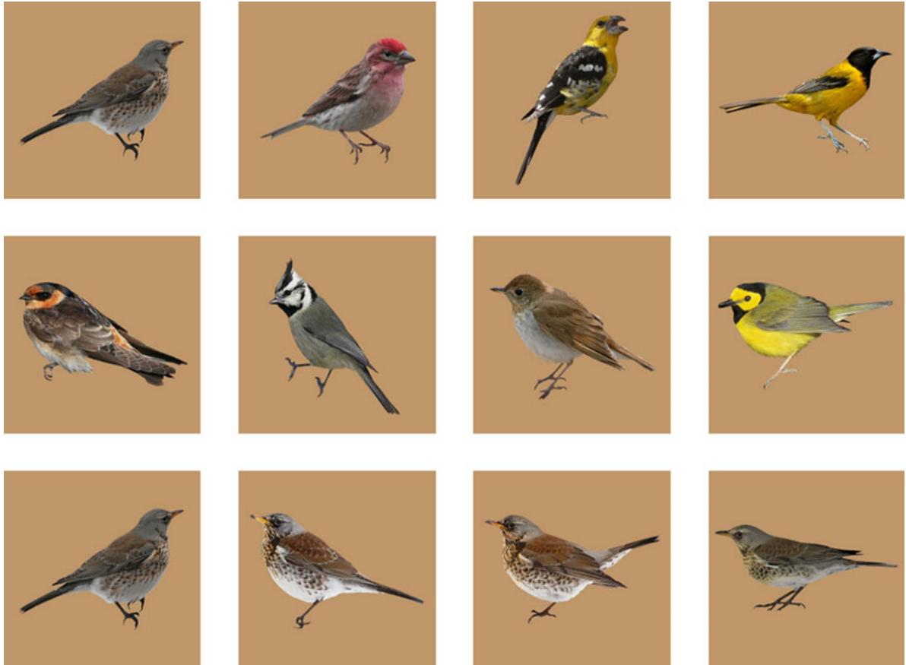
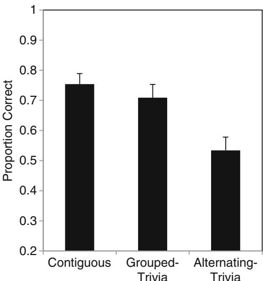
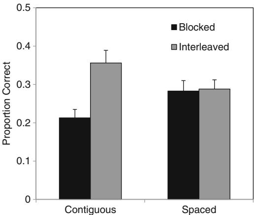

# Why interleaving enhances inductive learning: The roles of discrimination and retrieval

Monica S. Birnbaum  $\cdot$  Nate Kornell  $\cdot$  Elizabeth Ligon Bjork  $\cdot$  Robert A. Bjork

Published online: 9 November 2012  $(\widehat{\mathbf{C}})$  Psychonomic Society, Inc. 2012

Abstract Kornell and Bjork (Psychological Science 19:585- 592, 2008) found that interleaving exemplars of different categories enhanced inductive learning of the concepts based on those exemplars. They hypothesized that the benefit of mixing exemplars from different categories is that doing so highlights differences between the categories. Kang and Pashler (Applied Cognitive Psychology 26:97- 103, 2012) obtained results consistent with this discriminative- contrast hypothesis: Interleaving enhanced inductive learning, but temporal spacing, which does not highlight category differences, did not. We further tested the discriminative- contrast hypothesis by examining the effects of interleaving and spacing, as well as their combined effects. In three experiments, using photographs of butterflies and birds as the stimuli, temporal spacing was harmful when it interrupted the juxtaposition of interleaved categories, even when total spacing was held constant, supporting the discriminative- contrast hypothesis. Temporal spacing also had value, however, when it did not interrupt discrimination processing.

Keywords Categorization  $\cdot$  Induction  $\cdot$  Interleaving  $\cdot$  Spacing  $\cdot$  Metacognition

People accumulate a great deal of knowledge via inductive learning. Children, for example, learn concepts such as boat or fruit by being exposed to exemplars of those categories and inducing the commonalities that define the concepts.

Later in life, we might learn to distinguish between different species of butterflies or birds, as in the present research. Such inductive learning is critical in making sense of events, objects, and actions- and, more generally, in structuring and understanding our world. In the present research, we examined how exemplars of to- be- learned categories should be sequenced and spaced in order to optimize inductive learning.

Kornell and Bjork (2008) investigated the effect of study schedules on inductive learning- specifically, learning artists' painting styles from exemplars of their paintings. Images of six paintings by each of 12 artists were presented for study, with the artist's name displayed below each painting. The paintings by half of the artists were blocked (i.e., all six paintings by a given artist were shown consecutively), whereas the paintings by the other six artists were interleaved (i.e., mixed together). After the learning phase, participants were shown new paintings by each of the 12 artists and were asked to identify which artist had painted each new painting. Kornell and Bjork found that interleaving artists' paintings led to better performance on this inductive task than did blocking- even though participants consistently believed that blocking, rather than interleaving, had been more helpful for learning the artists' styles.

Kornell and Bjork's (2008) findings were replicated by Kornell, Castel, Eich, and Bjork (2010) with older adults as participants. Furthermore, Zulkiply, McLean, Burt, and Bath (2012) found similar results when their participants read case studies exemplifying different psychological disorders in an inductive- learning experiment, and Vlach, Sandhofer, and Kornell (2008) found similar results when three- year- old children learned the names of novel objects on the basis of induction. Additionally, Kornell and Bjork's results have been replicated by Kang and Pashler (2012), Zulkiply and Burt (in press), and Wahlheim, Dunlosky, and Jacoby (2011). All of these findings seem to fit within an extensive literature on the spacing effect—that is, the finding that

items studied once and restudied after a delay are recalled better in the long term than are items studied and restudied in quick succession (for reviews, see Cepeda, Pashler, Vul, Wixted, & Rohrer, 2006; Dempster, 1988; Glenberg, 1979). In all of the recent studies demonstrating the benefits of spacing for inductive learning (with the exception of Vlach et al., 2008, who did not have an interleaved condition in addition to their spaced condition), however, interleaving—mixing exemplars from different categories together—was what enhanced learning, rather than temporal spacing per se—a point to which we will return shortly.

A major goal of the present research was to discover why interleaving appears to enhance inductive learning. Intuitively, it might seem that studying a single category in a block would be beneficial, as learners would notice similarities within the category. Consistent with this idea, early studies showed that mixing exemplars from different categories resulted in poorer learning than did grouping exemplars of the same category (Kurtz & Hovland, 1956; Whitman & Garner, 1963). More recently, Goldstone (1996) found better performance when categories alternated on  $25\%$  of the trials than when they alternated on  $75\%$  of the trials—that is, less- frequent alternation appeared to produce more learning. One will discuss these findings and why they may differ from the more recent results in the General Discussion.)

# Discriminative-contrast hypothesis

If blocked studying facilitates noticing similarities among intracategory exemplars, interleaved studying might facilitate noticing the differences that separate one category from another. In other words, perhaps interleaving is beneficial because it juxtaposes different categories, which then highlights differences across the categories and supports discrimination learning—an idea that we refer to as the discriminative- contrast hypothesis. As Goldstone (1996) pointed out, "frequent alternation of categories has the advantage of highlighting features that serve to distinguish categories. Conversely, infrequent alternation of categories has the advantage of highlighting information that remains constant across the members within a category" (p. 615). If the ultimate goal of category learning is to be able to classify new examples into the appropriate categories, then knowing what distinguishes categories is crucial.

In a recent study, Kang and Pashler (2012) investigated the degree to which noticing differences is the driver behind the benefit of interleaving. Using three of the 12 artists employed by Kornell and Bjork (2008), they replicated the blocked and interleaved conditions. In their first experiment, they also included a condition in which the blocked items were temporally spaced (using irrelevant cartoon drawings). They found a benefit of interleaving over blocking (replicating Kornell & Bjork, 2008), but no benefit of temporal spacing over blocking. On the basis of this finding, they concluded that the value of interleaving lies in juxtaposing different categories, a process that they referred to as discriminative contrast. Consistent with this conclusion, they also found that simultaneous presentations of multiple paintings by the same artist did not benefit learning (Exp. 1), whereas simultaneous presentations of multiple paintings by different artists were beneficial (Exp. 2)—again, presumably, because they promoted discriminative contrast. Wahlheim et al. (2011) also found benefits of simultaneous presentation of different categories for inductive learning.

Kang and Pashler's (2012) findings are consistent with the view that the value of interleaving lies in promoting discrimination between categories. We believe, however, that their findings do not seal the case. Their argument rests on two findings. The first has to do with the effects of simultaneous presentation. These results clearly supported the value of discriminative contrast, but presenting one item at a time is different from presenting all items at once—doing the latter places greater demands on working memory, and the discrimination processes that appear to be at work during a simultaneous presentation may not happen, or may not happen as effectively, during single presentations. Their second finding was a lack of benefit of temporal spacing, but that finding also did not pin down the cause of the interleaving benefit. That is, although a spacing effect did not occur, had it occurred, such a spacing effect would not have ruled out a role for discriminative contrast when examples are interleaved.

# The present experiments

The crucial question, in our view, has to do with comparing different versions of the interleaved condition, because the interleaved condition is where the discriminative- contrast hypothesis makes strong predictions. Specifically, we tested the hypothesis that—in an interleaved condition—preventing items from being juxtaposed with one another would hurt inductive learning. We tested this prediction, in Experiment

1, by presenting interleaved exemplars with, or without, unrelated trivia questions inserted between successive exemplars. The basic logic was that if inserting trivia questions did not disrupt inductive learning, it would then be difficult to conclude that discrimination processes are responsible for the benefit of interleaving.

Our study was also motivated by practical questions. Creating a condition that was both spaced and interleaved allowed us to investigate an optimal combination of both manipulations. Zulkiply and Burt (in press) tested an interleaved schedule in which each exemplar was temporally spaced out with  $30~\mathrm{s}$  of unrelated filler task. They found that although interleaving led to a benefit in inductive learning, as compared to blocking, temporal spacing did not affect the benefit of interleaving. In our Experiment 2, we tested a similar condition, but used species of butterflies as the to- be- learned categories and employed 10- s intervening filler tasks. In Experiments 2 and 3, we examined the possible interaction of spacing and interleaving.

# Experiment 1

In Experiment 1, we presented four photos each of eight species of birds in an interleaved order during the learning phase, using the following three study conditions. In the contiguous condition, no trivia questions were interpolated between the interleaved presentations of exemplars. In the alternating- trivia condition, the presentation order of the bird exemplars was the same as in the contiguous condition, but the presentations of successive exemplars were separated by the insertion of a trivia question. An unrelated task was inserted rather than having no filler task during the time delay so as to prevent rehearsal of the previously viewed image. In the grouped- trivia condition, single exemplars from each of the eight species of birds were presented in randomly ordered groups, with no trivia questions presented inside of a group, but successive groups of exemplars were separated by a series of eight trivia questions.

Importantly, between successive exemplars of a given species, exactly the same events transpired in the groupedtrivia and alternating- trivia conditions; that is, an average of eight trivia questions and seven photos intervened between successive exemplars of a given species in each condition. Thus, the total spacing was held constant in these two conditions, but the alternating- trivia condition interrupted comparison processes (by placing trivia questions between the photos), whereas the grouped- trivia condition did not. The discriminative- contrast hypothesis predicts that the alternating- trivia condition, which disrupted discrimination processes, should impair performance as compared to the grouped- trivia condition.

# Method

Participants A group of 102 participants (52 female, 50 male) were recruited to participate via Amazon's Mechanical Turk, a website that allows people to sign up to complete small tasks for pay. Participants were paid 80 cents for participating, which took an average of about  $12\mathrm{min}$  and the participants averaged 31.2 years of age (range: 18- 60). Of the participants, 59 were from the United States, 23 were from India, and the remaining 20 came from 17 other countries.

The numbers of participants in the contiguous, groupedtrivia, and alternating- trivia conditions were, respectively, 35, 25, and 42, with the differing numbers of participants arising through random assignment.

Materials The materials consisted of five different photographs of each of eight different species of birds (see Wahlheim et al., 2011). As is illustrated in Fig. 1, each bird was shown against a brown background, with its species name shown below the photo during learning. The names of the species were accurate but simplified; for example, Cave Swallow was changed to Swallow (see Fig. 1). The materials also included trivia questions (e.g., "What is the name of the spear- like object that is thrown during a track meet?"), which came from Nelson and Narens (1980).

Procedure The study was conducted online. After reading the instructions, participants were shown 32 photographs of birds on their computer screens, one at a time, for  $4\mathrm{s}$  each. The eight species were interleaved, such that each group of eight trials included one photo from each species, arranged in a random order.

In the contiguous condition, the photos were presented contiguously. In the other two conditions, 32 trivia questions were also presented for  $8\mathrm{s}$  each, accompanied by the following instruction: "Try to think of the answer. We will ask you to recall it later."

In the alternating- trivia condition, a trivia question was presented before every photo. This task was intended to keep participants occupied with a task not related to bird photos. In the grouped- trivia condition, a series of eight trivia questions was presented followed by a series of eight photos, followed by a different set of eight trivia questions, and so forth. With the trials ordered in this fashion, all three conditions ended when the last photo was presented.

After the last photo was presented, participants were asked to play the computer game Tetris for  $3\mathrm{min}$  as a distractor task and were then given an inductive- learning test. During the test, a previously unpresented exemplar of each species was presented, along with the names of all eight species, which were shown below the photos. Participants were asked to select the name of the species

  
Fig. 1 Photographs used to depict exemplars of the eight bird species used in Experiment 1. The top row (left to right) depicts Fieldfare, Finch, Grosbeak, and Oriole. The middle row depicts Swallow, Titmouse, Veery, and Warbler. Although all species were presented in an interleaved order, the bottom row depicts four Fieldfare exemplars. During the learning phase, the name of the exemplar's species was shown below each exemplar

represented by the presented exemplar and to type it on the computer keyboard. Participants had unlimited time to respond, and no feedback was provided.

# Results

Correct performance on the final test, which is illustrated in Fig. 2, was significantly affected by participants' learning conditions,  $F(2,99) = 8.53$ $p < .001$ $\eta_{\mathrm{p}}^{2} = .15$  .Furthermore, a Tukey- Kramer post- hoc test showed that accuracy was significantly lower in the alternating- trivia condition than in the other two conditions, for which performance did not differ significantly.

Experiment 1 went beyond previous findings by holding spacing constant between the grouped- trivia and alternatingtrivia conditions and directly manipulating participants' ability to engage in discrimination processes in an interleaved presentation condition. The results were consistent with prior studies Kang & Pashler,2012;Wahlheim et al.,2011) in supporting the discriminative- contrast hypothesis: Interrupting discrimination processing, which was accomplished in the present experiment by inserting trivia questions between interleaved exemplars, impaired inductive learning, whereas

  
Fig. 2 Proportions correct on the final test in Experiment 1. Error bars represent one standard error of the mean

inserting groups of trivia questions between successive groups of exemplars—and, thus, separating exemplars from within a given species temporally—did not impair inductive learning significantly. One could argue that introducing another task increased interference, and thus a true comparison between the contiguous and grouped- trivia conditions could not be made. The grouped- trivia and alternating- trivia conditions, however, had comparable levels of interference, and a comparison between these two conditions reveals the importance of discriminative contrast in inductive learning. Additionally, interference and task were held constant across all three conditions in Experiment 3.

# Experiment 2

In Experiment 2, we examined how interleaving and spacing might interact in producing their effects on inductive learning. The results of Experiment 1 suggested that spacing, as implemented in the grouped- trivia condition, might have impaired performance slightly relative to the contiguous condition, but Experiment 1 did not include a noninterleaved condition of the type that would permit an assessment of the value of interleaving, relative to blocking, as a function of temporal spacing. Experiment 2 was designed to permit such an assessment.

The participants in Experiment 2 studied four exemplars of each of 16 species of butterflies in the context of a  $2 \times 2$  mixed design. The species were randomly assigned to either the interleaved or blocked condition. In addition, for half of the participants, the butterfly exemplars were presented contiguously, replicating previous research (e.g., Kornell & Bjork, 2008); for the other half of the participants, trivia questions were inserted during the 10- s intervals between the presentations of successive butterfly exemplars, which created a spaced condition.

We predicted an interaction between spacing and interleaving. When exemplars are presented contiguously, the discriminative- contrast hypothesis, as well as previous research, predicts that interleaving should be beneficial as compared to blocking. When, however, exemplars are spaced apart with trivia questions, the expected impairment of discrimination processing as a consequence of blocking might not be observed, because such processing has already been neutralized by the presence of the interpolated trivia questions. To the extent that trivia questions prevent discrimination processing across the board, the discriminative- contrast hypothesis does not predict a benefit of interleaving over blocking. (Such a finding would be consistent with Kang & Pashler's, 2012, finding that spacing did not enhance blocked learning, but Kang & Pashler did not compare interleaved vs. blocked study when both conditions were spaced.)

We were also interested in participants' metacognitive judgments regarding which study schedule, interleaved or blocked, was more helpful to their learning. Kornell and Bjork's (2008) participants rated blocking as being more effective than interleaving, despite having just completed a test on which they had performed better for categories learned under interleaved rather than under blocked conditions. We expected that the present participants would make the same judgment error for both the contiguous and spaced conditions, because blocking appears to create a greater sense of fluency of induction than does interleaving.

# Method

Participants A group of 114 undergraduates from the University of California, Los Angeles, served as participants for partial course credit.

Materials The materials were 80 photographs depicting 16 species of butterflies, examples of which are illustrated in Fig. 3. The participants studied four exemplars of each species and were tested on a fifth exemplar. The labels presented to participants for each species were based on the actual name of each species, but some names were shortened, made into one word, or changed entirely if the real name described physical characteristics of the butterfly. The names employed were Admiral, American, Baltimore, Cooper, Eastern Tiger, Hairstreak, Harvester, Mark, Painted Lady, Pine Elfin, Pipevine, Sprite, Tipper, Tree Satyr, Viceroy, and Wood Nymph.

In the spaced condition, a different individual trivia question, drawn from the same pool that had been used in Experiment 1, was presented between the successive presentations of butterfly photographs.

Design Half of the 16 species were presented in a blocked fashion (i.e., the four exemplars from each species were presented with no exemplars from other species in between), and the other half were presented in an interleaved fashion (i.e., the presentations of the four exemplars from each species were mixed with presentations of exemplars from other species). Additionally, equal numbers of participants were randomly assigned to either a temporally spaced  $(n = 57)$  or a contiguous  $(n = 57)$  presentation mode, in which no intervening filler tasks were presented between the exemplars. Thus, the experiment employed a  $2 \times 2$  mixed factorial design, with presentation order (blocked vs. interleaved) manipulated within participants and presentation mode (spaced vs. contiguous) manipulated between participants.

Procedure During the learning phase, 64 different photographs of butterflies appeared, according to the following organizational scheme: I I B B I I B B I I B B I I B B, where

  
Fig. 3 Photographs used to depict exemplars of butterfly species. The top row depicts four exemplars of the Viceroy species. The bottom row depicts exemplars from four different species (Sprite, Cooper, Baltimore, and Tipper). The first row corresponds to a typical sequence

I and B represent sequences of four photos that were presented in either an interleaved (I) or a blocked (B) fashion. Within each I I sequence, one exemplar from each of eight species was presented, meaning that each exemplar of a given species was interleaved among exemplars of the other species. The eight photos were ordered randomly within each I I grouping. In each B B sequence, all four exemplars of a single species were presented consecutively, followed by all four exemplars of another species. Thus, in the interleaved condition, the four exemplars belonging to a given species were distributed across all four I I sequences, whereas in the blocked condition, all four exemplars of a given species were presented within one B sequence, without exemplars of other species intervening.

Each photo was presented on a computer screen for  $4\mathrm{~s~}$  with the species name shown below the photo. For participants assigned to the spaced presentation mode, a 10- s interval occurred between successive presentations of butterfly photos. During this interval, a trivia question appeared on the screen, along with the instruction to try to retrieve the answer and then remember it for a later memory test. For participants assigned to the contiguous- presentation mode, all photos immediately succeeded one another, with no intervening trivia questions appearing on the screen. Thus, whereas all participants studied half of the butterfly species in an interleaved fashion and half in a blocked fashion, for half of the participants a trivia question appeared between successive photos of butterflies, and for the other half of the participants, no trivia questions were presented.

When the learning phase ended, participants were immediately tested, as follows. A new exemplar of one of the 16 species was presented with the names of all 16 species shown below the photo. Participants were asked to select the species represented by the presented exemplar and enter during blocked study; the bottom row corresponds to a typical sequence during interleaved study. During the learning phase, the name of the exemplar's species was shown below each exemplar

it on the computer keyboard. All 16 species were tested in this manner in a random order. A unique random order was used for each participant. The participants had unlimited time to respond, and no feedback was provided during the testing phase.

After the testing phase, participants read a brief description of the experiment that they had just completed, which defined the terms blocked and interleaved. They were then asked to answer the following question, which appeared on the screen: "Which do you think helped you learn more, blocking or interleaving?"

Results and discussion

Induction performance Performance on the final induction test, which is illustrated in Fig. 4, was analyzed using a 2 (blocked vs. interleaved)  $\times 2$  (contiguous vs. spaced) mixed

  
Fig. 4 Proportions correct on the final test in Experiment 2. Error bars represent one standard error of the mean

analysis of variance (ANOVA). As is indicated in Fig. 4, a significant overall advantage of interleaving over blocking was obtained,  $F(1,112) = 12.34$ $p < .001$ $\eta_{\mathrm{p}}^{2} = .099$  Importantly, as is further indicated in Fig. 4, a significant interaction between presentation order (interleaved vs. blocked) and presentation mode (contiguous vs. spaced) was also obtained,  $F(1,112) = 10.909$ $p < .01$ $\eta_{\mathrm{p}}^{2} = .089$  .As predicted, performance in the interleaving condition was superior to that in the blocking condition when exemplars were presented contiguously (the means were .36 and .21, respectively). When trivia questions were used to space out the presentation of successive exemplars however, performance in the interleaving condition was not significantly different from that in the blocking condition (the means were .29 and .28, respectively). This pattern of results is consistent with the discriminative- contrast hypothesis.

A planned comparison of performance in the spaced versus contiguous conditions, limited to only the blocked condition, showed that spacing was beneficial for this type of presentation,  $t(112) = 2.018$ $p < .05$ $d = .379$  whereas Kang and Pashler (2012) had found no significant effect of spacing during blocked learning. Why the findings from these two studies diverged in this way is unclear, but the difference emphasizes the importance of Experiment 1 in providing direct support for the discriminative- contrast hypothesis.

Another planned comparison showed that in the absence of spacing, the induction learning produced by interleaving was superior to that produced by blocking,  $t(56) = 4.794$ $p < .0001$ $d = 0.678$  replicating prior findings (e.g., Kang & Pashler, 2012; Kornell & Bjork, 2008). Combined, these two planned comparisons demonstrated that, as compared to a baseline condition in which presentations were not interleaved or spaced, adding spacing or interleaving enhanced learning. Adding both interleaving and spacing, however, did not lead to the best performance- interleaving alone did- so clearly, the benefits of spacing and interleaving were subadditive. Zulkiply and Burt (in press) also found a benefit of a contiguous interleaved study schedule as compared to a spaced blocked schedule. This provides further support for the accounts that discrimination processes are more critical to inductive learning than is pure temporal spacing.

One potential criticism of Experiment 2 is that spacing was confounded with retention interval: For blocked categories, in particular, the interval between the last study trial and the final induction test was longer in the spaced than in the contiguous condition (this was not the case in the interleaved condition, in which all species were studied at both the beginning and end of the session). To examine the potential effects of this confounding, we analyzed test accuracy as a function of study order by computing accuracy scores for the first two blocked species (which always occurred consecutively) and the last two blocked species (which also always occurred consecutively). Study block did not have a significant effect on performance, nor did it interact with spacing. Thus, order effects did not seem to have an impact on our results. Also, Exp. 1 had been designed to avoid such a confounding problem.)

Temporal spacing did not enhance learning for interleaved species. At the same time, spacing did significantly enhance learning in the blocked condition. We interpreted this pattern as indicating that two separable benefits of distributed learning occurred. In the interleaving condition, spacing did not provide a benefit in addition to interleaving because spacing prevented the beneficial discriminative contrast processing that otherwise would have occurred. In contrast, in the blocked condition, spacing was valuable for the reasons that have been used to explain spacing effects in noninductive learning- in particular, the value of studyphase retrieval (e.g., Thios & D'Agostino, 1976). That is, delay allows time for forgetting, making retrieval of previous exemplars from memory more difficult, but thereby enhancing learning when such retrievals are successful.

Our interpretation of these opposing findings might seem inconsistent, because forgetting is viewed as bad in the interleaved condition, but good in the blocked condition. There are two reasons to believe that these claims are actually consistent with each other. First, forgetting was not catastrophic in the blocked condition (where we believe that it was beneficial) because blocked items came from the same category, and thus, similar items could serve as reminders of each other. Seeing a Cooper, for example, could serve as a reminder of what the previous Cooper had looked like. Seeing a Tipper, however, would not bring to mind what the previous Cooper looked like. Therefore, it would be easier to recall the previous butterfly photograph (after a trivia question has been presented) in the blocked condition than in the interleaved condition. Owing to such reminders, retrieval between trials should be better in the blocked than in the interleaved condition, so some forgetting would likely be valuable in the former condition.

A second reason why the two claims are consistent is that when the same information is presented twice (as with repetition learning), spacing enhances learning, but no spacing effect occurs when two separate pieces of information are presented. Two items from the same category (e.g., two Tippers) contain similar information and share the same category label, and thus, spacing would be expected to enhance learning in the blocked condition. In contrast, two items from different categories contain far less similar information (and have different labels); thus, there would be little reason to expect a benefit of temporal spacing in the interleaved condition.

Related to such considerations, the subadditivity of spacing and interleaving that we observed in the present experiment is analogous, perhaps, to the subadditivity of spacing

and variation found by Appleton- Knapp, Bjork, and Wickens (2005) in participants' memory for advertisements of hypothetical products. In that research, recall was facilitated when the formats of advertisements for the same product were varied, but only when the advertisements were shown close together. Spacing also facilitated recall, but only when the exact same advertisement was repeated. When variation and spacing were combined, therefore, the effects on later recall were subadditive. Appleton- Knapp et al. reasoned that study- phase retrieval processes are crucial in supporting long- term retention: When spacing and variation were combined, the participants were no longer able to retrieve the earlier version of the advertisement. The present induction task differed in several ways from Appleton- Knapp et al.'s recall task, but a similar dynamic may have been at work in the present experiment: When spacing and interleaving were combined, the participants became unable, when shown an exemplar of a given species, to remember the prior exemplars of that species. As a result, they found it difficult to recognize and remember commonalities within a given species, with their performance suffering accordingly.

Metacognitive judgments After completing the final test, participants were asked whether they believed that blocking or interleaving had been more effective for their learning of the different species. In the contiguous condition,  $65\%$  (37/57) of the participants favored blocking. A binomial test using an approximation of the normal distribution showed this ratio to be significantly different from chance (i.e., from  $50\%$ ),  $z = 2.12$ ,  $p <.05$ . The ratings were almost identical in the spaced condition, in which  $67\%$  (38/57) of the participants rated blocking as more effective,  $z = 2.38$ ,  $p <.05$ . Thus, although blocking was counterproductive in the contiguous condition and had almost no overall effect in the spaced condition, participants in both groups believed that blocking the exemplar presentations had helped them learn more effectively than did interleaving the exemplar presentations. This finding replicates previous research demonstrating that the conditions that produce the most fluent processing during learning tend to result in the highest judgments of learning, even when the participants' actual performance shows quite the opposite pattern (e.g., Kornell & Bjork, 2008; Kornell et al., 2010; Simon & Bjork, 2001; Wahlheim et al., 2011; Zechmeister & Shaughnessy, 1980).

# Experiment 3

In Experiment 2, the optimal way to study was not to combine spacing and interleaving, because spacing seemed to interrupt discrimination processing. This finding has a practical message: It is crucial, in inductive learning, to juxtapose examples of different categories. Assuming, therefore, that interleaving is the superior condition for inductive learning, a question remains unanswered: When all items are contiguously interleaved, is more spacing better than less? In Experiment 1, performance was not significantly different between the grouped- trivia condition and the contiguous (baseline) condition, suggesting that the amount of temporal spacing may not matter, provided that items are contiguously interleaved. In Experiment 1, however, the temporal spacing between exemplars of the same category differed between the contiguous and grouped- trivia conditions. Thus, in Experiment 3, we investigated the effect of spacing on interleaved inductive learning while holding constant total time spent studying.

The participants in Experiment 3 studied pictures of butterflies, and the exemplars of all species were presented in an interleaved manner. Instead of using trivia questions to manipulate spacing, however, we varied the lag between exemplars of a given category. In the small- and large- spacing conditions, respectively, the lag was filled with three or 15 exemplars of butterflies from other species. This manipulation allowed us to examine the effects of varying temporal spacing while holding juxtaposition, time on task, and time until test constant across all conditions. We did not expect to find differences in performance, on the basis of the discriminative- contrast hypothesis; our question was whether temporal spacing might enhance learning even when all of the to- be- learned categories were presented in an interleaved manner.

# Method

Participants A group of 53 undergraduates from the University of California, Los Angeles, served as participants for partial course credit.

Materials The materials used in this experiment were identical to those used in Experiment 2.

Procedure The participants studied four exemplars from each of 16 species of butterflies for 4 s each, with the label below each photo, and they were then immediately tested with new exemplars, using the procedure from Experiment 2. In the small- spacing condition  $(n = 26)$ , participants studied photos of a given species separated by an average of three other trials, whereas in the large- spacing condition  $(n = 27)$ , successive photos of a given species were separated by an average of 15 other trials. Within each block of four exemplars, the order of species was randomized, with the constraint that no two exemplars from the same species were presented consecutively between blocks. The numbers of between- category juxtapositions were the same for both spacing conditions. In the large- spacing condition, exemplars of a given species were juxtaposed next to exemplars of only three other species, in

order to match the number of between- category juxtapositions that occurred in the small- spacing condition.

# Results

As is shown in Fig. 5, the participants in the large- spacing condition performed significantly better  $(M = .42, SD = .198)$  than those in the small- spacing condition  $(M = .29, SD = .125)$ ,  $t(51) = 2.74$ ,  $p = .008$ ,  $d = 0.752$ .

Thus, the results of Experiment 3 indicate that larger spacing can lead to better inductive learning than does smaller spacing. Furthermore, it is important to note that this benefit of spacing cannot be attributed to greater discrimination processing, because the degrees of juxtaposition did not vary across conditions. Instead, this pattern of results is consistent with the study- phase retrieval account of the spacing effect.

On the basis of the Experiment 1 and 2 results, we attributed the value of interleaving to enhanced discrimination processing, but the value may actually come from multiple sources. It is important to remember that, as compared to blocking, interleaving increases the amount of spacing between exemplars, and, as is demonstrated by the results of Experiment 3, increases in spacing may play some role in the value of interleaving for inductive learning. We do acknowledge that there may be an upper limit to how much spacing can occur, even with contiguous interleaved presentation, before performance suffers. This effect has not yet been tested, and it should be. Our present findings do, however, indicate that temporal spacing can provide a unique benefit to inductive learning, separate from the benefits of temporal juxtaposition.

# General discussion

When people learn natural categories via induction, it is important to learn both the similarities among exemplars within a category and the differences between categories. The results obtained in the present research suggest that, to a great extent, the reason why interleaving enhances inductive learning is that the juxtaposing of exemplars of different categories that interleaving affords promotes the learning of differences. Temporal spacing is a natural consequence of interleaving, but the present results suggest that spacing can have both benefits and costs in inductive learning.

  
Fig. 5 Proportions correct on the final test in Experiment 3. Error bars represent one standard error of the mean

In Experiment 1, presenting trivia questions between photographs of birds impaired learning, but only when doing so prevented the juxtaposition of exemplars from different categories. This finding thus supported the discriminative- contrast hypothesis (Kang & Pashler, 2012; Kornell & Bjork, 2008). Spacing provided no benefit when it interrupted juxtaposition between categories in Experiment 2, although spacing was beneficial in the blocked condition of Experiment 2—when it did not interrupt juxtaposition—contrary to the prior findings by Kang and Pashler. Thus, we further investigated the value of spacing in Experiment 3, obtaining results that showed that, when the presentation conditions for inductive learning were already interleaved, more spacing was superior to less spacing.

The present findings have practical implications, but first we turn to a consideration of their theoretical implications. First, the present findings lend strong support to the discriminative- contrast hypothesis, suggesting that interleaving is valuable in inductive learning because it allows people to grasp the differences between categories. The downside of temporal spacing appears to be that it can prevent between- category differentiation, as it did when exemplars were interleaved in Experiment 1.

Spacing also enhanced learning, however, when exemplars were blocked in Experiment 2 and when they were interleaved in Experiment 3, suggesting that multiple mechanisms may contribute to the value of distributed practice (spacing and interleaving) in inductive learning. It seems that there is value in making it difficult to retrieve a prior instance of the same category, as long as retrieval does not become impossible.

In the conceptual framework that we have adopted, blocking facilitates processing of similarities within a category, whereas interleaving facilitates processing of differences between categories. Categories can be defined by both similarities and differences, and these two dimensions are not completely independent (see Goldstone, 1996, for a discussion of the degree to which these concepts are isolated vs. interrelated). Zulkiply and Burt (in press) found that blocking was more effective for learning highly discriminable categories, whereas interleaving was critical for inducing learning of low- discriminability categories. This set of findings can be seen as supporting the hypothesis that it is important to promote the processing of similarities within a category as well as of differences between categories.

In this framework, the way that learning is assessed may be important. In the present experiments, the final test required participants to indicate the appropriate species for each of a set of new exemplars. Interleaving may have been effective, in part, because the test required discrimination, and interleaving promotes discrimination. Another test, one that emphasized discrimination less and similarity more- such as an inference rather than a classification test (see Chin- Parker & Ross, 2002)- might have produced an advantage of blocking, or at least a smaller advantage of interleaving, even if the training conditions had been the same.

Although the present pattern of results seems inconsistent with prior studies of inductive learning that have demonstrated a benefit of blocked practice (Goldstone, 1996; Kurtz & Hovland, 1956; Whitman & Garner, 1963), the conceptual framework just described may offer an explanation of these apparently divergent results. In the present research, similarities within butterfly species (as illustrated in Fig. 3) may have been relatively easy to process, even during interleaved practice. If so, any advantage of blocking for noting similarities may have been unneeded only making an already easy process easier- whereas interleaving helped with the more difficult process of discriminating among species. In contrast, an informal analysis of the previous experiments that showed a benefit for blocking indicates that the materials and procedures employed made identifying similarities within categories more difficult, whichaccording to the present framework- should result in blocking being more advantageous. This speculation is tentative, however, because the present research differed from that prior work in other ways. Among other differences, the previous studies had used artificial categories, more practice trials, and fewer categories, and they did not involve a final test (i.e., performance was measured during learning).

# Practical implications

The foremost practical implication of the present findings is that successful inductive learning entails the juxtaposing of exemplars from different categories so as to promote discriminative contrast. This implication may extend well beyond visual categories of the type employed in the present studies. Taylor and Rohrer (2010), for example, asked students to learn four kinds of mathematics problems using a task that could be categorized as requiring inductive learning, because participants never saw the same problem twice during the learning phase. Taylor and Rohrer found that interleaving enhanced learning- as measured by the ability to solve new examples of each type of problem on a delayed test- even when the amount of spacing had been the same in the interleaved and blocked conditions. It could be argued that the main challenge for students in the Taylor and Rohrer experiment was to learn to discriminate among the categories of problems so that later, on a test, they could recognize a category of problem and retrieve the correct solution procedure. Blocked practice may have, as the authors suggested, led to the "students' failure to discriminate between different kinds of problems" (p. 846). On the basis of Taylor and Rohrer's findings, it seems likely that a variety of learning tasks in the classroom might profit from interleaved rather than blocked- schedules of practice or study.

The present results also suggest that temporal spacing can present a danger to inductive learning. Spacing and interleaving have both been described as "desirable difficulties"- that is, manipulations that create challenges and difficulties for the learner, but enhance long- term retention and transfer Bjork, 1994).As in the case of the results obtained by Appleton- Knapp et al. (2005), described earlier, the present results illustrate that two desirable difficulties are not always more desirable than one. When spacing interfered with discrimination processes, it impaired inductive learning.

Spacing does not have to interfere with discriminative contrast, however. Spacing was beneficial both when exemplars were blocked in Experiment 2 and when they were interleaved in Experiment 3. In part, the value of spacing may depend on how spacing is achieved: Increasing the lag between interleaved items may be wiser than inserting gaps between inductive- learning trials. The bottom line is that interleaving is valuable for inductive learning, and that spacing can be valuable, too, if it does not interfere with discriminative contrast.

# Concluding comment

In educational settings, formal and informal, it is often important to learn a new concept or category by observing, or studying, exemplars of that category or concept. There may be situations in which it is advantageous to block such learning trials, as has been demonstrated using artificial laboratory tasks, particularly when it is difficult to discern similarities among the exemplars of a category. In the case of naturalistic categories, however, the data thus far are fairly unanimous in demonstrating the benefits of interleaving over blocking Kang & Pashler,2012;Kornell & Bjork,2008;Kornell et al., 2010; Taylor & Rohrer, 2010; Wahlheim et al., 2011; Zulkiply & Burt, in press; Zulkiply et al., 2012).

Importantly, however, even when interleaving is beneficial, it may seem counterproductive: The great majority of the participants in the present study, as well as those in prior studies (Kornell & Bjork, 2008; Kornell et al., 2010; Wahlheim et al., 2011; Zulkiply et al., 2012), judged that they had learned more effectively with blocked than with interleaved study. Thus, a bit of practical advice to learners and educators seems

warranted: If your intuition tells you to block, you should probably interleave.

Author note Grant No. 29192G from the McDonnell Foundation supported this research. Thanks to Michael Garcia, Sean Kang, and John Nestojko for their contributions to, and conversations about, this article. Andrei Baiu, Colin Curzi, Brian Kim, Alexander Manter, and Conor Ryan contributed to the design and data collection in Experiment 2. Chris Wahlheim provided the stimuli for Experiment 1.

# References

Appleton- KnappS.BjorkR.A.& WickensT.D.2005. Examining the spacing effect in advertising: Encoding variability, retrieval processes and their interaction. Journal of Consumer Research, 32,266- 276. doi:10.1086/432236 Bjork, R. A. (1994). Memory and metamemory considerations in the training of human beings. In J. Metcalf & A. P. Shimamura (Eds.), Metacognition: Knowing about knowing (pp. 185- 205).Cambridge, MA: MIT Press. CepedaN.J.PashlerH.VulE.WixtedJ.T.& RohrerD.2006. Distributed practice in verbal recall tasks: A review and quantitative synthesis. Psychological Bulletin, 132, 354- 380. doi:10.1037/ 0033- 2909.132.3.354 Chin- Parker, S., & Ross, B. H. (2002). The effect of category learning on sensitivity to within- category correlations. Memory & Cognition,30,353- 362. doi:10.3758/BF03194936 Dempster, F. N. (1988). The spacing effect: A case study in the failure to apply the results of psychological research. American Psychologist,43,627- 634. doi:10.1037/0003- 066X.43.8.627 Glenberg, A. M. (1979).Component- levels theory of the effects of spacing of repetitions on recall and recognition. Memory & Cognition,7,95- 112. doi:10.3758/BF03197590 Goldstone, R. L. (1996). Isolated and interrelated concepts. Memory & Cognition,24,608- 628. doi:10.3758/BF03201087 Kang, S. H. K., & Pashler, H. (2012). Learning painting styles: Spacing is advantageous when it promotes discriminative contrast. Applied Cognitive Psychology,26,97- 103. doi:10.1002/acp.1801 Kornell, N., & Bjork, R. A. (2008). Learning concepts and categories: Is spacing the "enemy of induction"? Psychological Science, 19, 585- 592. doi:10.1111/j.1467- 9280.2008.02127. x

Kornell, N., Castel, A. D., Eich, T. S., & Bjork, R. A. (2010). Spacing as the friend of both memory and induction in young and older adults. Psychology and Aging, 25, 498- 503. doi:10.1037/a0017807 Kurtz, H. K., & Hovland, C. I. (1956). Concept learning with differing sequences of instances. Journal of Experimental Psychology, 51, 239- 243. doi:10.1037/h0040295 Nelson, T. O., & Narens, L. (1980). Norms of 300 general information questions: Accuracy of recall, latency of recall, and feeling- of- knowing ratings. Journal of Verbal Learning and Verbal Behavior, 19, 338- 368. doi:10.1016/S0022- 5371(80)90266- 2 Simon, D. A., & Bjork, R. A. (2001). Metacognition in motor learning. Journal of Experimental Psychology: Learning, Memory, & Cognition, 27, 907- 912. doi:10.1037/0278- 7393.27.4.907 Taylor, K., & Rohrer, D. (2010). The effects of interleaved practice. Applied Cognitive Psychology, 24, 837- 848. doi:10.1002/acp.1598 Thios, S. J., & D'Agostino, P. R. (1976). Effects of repetition as a function of study- phase retrieval. Journal of Verbal Learning and Verbal Behavior, 15, 529- 536. doi:10.1016/0022- 5371(76)90047- 5 Vlach, H. A., Sandhofer, C. M., & Kornell, N. (2008). The spacing effect in children's memory and category induction. Cognition, 109, 163- 167. doi:10.1016/j.cognition.2008.07.013 Wahlheim, C. N., Dunlosky, J., & Jacoby, L. L. (2011). Spacing enhances the learning of natural concepts: An investigation of mechanisms, metacognition, and aging. Memory & Cognition, 39, 750- 763. doi:10.3758/s13421- 010- 0063- 9 Whitman, J. R., & Garner, W. R. (1963). Concept learning as a function of form of internal structure. Journal of Verbal Learning and Verbal Behavior, 2, 195- 202. doi:10.1016/S0022- 5371(63)80085- 7 Zechmeister, E. B., & Shaughnessy, J. J. (1980). When you know that you know and when you think that you know but you don't. Bulletin of the Psychonomic Society, 15, 41- 44. Zulkiply, N., & Burt, J. S. (in press). The exemplar interleaving effect in inductive learning: Moderation by the difficulty of category discriminations. Memory & Cognition. doi:10.3758/s13421- 012- 0238- 9 Zulkiply, N., McLean, J., Burt, J., & Bath, D. (2012). Spacing and induction: Application to exemplars presented as auditory and visual text. Source: Learning and Instruction, 22, 215- 221. doi:10.1016/j.learninstruc.2011.11.002